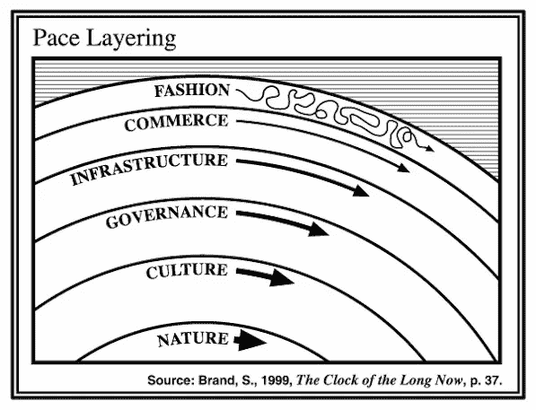

# 区块链神话解码#2:不仅仅是时尚、商业和基础设施

> 原文：<https://medium.com/coinmonks/blockchain-myths-decoded-2-more-than-fashion-commerce-infrastructure-c153963cbff9?source=collection_archive---------21----------------------->

上周，一位重要的同事与我分享了一篇由本·施雷金格撰写的文章，这篇文章发表在 POLITICO 的数字未来日报上。

这篇文章确实很有意思，它触及了区块链领域有时令人迷惑的变化和创新速度，并将更广泛的 Web3 文化描述为“痴迷于变化”。

该通讯报道了这一因素以及华盛顿和布鲁塞尔的规则制定者对更广泛的行业构成的挑战，因为他们正在以慢得多的政府步伐放缓发展。Schreckinger 将政府监管的缓慢文化描述为似乎与快节奏的区块链社会不相容，后者想要快速的答案，或者旧机构不去管它们。然而，他写道，有一种理论认为，这种差异化的步伐水平实际上是一种优势，监管者和行业的塑造者以如此不同的步伐水平前进，表明更大的体系在整体上发挥作用。这个理论就是“步伐分层”，一个来自 Stewart Brand 的想法。

> “持久的文明通过六个不同层次的相互作用而变化，每个层次都以自己的速度移动，从最动态和最短暂的层次到最慢和最持久的层次。”

根据这篇文章，区块链主要存在于品牌方案的上层——介于时尚和下一个最快的层“商业”之间。监管者生活在两层之下，在行动较慢的“治理”领域。根据这个理论，外层比内层移动得更快，但是每个环都不是独立的。当一个环移动时，每一层之间都有一种粘性，并且有一种张力来推拉相邻的层，因此时尚的变化导致商业的变化，然后影响基础设施领域，因为显然，基础设施需要支持商业。

在这一点上，我同意 POLITICO 的文章。但在我看来，它低估了区块链技术对时尚、商业和基础设施以下层面的影响。我认为，治理层尤其会在某种程度上与一些上层合并，从而导致集中式和分散式治理基础设施的共存。虽然这篇文章将治理和技术分开了(这是正确的，因为模型就是这样设计的)，但我相信在 Web 3 中，这两者很可能成为一枚硬币的两面。

***第一层—时尚:***

我们有多少次讨论“价值与炒作”、“美德与信号”，以及可比较的并列。该领域的专家不断感到有必要解释区块链和 Web3 不仅仅是当前围绕 NFTs 的大肆宣传。有些人甚至说，2021 年开始的 NFT 炒作对整个行业都是有害的。会谈围绕着 NFT 投机泡沫展开，这一泡沫将摧毁数十亿美元的投资资本，并在投机类人猿形象的有害形象下埋葬来自 Web3 的可持续创新的希望。对许多人来说，非功能性测试被视为“仅仅是一种趋势”。如果你问我，这种对“时尚”层发生的事情的叙述很难远离事实，原因有三:它

1.低估了这种破坏，NFTs 意味着人们如何决定销售和消费内容。

2.低估了比特币基地和 OpenSea 的作用，将它们标榜为提供铸造服务的科技公司。他们即将成为挑战内容产业现状的媒体巨头。

3.低估了科技和商业领域极有才华和技能的人辞职去更广阔的 Web3 生态系统中任职的人数。

4.低估了我们视为技术限制的所有挑战是巨大的机会，一旦被破解，将为利益相关者带来数十亿美元的价值。

是的，时尚领域发展迅速。是的，有很多尝试和错误。但是不，无论是 NFT 泡沫，还是类似地球月球坠毁这样的灾难，都不能改变这一事实，即在这一层取得的进步将不可避免地渗透到更低的层面。任何进入这个领域的创新都是受欢迎的，从过去错误的灰烬和教训中将产生可持续的价值，改变商业运作方式。

***第二层—商业:***

一旦定义了时尚，交易就开始了。从品牌的速度层方法来评估 Web3 环境中的商业层尤其有趣。手头有一种(广泛地)能够消除中介的技术，在一个 Web3 使能的世界中，商业层相对变得更快。从某种意义上说，尽管我喜欢把 Web3 贴上价值互联网的标签，但交易领域，即商业，可能见证了最明显的变化。随着内容和服务的融合，电子商务将更多地以点对点的方式进行，并被重新定义。NFT 的例子非常准确地展示了这一点:有了 NFT，你就有了内容、创作者、社区、对服务的访问、出处，所有这些都合并到一个不可替代的令牌中。这有可能从根本上重新定义商业。除此之外，你可以引入数字稀缺的概念，这一事实正在将一个长期的理论概念转化为现实:元宇宙的想法。

我们看到加密货币的交易和 NFTs 的交易正在发生。我们看到，在元宇宙和“原始”世界——或多或少——这些替代支付手段被接受并促进了商业。我们看到全新的商业模式作为其基础或结果出现。随着 DAOs 的创建，所有用户都有能力以某种形式参与这种类型的商务。DAO 的概念与治理在比 Web3 生态系统或基础设施更低的层上运行的假设相矛盾。在某种意义上，DAOs 的思想已经在商业层引入了治理。因此，实际上，监管者和生态系统已经在第二层上共存，这也表明了我们正在观察的范式转变。

***第三层—基础设施:***

商业的变化不可避免地导致基础设施的变化。需要新的基础设施来支持新的商业模式，让商业和时尚蓬勃发展。对许多人来说，Web3 本身就是建立一个保护知识产权和隐私的分散式基础设施。我并不完全同意——尽管肯定部分同意——但 Web3 肯定赋予了创造者和消费者权力，因此，不可避免地，以当前平台互联网架构为代价重新分配了现有的权力关系。然而，基础设施层将是整个 Web3 领域成功的关键，还有另一个原因，我们现在可以通过查看 coinmarketcap.com 来观察:有过多的基础设施——链——发行它们的本机令牌，实现它们的令牌组学，并强调它们开发中的不同方面。批评者经常问:“我怎么知道哪个基础设施最终会成功？”

答案是会有很多。声称 Web3 基础设施市场是一个“赢家通吃”的市场，就像声称电信市场、汽车行业、媒体行业或乐器行业是“赢家通吃”的市场一样。他们都不是。连锁店必须始终强调不同的特征，并根据他们试图作为基础设施的商业模式，在速度、可扩展性、安全性和其他方面进行权衡。

***第四层——治理:***

与 POLITICO 文章中的假设相反，在我看来，治理根本不能免受区块链技术带来的破坏。恰恰相反。通过提供基于区块链的选举来立即消除所有关于投票结果的不确定性怎么样？在如此重要的事情上，我宁愿不相信任何一位领导人所谓的 99.6%的人民支持，也不愿不相信任何媒体或任何类型的机构。

还有:元宇宙的治理如何？任何类型的元宇宙都需要他们自己的治理。而光是那句话就引出了几十个问题:

1。元宇宙属于哪个司法管辖区？

2.是集中式(元)还是分散式(开源)？

3.用户之间的权力和共识分配会是什么样子？

4.用户如何对自己的行为负责？

使用 DAOs 的概念，它可以归属于商业、基础设施和治理层，整个治理层是某种解耦和合并，至少当我们进入元宇宙场景时是这样。这本身就表明了我们正在目睹的混乱，更不用说我们还没有一个非常哲学的问题的答案:

哪个实体管理分散治理基础设施，如果不是，它如何与中央治理结构(如国家)共存？

***第五层—文化:***

什么是文化？它是与特定领域、活动、社会特征、习惯信仰、种族、宗教或社会群体的物质特征相关的一套价值观、惯例、社会实践，还是所有这些的混合？形成文化需要多长时间？有没有类似“互联网文化”的东西？

如果你问我，那么答案是“是的，有”。如果有互联网文化，那么最肯定的是，Web3 将形成自己的文化，但同时，将影响现有的文化，就像互联网过去和现在一样。在一个快节奏的数字世界里，文化形成的速度比线下更快。看看 Web2 的互联网平台，有——至少看起来是这样——一组可管理的文化出现了。事实上，在我看来，随着政治光谱两边缺乏宽容，“亚文化”的总数下降了。Web 2 在许多方面支持积木式建筑(我这里指的不是区块链)和一个更倾向于在提倡个人主义的同时呈现群体特征的社会。有了赋予个人权力的技术，就可以培养真正的个人主义，从而形成更丰富多彩的观点和人群，最终并有望形成一种不可避免的相互沟通和交流以达成共识的必要性。如果我们互动的方式不是文化的，那么最终是什么？当然，Web3 将会在这里产生影响。

***第六层—性质:***

区块链和环境是两个关联很差的术语。当然，谈到自然，最突出的话题总是变成据报道的世界末日般的 Web3 能源消耗。我不会在那篇文章中触及这一点，因为这个神话值得在单独的版本中被解码。但我确实相信，与 POLITICO 上的一篇在我看来相当不错的文章相比，区块链和 Web3 对自然的影响不亚于它们对其他层面的影响。

技术的不可改变的本质——就像它在治理中一样——允许新的措施来保护我们生活的自然。越来越多的学者正在模拟区块链上人类和生物圈之间的相互联系。应用领域从能源部门到排放交易系统和基于奖励的绿色 Dao，在能源部门，区块链自然会解决与来源、数据管理和资源分配有关的关键问题。Web3 实现了新的激励机制来维护、保护、恢复甚至扩展自然，不需要捐助者，但事实上有机会作为商业或奖励生态系统的一部分来这样做。在可持续发展方面名声如此之差的技术，事实上支持了新的气候因素的出现，而这是之前没有办法实现的。

***总结:***

本·史瑞金格的文章做了一些很棒的事情。通过在 Web3 上应用速度层理论，他使这项技术更容易使用，也不那么抽象。该模型的创建者 Brand Stewart 自己写道，一些力量，如技术，已经渗透到每一层，以至于它们像“重力”一样拉动各层并使它们保持同步。但生活本身变得更加复杂，我们面临的一个挑战是，我们现有的治理结构受到地理位置的限制。毫无疑问，随着多边主义和全球化概念的发展，这种情况已经发生了变化，但这些程序是由中央集权制度执行的。在去中心化的 Web 3 中，这种情况也在改变。虽然我确实认为巨大的破坏性潜力和不可避免的变化是一种赋权催化剂，可以让人们和企业更加负责并提高责任感，但我也确实看到了相关的风险，特别是对治理以及最终对社会的风险。但是就像所有伟大的发明一样，做好事或坏事都取决于人们的能力。我们手上就有。

> 加入 Coinmonks [电报集团](https://t.me/joinchat/Trz8jaxd6xEsBI4p)，了解加密交易和投资