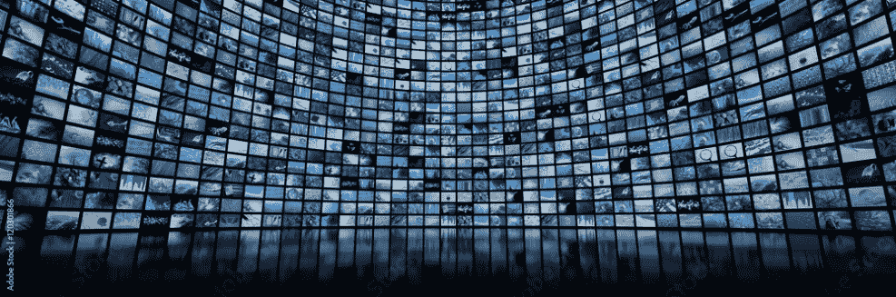
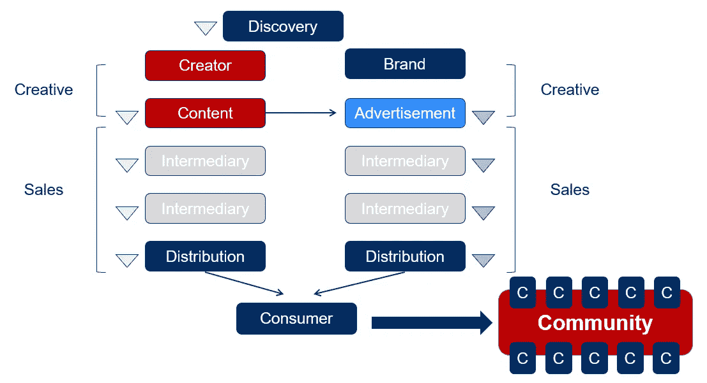
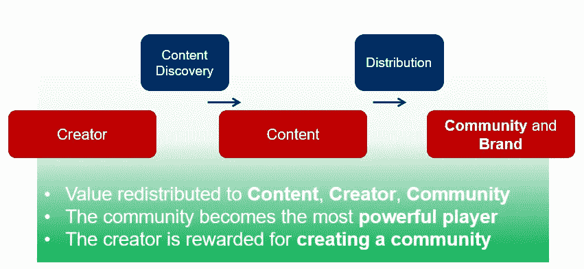

# 区块链神话解码#3:重新评估价值——区块链如何重新定义内容和媒体世界

> 原文：<https://medium.com/coinmonks/blockchain-myths-decoded-3-re-evaluating-value-how-blockchain-redefines-the-worlds-of-content-c55cd245b7a3?source=collection_archive---------19----------------------->

Content Content Content — Everywhere

内容无处不在。这肯定不是秘密。如果我们假设——正如我经常做的那样——区块链技术有潜力显著改变商业运作方式，那么假设它也能从根本上颠覆媒体行业也是合乎逻辑的。

“区块链神话解码”的第三篇文章正是聚焦于此。它围绕着区块链解决的一件事——数字重复花费问题，不需要中介，以及由此为内容产业打开的机会之门。

# 税收者

你可能会问，媒体和内容产业真的有必要改变吗？为什么会有人想要改变呢？第一个问题的答案当然是肯定的，因为价值创造者并不是从他们的内容中获益最多的人。第二个问题的答案更简单:因为这符合所有消费者的最佳利益。

Simplified illustration of the media value chain in Web2

当前的价值链是什么样的？非常简单地说，媒体行业有两个主要的收入来源:

***1。)将内容本身货币化***

**2*。)利用内容赚钱的品牌***

在一个理想的世界中，内容创建者将直接创建内容并出售给他们的观众，而不涉及任何中介。当然，现实看起来有所不同。关于内容的直接货币化和广告行业，这两个过程都充斥着中介。当然，区块链不会将它们全部消除——以内容发现为例:如果没有发现服务，内容创作者很难提高意识并在大众中大放异彩。内容可以很出彩，但是没有人会注意到，如果不被发现的话。因此，我确信发现服务仍然是最重要的，但是它会改变，我将在下面进一步描述。当然，另一项基本服务是分发，这是一项各种平台在 Web2 中提供的服务，并且将继续在 Web3 中提供。然而，发现和分发只是众多中介服务中的两种，而且并不是所有的服务都增加了同样重要的价值。

Simplified illustration of the media value chain in Web3

在一个透明、流动和分散的替代方案的世界里，这些服务中的一些将不再需要，因为智能合同可以被编程来自动执行它们。与现有产品相比，这些合同的成本效益非常高。虽然创作者现在可能依赖于所有类型的中介服务，但只要没有更具成本效益的替代方案，他们就不会愿意放弃很大一部分收入。随着我们越来越多地进入 Web3，越来越多的这些产品将被取代，释放出的收入可以重新分配给那些真正增加价值的实例，特别是内容创作者。广告方面也是如此——但随着复杂性的增加，收费是一个非常不透明的过程，建立在假设而不是事实、影响和印象而不是事实上的专注上。像基本注意力令牌(BAT)这样的传输概念可以解决这个问题，用令牌奖励观众观看，从而在一个不变的分散链上测量事实上的注意力。但这只是一个旁注。

现有的服务——当然，其中一些是中介——不会消失，但会随着技术机会的改善而改变它们的角色。我提到的内容发现就是这样一个例子；让我们看看帮助观众发现合适内容的基本工具:推荐引擎。这些工具是为了帮助我们发现我们真正想看的内容，基于我们个人的喜好。然而，我们不能对这些推荐引擎进行任何类型的控制。由于它们是高度集中的，并且不是开源的，我们实际上不知道它们是如何组成的，并且至少在理论上，很容易认为最好的内容并不总是被传递到我们的关注范围，而是具有最强游说(和/或财务激励)的内容。所以潜在的问题是:我们真的发现了最好的内容吗？如果是，为什么内容变得如此平庸。

虽然这肯定是一个重要的方面，但图 1 中高度简化的媒体链的显著特征是，事实上，这一过程中第二重要的各方，即消费者，并没有因为消费而获得回报。他们用两种不同的货币支付:金钱和注意力。而当他们成为一个社区时，他们变得极具价值，但无法利用这种价值。

内容的肥胖，高度分散的收入分配，不透明的推荐引擎:内容前所未有的容易获取，这使得它越来越膨胀。

# **出处赋予社区力量——为什么 NFT 不是骗局**

我们如何解决已发现的问题？没有简单的答案，但我们可以利用强大的工具。

在媒体方面，NFTs 将发挥重要作用。区块链技术，尤其是 NFTs，允许重新定义数字价值。而这种价值是通过创作者、内容、社区的合并来创造的。这就是出处的概念。光是这个概念就有可能颠覆许多媒体行业目前的逻辑。将排他性和稀缺性的概念引入行业，有史以来第一次有了挑战当前数字空间中衡量价值的逻辑的动力。事实上，在区块链科技出现之前，要定义一项数字资产的价值非常困难，如果不是不可能的话。NFT 使这成为可能。

创作者、内容以及大量消费者愿意为成为独家社区的一部分而付费的意愿决定了价格。价格是人们愿意为加入一个社区而支付的金额。

> [*因为每一条内容都必须值得为之付费，而每一个值得加入的社区都需要实实在在的认同(……)，*](/@julietterolnick/nfts-are-the-market-correction-a0cfebb35823) *内容产业的重心可以从尽可能多的销售转移到提供尽可能有价值的内容。在这样的世界里，那些增加价值的人会得到回报。当社区定义了一项资产的真实价值时，他们也将获得回报——独家体验、收入分成、他们持有的 NFT 升值等。你的幻想没有极限。*

简而言之:媒体资产的价值等于其社区的价值。一个社区的价值可以通过衡量其故事的病毒式传播来评估。这就是为什么与 Web2 相反，在这样一个世界里，品牌和社区会融合在一起。社区选择的叙述定义了品牌。社区定义了品牌价值。

# **为什么这很重要**

虽然这听起来很有趣，但你可能想知道为什么你应该关心。你不需要。归根结底，这是一个偏好的问题，这种情况经常发生。但是当我看到内容领域的发展时，我当然希望有一股变革之风。

每一分钟，都有 500 小时的 YouTube 视频被上传。Spotify 的曲库包含超过 7000 万首歌曲，仅网飞一个国家发行的原创歌曲就超过了整个全球电视行业。成为内容创作者的门槛已经变得和成为 YouTube、Instagram、抖音等平台的消费者一样低了。对我个人来说，感觉我们正在遭受内容肥胖。当然，有些球员可能会从中受益，有些可能不会。网飞可能在苦苦挣扎，迪士尼+可能会做得更好。这令人惊讶吗？如果你问我，它不是，事实上，它是我刚刚描述的症状。当然，我对欧比万系列的发布感到兴奋。为什么？因为我是星战迷。但让我对另一个随机的网飞原创作品充满热情会这么容易吗？当然不是。为了说服我，它需要高质量的内容和一个我希望加入的社区。但通常，当数量被优先考虑时，质量会受到影响。

上述发展可能会迫使创作者和平台重新评估他们的方法。他们能做的最好的事情就是重新评估他们内容的价值，颠覆他们自己，做媒体行业最终一直在做的事情:将激情货币化——但这一次，与相关社区一起

# **没有竞争者的故事**

内容行业正在见证类似于云革命的颠覆性转变的阵痛。新的竞争者出现了，他们仍然被视为“铸造公司”或“市场”。我很难过把它带给你，但他们不是。这些公司已经打入内容世界，并将与大型唱片公司、大型图书出版商、主要制作公司和有影响力的公司竞争。这些平台拥有实现上述品牌体验的技术能力，这些数字对于今天的媒体和内容巨头来说应该是惊人的:Opensea 上的总交易额已经超过 300 亿美元，这意味着该平台自 2018 年推出以来已经产生了 7.5 亿美元的费用。越来越多的著名创作者进入这个平台——当然，他们为什么不呢，毕竟这是很容易赚到的钱。但是，这很重要，技术优势有一个警告，事实上，这是这些公司唯一的优势。

今天的大型内容公司有一个巨大的竞争优势。他们坐拥已有社区的黄金宝藏。那些以最佳体验迎合这些社区的公司不仅会战胜新的竞争，而且最终会吸引一些最强的品牌，他们的竞争对手已经有了。如果他们利用这种颠覆性的势头作为我们十年来最大的机会，重塑内容产业——他们将变得比以往任何时候都更强大，重塑我们今天所知的产业——这将有利于我们所有人。

> 加入 Coinmonks [电报频道](https://t.me/coincodecap)和 [Youtube 频道](https://www.youtube.com/c/coinmonks/videos)了解加密交易和投资

# 另外，阅读

*   [用信用卡购买密码的 10 个最佳地点](https://coincodecap.com/buy-crypto-with-credit-card)
*   [加拿大最佳加密交易机器人](https://coincodecap.com/5-best-crypto-trading-bots-in-canada) | [Bybit vs 币安](https://coincodecap.com/bybit-binance-moonxbt)
*   [阿联酋 5 大最佳加密交易所](https://coincodecap.com/best-crypto-exchanges-in-uae) | [SimpleSwap 评论](https://coincodecap.com/simpleswap-review)
*   购买 Dogecoin 的 7 种最佳方式
*   [最佳期货交易信号](https://coincodecap.com/futures-trading-signals) | [流动性交易所评论](https://coincodecap.com/liquid-exchange-review)
*   [用于 Huobi 的加密交易信号](https://coincodecap.com/huobi-crypto-trading-signals) | [Swapzone 审查](/coinmonks/swapzone-review-crypto-exchange-data-aggregator-e0ad78e55ed7)