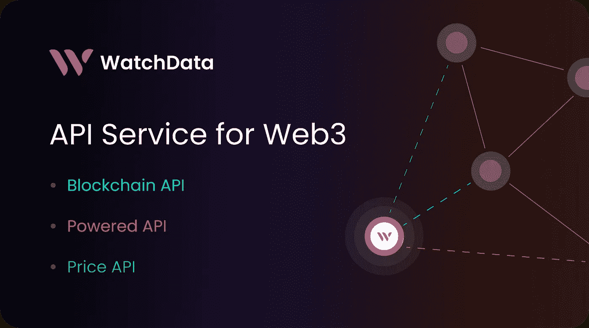
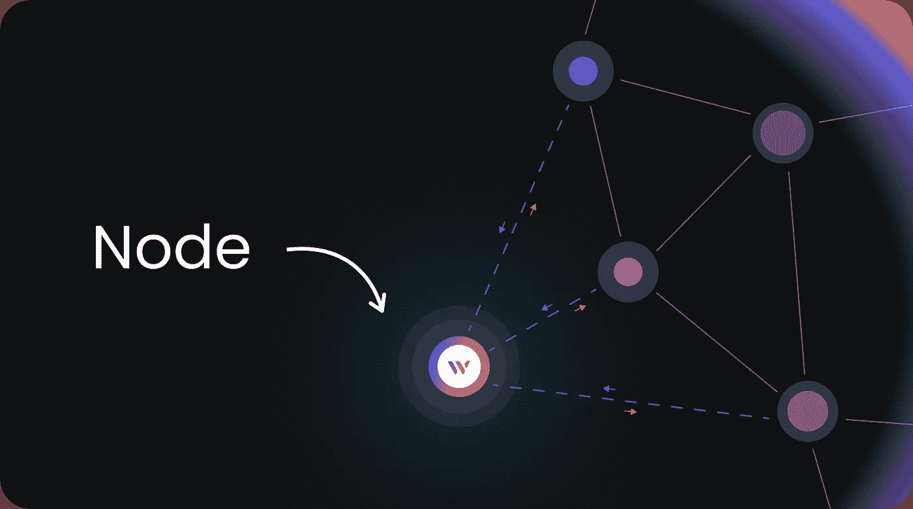
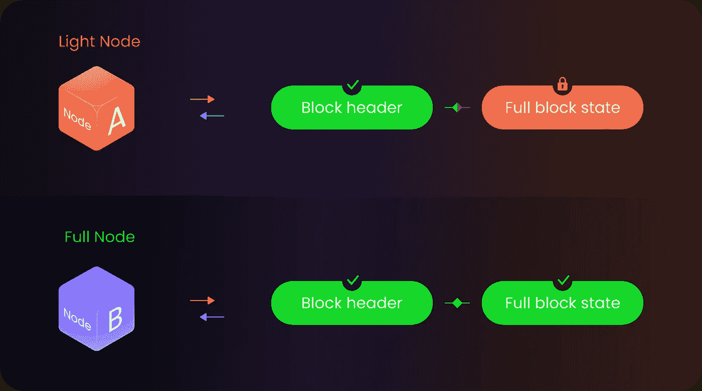
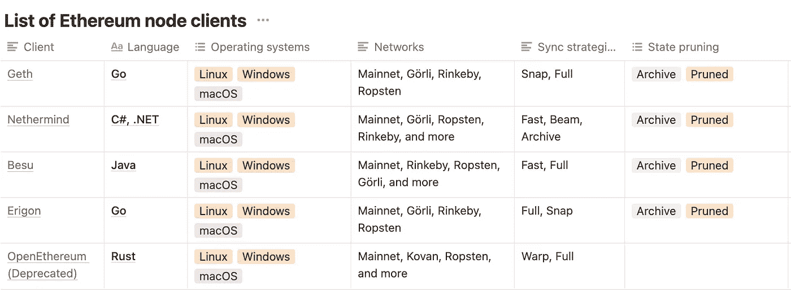
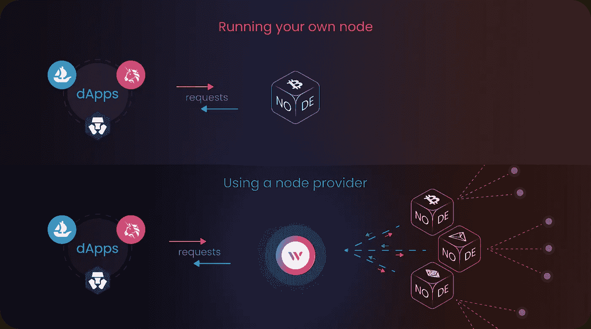
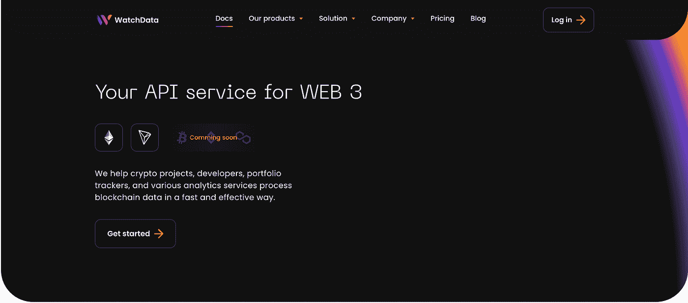

# 区块链节点提供商——是什么？为什么你需要它？

> 原文：<https://medium.com/coinmonks/blockchain-node-provider-what-is-it-and-why-you-need-it-c15fdfecabc5?source=collection_archive---------9----------------------->

# 介绍

欢迎回到 WatchData 博客！

在本文中，我们想向您解释什么是节点提供者，它的优势是什么，以及这样的服务如何对您有用。



我们想先简单介绍一下市场。区块链已经存在了十年，但只是在最近几年，人们才开始意识到它的潜力，并在金融、广告、公用事业、医疗保健等领域实施它。专家预测，到 2023 年，区块链市场可能价值 106 亿美元。对产品和制造这些产品的团队的市场需求都在增长。

这一领域的主要问题是，并不是每个人都有从零开始创造自己的区块链产品或服务所需的资源或专业知识。这就是节点提供商发挥作用的地方——他们帮助公司在现有区块链的基础上构建创新的解决方案

# 应用开发需要什么？

构建一个区块链产品并不容易，但是如果你准备开始构建你的项目，理解什么是节点以及它是如何工作的是很重要的。节点本质上是运行在一台计算机上的程序，它连接到其他节点，以便来回发送信息，验证人与人之间发送的交易的有效性，并存储关于区块链状态的重要信息。这些节点协同工作，确保您的事务不会出错——即使一个节点离线或出现故障！



区块链是一种分布在多个节点或计算机上的数据库。需要注意的是，区块链不是传统意义上的数据库，而是一种新型数据库。这意味着不再有一个主服务器或单一的真实来源(就像你在大多数传统数据库中发现的那样)，而是有许多不同的节点来保存这个分散网络的信息片段。

可以将节点视为区块链的浏览器，它允许用户访问区块链上的信息，而无需依赖任何类型的中央权威机构(就像使用传统数据库一样)。节点是任何 dApp 的**关键部分。它允许您修改区块链并获取最新的数据。如果没有此功能，您将无法创建自己的应用程序！**

# 为什么很难用自己的节点工作？

运行一个节点需要大量的工作。这可能需要几个星期，然后你必须继续下去。如果您不小心，您可能会花费更多的时间来维护您的节点，而不是实际使用它。

出现这种情况有几个原因:

*   设置节点需要很长时间。It 部门通常需要两周时间来设置和正常运行一切。
*   一旦你完成了你的节点的设置，你需要保持对它的关注，以使它正常工作。节点通常需要持续维护，因为它们通常运行在功能不太强大或不太可靠的机器上。
*   有许多不同类型的节点，因此，如果一种类型的节点出现问题，不能保证另一种类型会更好地为您工作，您最终可能不得不重新开始！
*   自动负载缩放。如果您的应用程序在使用节点提供程序时开始消耗更多的资源，您不会注意到任何偏差。

这只是你将面临的问题的一部分，让我们更详细地看看。

# 运行节点

建立一个区块链节点可能是一件痛苦的事情。🤬

如果你和我一样，你只想进入正题，开始开发，而不必花费所有的时间来设置那些对你要做的事情没有直接贡献的工具。当涉及到这个问题时，节点是最糟糕的罪犯之一。

通常有两种主要的节点类别:轻型节点和完整节点。对于许多请求，轻型节点只同步块头和来自完整节点的请求，而完整节点存储区块链的整个状态，即曾经创建的每个事务。大多数查询使用轻型节点，但是完整节点是区块链的主干——它们需要提供大多数信息。

轻量级节点已经变得相对简单，但是仍然需要安装节点程序、设置配置变量、加载块头并检查端口和状态以确保它们正常工作。

完整节点是一台计算机，它存储从 0 到提交的最后一个数据块的每个数据块，以及任何人提交的每个事务。这意味着整个节点需要从头开始加载从 0 到最后一个的每个块，并手动复制任何人提交的每个块和每个事务。对于以太坊主网来说，这超过 1000 万个数据块，大约是数十亿次交易。这可能需要几周的同步时间！



# 分析节点客户端并确定服务器需求。

你将不得不自己做分析，花很多时间在论坛上聊天，找出哪个节点客户端最适合你。



在你和客户确定之后，你还需要花时间去寻找并支付服务器的费用。这也可能是一个缓慢的过程。

# 节点管理

许多人没有意识到您需要管理您的节点——这不仅仅是为了好玩！

节点定期需要每隔几周更新一次，在硬分叉和节点客户端升级的情况下，有时不得不从头开始构建。由于大多数节点在设计时没有考虑到可靠性，一些请求(如 eth_getLogs)可能涉及数百万个块和事务，并经常导致节点超时或崩溃。因此，您必须密切关注您的节点的健康状况。例如，您可能用完了磁盘空间，不得不购买更多的空间。在此类过程中，节点会停止，并且变得不可访问。除此之外，节点可能会因为各种原因而落后—对等和连接问题、陷入分叉、内部状态问题。如果他们落后了，你的用户会收到过时的，有时是不正确的数据，但他们没有意识到这一点。

# 扩展解决方案

正如您在我们的文章中已经注意到的，节点是一个服务器，它处理事务并与网络中的其他节点交互。但是您知道当您不能使您的节点服务器大到足以处理您发送给它的请求时会发生什么吗？相信我，您将需要 **100%的节点可用性。**

您可能认为运行两个或更多节点并在它们之间放置一个负载平衡器可能是解决所有问题的方法。是的，那是真的，但是它非常难维持。不同的节点看到区块链的最后状态是不同的。这可能会导致用户端出现问题！

您有几个节点，它们可以单独同步，平衡器在它们之间分配流量。因此，第一个节点可能认为最后一个块是 X，第二个节点认为最后一个块是 y。这是一种完全正常的情况，因为最新信息在网络中传播缓慢，所以一些节点将总是领先于其他节点。

# 听起来拥有自己的节点很困难，很昂贵，而且并不总是必要的？

完全正确！在这种情况下，节点支持的问题由节点提供者解决。

节点提供程序可以在许多方面帮助您:

*   当您想在市场上推出新产品，但不确定如何选择合适的节点提供商时。
*   当您在管理项目和开发团队时需要帮助。
*   当您希望找到一个合作伙伴来帮助您为您的业务构建一个可扩展的平台时。



使用节点提供程序，您可以将请求发送到远程服务器，该服务器提供与区块链上任何其他节点相同的 API。这样，您就可以使用其他人的节点，而不必维护您自己的节点并使其保持最新！

一旦在活动链上部署了应用程序，节点提供者就成为工作流的重要部分。它们使您能够访问区块链上的信息，而无需自己运行完整的节点，并且它们确保其所有节点彼此完全同步，以便它们始终是最新的并且全天候可用。

可靠的节点提供者必须提供以下服务:

*   稳定性高。没有高稳定性，您将无法构建您的应用程序。
*   不断访问节点。节点必须是当前的和更新的，以便用户不必担心分叉或网络中的任何其他变化。
*   访问历史数据，以便您可以将区块链互动的任何历史添加到您的应用程序中。
*   数据的可靠性和可信度——您必须只向您的客户传播可靠和正确的信息，否则您可能会失去他们！
*   自动负载伸缩—如果您的应用程序在使用节点提供程序时开始消耗更多资源，您不会注意到任何偏差！

当您的应用程序与区块链交互时，应用程序可能需要不断接收关于区块链的信息，以便更新其内部状态。该信息也通过节点或节点提供者传递。

如果您已经在使用像 [WatchData](https://bit.ly/39s3FnO) 这样的节点提供者，那么继续使用它们可以节省大量的时间和金钱。例如，如果你正在使用 [WatchData 的区块链 API](https://bit.ly/39s4mNW) ，那么当你需要了解区块链的一些情况时——比如一个地址是否收到了任何资金——你所要做的就是从你的应用程序中调用他们的 API，他们会为你返回信息。

这意味着您不必在自己的计算机上运行任何额外的软件(比如一个完整的节点),这样您的应用程序就可以与区块链上发生的事情保持同步。

在我们的平台上，您可以找到以下产品:

*   [**WatchData 区块链 API。**](https://bit.ly/39s4mNW)

使用 WatchData 的 API，您可以获得原始区块链数据:余额、交易、块、令牌转移、日志等。无需运行自己的节点！节省开发成本和相关费用。通过我们的 API 调用大多数 JSON-RPC 方法，就像发送到自己的节点一样。

让我们看几个与我们的 API 交互的例子:

最常见的端点之一是— **eth_blockNumber**

请求示例:

```
URL: <https://ethereum.api.watchdata.io/node/jsonrpc?api_key=your_api_key>
RequestType: POST
Body: 
{
    "jsonrpc":"2.0",
    "method":"eth_blockNumber",
    "params":[],
    "id":0
}
```

响应示例:

```
{
  "jsonrpc": "2.0",
  "id": 0,
  "result": "0xa1c054"
}
```

从示例中可以看出，我们只是改变了端点！不需要其他更改。你自己试试！

让我们尝试改变区块链的端点

请求示例:

```
URL: <https://ethereum.api.watchdata.io/node/jsonrpc?api_key=your_api_key>
RequestType: POST
Body: 
{
    "jsonrpc":"2.0",
    "method":"eth_sendRawTransaction",
    "params":["0xd46e8dd67c5d32be8d46e8dd67c5d32be8058bb8eb970870f072445675058bb8eb970870f072445675"],
    "id":1
}
```

响应示例:

```
{
  "id":1,
  "jsonrpc": "2.0",
  "result": "0xe670ec64341771606e55d6b4ca35a1a6b75ee3d5145a99d05921026d1527331"
}
```

通过我们的 API，我们提供了对各种区块链的访问。在我们的[文档](https://bit.ly/3yVsp2z)中了解更多关于[区块链 API](https://bit.ly/39s4mNW) 的信息

*   [watch data Powered API。](https://bit.ly/3lcl863)

[Powered API](https://bit.ly/3lcl863) 是一种与节点交互的附加功能。我们接管了区块链的工作，并将数据转换成清晰的结构化格式。你作为一个用户，会得到一套现成的数据，里面承载着海量的信息。让我们更清楚地解释给你听:如果你想找到一个 ETH 地址的所有交易，该怎么办？虽然这在 SQL 数据库中可能很容易，但在区块链却异常复杂——你几乎必须扫描区块链的每一笔交易(同样，ETH 网络中有数十亿笔交易！)来查看它是否包含单个地址。我们已经创建了一些高级 API，允许您立即执行这个查询和其他类似的查询。我们相信 [Powered API](https://bit.ly/3lcl863) 将帮助您在项目上节省时间和金钱，同时为它们提供更多功能！

像这样的情况，试试[**watch _ getTransfersByAddress**](https://docs.watchdata.io/powered-api/transfers/watch_gettransfersbyaddress)

请求示例:

```
URL: <https://ethereum.api.watchdata.io/node/jsonrpc?api_key=your_api_key>
RequestType: POST
Body: 
{
    "id": 1,
    "method": "watch_getTransfersByAddress",
    "jsonrpc": "2.0",
    "params": [
        {
            "addresses": "0x6a73eb4e8EA2068ec539D2f0D15d757766E247E4",
            "contractAddresses": "native",
            "transferDirection": "from",
            "fromBlock": 14046400,
            "toBlock": "latest",
            "offset": 0,
            "limit": 10
        }
    ]
}
```

响应示例

```
{
    "jsonrpc": "2.0",
    "id": 1,
    "result": [
        {
            "blockNumber": 14133136,
            "blockTimestamp": "2022-02-03T12:58:13",
            "transactionHash": "0x7b778a9135fd37703c089f7dd9e4f54e165b6c5334de5f9e125635682022447a",
            "transactionIndex": 10,
            "logIndex": null,
            "contractAddress": null,
            "transferType": "trx",
            "from": "0x6a73eb4e8ea2068ec539d2f0d15d757766e247e4",
            "to": "0xd9e1ce17f2641f24ae83637ab66a2cca9c378b9f",
            "value": 230000000000000000,
            "fee": 10275082740798368,
            "asset": "ETH",
            "decimals": 18
        },
        {
            "blockNumber": 14133182,
            "blockTimestamp": "2022-02-03T13:06:15",
            "transactionHash": "0x66d768ff5482909b9ef2a72b9d701568216070ab760b1f53382b30740a023072",
            "transactionIndex": 312,
            "logIndex": null,
            "contractAddress": null,
            "transferType": "trx",
            "from": "0x6a73eb4e8ea2068ec539d2f0d15d757766e247e4",
            "to": "0xe6cd4727a1058e6973e973986d0493f1e7975ef8",
            "value": 11682235338506250,
            "fee": 22314053230899568,
            "asset": "ETH",
            "decimals": 18
        },
        {
            "blockNumber": 14145122,
            "blockTimestamp": "2022-02-05T09:14:55",
            "transactionHash": "0x2b89ac24371d7938728b365cdc56140321095e23d4a47e4ea58d7d357d1642cc",
            "transactionIndex": 196,
            "logIndex": null,
            "contractAddress": null,
            "transferType": "trx",
            "from": "0x6a73eb4e8ea2068ec539d2f0d15d757766e247e4",
            "to": "0xd9e1ce17f2641f24ae83637ab66a2cca9c378b9f",
            "value": 115498399326596663,
            "fee": 5267950395018750,
            "asset": "ETH",
            "decimals": 18
        },
        {
            "blockNumber": 14145138,
            "blockTimestamp": "2022-02-05T09:19:35",
            "transactionHash": "0xeb97ff4306efe3ef9c95229b9ac34e6b441c79ae265a4ad5d0be807a3ac084e3",
            "transactionIndex": 115,
            "logIndex": null,
            "contractAddress": null,
            "transferType": "trx",
            "from": "0x6a73eb4e8ea2068ec539d2f0d15d757766e247e4",
            "to": "0xe6cd4727a1058e6973e973986d0493f1e7975ef8",
            "value": 5720494316456640,
            "fee": 16532150415218226,
            "asset": "ETH",
            "decimals": 18
        },
        {
            "blockNumber": 14145167,
            "blockTimestamp": "2022-02-05T09:25:33",
            "transactionHash": "0x8efc515d6d6440dc02f938b93162762c73e1fd1b24b8cbe70bf0929a3e21e72d",
            "transactionIndex": 325,
            "logIndex": null,
            "contractAddress": null,
            "transferType": "trx",
            "from": "0x6a73eb4e8ea2068ec539d2f0d15d757766e247e4",
            "to": "0xa5409ec958c83c3f309868babaca7c86dcb077c1",
            "value": 0,
            "fee": 22320578599734744,
            "asset": "ETH",
            "decimals": 18
        },
        {
            "blockNumber": 14145175,
            "blockTimestamp": "2022-02-05T09:27:08",
            "transactionHash": "0x1ff0025dc6fe1408b42b8655ff05de4158e5a8a94478a7517873cd79994f9883",
            "transactionIndex": 560,
            "logIndex": null,
            "contractAddress": null,
            "transferType": "trx",
            "from": "0x6a73eb4e8ea2068ec539d2f0d15d757766e247e4",
            "to": "0xc71a726d390bf02b4af8920c0820970310d0f367",
            "value": 0,
            "fee": 2760413994607680,
            "asset": "ETH",
            "decimals": 18
        },
        {
            "blockNumber": 14145253,
            "blockTimestamp": "2022-02-05T09:45:32",
            "transactionHash": "0x226847bb385b2600cfc9bae11dc207a5a397a757cee5aab6380e40148463d508",
            "transactionIndex": 158,
            "logIndex": null,
            "contractAddress": null,
            "transferType": "trx",
            "from": "0x6a73eb4e8ea2068ec539d2f0d15d757766e247e4",
            "to": "0xef8c662114494e2c7999e5deab46c25ebd2c7e68",
            "value": 0,
            "fee": 2622120687456424,
            "asset": "ETH",
            "decimals": 18
        },
        {
            "blockNumber": 14145400,
            "blockTimestamp": "2022-02-05T10:16:17",
            "transactionHash": "0xd16f57eed01a4edca7bca41bc5de100caca5265fecbe0bb4d84080754af695dc",
            "transactionIndex": 66,
            "logIndex": null,
            "contractAddress": null,
            "transferType": "trx",
            "from": "0x6a73eb4e8ea2068ec539d2f0d15d757766e247e4",
            "to": "0xd9e1ce17f2641f24ae83637ab66a2cca9c378b9f",
            "value": 100040960961230628,
            "fee": 5403373540925517,
            "asset": "ETH",
            "decimals": 18
        },
        {
            "blockNumber": 14145408,
            "blockTimestamp": "2022-02-05T10:19:13",
            "transactionHash": "0x8ce35ed7dfd9d5e2eb68a70632cad083dfc0a3bc87317b7199582ade6f38b230",
            "transactionIndex": 126,
            "logIndex": null,
            "contractAddress": null,
            "transferType": "trx",
            "from": "0x6a73eb4e8ea2068ec539d2f0d15d757766e247e4",
            "to": "0xe6cd4727a1058e6973e973986d0493f1e7975ef8",
            "value": 5106850519666560,
            "fee": 19907523574730646,
            "asset": "ETH",
            "decimals": 18
        },
        {
            "blockNumber": 14190133,
            "blockTimestamp": "2022-02-12T08:20:31",
            "transactionHash": "0x7944031ad46e604607aca5fd97fd2feaeaf580b0df3e0e0658196dac24954f7b",
            "transactionIndex": 266,
            "logIndex": null,
            "contractAddress": null,
            "transferType": "trx",
            "from": "0x6a73eb4e8ea2068ec539d2f0d15d757766e247e4",
            "to": "0xb03b54093225be141bd5527aeba7289057e44244",
            "value": 160000000000000000,
            "fee": 972908623281000,
            "asset": "ETH",
            "decimals": 18
        }
    ]
}
```

或者，假设您想要包含平均油价或平均矿工报酬的统计数据？没问题，试试 [**watch_getStatsByDay！**](https://docs.watchdata.io/powered-api/stats/watch_getstatsbyday)

请求示例:

```
URL: <https://ethereum.api.watchdata.io/node/jsonrpc?api_key=your_api_key>
RequestType: POST
Body: 
{
    "jsonrpc":"2.0",
    "method":"watch_getStatsByDay",
    "params":[1645170803],
    "id":0
}
```

响应示例:

```
{
    "jsonrpc": "2.0",
    "id": 0,
    "result": {
        "transactionCount": 1252754,
        "averageGasPrice": 99672209984.26283,
        "totalGasUsed": 99200040530,
        "uncleBlockReward": 676500000000000000000,
        "minersReward": 13594383283569909503493,
        "blockCount": 6418
    }
}
```

仅在一个终端上就有大量有用的信息。

*   [**WatchData 价格 API。**](https://bit.ly/3PkxRBE)

当你创建一个去中心化的应用程序时，你最不希望的就是被一个不太准确的令牌价格所束缚。这就是我们 WatchData 自豪地宣布我们新的[价格 API](https://bit.ly/3PkxRBE) 的原因，这是同类产品中第一个让您从区块链获得准确代币价格的产品。我们的 [Price API](https://bit.ly/3PkxRBE) 易于使用且功能强大，让 dApp 开发者能够获得准确的令牌价格，而无需处理管理自己基础设施的麻烦。别担心——我们的[价格指数](https://bit.ly/3PkxRBE)有你需要的一切！😎

请求示例:

```
{
    "base_symbol": "BTC",
    "quote_symbol": "ETH"
}
```

响应示例

```
{
    "base_symbol": "BTC",
    "quote_symbol": "ETH",
    "price": 13.745515525559787,
    "created_at": "2022-05-04T09:36:51+00:00"
}
```

如您所见，只需一个动作，您就可以获得所请求的加密货币的价值！

# 结论

您可能已经从文章中注意到，拥有自己的节点是一项巨大的工作，需要技术专家的不断投入，您将始终掌握脉搏并关注更新，以便您的应用程序拥有正确的信息，此外，当您决定扩展您的产品时，一切都可能会崩溃。



相信我，我们在 [WatchData](https://bit.ly/39s3FnO) 也面临过类似的问题，这就是为什么我们决定制造这款产品。一个首先有助于你专注于真正任务的产品。我们目前的目标是覆盖尽可能多的网络。为一个平台上的多个区块链提供一个 API！

我们理解开发人员了解不同区块链的不同 API 有多难，以及他们在这项任务上花费了多少时间。我们的目标也是通过在一个地方为所有区块链交互提供一个方便的解决方案来节省您的时间和金钱！

现在就采取简单的步骤来停止浪费你的时间和金钱吧！

*   [注册 WatchData](https://bit.ly/39s3FnO)
*   [获得你的第一个 API 密匙](https://docs.watchdata.io/introduction/quick-start-guide-to-watchdata)
*   [学习文档](https://bit.ly/3yVsp2z)
*   并开始建设！

通过 [WatchData 文档](https://bit.ly/3yVsp2z)查看我们的入门指南。我们希望这将帮助您开始使用 WatchData，并开始收集您需要的数据，以使您的业务取得成功。如果您有任何问题，请随时联系我们的 watch data[Discord channel](https://discord.com/invite/TZRJbZ6bdn)。要了解您可以使用我们的 API 构建什么→ [查看操作指南！](https://docs.watchdata.io/tutorials-and-guides/how-to-guides)

> 加入 coin monks[Telegram group](https://t.me/joinchat/Trz8jaxd6xEsBI4p)学习加密交易和投资