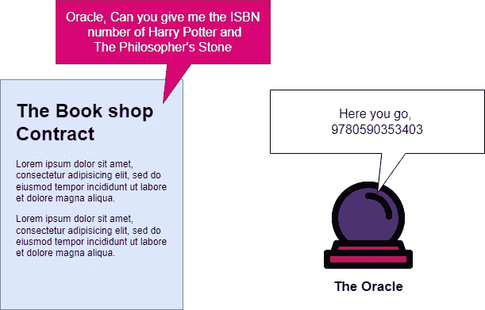
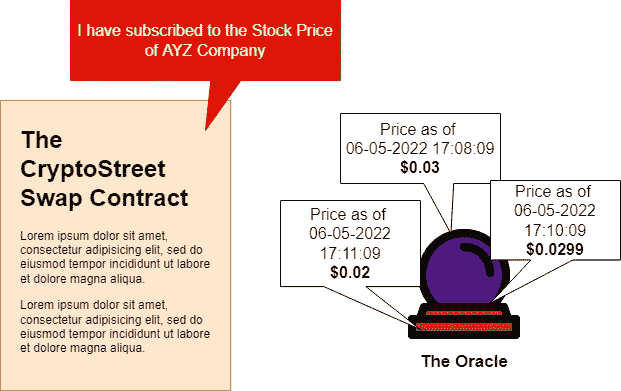
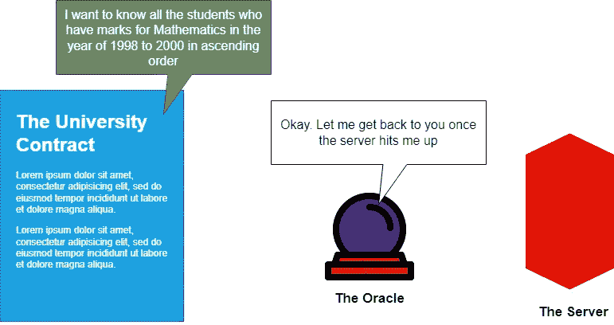
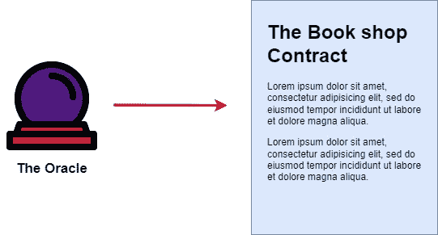
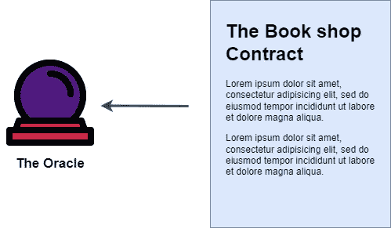

# 区块链 Oracle 设计模式—解释

> 原文：<https://medium.com/coinmonks/blockchain-oracle-design-patterns-explained-1ce2e185fa1d?source=collection_archive---------3----------------------->

[Prediction vector created by vectorjuice — www.freepik.com](https://www.freepik.com/vectors/prediction)

智能合同提供了安全性、透明度、效率和信任，可以在区块链内部启动协议。因为它是在区块链内部执行的，所以它不能访问任何外部数据，比如天气数据或汇率。区块链 Oracles 旨在缓解这一问题。

oracle 是可以向智能合同提供外部数据的程序。在本文中，让我们讨论可以用来设计 oracles 的不同模式。

# 神谕的关键步骤

智能合同将使用 oracle 的 3 个关键步骤。我们将在本文中讨论的所有设计模式都使用这些步骤:

1.  从链外来源收集数据
2.  用签名的消息传输数据
3.  通过将数据放入智能合约的消息中，使数据可用

# 设计模式的类型

根据以下因素，设计模式分为两种类型

1.  提取数据的频率
2.  数据的流动方向

# 模式源于提取数据的频率

## 1 —立即**—读取**

Example for Immediate-Read Design Pattern

允许获取数据的神谕**将用于立即做出决策**。这种类型的 oracle 将数据存储在智能合约存储中。数据会不时更新。因为它使用契约存储，所以只有与用例高度相关的数据才会被存储。

***举例:***

书店使用的智能合同可以使用 oracle 来提供特定图书的 ISBN。在这种情况下，oracle 只在合同存储中存储图书的名称和 ISBN，因为存储诸如作者姓名、年份等属性太多了。

## 2-发布-订阅

Example for Publish-Subscribe Design Pattern

在订阅 oracle 时提供数据的 oracle 属于这种模式。它向智能合同提供数据广播服务。数据将通过智能合同的轮询或离线运行一个工人并在 oracle 中监视更新来提供给智能合同。

***举例:***

让我们想象一下，在去中心化的世界里有一个交易所，它将允许你购买股票。这个交易所的智能合约应该知道特定股票或所有股票的最新价格。然后，智能合同可以订阅 oracle，Oracle 将提供价格。从智能合约的角度来看，它可以轮询 oracle，或者 oracle 可以将更新推送到所有客户端。

## 3 —请求-响应

Example for Request-Response Design Pattern

用这种模式设计的甲骨文比以前的先进得多。这种模式类似于**客户端-服务器架构，其中请求从客户端发出，由服务器**处理。与此 oracle 相关的数据可能存储在外部基础架构中，因为它使用了无法存储在智能合约存储中的更大的数据集。由于这种情况和对额外性能的需要，这些类型的 oracles 使用服务器等链外基础设施。

***举例:***

杰森教授想知道奇迹大学 1998 年至 2000 年的数学成绩。由于这所大学使用区块链和智能合约来存储学生的部分数据，负责提供该查询的智能合约必须调用 oracle 并取回数据。在智能合同调用 oracle 之后，oracle 会将查询传递给拥有所有数据记录的服务器。最后，服务器将执行查询并将结果传递回 oracle，oracle 将数据传递回智能合同。

# 模式源于数据的流动方向

## 1-入站 Oracle

Example for Inbound Oracle Design Pattern

入站 oracle **将数据从外部(或链外)世界传输到区块链**。在入站 oracle 中可以识别两种子模式

1.  **基于拉取的入站 Oracle —** 当智能合同需要数据时，它会向 Oracle 请求数据。oracle 收到请求后，它从离线数据源收集信息，并将其提供给区块链。
2.  **基于推送的入站 Oracle —** Oracle 监视特定链外数据源中的任何变化。当数据源发生变化时，这些变化将被传送到区块链。

## 2-出站 Oracle

Example for Outbound Oracle Design Pattern

出站 oracle **将数据从区块链传输到外部世界**。当有数据(如发生在区块链内部的金融交易)需要通过链外资源传递给相关方时，这很有用。在这个 oracle 中也有两个子模式。

1.  **基于拉取的出站 oracle —** 当链外资源需要从区块链查询数据时，它会从链上数据源请求数据。收到请求后，它提供数据。
2.  **基于推送的出站 oracle —** 智能合约监视区块链数据集中的任何变化。当有变化时，它将被传达给离线资源。

我希望这篇文章已经帮助你理解了什么是用于创建区块链神谕的设计模式。另一篇文章再见:)

**参考文献:**

[1] Andreas Antonopoulos，[掌握以太坊:建立智能合约和 dapp](https://www.amazon.com/Mastering-Ethereum-Building-Smart-Contracts/dp/1491971940)

[2] R. Mühlberger，S. Bachhofner，E. Castelló Ferrer，C. D. Ciccio，I. Weber，m . hrer，U. Zdun，[基础甲骨文模式:连接区块链和链外世界](https://link.springer.com/chapter/10.1007/978-3-030-58779-6_3)

[3] A .贝尼奇，[区块链神谕研究](https://arxiv.org/abs/2004.07140)

> 加入 Coinmonks [电报频道](https://t.me/coincodecap)和 [Youtube 频道](https://www.youtube.com/c/coinmonks/videos)了解加密交易和投资

# 另外，阅读

*   [最佳比特币保证金交易](/coinmonks/bitcoin-margin-trading-exchange-bcbfcbf7b8e3) | [萝莉点评](/coinmonks/lolli-review-e6ddc7895ad8) | [比特币保证金交易](https://coincodecap.com/bityard-margin-trading)
*   [创造并出售你的第一个 NFT](https://coincodecap.com/create-nft) | [密码交易机器人](https://coincodecap.com/best-crypto-trading-bots)
*   [如何在 CoinDCX 上购买柴犬(SHIB)币？](https://coincodecap.com/buy-shiba-coindcx)
*   [CBET 评论](https://coincodecap.com/cbet-casino-review) | [库科恩 vs 比特币基地](https://coincodecap.com/kucoin-vs-coinbase) | [拜比特 vs 比特币基地](https://coincodecap.com/bybit-vs-coinbase)
*   [折叠 App 回顾](https://coincodecap.com/fold-app-review) | [LocalBitcoins 回顾](/coinmonks/localbitcoins-review-6cc001c6ed56) | [Bybit vs 币安](https://coincodecap.com/bybit-binance-moonxbt)
*   [加密保证金交易交易所](/coinmonks/crypto-margin-trading-exchanges-428b1f7ad108) | [赚取比特币](/coinmonks/earn-bitcoin-6e8bd3c592d9) | [Mudrex 投资](https://coincodecap.com/mudrex-invest-review-the-best-way-to-invest-in-crypto)