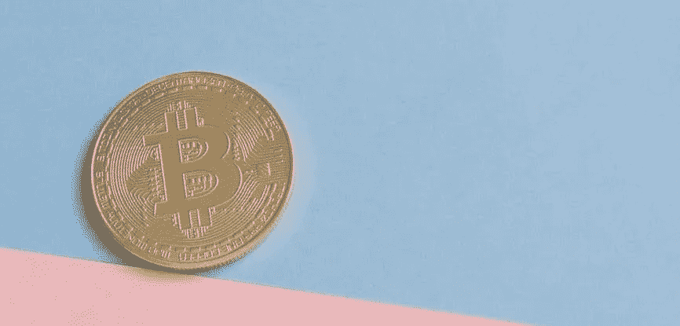

# 区块链:人们想要回自由

> 原文：<https://medium.com/coinmonks/blockchain-people-want-their-freedoms-back-e25f21ebbde2?source=collection_archive---------42----------------------->

区块链将会改变世界，让世界变得更加美好。你可以打赌！

考虑到区块链甚至还没有发挥出它的全部潜力，我写它真是太疯狂了。但请想一想:你有一种去中心化的、不以债务或银行为基础的货币。它不受任何政府或中央机构的控制。从那以后，你可以把它看作一个平台，在这个平台上你可以运行不属于任何人的分散的应用程序，这些应用程序是高度安全的，并且是抗审查的。

这是技术世界的一个范式转变，在这里你不能再相信任何人，数据不断被大公司视为新的黄金。无论你走到哪里，你都被像谷歌和脸书这样的大玩家和其他零售商监视和跟踪，这些零售商想把数据卖给市场研究人员，损害用户的利益。

我们将何去何从？很简单:web3.0 革命已经在进行中。别忘了，这是人类历史上第一次在政府支持的法定货币和比特币、以太坊等数字货币之间发生真正的战争，这些货币没有任何支持，但仍有价值(主要是因为人们相信它们)。

区块链是一项民主技术，有潜力改变世界。它不只是关于数字货币和交易，它有自己的一套协议，确保免受压迫实体的影响。

在过去的一年里，我们看到了许多加密货币被创造出来。我们也看到许多骗子试图从炒作中快速致富，但在所有这些中，我看到两件事。我看到了一场非常强大的运动，它正在创造互联网的下一个阶段，并寻求挑战现有的世界政治秩序。

考虑到由于大西洋两岸的丑闻，这些科技巨头已经成为公众愤怒的目标，我们将从一个人们依赖谷歌和脸书满足其搜索需求、电子邮件和在线社交的世界走向一个他们的数据和生活真正属于他们自己的世界。对这些公司的强烈反对已经开始，我们看到权力开始向个人转移。

人们已经在区块链上交易了数十亿美元，软件开发人员已经编写了各种各样的智能合同和分散式应用程序，再过几年它就会成为普通人正常生活的一部分。

现在是一个很好的时间来思考这种转变对你这个日常用户或创造者意味着什么。

如果你喜欢这样的内容，请随时在 Medium、Linkedin 或 Twitter 上关注我:@ adinortey360

> 加入 Coinmonks [电报频道](https://t.me/coincodecap)和 [Youtube 频道](https://www.youtube.com/c/coinmonks/videos)了解加密交易和投资

# 另外，阅读

*   [最佳密码交换平台](https://coincodecap.com/best-crypto-swap-platforms) | [最佳密码交易所](https://coincodecap.com/crypto-exchange)
*   [购买比特币印度](/coinmonks/buy-bitcoin-in-india-feb50ddfef94) | [Pionex 评论](/coinmonks/pionex-review-exchange-with-crypto-trading-bot-1e459d0191ea) | [加密交易机器人](/coinmonks/crypto-trading-bot-c2ffce8acb2a)
*   [n rave ZERO Review](/coinmonks/ngrave-zero-review-c465cf8307fc)|[phe MEX Review](/coinmonks/phemex-review-4cfba0b49e28)|[PrimeXBT Review](/coinmonks/primexbt-review-88e0815be858)
*   最佳[区块链分析](https://bitquery.io/blog/best-blockchain-analysis-tools-and-software)工具| [赚比特币](/coinmonks/earn-bitcoin-6e8bd3c592d9)
*   [Cloudbet 赌场评论](https://coincodecap.com/cloudbet-casino-review) | [点火赌场评论](https://coincodecap.com/ignition-casino-review)
*   [加密套利](/coinmonks/crypto-arbitrage-guide-how-to-make-money-as-a-beginner-62bfe5c868f6)指南| [如何做空比特币](/coinmonks/how-to-short-bitcoin-568a2d0b4ae5)