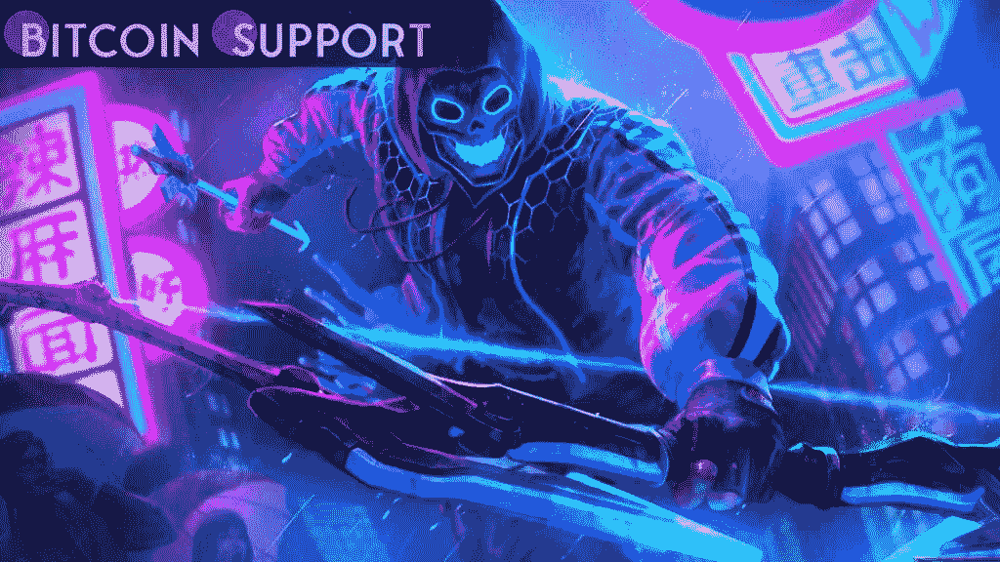
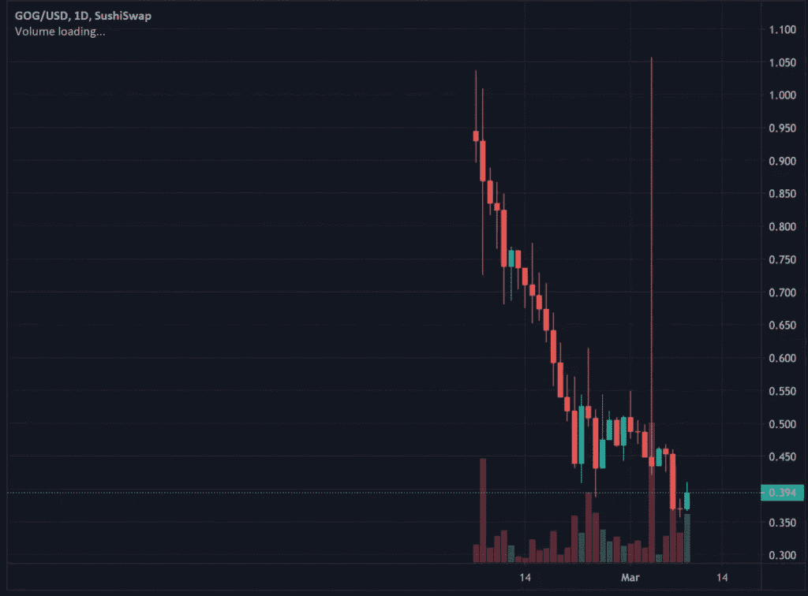
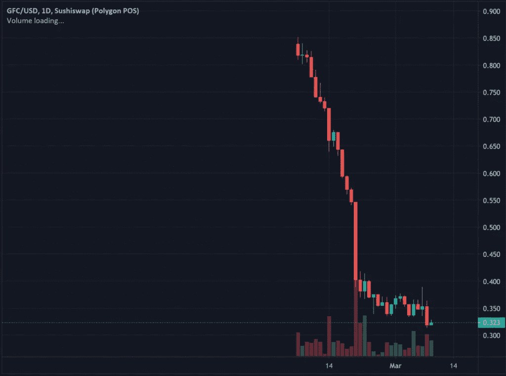

# 即使 NFT 价格下跌，区块链玩赚游戏仍是建设的重点

> 原文：<https://medium.com/coinmonks/blockchain-play-and-earn-video-games-focal-point-on-constructing-even-as-nft-prices-fall-3e40358db2e2?source=collection_archive---------101----------------------->

**Visit our website:-** [**https://bitcoinsupports.com/**](https://bitcoinsupports.com/)

月交易量显示 NFT 值在下降，然而区块链游戏任务公司通过改进他们的即玩即赚机制忽略了这一下滑趋势。从 1 月 1 日到 2 月中旬，不可兑现的代币(NFT)一直处于强劲的牛市。在此期间，OpenSea 的交易量达到 50 亿美元，然后在 2 月末下降到 36 亿美元。这应该是一个信号，表明加密和 NFT 市场的典型情绪曾经正在调整。

随着 Q2 的临近，NFT 的整体交易量和收入都在下降，导致新进入者和买家怀疑这个季度是否会消亡。根据 DappRadar 的信息，在剩余的一周内，OpenSea 的买卖量下降了近 11%,到目前为止，整个市场继续降温，因为客户范围在过去 30 天内下降了 13%。似乎 NFT 周边地区已经意识到，蓝筹衍生品的选择已经耗尽，买家正在寻找一种更可持续、投机性更低的价值配置。

无论 profile movement (PFP)走向何方，区块链游戏建设者和社区都在稳步建设。

例如，2 月份,“即玩即赚”( P2E)区块链运动 Axie Infinity 在 NFT 的销售额突破 40 亿美元。这标志着它成为销售额为 0.33 的最大 NFT 平台，也是第一个实现这一目标的 NFT 系列。

[https://twitter.com/ETH_Daily/status/1496437349684637705](https://twitter.com/ETH_Daily/status/1496437349684637705)

Axie Infinity 于 2018 年创立，这款娱乐产品清楚地证明了在一个经历激烈的市场中什么是可能的。Axie Infinity 开发了一个最小可行产品(MVP ),搭载了成千上万的 Web3、区块链和加密货币。

区块链电子游戏专注于创造，并在这个熊市中艰难前行，以面对糟糕的趋势。这三个区块链游戏的重点是增加资本流动，扩大基础设施和建立安全的用户基础。

**新买的资金推动了守护者协会的繁荣**

区块链视频游戏正在通过战略合作伙伴关系定位自己的位置，以此来推进自己的产品。NFT 游戏开发商 Immutable X 在最近一轮 2 亿美元的融资中表现明显。在这条新闻中，其资金的“很大一部分”将用于尖端项目，其中包括守护者协会。

根据守护者协会的不和，这个消息来得正是时候，在乌克兰这个地方的战斗已经造成了发展上的挫折。由于《守护者协会》部分是在乌克兰改进工作室 Stepico Games 的帮助下开发的，一般的娱乐开发不可避免地面临延迟。就像加密市场一样，守护者协会的游戏内置 GOG 令牌已经崩溃，目前价值为 0.37 美元，比 2.81 美元的历史高点下跌了近 87%。

**Visit our website:-** [**https://bitcoinsupports.com/**](https://bitcoinsupports.com/)

守护者协会将把新筹集的资金分配给体育和社区的广告活动和扩展选项。清洁资金通过持久的市场和项目在未来 12 个月雇佣 200 名员工的宏伟目标的焦点，确保了项目的可持续性。守护者协会已经发布并申请了它的前 alpha 游戏试玩版，作为对社区洞察力的证明和贡献。

NFT 的其他任务是通过与不同的网络合作来促进改变，从而将他们的社区额外地过渡到游戏生态系统。

CyberKongz 在 Polygon

上推进“Play&Kollect”NFT CyberKongz 系列最初是以太坊社区上的一个典型的 PFP，虽然它仍然如此运作，但它已经过渡到 Polygon 社区，以实现其 Play & Kollect 游戏化功能。

虽然部署面临一些小的延迟，但工作人员目前正在为社区做好准备，通过一个到多边形网络的桥梁顺利启动。CyberKongz 还宣布将其与分散化的 oracle community ChainLink 及其可验证随机函数(VRF)集成到 Play & Kollect 生态系统中。

[https://twitter.com/PolygonDaily/status/1501280149953597441](https://twitter.com/PolygonDaily/status/1501280149953597441)

VRF 函数将通过甲骨文节点预先提交的私钥对游戏中的元素进行随机化，生成一个随机变量和一个混有未知块数据的密码证明。这种合作增加了最先进技术方面的集成，同时优先考虑安全性。

目前，通过 OpenSea 在 Polygon 社区上希望玩 CyberKongz VX 的游戏内角色为 2.59 Ether)，即$ 6674.09。足够有趣的是，以太坊社区上不再桥接的财产更划算，为 1.95 ETH，或 5024.90 美元。

**银河搏击俱乐部正在划分游戏和 Web3 开发的区域**

在其超现代的更新中，P2E 娱乐银河搏击俱乐部宣布与韦内丘克体育和加里·维的兄弟 AJ·韦内丘克合作，将娱乐引入终极格斗锦标赛(UFC)的运动员。GFC 的本国货币 GCOIN 也计划在火币交易所推出，可能会给它带来它想要的涨幅，以扭转目前的跌势。在最后一周，GCOIN 下跌了 11 %, token 从 2.16 美元的历史高点下跌了近 85%。

**Visit our website:-** [**https://bitcoinsupports.com/**](https://bitcoinsupports.com/)

与《守护者协会》和《赛博控》类似，GFC 也因不和谐漏洞而遭遇了一些挫折。然而，它似乎是通过持续关注可交付成果来应对逆境的。该团队已经开发了测试版的新功能，并计划在接下来的两周内整合游戏赚取机制。要在游戏中释放金币，玩家必须亲自体验创世纪银河战士。更具成本效益的对手和最低收入等级目前的价格为 0.47 ETH，或 1271.60 美元，最高收入等级的最低价格为 3.99 ETH，或 10795.10 美元。

尽管有无法控制的挫折和挑战，区块链游戏公司似乎认识到成长的烦恼是不可避免的，但要想成功，他们必须牢记一个方面:提高游戏的趣味性。随着市场稳步进入 Q2，投资者将密切关注谁明智地利用了这段平静的时间。

【https://bitcoinsupports.com/】访问我们的网站:-

****免责声明:以上为作者观点，不应视为投资建议。读者应该自己做研究。****

> **加入 Coinmonks [电报频道](https://t.me/coincodecap)和 [Youtube 频道](https://www.youtube.com/c/coinmonks/videos)了解加密交易和投资**

# **另外，阅读**

*   **[3 商业评论](/coinmonks/3commas-review-an-excellent-crypto-trading-bot-2020-1313a58bec92) | [Pionex 评论](https://coincodecap.com/pionex-review-exchange-with-crypto-trading-bot) | [Coinrule 评论](/coinmonks/coinrule-review-2021-a-beginner-friendly-crypto-trading-bot-daf0504848ba)**
*   **[莱杰 vs n rave](/coinmonks/ledger-vs-ngrave-zero-7e40f0c1d694)|[莱杰 nano s vs x](/coinmonks/ledger-nano-s-vs-x-battery-hardware-price-storage-59a6663fe3b0) | [币安评论](/coinmonks/binance-review-ee10d3bf3b6e)**
*   **[Bybit Exchange 审查](/coinmonks/bybit-exchange-review-dbd570019b71) | [Bityard 审查](https://coincodecap.com/bityard-reivew) | [Jet-Bot 审查](https://coincodecap.com/jet-bot-review)**
*   **[3 commas vs Cryptohopper](/coinmonks/3commas-vs-pionex-vs-cryptohopper-best-crypto-bot-6a98d2baa203)|[赚取加密利息](/coinmonks/earn-crypto-interest-b10b810fdda3)**
*   **最好的比特币[硬件钱包](/coinmonks/hardware-wallets-dfa1211730c6) | [BitBox02 回顾](/coinmonks/bitbox02-review-your-swiss-bitcoin-hardware-wallet-c36c88fff29)**