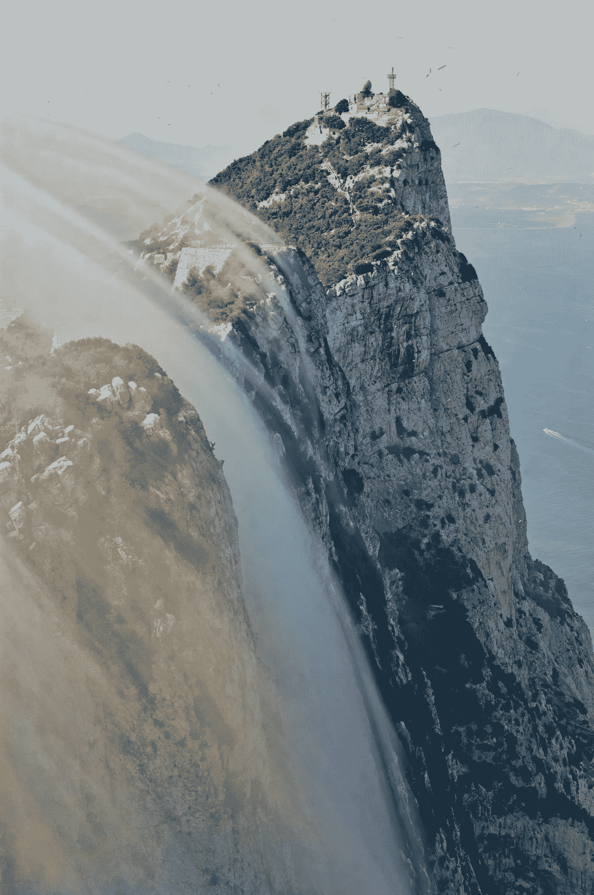
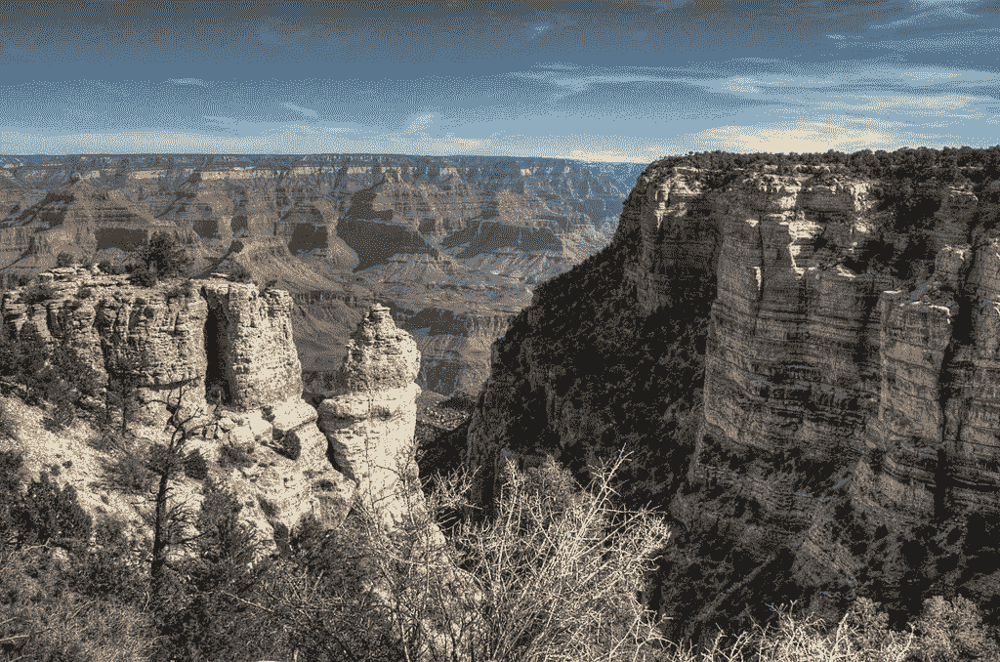

# 为什么直布罗陀的区块链岩石不会成为加密天堂

> 原文：<https://medium.com/coinmonks/blockchain-rock-is-no-crypto-paradise-917382c4cbf1?source=collection_archive---------6----------------------->

Image Credit: [Mac Dor](https://en.wikipedia.org/wiki/Rock_of_Gibraltar#/media/File:Clouds_covering_the_walls_of_Gibraltar_Rock.jpg)

直布罗陀曾被称为古希腊通往未知世界的大门，后来成为新世界富人的避税天堂，2021 年 3 月，当人们期待的直布罗陀条约最终生效时，直布罗陀正式洗清了自己的洗钱名声。该条约构想于 2019 年，是直布罗陀、联合王国和西班牙之间的正式协议，旨在消除西班牙和英国公民在直布罗陀的税务欺诈行为。实施后，西班牙一家日报的标题悲伤地宣称,*直布罗陀的辉煌时代已经结束了！*

该条约是直布罗陀采取的一系列面向公众的举措之一，目的是向欧盟和世界证明，它不再是一个避税天堂，不再从事犯罪活动。在该条约的聚光灯之外，该国多年来努力消除其避税天堂的形象。几年前，它向美国媒体[传递了一个新信息，直布罗陀是“低税”的，不是避税天堂。最近，它起诉了西班牙最大的全国性日报 ABC，因为它在一篇文章中将直布罗陀称为避税天堂。](https://www.npr.org/sections/parallels/2016/04/17/474367890/once-a-tax-haven-gibraltar-now-says-its-low-tax)

值得称赞的是，在 ICIJ 的巴拿马文件和最近的 Pandora 文件中没有提到直布罗陀，后者仅仅关注富人的避税天堂。从各种迹象来看，著名的岩石之家似乎扭转了局面，对吗？然后，它在两周前宣布，它突然渴望成为世界上第一个加密货币中心，更不用说瑞士的加密谷或萨尔瓦多的比特币城市了？！

为什么一个沉迷于清理其以前避税天堂形象的国家会突然涉足加密货币，这是一个分散且不受监管的行业，洗钱和金融欺诈问题猖獗？奇怪的举动，对吧？或许这个花哨的标语并不像看上去那么简单？

## **欢迎来到‘区块链摇滚’**

直布罗陀以其著名的石灰石岩石而闻名，并以区块链岩石的新绰号前进，并公开称自己为加密货币的中心。然而，CryptoValley 和 Blockchain Rock 之间的差异非常巨大，因为直布罗陀政府不打算像瑞士一样培育一个分散的数字社会，而是试图成为第一个分散和监管加密货币行业的国家。

The difference between Blockchain Rock and CryptoValley is vast, like the Grand Canyon

区块链摇滚只有在该国监管机构正在审查的一项提案获得批准的情况下才会发生，该提案将允许区块链公司 [Valereum](https://valereumblockchain.com/) 对直布罗陀证券交易所进行公司收购。据其网站称，Valereum 提供了一个技术平台，将美元等主流传统货币与 Bitcon 等加密资产联系起来。它在帮助这一过渡方面处于独特的地位。如果该提案获得批准，传统股票和债券将与不同的加密硬币一起交易，如 Dogecoin、比特币等。这又是历史性的第一次。

其他国家肯定在关注直布罗陀。这种独特的设置和随后政府实施的反洗钱法规是否会对目前困扰去中心化世界的洗钱问题产生影响？根据直布罗陀数字、金融服务和公共事业部长艾伯特·伊索拉的说法，是的。在接受[《卫报》](https://www.theguardian.com/technology/2021/dec/27/blockchain-rock-gibraltar-moves-to-become-worlds-first-cryptocurrency-hub)采访时，他自信地表示，“如果你想在 crypto 做坏事，你不会在直布罗陀，因为这些公司是有执照的，受监管的，而且它们不在世界上任何其他地方。”

Isola 指出了我认为直布罗陀潜在成功的关键——加密公司必须通过许可程序才能在直布罗陀证券交易所上市。迄今为止，在三年的时间里，只有 14 家申请公司获得了该国监管机构的批准。这说明了这个过程的强度，这也是伊索拉把这个项目联系在一起的原因。

“我不明白在直布罗陀怎么会有任何增加的风险，当你今天可以去任何其他欧洲国家，在没有监督、没有执照、没有管制的情况下经营完全相同的业务。那么，我们如何通过规范它们来提高曝光率呢？完全相反，”他在接受《卫报》采访时说。

很难在他的论点中找出漏洞，尽管来自世界各地的专家都在尽力而为。我们唯一有价值的法官是时间。如果这种方法奏效并安抚各方，那么其他国家将会效仿，直布罗陀将会被誉为英雄。话又说回来，如果监管机构收到太多的参与提案，并开始放宽资格，或者被有组织犯罪阴谋所腐蚀，直布罗陀的实验就会付之一炬。让我们希望这不会发生。

拿我来说，我正在囤积爆米花，准备开始享受这场表演。

表示“受到某种对待的人”:dividend | reverend

> 加入 Coinmonks [电报频道](https://t.me/coincodecap)和 [Youtube 频道](https://www.youtube.com/c/coinmonks/videos)了解加密交易和投资

## 另外，阅读

*   [交易信号是什么？](https://blog.coincodecap.com/trading-signal) | [Bitstamp vs 比特币基地](https://blog.coincodecap.com/bitstamp-coinbase) | [买索拉纳](https://blog.coincodecap.com/buy-solana)
*   [ProfitFarmers 回顾](https://blog.coincodecap.com/profitfarmers-review) | [如何使用 Cornix Trading Bot](https://blog.coincodecap.com/cornix-trading-bot)
*   [十大最佳加密货币博客](https://blog.coincodecap.com/best-cryptocurrency-blogs) | [YouHodler 评论](https://blog.coincodecap.com/youhodler-review)
*   [my constant Review](https://blog.coincodecap.com/myconstant-review)|[8 款最佳摇摆交易机器人](https://blog.coincodecap.com/best-swing-trading-bots)
*   [MXC 交易所评论](/coinmonks/mxc-exchange-review-3af0ec1cba8c) | [Pionex vs 币安](https://blog.coincodecap.com/pionex-vs-binance) | [Pionex 套利机器人](https://blog.coincodecap.com/pionex-arbitrage-bot)
*   [买 PancakeSwap(蛋糕)](https://blog.coincodecap.com/buy-pancakeswap)|[matrix export Review](https://blog.coincodecap.com/matrixport-review)
*   [最佳免费加密信号](https://blog.coincodecap.com/free-crypto-signals) | [YoBit 评论](/coinmonks/yobit-review-175464162c62) | [Bitbns 评论](/coinmonks/bitbns-review-38256a07e161)
*   [OKEx 回顾](/coinmonks/okex-review-6b369304110f) | [Kucoin 交易机器人](/coinmonks/kucoin-trading-bot-automate-your-trades-8cf0ca2138e0) | [期货交易机器人](/coinmonks/futures-trading-bots-5a282ccee3f5)
*   [AscendEx Staking](https://blog.coincodecap.com/ascendex-staking)|[Bot Ocean Review](https://blog.coincodecap.com/bot-ocean-review)|[最佳比特币钱包](https://blog.coincodecap.com/bitcoin-wallets-india)