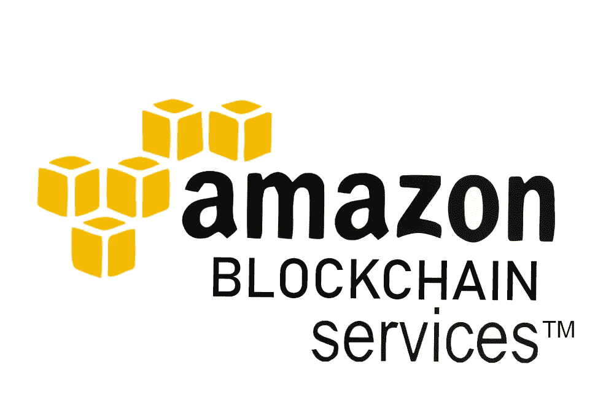
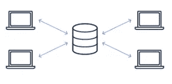
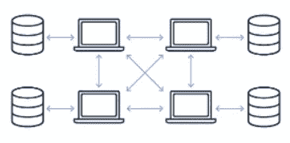
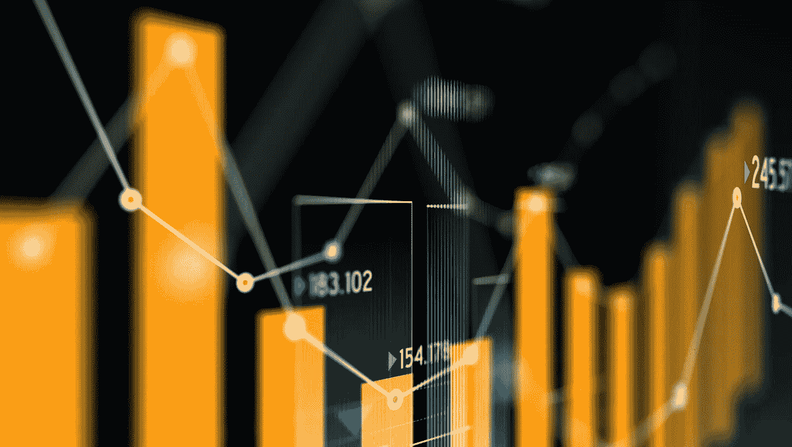

# Aws 上的区块链服务

> 原文：<https://medium.com/coinmonks/blockchain-services-on-aws-ddf8a92addbd?source=collection_archive---------19----------------------->

# 区块链和云计算等式的范例

云上的区块链技术是区块链一项意义深远的创新。云计算正在慢慢向分散式基础设施开放，以实现更好的可访问性、安全性、效率和灵活性。一些新的进步，如**无服务器**技术，正在给计算世界带来深刻的变革。

同时，新的创新为系统管理员在设计、配置和管理运行业务应用程序所需的服务器和资源方面带来了更大的灵活性。此外，分散式框架还缓解了与集中式云计算存储相关的严重挫折。

随后，分散式框架还允许通过在各种存储组件之间分配安全责任来实现广泛的安全性。在区块链云存储解决方案的情况下，用户数据被分离成微小的数据碎片。加密微小的数据碎片有助于增加一层安全性，同时使它们能够在整个网络中传播。

# AWS 区块链服务

## [亚马逊量子账本数据库](https://aws.amazon.com/qldb/?c=bl&sec=srv)

完全托管的分类帐数据库，提供集中的、不可变的、可加密验证的事务日志。

集中所有权

中央可信机构拥有并管理分类帐，并与任何数量的合作方共享。

## [亚马逊托管区块链](https://aws.amazon.com/managed-blockchain/?c=bl&sec=srv)

完全托管的服务，使创建和管理可扩展的区块链网络和分布式账本技术变得容易。

分散所有权

多方可以相互交易，而不必相互了解或信任。被称为成员的每一方在网络中拥有一个对等节点。

# 公司如何充分利用信息技术？

## SGX 使用亚马逊管理的区块链构建创新的支付解决方案

SGX 总部位于新加坡，在北京、芝加哥、香港、伦敦、纽约、孟买、旧金山、上海和东京拥有 800 多名员工。它提供上市、交易、清算、结算、存管和数据服务。

*   在几天内建立一个区块链环境
*   减轻运营负担
*   提高数据和交易传输的效率
*   将贸易结算时间缩短高达 60%

## 雀巢的原产地咖啡链通过亚马逊管理的区块链带来供应链透明度

雀巢是一家全球食品和饮料公司，拥有 2000 多个品牌，在全球 189 个国家分销。

供应链的透明度对消费者来说越来越重要，他们想知道他们的食物中有什么，来自哪里。虽然雀巢已经开始发布其 15 种主要商品的供应链信息，但使用区块链技术可以实现更精确的跟踪，”雀巢大洋洲公司数字技术经理阿明·内扎特说有了**亚马逊管理的区块链**，我们能够建立我们的**Hyperledger****Fabric**网络，并轻松邀请我们的合作伙伴参与我们的供应链透明工作。亚马逊管理的区块链将使我们的客户能够从农场到消费全程跟踪他们在区块链的产品。

## 司机和车辆执照代理处

驾驶员和车辆牌照局(DVLA)是一个中央政府机构，负责英国 4800 多万名驾驶员和 4000 多万辆汽车的注册和牌照发放。

我们维护的登记册对于广泛的公共和私营部门服务至关重要，因此信任我们处理数据的方式至关重要。 **Amazon QLDB** 有可能为我们处理信息的方式带来巨大的好处，我们很高兴能够探索这项新兴技术如何进一步支持我们的服务。

这基本上是我的观点。下一集，我们带着更多惊人的见解再见。谢谢大家！

> *加入 Coinmonks* [*电报频道*](https://t.me/coincodecap) *和* [*Youtube 频道*](https://www.youtube.com/c/coinmonks/videos) *了解加密交易和投资*

# 另外，阅读

*   [有哪些交易信号？](https://coincodecap.com/trading-signal) | [Bitstamp vs 比特币基地](https://coincodecap.com/bitstamp-coinbase) | [买索拉纳](https://coincodecap.com/buy-solana)
*   [ProfitFarmers 回顾](https://coincodecap.com/profitfarmers-review) | [如何使用 Cornix Trading Bot](https://coincodecap.com/cornix-trading-bot)
*   [十大最佳加密货币博客](https://coincodecap.com/best-cryptocurrency-blogs) | [YouHodler 评论](https://coincodecap.com/youhodler-review)
*   [MyConstant Review](https://coincodecap.com/myconstant-review) | [8 款最佳摇摆交易机器人](https://coincodecap.com/best-swing-trading-bots)
*   [MXC 交易所评论](/coinmonks/mxc-exchange-review-3af0ec1cba8c) | [Pionex vs 币安](https://coincodecap.com/pionex-vs-binance) | [Pionex 套利机器人](https://coincodecap.com/pionex-arbitrage-bot)