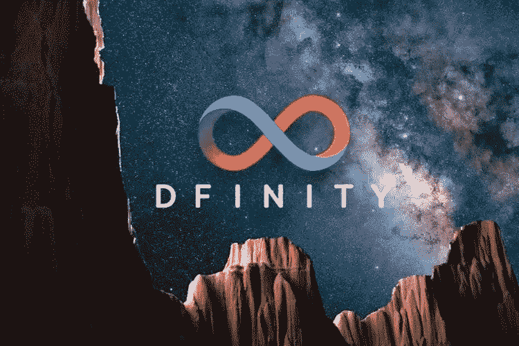

# 区块链奇点是什么？

> 原文：<https://medium.com/coinmonks/blockchain-singularity-what-is-it-b7fe84bbdd2b?source=collection_archive---------20----------------------->

互联网计算机导论

互联网是人类最伟大的发明之一。一个由开放的、分散的协议创建的公共网络将数以百万计的私有网络结合成一个统一的网络，连接所有人和所有事物，所有这些都从连接 UCLA、SRI、USCB 和犹他州的四个节点开始。该网络发展到 21 个节点，几十年后扩展到全球。

[马克·安德森和埃里克·比纳创造了第一个网络浏览器 Mosaic](https://en.wikipedia.org/wiki/Mosaic_(web_browser)) ，它后来启发了网景公司的发展。

开放的互联网并没有完成，它的商业潜力变得显而易见。一场争论出现了，这个庞大的网络应该由分散的协议还是强大的公司来管理。

2009 年，区块链技术作为一项突破出现，它提供了治理令牌和智能合同。比特币成为第一种在网络空间创造数字黄金的加密货币，不久前以太坊推出了智能合约，使加密货币可编程，并引发了 divvy 革命。

[无限基金会](https://dfinity.org/)正引领着这一新运动，并跟随这些网络的脚步。Dfinity 成立于 2016 年，推出了去中心化的世界计算机，也被称为互联网。一个无限的区块链，以网络速度运行，托管所有人文软件和数据。直到现在，互联网还是一个全球网络。现在有了互联网，计算机将网络的功能扩展到了公共计算平台。互联网计算机将使企业家和开发者能够直接构建公共互联网。因此，互联网正在回归其自由和开放的根基，这将我们带到了这一时刻——互联网计算机的水星创世纪发布。

> 加入 Coinmonks [电报频道](https://t.me/coincodecap)和 [Youtube 频道](https://www.youtube.com/c/coinmonks/videos)了解加密交易和投资

# 另外，阅读

*   [CoinFLEX 评论](https://coincodecap.com/coinflex-review) | [AEX 交易所评论](https://coincodecap.com/aex-exchange-review) | [UPbit 评论](https://coincodecap.com/upbit-review)
*   [AscendEx 保证金交易](https://coincodecap.com/ascendex-margin-trading) | [Bitfinex 赌注](https://coincodecap.com/bitfinex-staking) | [bitFlyer 点评](https://coincodecap.com/bitflyer-review)
*   [Bitget 回顾](https://coincodecap.com/bitget-review)|[Gemini vs block fi](https://coincodecap.com/gemini-vs-blockfi)cmd |[OKEx 期货交易](https://coincodecap.com/okex-futures-trading)
*   [AscendEx Staking](https://coincodecap.com/ascendex-staking)|[Bot Ocean Review](https://coincodecap.com/bot-ocean-review)|[最佳比特币钱包](https://coincodecap.com/bitcoin-wallets-india)
*   [霍比评论](https://coincodecap.com/huobi-review) | [OKEx 保证金交易](https://coincodecap.com/okex-margin-trading) | [期货交易](https://coincodecap.com/futures-trading)
*   [网格交易机器人](https://coincodecap.com/grid-trading) | [Cryptohopper 审查](/coinmonks/cryptohopper-review-a388ff5bae88) | [Bexplus 审查](https://coincodecap.com/bexplus-review)
*   [7 个最佳零费用加密交易平台](https://coincodecap.com/zero-fee-crypto-exchanges)
*   [氹欞侊贸易评论](https://coincodecap.com/anny-trade-review) | [霍比保证金交易](/coinmonks/huobi-margin-trading-b3b06cdc1519)