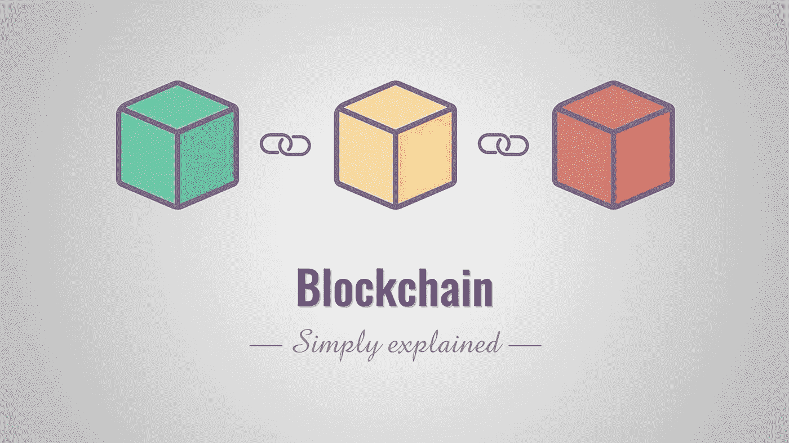

# 区块链技术:it 外行指南…

> 原文：<https://medium.com/coinmonks/blockchain-technology-a-laymans-guide-to-it-b0bb98453928?source=collection_archive---------54----------------------->

区块链听起来像是一个非常奇特的术语，不是吗？

今天，我们将深入研究这种所谓的技术，这种技术在过去几年里引起了极大的关注。

根据定义，**区块链技术被定义为去中心化、分布式、不可变的账本，记录数字资产的出处。**

我知道你可能跳过了这个定义，因为它包含了一些花哨的术语。

没问题。我是今天的简讯，即我的第一篇简讯，我们将在 5 分钟内用简单的语言了解区块链的来龙去脉。

**区块链就是一串包含信息的区块链。**它有一些有趣的特性，**一旦数据被写入数据块，改变就变得非常非常困难**(我不是说这不可能。在即将发布的区块链技术简讯中，你会明白为什么)。

区块链最初是由一群研究人员在 1991 年描述的，**最初是为了给数字文档加上时间戳，使它们不能被回溯或篡改——就像公证人一样。**

理解区块链技术的一个简单类比是 Google Docs。当我们创建一个文档并与一群人共享它时，该文档是被分发的，而不是被复制或传输的。这创建了一个分散的分发链，使每个人都能同时访问文档。文档中的所有修改都会被实时记录并立即反映出来，从而使更改完全透明。

**Google Docs 和区块链技术的一个主要区别是…** [**阅读更多**](https://raihankhan.substack.com/p/blockchain-technology-a-laymans-guide)

> 加入 Coinmonks [电报频道](https://t.me/coincodecap)和 [Youtube 频道](https://www.youtube.com/c/coinmonks/videos)了解加密交易和投资

# 另外，阅读

*   [如何在 FTX 交易所交易期货](https://coincodecap.com/ftx-futures-trading) | [OKEx vs 币安](https://coincodecap.com/okex-vs-binance)
*   [CoinLoan 审查](https://coincodecap.com/coinloan-review) | [YouHodler 审查](/coinmonks/youhodler-4-easy-ways-to-make-money-98969b9689f2) | [BlockFi 审查](https://coincodecap.com/blockfi-review)
*   XT.COM 评论 | [币安评论](https://coincodecap.com/xt-com-review)
*   [SmithBot 评论](https://coincodecap.com/smithbot-review) | [4 款最佳免费开源交易机器人](https://coincodecap.com/free-open-source-trading-bots)
*   [比特币基地僵尸程序](/coinmonks/coinbase-bots-ac6359e897f3) | [AscendEX 审查](/coinmonks/ascendex-review-53e829cf75fa) | [OKEx 交易僵尸程序](/coinmonks/okex-trading-bots-234920f61e60)