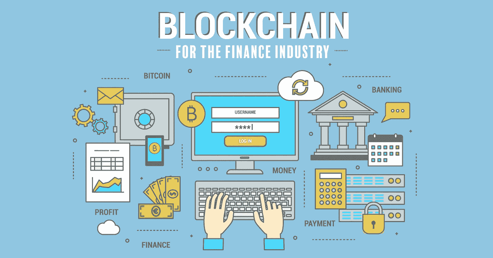

# 区块链技术及其在金融中的应用

> 原文：<https://medium.com/coinmonks/blockchain-technology-and-its-applications-in-finance-314a6e7e2c5a?source=collection_archive---------45----------------------->

区块链是比特币和其他加密货币运行的基础技术。然而，如果加密货币颇具争议，区块链则不然，它本身就是一项创新，已被证明是开创性的。区块链具有多种应用，可用于加密货币之外的各种领域。

**什么是区块链？**
区块链基本上是参与者或网络“节点”之间交易的分类账，或者更准确地说，是交易块。区块链中的每个区块是:

*   按时间顺序排序:每个块都被唯一地标识，并引用它前面的块的标识符
*   不可撤销:一旦块被验证并添加到区块链，就不能再被删除或修改
*   共享:网络中的所有节点都有自己的区块链上所有事务的副本，与所有其他节点的副本相同；所以区块链也被称为“分布式账本”
*   分散式:没有网络节点充当“可信第三方”，即区块链参考副本的持有者
*   透明:记录在区块链中的所有事务对所有网络节点都是可见的
*   防篡改:在区块链中插入欺诈或错误交易极其困难，甚至几乎不可能

区块链可以用来做什么？

为了理解区块链的可能用途，有必要从交易的意义出发。当交易发生在两个行为者之间时，我们称之为交易或转让，交易需要有一个可信的第三方在场证明转让的有效性，也就是说在这些行为者之间，他们基本上没有理由信任对方，主要是因为他们彼此不了解。

对转让的理解是广义的，也就是说，它涉及一项原已存在的资产或权利，因此从一个人转移给另一个人，或者从一项资产或权利的产生转移，转让还包括证明该人确实是合法持有人，它包括:

*   所有权转让或证明:货币、证券、不动产等。
*   权利的转让或证明:身份、知识产权、投票权等。
*   承诺的转让或证明:出租、出借、设备共享等。

在所有这些情况下，权利的有效性由可信任的第三方证明:银行、中央保管机构、民事登记处、市场、公证人、版权机构、市政当局等。其保持权利所有权的登记是最新的。

区块链取消了第三方存在的必要性，同时保留了其作用的本质，即信任。它允许以分散的方式在所有行为者之间共享这一登记册，同时保证它所传达的信息的真实性。

**金融中的区块链**
我之前说过，区块链有多种可能的应用。

但在这里，我将简要关注它在金融中的应用。

一个允许以安全的方式管理交易的系统，在参与者之间完全保密并且具有流动性，不可能不引起金融参与者的兴趣，这就是目前正在发生的事情。我们正在见证计划的爆炸式增长，其中大多数都处于区块链和分布式分类帐的测试或“概念验证”阶段。没有一天不发布关于这个问题的新闻稿。应用领域的简要概述如下。

1.  区块链技术可能会在场外衍生品和证券金融交易(回购和证券借贷)的透明度和安全性方面带来巨大进步。基本上，区块链本身将构成“交易库”,允许在任何时候知道谁持有哪个合同。
2.  后市场证券链:在这一领域，一切都依赖于中央存管机构的关键作用，它是保存流通证券数量登记册的唯一机构。有了区块链，就不再需要通过中央托管人和众多的中间人来实现证券买卖后的所有权转让
3.  国际贸易融资:此处的复杂性在于商业单据的存储和获取，这些单据使得证明货物在某个港口的存在及其到达目的地的路线成为可能。这些信息可以以“智能合同”的形式存储在区块链中。
4.  公司的私人资本或债务融资:区块链使得有可能记录和交换成长型公司的股票，这些公司的融资尚未公开(即“未上市”公司)。

**区块链银行:自相矛盾？**
区块链背后的倡议，即比特币，具有强烈的意识形态色彩。潜在的意识形态是那些为政府消失而奔走的人们的意识形态。区块链旨在允许出现一个不受国家、央行和商业银行控制、能让用户满意地工作(而且确实在工作)的金融体系。

事实上,“可信赖的第三方”的角色是银行业务的核心，不仅在货币交易方面，而且在证券、债务、衍生工具等所有类型的金融合同方面都是如此。

由此可见，银行在这一领域的策略只能是防御性的。

驾驭海浪，防止它淹没你。

可以肯定的是，最有趣的举措不会来自银行或当前的交易后参与者，对他们来说，这相当于锯掉他们所坐的树枝，而是来自新的参与者。

因此，监管者这一重要角色出现了，他们以极大的兴趣关注着技术的发展...有一定的可能性将任何在他们看来违背安全和金融稳定的发展扼杀在萌芽状态，并大力鼓励有助于他们实现目标的发展。

还应考虑用户、个人或公司群体对银行、资本市场中的投资者这类解决方案的可接受性。

我们应该更信任一个单一的中介机构，即银行吗？这家银行信誉卓著，由监管机构和会计师、审计师组成的庞大队伍控制，但却能够庇护一个疯狂的交易员，这个交易员能够在市场上发挥数倍于银行资本的作用。或者更确切地说，是一个由许多个人组成的社区，完全不为人知，可能或多或少都很诚实，但没有一个人单独拥有控制系统的权力？这是一个迷人的哲学问题，每个人都可以根据自己的水平自由回答。

金融服务是一个明显适用于区块链的行业。在金融服务领域，公司一直在努力降低交易成本和摩擦。总而言之，区块链有潜力让金融服务业变得更加透明，更不容易受到欺诈，对消费者来说更便宜。

> 加入 Coinmonks [电报频道](https://t.me/coincodecap)和 [Youtube 频道](https://www.youtube.com/c/coinmonks/videos)了解加密交易和投资

# 另外，阅读

*   [用于 Huobi 的加密交易信号](https://coincodecap.com/huobi-crypto-trading-signals) | [Swapzone 审查](/coinmonks/swapzone-review-crypto-exchange-data-aggregator-e0ad78e55ed7)
*   最佳[密码交易机器人](https://coincodecap.com/best-crypto-trading-bots) | [购买索拉纳](https://coincodecap.com/buy-solana) | [矩阵导出评论](https://coincodecap.com/matrixport-review)
*   [Coldcard 评论](https://coincodecap.com/coldcard-review) | [BOXtradEX 评论](https://coincodecap.com/boxtradex-review)|[uni swap 指南](https://coincodecap.com/uniswap)
*   [比特币基地评论](/coinmonks/coinbase-review-6ef4e0f56064) | [德里比特评论](/coinmonks/deribit-review-options-fees-apis-and-testnet-2ca16c4bbdb2) | [FTX 评论](/coinmonks/ftx-crypto-exchange-review-53664ac1198f)
*   [Coinmetro 评论](https://coincodecap.com/coinmetro-review) | [VirgoCX 评论](https://coincodecap.com/virgocx-review)