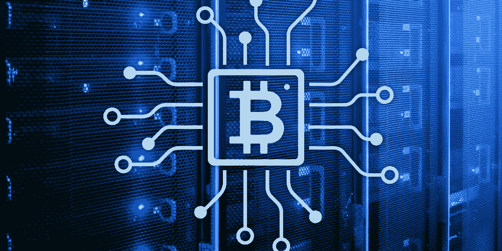

# 区块链技术及其潜在应用——加密货币

> 原文：<https://medium.com/coinmonks/blockchain-technology-and-its-potential-applications-7276c526907?source=collection_archive---------97----------------------->

## 一种分布式数据库，无需第三方即可实现安全、透明和防篡改的交易。

B lockchain 是一种分布式分类账，可用于记录跨多台计算机的交易，因此，在没有更改所有后续块和网络共谋的情况下，记录不能被追溯更改。这是一个开放的、分散的数据库。

Blockchain Technology and Its Potential Applications

区块链是一种记录和存储交易信息的数据库。使用该系统的一个主要优点是能够以不可改变的、防篡改的方式记录数据。这意味着一旦数据被记录到链上的块中，它就不能被更改或删除。(该属性使其对审计、来源跟踪和计票等应用程序非常有用。)

区块链是一个分布式数据库，这意味着它不是存储在一个单一的中心位置，而是分布在计算机网络中。该网络由运行维护区块链所需软件的计算机(也称为节点)组成。为了将交易添加到区块链，它必须由节点网络验证。这个验证过程被称为共识。

# 区块链是如何工作的？

区块链由一个节点网络维护，每个节点都有整个区块链的副本。当一个新的事务被启动时，它被广播到节点网络。然后，节点根据预定义的规则验证交易，如果交易有效，则将其添加到链中。该事务现在是不可变的，这意味着它不能被更改或删除。

每笔交易的验证过程都需要计算能力，作为回报，参与节点会得到加密货币的补偿。这个过程被称为采矿。

# 区块链技术有什么好处？

T 区块链技术的主要优势在于它能够以安全、防篡改的方式存储和共享数据。这使得它非常适合金融交易、出处跟踪和投票等应用。

区块链技术的另一个好处是它是分散的，这意味着它不受任何单一实体的控制。这使得它能够抵抗审查和篡改。

Blockchain Technology and Its Potential Applications

# 区块链技术有哪些潜在的应用？

区块链技术有可能彻底改变各种各样的行业。一些最有前途的应用包括:

# 金融交易:

区块链可用于简化进行和验证交易的流程，从而实现更快、更高效、更便宜的交易。

# 出处跟踪:

区块链可以用来跟踪产品的来源，并确保它们的来源符合道德规范。

# 投票:

区块链可以用来安全记录选票，防止舞弊。

# 医疗保健:

区块链可用于以安全、防篡改的方式存储患者数据。这可能会彻底改变医疗保健的提供和跟踪方式。

# 供应链管理:

区块链可用于跟踪货物的移动，并确保它们按预期交付。

# 房地产:

区块链可以用来简化买卖财产的过程。

# 身份管理:

区块链可用于以安全、防篡改的方式存储和管理身份信息。这可能会彻底改变我们与数字世界互动的方式。

区块链技术的潜在应用是巨大的和令人兴奋的，该技术仍处于早期阶段。随着它的不断发展，很可能会发现更多的应用。

# 结论

锁链技术是一种安全、分散的系统，有可能彻底改变各种行业。它的主要好处是能够以不可变、防篡改的方式存储数据。这使得它非常适合金融交易、出处跟踪和投票等应用。

区块链技术的潜在应用是巨大的和令人兴奋的，该技术仍处于早期阶段。随着它的不断发展，很可能会发现更多的应用。

> *加入 Coinmonks* [*电报频道*](https://t.me/coincodecap) *和* [*Youtube 频道*](https://www.youtube.com/c/coinmonks/videos) *了解加密交易和投资*

# 另外，阅读

*   [Capital.com 评论](https://coincodecap.com/capital-com-review) | [香港的加密借贷平台](https://coincodecap.com/crypto-lending-hong-kong)
*   [支持卡审核](https://coincodecap.com/uphold-card-review) | [信任钱包 vs MetaMask](https://coincodecap.com/trust-wallet-vs-metamask)
*   [赢取注册奖金——10 大最佳加密平台](https://coincodecap.com/earn-sign-up-bonus)
*   [Exness 回顾](https://coincodecap.com/exness-review)|[moon xbt Vs bit get Vs Bingbon](https://coincodecap.com/bingbon-vs-bitget-vs-moonxbt)
*   [如何开始通过加密贷款赚取被动收入](https://coincodecap.com/passive-income-crypto-lending)