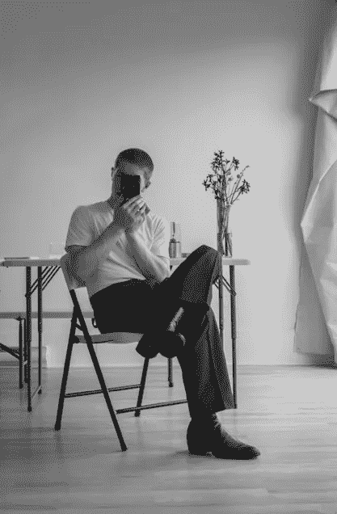
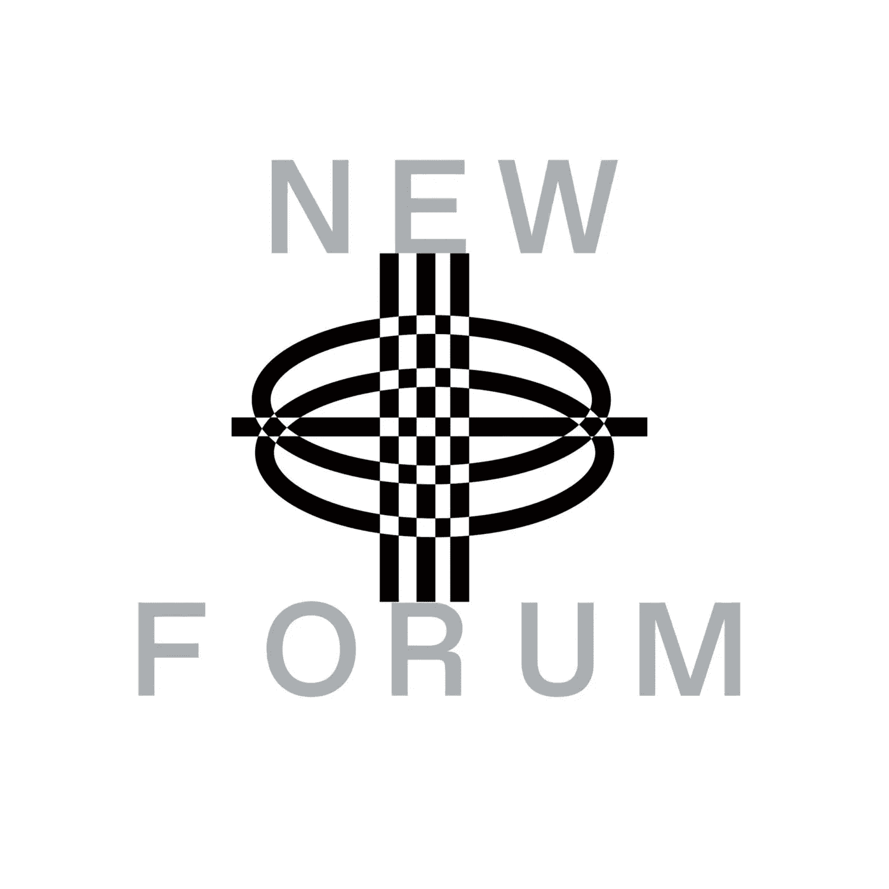

# 区块链技术重新定义创造力&改变创造者经济

> 原文：<https://medium.com/coinmonks/blockchain-technology-redefining-creativity-transforming-the-creator-economy-5820064c857e?source=collection_archive---------35----------------------->

Loucas Braconnier，也就是图 31，加入了我们这一集的新论坛。图 31 用作 Loucas 数字角色。他是一个非常罕见的、勤奋的、坚持不懈的艺术家，他投入大量的时间来改进他的技艺，这在他的作品中有所体现。他在 Web3 空间的朋友在描述图 31 时使用了“天才”这个词，我们的社区也同意！继续读下去，看他的完整采访，你就明白为什么了！

图 31 学习摄影，然后转向电影和媒体研究。他最终获得了视觉艺术和媒体专业的学士学位。图 31 展示的视觉和概念作品质疑了现实和技术之间不断发展的关系，由不同的计算机生成的图像、照片、雕塑、测试和虚拟空间支持。所有的作品都是在网上创作的，任何有网络连接的人都可以看到。

Figure 认为自己是一名多媒体艺术家，碰巧正在研究区块链技术。

> “过去，我从事过印刷、视频、摄影、雕塑装置，但现在我的主要媒介是区块链”——图 31

那么，图 31 的加密、Web3、区块链之旅是如何开始的呢？

图 31 解释说，当他完成大学学业时，疫情开始了，他所做的一切都被取消了；他不能去画廊或任何艺术家中心，甚至博物馆。除了过渡到数字艺术之外，没有什么是有意义的。他承认这一开始对他来说是一个艰难的决定，但他进入了其中，这就是他现在正在做的。

> “我曾经用沙子和一些大字体创作大型装置；我的作品尽可能地填满了整个空间。当你进行数字化工作时，就像现在我们消费艺术品的方式主要是在台式机或 iPhone 上——这是一个简单的界面，与艺术品的关系非常不同……”—图 31

图 31 表示，他发现有趣的是，由于社交媒体的性质和我们工作的性质，我们产生了大量的图像。技术在我们的日常生活中被过度使用，他想知道这如何改变我们人类以及我们解释世界其他部分的方式。

> “如今，我们倾向于区分真实空间和数字空间；这是我经常从其他交易者那里听到的。我们说 IRL(在现实生活中)，但在现实生活中，现在也是数字化的，因为我们在屏幕上花了这么多时间，屏幕占据的空间和我们花费的时间，可能相当于我们使用的时间和空间以及我们现在生活的世界……”—图 31

图 31 表明，NFTs(链上艺术，区块链艺术)将是定义现实世界中存在的艺术作品之间的平衡的关键；不仅从数字的角度，而且从物理的角度来看，使其可转移在未来将是重要的。

他更多地分享了自己的数字化工作经历；当他在采访中质疑现实和技术之间不断发展的关系时，这给他的作品带来了好处和创新。

根据图 31，区块链技术是一种媒介，不同的艺术家会用不同的方式来达到不同的效果。

> “这就是我对待它的方式——有些艺术家更喜欢娱乐，有些只是对插图感兴趣，这都没关系。这就像一个巨大的空间，不同的人有不同的意图，真正由艺术家决定他们想用它做什么，达到他们的标准，艺术史的标准，或者根本不要。他们可以做卡通化的事情，对我来说，这不会影响我在区块链上的发展空间……”—图 31

Figure31 认为，区块链技术的未来只会进一步赋予艺术家和创作者更多权利。然而，这不是一个容易做出的预测；弄清楚这个数字工作空间或艺术空间或艺术市场的结构会是什么样子，但可追溯性和更多合作的想法是有希望的。

> “这件作品是不是出自这位艺术家之手并不含糊，就像出处是肯定的一样，这很酷，但就我们的工作方式而言；我认为我们将会看到更多的合作……”—图 31

今天就加入我们的社区观看他的完整采访吧！听听 Figure31 和 NewForum 主持人之间关于现实和技术之间不断发展的关系、它如何影响 Figure31 的工作和艺术家以及区块链技术如何改变创作者经济的激动人心的讨论！

> “比方说，你有一张照片，然后你把它打印出来，然后你在画廊里展示它，就是这样，这就是它的体验；你可以写一篇关于它的文字，你可以和其他人谈论它，也许这可以培养这种体验，然而，在数字空间中，你有图像本身的物质性或者任何艺术作品变得如此巨大，不局限于单一的形式，它可以是如此多的东西:你可以从图像中提取数据，你可以用它创造一个空间，你可以创造一种氛围，你可以用它编码光，你可以扩展它成为一幅完整的地图。它的潜力是如此丰富，我非常期待它……”—图 31

[加入社区](https://twitter.com/newforum_nco)了解 [@figure31](https://twitter.com/figure31_) 并发现 web3 社区中的其他创作者！

✨Follow 图 31 在这里！推特:[@图 31](https://twitter.com/figure31_) 不和:[图 31](https://discord.com/invite/hCh6kZZTnG) 网站:[www.figure31.com](http://www.figure31.com)TG:[图 31](https://t.me/figure31)

[# web 3](https://www.linkedin.com/feed/hashtag/?keywords=web3&highlightedUpdateUrns=urn%3Ali%3Aactivity%3A6895027524963753984)[# social 3](https://www.linkedin.com/feed/hashtag/?keywords=social3&highlightedUpdateUrns=urn%3Ali%3Aactivity%3A6895027524963753984)[#](https://www.linkedin.com/feed/hashtag/?keywords=crypto&highlightedUpdateUrns=urn%3Ali%3Aactivity%3A6895027524963753984)区块链# nfts #创造经济#去中心化#社区#艺术家#协作#元宇宙

爱 x 新论坛

# Twitter @newforum_nco

不和谐[@加入](https://discord.gg/DHepA4WTkN)

# 新论坛

[NEWFORUM](https://newforum.notion.site/newforum/Welcome-to-NEWFORUM-48f9661398ec4ec6a1af37fcc96dc926) 由 [Newcoin Foundation](https://newcoin.org/) 提供支持，专注于促进去中心化社交应用的扩展，也被称为 Social 3.0，形成一个生态系统和一个由远见者、创造者和投资者组成的社区。它为思想者提供了一个安全的交流、传播和分享思想的空间，以确保一个新网络的自觉和道德发展，嵌入关怀、自由和创造力的价值观。✨每周新集！在 [Twitter](https://twitter.com/newforum_nco) 、 [Newlife](https://newlife.io/) 、 [Youtube](https://www.youtube.com/channel/UCWvHyau1nIJBffmaaj6FmbQ) 和 [LinkedIn](https://www.linkedin.com/showcase/newforum/) 上关注我们，了解 web3 的更多信息，认识生态系统！加入生态系统[不和](https://discord.gg/DHepA4WTkN)！

> 加入 Coinmonks [电报频道](https://t.me/coincodecap)和 [Youtube 频道](https://www.youtube.com/c/coinmonks/videos)了解加密交易和投资

# 另外，阅读

*   [AscendEx 保证金交易](https://coincodecap.com/ascendex-margin-trading) | [Bitfinex 赌注](https://coincodecap.com/bitfinex-staking)
*   [最好的卡达诺钱包](https://coincodecap.com/best-cardano-wallets) | [Bingbon 副本交易](https://coincodecap.com/bingbon-copy-trading)
*   [印度最佳 P2P 加密交易所](https://coincodecap.com/p2p-crypto-exchanges-in-india) | [柴犬钱包](https://coincodecap.com/baby-shiba-inu-wallets)
*   [8 大加密附属计划](https://coincodecap.com/crypto-affiliate-programs) | [eToro vs 比特币基地](https://coincodecap.com/etoro-vs-coinbase)
*   [最佳以太坊钱包](https://coincodecap.com/best-ethereum-wallets) | [电报上的加密货币机器人](https://coincodecap.com/telegram-crypto-bots)
*   [交易杠杆代币的最佳交易所](https://coincodecap.com/leveraged-token-exchanges)