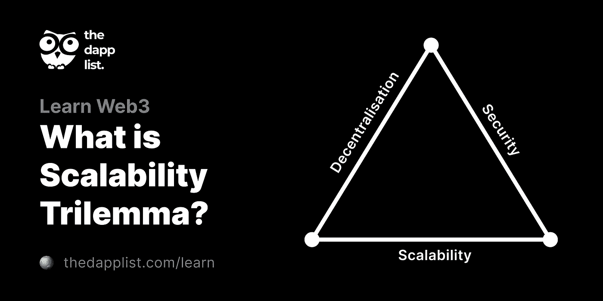

# 区块链技术:未来；如何一头扎进区块链开发？

> 原文：<https://medium.com/coinmonks/blockchain-technology-the-future-how-to-dive-into-blockchain-development-f6a3c6e2583d?source=collection_archive---------28----------------------->

Image credits: [https://pnorental.com/](https://pnorental.com/)

毫无疑问，区块链技术是一种新兴的、快速发展的技术，也是一种在全球范围内被迅速采用的技术。这并不可怕，因为智能加密货币投资可以带来改变生活的财富获取。

除了获取财富，区块链技术还可以为任何完全愿意采用它的个人或实体带来许多好处。伟大技术的一个主要好处是“去中心化”。有三大现象被用来衡量任何区块链的“伟大”。这让我们想到了一个术语，这个术语通常归因于这三者在任何区块链网络中无法平等平衡，称为“区块链可扩展性三元悖论”。这些是:

*   安全性
*   可扩展性和
*   权力下放。

我们将简要探讨这三个概念。网络的安全性通常取决于它的“去中心化”因素和在其上实现的共识机制。很难开发一个既非常安全又保持足够大的可扩展性的区块链网络。实际上，上述因素往往相互密切依赖。

**安全**处理区块链网络的完整性无法被破坏或被恶意实体利用的问题。

**可扩展性**处理区块链网络适应或处理协议调整或在高用户量、交易数据等情况下保持正常运行的能力。

**去中心化**处理区块链网络在没有民主同意或公众意见的情况下不受单个实体或一组实体的决策和/或操纵的能力。这意味着在任何区块链网络中，必须透明并尊重每个参与者的意见。

Image credits: https://thedapplist.com

这么多年来开发的许多区块链都遇到了这种三难困境，并以这样或那样的方式设计了一种方法来使用他们的方法来管理它，稍微或大大缺乏这些现象中的任何一种或两种。其他一些现有的共识机制有委托利益证明(DPoS)、纯粹利益证明(PPoS)、工作证明(PoW)等。

工作一致性机制的证明是，在该机制中，被允许向链中添加新块的实体必须成功地执行密码计算问题来验证它们的有效性。

授权的利害关系共识证明机制是这样一种机制，其中区块链的参与者经历一种“投票”形式，以选举将验证网络中下一个区块的代表。这可能会偏离方向，因为这些实体容易受到腐败的影响，并具有可变的完整性。

利害关系共识机制的纯证明是这样一种机制，其中将提议或投票赞成链上的下一个块的提议的实体是随机和秘密选择的。

在我看来，[恳求 PPoS 的 Algorand 区块链](https://algorand.com)(2017 年开发)似乎已经解决了这个三重困境。

采用加密货币和区块链技术是目前任何人都愿意给出的流行建议之一；要么打造区块链产品，要么进行资产投资。这不是一个坏主意，但应该做大量的审查和深入的研究。

有各种与区块链相关的术语，如 DeFi、dApps、web3.0、DEXes、CEXes、GameFi 等。这些是在复杂和分散的系统开发中利用该技术的一些最常见的方式。

在其他条件相同的情况下，我们可以深入了解我的故事的意图，即从发展的角度为一个对区块链技术感兴趣的人提供启示。

基本上，每个产品都以一个想法(概念化)开始，以一个成品(市场现成的产品)结束。正在组建的团队包括产品团队、咨询团队、研究团队、营销团队和工程团队。这些教派有助于任何区块链产品的完整开发过程，但我将只专注于软件开发方面的事情。原谅我:)

你可以看看这篇[可爱的文章](https://www.entrepreneur.com/article/300077)，以获得更多关于整个过程的知识(禁用网站的广告块)。

## 与区块链开发相关的概念

有许多术语与区块链开发相关联。这不是区块链 lexis 课程，不要慌:)。一个人要想成功地投入进去，他或她必须愿意让它们成为他或她的一部分。另一个温和的建议是，你需要对任何主流编程语言的传统编程有相当好的背景，如 JavaScript(尤其是)、Python、Go、Rust(很少)、Haskell、PHP/Laravel(可以帮助)等。有了这样的背景经验，这将是一个相对容易的流程。

此外，你需要采取温和、谨慎和专注的步骤，因为区块链开发(特别是在处理智能合同时)涉及财务，一个写得不正确的区块链可能会导致恶意利用(或黑客)损失大量金钱，正如 2022 年 1 月的 [Tinyman Hack](https://halborn.com/explained-the-tinyman-hack-january-2022/) 中所见。

以下是与区块链开发相关的术语；

*   **智能合同:**“智能合同”一词源于 **Nick Szabo** ，他创造了这个术语，用它来指代“一组以数字形式规定的承诺，包括各方履行这些承诺的协议”。在这种情况下，它们可以被视为在区块链上运行的应用程序，可以在采取预定义的交易行为之前验证一些程序(或参数)。举一个例子，您需要检查用户是否必须发送给定数量的令牌才能被授予访问应用程序中的特权或接收另一个令牌的等值。智能合同可以用来以分散的方式实现这一点。智能合约是使用它支持的语言编写并部署到任何区块链上的，例如 Algorand 的 TEAL，Ethereum 的 Solidity，Rust，Solana 的 C 等等。
*   **Web3.0:** Web3.0 是一个术语，用来表示从传统的(集中式)Web 应用程序开发模式到分散式 Web 应用程序开发方法的转变。它由 SDK、模块、框架、库等组成。，支持与区块链节点的交互，用于发送交易、与智能合约交互、执行令牌转移、连接到客户端钱包以授权交易事件等。这可以用多种编程语言、协议、工具和/或库来完成，包括但不限于 WalletConnect 协议、JavaScript ES6 (React、Vue 等)。
*   **区块链浏览器:**区块链浏览器是一个平台，它提供有关交易、区块、提交、账户(钱包)、智能合同、资产等区块链的信息。大多数区块链探索者都提供可公开访问的 API。在[以太扫描](https://etherscan.io/)和[BSC 扫描](https://bscscan.com/)上可以看到这样的例子。当获取钱包余额、资产信息等时，这些平台提供的 API 非常方便。并在开发 dApp 时发挥重要作用。
*   **dApp:**dApp 是“去中心化应用”的杜撰术语，描述任何与区块链交互并执行 P2P 和/或去中心化操作(如游戏、营销、交易、资产交换等)的完整解决方案。通常，人们将钱包连接到这样的协议，并授权(签署)向它们提出的交易。一些著名的例子有[PancakeSwap](https://pancakeswap.finance)(DEX)[AlgoDEX](https://app.algodex.com/about)(DEX)[Tinyman](https://tinyman.org)(DEX)[死亡之路](https://deathroad.io)等。
*   **节点:**节点是网络利益相关者和他或她的设备，其被授权跟踪分布式分类帐并充当各种网络任务的通信集线器。区块链节点的主要工作是确认每一批后续网络事务(称为“块”)的合法性和真实性。

请允许我在这里列出一些编程语言，因为我认为它们适合被称为“概念”，因为它们在区块链生态系统中被广泛接受。

*   **Solidity:** Solidity 是一种面向对象的编程语言，用于编写智能合同，特别是在以太坊区块链和币安智能链(区块链)上。它是静态类型的，与 JavaScript、C++和其他一些当代语言在语法上有一些相似之处。可以通过此[链接](https://docs.soliditylang.org/)访问官方文档。
*   **TEAL:** TEAL 是“交易执行和批准程序”的首字母缩写，用于编写在 algrand 虚拟机(AVM)上本地运行的 algrand 智能合同。要编写汇编语言 teal，还可以使用 Python 包装器 [Pyteal](https://pyteal.readthedocs.io/) ，它可以帮助用户使用 Python 编写脚本，生成 TEAL 的等效物。 [Reach](https://www.reach.sh/) 也是一个方便的例子。
*   **Rust:** Solana 智能合约是用 Rust 编程语言编写的，是静态类型的。Rust 是一种多范例、通用的编程语言，它是为性能和安全，尤其是安全并发而设计的。访问[官方网站资源](https://www.rust-lang.org/)了解更多关于 Rust 的信息。

凭借我所写的一点点，我相信我已经能够对整个区块链“东西”进行去抽象。区块链技术非常复杂，需要一些时间来熟悉，但它确实值得采用和沉迷。

## 温和的通知

在区块链上开发时，建议利用 TestNet 进行各种形式的测试。这样，您在测试期间不会损失任何资金:)。知道这一点，知道和平。

一个区块链上有三种部署协议，分别是 MainNet、TestNet 和 BetaNet。这些使人们能够在区块链上无缝开发。它们实际上可以被视为“生产”和“开发”环境。每个区块链的 Testnet 和 BetaNet 都有“测试货币”，这是可以在测试环境中进行交易的令牌。请注意，它们不是“真实的”(或实际的)金融价值，因此你应该警惕骗局。

我相信你喜欢这样:)请留下你的真实反馈。

感谢阅读。

[联系我](https://twitter.com/EOttoho)。

> 加入 Coinmonks [电报频道](https://t.me/coincodecap)和 [Youtube 频道](https://www.youtube.com/c/coinmonks/videos)了解加密交易和投资

# 另外，阅读

*   [八大加密附属计划](https://coincodecap.com/crypto-affiliate-programs) | [eToro vs 比特币基地](https://coincodecap.com/etoro-vs-coinbase)
*   [最佳以太坊钱包](https://coincodecap.com/best-ethereum-wallets) | [电报上的加密货币机器人](https://coincodecap.com/telegram-crypto-bots)
*   [交易杠杆代币的最佳交易所](https://coincodecap.com/leveraged-token-exchanges) | [购买 Floki](https://coincodecap.com/buy-floki-inu-token)
*   [3Commas 诉 Pionex 诉 crypto hopper](https://coincodecap.com/3commas-vs-pionex-vs-cryptohopper)|[Bingbon Review](https://coincodecap.com/bingbon-review)
*   [加密复制交易平台](/coinmonks/top-10-crypto-copy-trading-platforms-for-beginners-d0c37c7d698c) | [如何在 WazirX 上购买比特币](/coinmonks/buy-bitcoin-on-wazirx-2d12b7989af1)