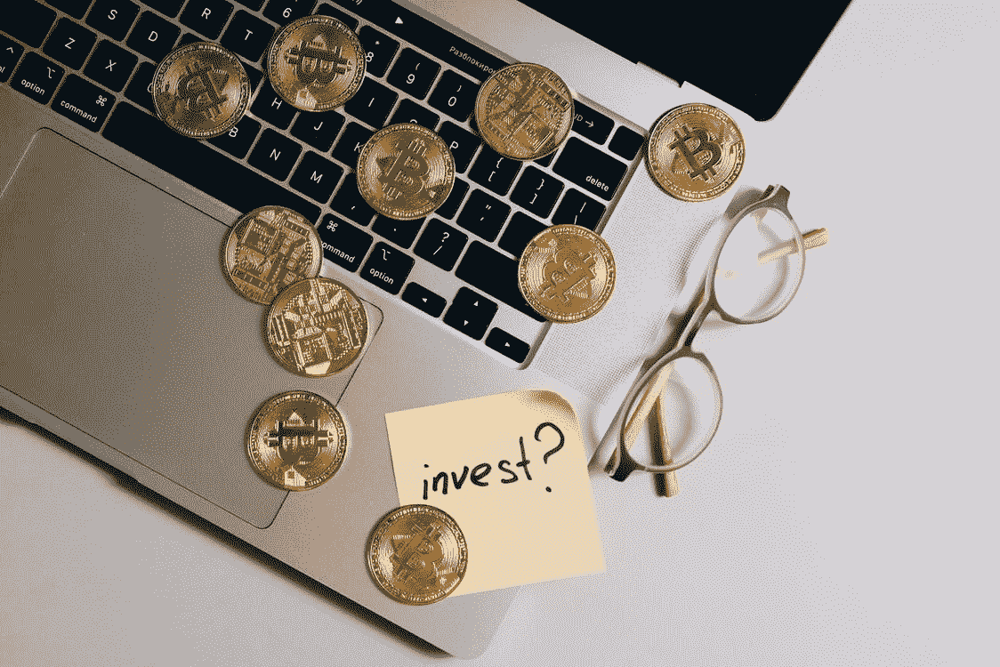

# 区块链技术，非洲未开发的潜力。

> 原文：<https://medium.com/coinmonks/blockchain-technology-the-untapped-potential-in-africa-ada166fb8b55?source=collection_archive---------13----------------------->

Photo by Olya Kobruseva from Pexels:

**根据维基百科**

> [区块链](https://en.wikipedia.org/wiki/Blockchain)是一个不断增长的记录列表，称为使用加密技术安全链接在一起的块。每个块包含前一个块的加密哈希、时间戳和事务数据(通常表示为 merkel 树，其中数据节点用树叶表示)。时间戳证明事务数据在块被发布以进入它的散列时存在。因为每个块都包含关于其前一个块的信息。它们形成一个链，每个附加的块加强前面的块，因此区块链能抵抗对其数据的修改，因为一旦记录，任何给定块中的数据在不改变后续块的情况下不能被追溯性地改变。

**简单定义**

区块链是共享的分布式账本，有助于记录交易和跟踪商业网络中的资产。

资产可以是房子、汽车、土地或版权、专利和品牌。

谁发明了区块链技术？

2009 年，第一台区块链由一个名叫中本聪的人/团体创造

区块链技术主要应用于政府、教育、供应链管理、保险、跨境交易和音乐行业。

区块链研究分析公司[chain analysis](https://blog.chainalysis.com/reports/africas-grassroots-cryptocurrency-adoption/)最近的一份报告显示，在过去几年中，非洲加密货币市场的价值增长了 1200%以上，该公司估计，2020 年 7 月至 2021 年间，非洲国家总共收到了价值约 1056 亿美元的加密货币。

**受益于非洲区块链技术的公司**。

[**Bitpesa**](https://account.bitpesa.co/)

[Bitpesa](https://account.bitpesa.co/) 是一家肯尼亚区块链公司，专注于跨境 B2B 支付和加密货币兑换交易。它成立于 2013 年，现已扩展到坦桑尼亚、塞内加尔、乌干达、刚果民主共和国和尼日利亚。bitpesa 的重点是通过容易出错的传统货币系统来降低跨境交易费用。

[**阿格里**](https://play.google.com/store/apps/details?id=com.agrikore.agrikoreapp&hl=en&gl=US)

[Agrikore](https://play.google.com/store/apps/details?id=com.agrikore.agrikoreapp&hl=en&gl=US) 为买卖双方提供了一个完全在线交易的平台。该平台包括安全、即时的网上支付，还提供集中的区块链数据库，显示整个农业生态系统中的所有利益相关者，从而提供高效的交易。

[**瓦拉**](https://getwala.com/)

[wala](https://getwala.com/) 是 2018 年在南非成立的区块链创业公司。

Wala 为新兴市场中以现金为基础的消费者建立了一个社区驱动和游戏化的个人财务管理工具。该产品允许用户轻松跟踪他们的支出和收入，为目前没有财务档案的客户建立财务档案。该应用程序然后使用该配置文件来设定每周财务和参与目标，从而提高消费者的支出和储蓄。

随着用户继续通过记录他们的交易和达到他们的目标来参与应用程序，他们将获得积分，这些积分可以兑换成现金、数据和其他奖励。

通过该应用程序，用户将能够注册和访问金融产品，如存款账户、支付等。

[塔里](https://tlu.tarilabs.com/)

[Tari](https://tlu.tarilabs.com/) 是一个专注于数字资产的区块链协议，内置于 Rust 中，默认为私有，开源，被设计为与 Monero 合并的侧链。

此外，塔里正在努力支持其他雄心勃勃的非洲区块链创始人，通过塔里实验室大学提供免费教育。

[**比特兰**](https://www.inwara.com/bitland-world/)

比特大陆是区块链在非洲的另一家创业公司。Bitland 位于加纳，致力于通过利用区块链技术提供简化的土地注册服务来改善非洲人的土地所有权。

Bitland 平台使非洲人能够在区块链的 bitshores 上以不可改变的记录记录土地所有权。注册数据不能伪造，对所有相关方都是透明的，因此消除了国家间的冲突

**Sunexchange 是另一家利用技术带来的机会的创业公司。太阳交易所试图利用区块链技术解决影响我们星球的全球变暖问题。**

**Sunexchange 是一家位于南非的区块链初创公司，旨在为人们提供一个使用比特币(BTC)投资太阳能项目的平台。世界上任何人都可以购买太阳能设备，并将其租赁给学校、医院、农场、政府设施和企业。这个平台提供了一个双赢的局面，比特币投资者赚取租金收入，同时为当地非洲社区提供清洁和不可再生能源，促进我们星球的可持续发展。**

**[**Tracr**](https://www.tracr.com/)**

**Tracr 是区块链在非洲的另一家创业公司。它来自南非一家富有的钻石公司。被称为戴比尔斯。它侧重于使用透明的区块链技术来登记和追踪在非洲开采的所有钻石。**

**众所周知，非洲的一些钻石是血腥的，它们是在冲突地区非法开采的，并在非法市场上出售，因此减缓了各自国家和整个大陆的经济发展。**

**[Tracr](https://www.tracr.com/) 提供从钻石开采到销售给珠宝制造商的透明记录。透明的非不可改变的记录将改善参与整个商业交易的利益相关者的经济状况。**

****

****[NairaEx](https://nairaex.com/) 是位于尼日利亚的区块链初创公司，提供加密货币交易平台。它允许用户在其交易所买卖加密货币。 [NairaEx](https://nairaex.com/) 提供简化的资金和提款流程，因为整个流程在一天内完成。此外，它还提供无摩擦交易费，因为交易费包含在交易费中，因此没有隐藏费用。这是一个巨大的胜利，因为传统的货币兑换平台带有隐藏的费用。****

****[SureRemit](https://sureremit.co/)****

****SureRemit 是总部位于尼日利亚的区块链公司，由总部位于阿布贾的 GreenHouse Capital 所有。sure remi t 为散居国外的非洲人提供了一种简单的汇款方式。通过使用 RMT 公用事业令牌购买凭证，用户可以支付公用事业账单和其他真实世界的商品和服务。****

****[查马佩萨](/@chamapesa)****

****[Chamapesa](/@chamapesa) 是一家总部位于区块链的非洲初创公司，致力于改善非洲当地人的生活。Chamas 是非洲共同体中未注册的信贷和储蓄系统。由于 chamas 是在当地经营的，交易不透明，容易出错。 [Chamapesa](/@chamapesa) 应用程序通过允许应用程序用户创建自己的 chama 来帮助消除这些问题，并为这些群体提供不同的联系人和其他金融工具。Chamas 内发生的所有交易都是透明和不可改变的，因此对会员有利。****

****如果认真对待，区块链技术将改变非洲大陆的经济。凭借已经存在的创新平台，一个移动平台，African 将自己定位为在不久的将来成为领先的区块链行业。在非洲大陆，移动支付随处可见。如果区块链技术集成到这些平台中，那么教育、医疗、物流和能源等各个领域都有可能被颠覆。非洲政府应该通过改变禁止在金融领域使用区块链技术的政策来支持这些努力。****

> ****加入 Coinmonks [电报频道](https://t.me/coincodecap)和 [Youtube 频道](https://www.youtube.com/c/coinmonks/videos)了解加密交易和投资****

# ****另外，阅读****

*   ****[CoinFLEX 评论](https://coincodecap.com/coinflex-review) | [AEX 交易所评论](https://coincodecap.com/aex-exchange-review) | [UPbit 评论](https://coincodecap.com/upbit-review)****
*   ****[AscendEx 保证金交易](https://coincodecap.com/ascendex-margin-trading) | [Bitfinex 赌注](https://coincodecap.com/bitfinex-staking) | [bitFlyer 评论](https://coincodecap.com/bitflyer-review)****
*   ****[Bitget 回顾](https://coincodecap.com/bitget-review)|[Gemini vs block fi](https://coincodecap.com/gemini-vs-blockfi)cmd |[OKEx 期货交易](https://coincodecap.com/okex-futures-trading)****
*   ****[AscendEx Staking](https://coincodecap.com/ascendex-staking)|[Bot Ocean Review](https://coincodecap.com/bot-ocean-review)|[最佳比特币钱包](https://coincodecap.com/bitcoin-wallets-india)****
*   ****[霍比评论](https://coincodecap.com/huobi-review) | [OKEx 保证金交易](https://coincodecap.com/okex-margin-trading) | [期货交易](https://coincodecap.com/futures-trading)****