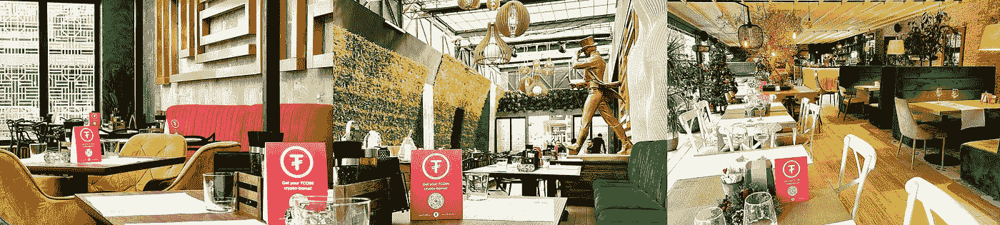
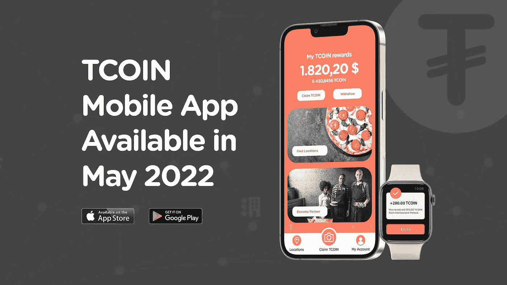

# 区块链技术最终将彻底改变酒店业。

> 原文：<https://medium.com/coinmonks/blockchain-technology-will-eventually-revolutionize-the-hospitality-industry-dab770ac86da?source=collection_archive---------23----------------------->

随着不同行业越来越多的企业寻求利用区块链技术的特性和优势，该技术的受欢迎程度和接受度在过去几年中不断提高。

随着区块链支持的各种解决方案的出现，价值数十亿美元的酒店业也接受了这项技术。不幸的是，许多可用的解决方案不能有效地解决服务提供商和客户的需求，因为他们缺乏对新技术的理解。

由[丹·塞巴斯蒂安](https://www.linkedin.com/in/dan-sebastian/)领导的 [**Travel Coin**](https://tcoin.one) 团队旨在通过他们包罗万象的生态系统来改变这种叙事，这将允许尽可能多的人，特别是酒店业的客户，使用区块链技术，利用一个简单易用的生态系统，作为企业和客户之间的加密奖励。

TCOIN is already used in partner locations as a crypto-bonus for clients.

作为旅行币生态系统的一部分，该团队已经推出了 [TCOIN](https://coinmarketcap.com/currencies/travel-coin/) token，以便在行业中用作奖励，使企业能够吸引和留住客户，并最终增加销售额。

通过将于 2022 年 5 月推出的 [TCOIN 奖励手机应用](https://tcoin.one/mobile-app/)，餐馆、酒吧、俱乐部、酒店和其他相关企业将自动向其客户提供 [TCOIN](https://coinmarketcap.com/currencies/travel-coin/) 代币作为奖励。

Travel Coin App will be available in May 2022

该团队在真实地点成功测试了旅行币生态系统，真实客户收到了 [TCOIN](https://coinmarketcap.com/currencies/travel-coin/) 代币作为其品牌忠诚度的奖励。通过收集用于识别和调整洞生态系统以满足客户和企业主需求的数据，这一过程对团队来说是成功的。

旅行币生态系统非常灵活，客户可以轻松地将代币兑换成其他加密货币或法币，在不久的将来，他们将能够在合作伙伴所在地获得折扣。Travel Coin 项目旨在通过利用不断发展的技术来挑战现状，该项目还将在移动应用程序中为不同的会员使用[NFT](https://tcoin.one/nft/)。

尽管酒店行业不断增长，区块链项目仍然面临着各种各样的挑战，这些挑战在最近一段时间内阻碍了市场的发展，但通过上述方法，酒店行业的老问题，如高额预订费、难以吸引客户、客户保留和新技术的采用，将在不久的将来得到解决和改善，为客户和企业所有者提供更好的体验和新的收入来源。

> 加入 Coinmonks [电报频道](https://t.me/coincodecap)和 [Youtube 频道](https://www.youtube.com/c/coinmonks/videos)了解加密交易和投资

# 另外，阅读

*   [加密保证金交易交易所](/coinmonks/crypto-margin-trading-exchanges-428b1f7ad108) | [赚取比特币](/coinmonks/earn-bitcoin-6e8bd3c592d9) | [Mudrex 投资](https://coincodecap.com/mudrex-invest-review-the-best-way-to-invest-in-crypto)
*   [WazirX vs coin dcx vs bit bns](/coinmonks/wazirx-vs-coindcx-vs-bitbns-149f4f19a2f1)|[block fi vs coin loan vs Nexo](/coinmonks/blockfi-vs-coinloan-vs-nexo-cb624635230d)
*   [比斯勒评论](https://coincodecap.com/bitsler-review)|[WazirX vs coin switch vs coin dcx](https://coincodecap.com/wazirx-vs-coinswitch-vs-coindcx)
*   [7 大副本交易平台](https://coincodecap.com/copy-trading-platforms) | [BuyCoins 点评](https://coincodecap.com/buycoins-review)
*   《XT.COM 评论》的[《币安评论》的](https://coincodecap.com/profittradingapp-for-binance)|