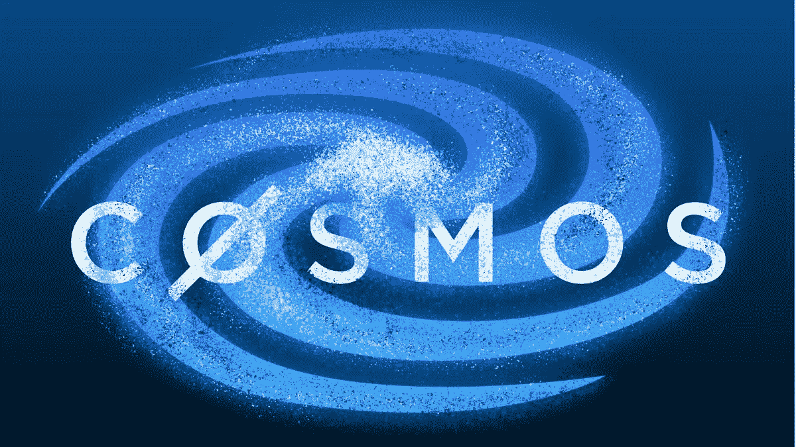

# 区块链将以太坊虚拟机带入宇宙

> 原文：<https://medium.com/coinmonks/blockchain-to-bring-ethereum-virtual-machine-to-cosmos-c10bd877d183?source=collection_archive---------59----------------------->

## 快录功能

*   Evmos 已经在 Cosmos 的互操作性网络上推出了它的主网区块链。
*   这款区块链完全兼容以太坊虚拟机。
*   Evmos 将与以太坊和宇宙生态系统互操作。

开发者周三宣布，经过多年的开发，Evmos(以前称为 Ethermint)在 Cosmos 网络上上线。

此次发布意味着用户和开发者现在可以在 Cosmos 上以第一层区块链的形式访问它，Cosmos 是一种互操作性协议，其生态系统包含 250 多种应用和服务。

特别是，Evmos 的推出允许用户从以太坊部署智能合同和资产，并在 Cosmos 生态系统中使用它们。Evmos 原定于 2 月份推出，但因技术问题而推迟。

# 埃夫莫斯的 EVM 野心

Evmos 于 2016 年由其开发团队 Tharsis 首次概念化为 Ethermint。

Evmos 的独特之处在于，与大多数其他宇宙链不同，它完全兼容以太坊虚拟机，这是以太坊区块链上的开发人员使用的计算环境。

通过集成 EVM 机制，Evmos 团队希望使其对以太坊开发者更具吸引力，并从他们那里吸引应用程序和资产。在过去的一年里，EVM 已经成为最广泛采用的智能合约标准，现在区块链许多地方都在试图复制以太坊的成功。这些包括雪崩、多边形、BNB 链、扇形和月光。

为了启动它的野心，Evmos 开发者计划首先通过桥实现与以太坊的互操作性。该团队正在使用桥接应用程序，包括 Connext、Celer、Nomad 和其他应用程序，以便可以在两个链之间进行令牌传输。“通过这些桥梁，加密用户将能够将资产转移到 Evmos，并在 Evmos 自己的应用程序上使用它们，”Evmos 的联合创始人兼 Tharsis 首席执行官费德里科·昆泽·库尔默告诉 Block。

Evmos 也有在宇宙生态系统中扩张的计划。使用一种称为区块链间通信(IBC)的协议，Evmos 区块链能够与其他支持 Cosmos 的链共享数据和资产。

这种互操作性为 Evmos 应用程序开辟了与 Terra 的直接交互 Terra 是一个基于宇宙的区块链，包含 290 亿美元的加密资产，是第三大稳定币 TerraUSD (UST)的所在地。Terra 的治理已经提议与 Evmos 合作开发 UST，并拨款 800 万美元提高 Evmos 的流动性。

也有一些应用程序将在 Evmos 上推出——分散式交易所、货币市场和 NFT，包括 EvmoSwap、QuantumSwap、Diffusion Finance、Nomad、Coslend 等。

> *加入 Coinmonks* [*电报频道*](https://t.me/coincodecap) *和* [*Youtube 频道*](https://www.youtube.com/c/coinmonks/videos) *了解加密交易和投资*

# 另外，阅读

*   [有哪些交易信号？](https://coincodecap.com/trading-signal) | [Bitstamp vs 比特币基地](https://coincodecap.com/bitstamp-coinbase) | [买索拉纳](https://coincodecap.com/buy-solana)
*   [ProfitFarmers 点评](https://coincodecap.com/profitfarmers-review) | [如何使用 Cornix 交易机器人](https://coincodecap.com/cornix-trading-bot)
*   [十大最佳加密货币博客](https://coincodecap.com/best-cryptocurrency-blogs) | [YouHodler 评论](https://coincodecap.com/youhodler-review)
*   [my constant Review](https://coincodecap.com/myconstant-review)|[8 款最佳摇摆交易机器人](https://coincodecap.com/best-swing-trading-bots)
*   [MXC 交易所评论](/coinmonks/mxc-exchange-review-3af0ec1cba8c) | [Pionex vs 币安](https://coincodecap.com/pionex-vs-binance) | [Pionex 套利机器人](https://coincodecap.com/pionex-arbitrage-bot)