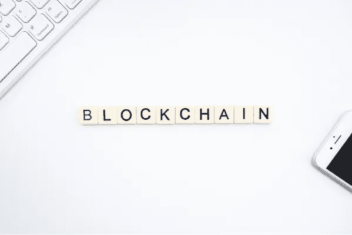

# 2022 年区块链趋势和用途要知道

> 原文：<https://medium.com/coinmonks/blockchain-trends-and-uses-to-know-in-2022-f7e08d424ad3?source=collection_archive---------22----------------------->

我们知道区块链是推动加密货币和应用的创新技术。这是一项令人兴奋的突破性技术，预计到 2024 年，全球在区块链解决方案上的支出将达到 190 亿美元，而 2017 年为 9.5 亿美元(1)。

区块链技术是一种在数据库中存储信息的可靠方式，不依赖于监管机构和会计公司等中央实体和机构。此外，区块链为各方相互信任提供了一种直接的方式。

# 区块链趋势

以下是一些激动人心的区块链趋势，它们可能会影响我们的生活，并有助于塑造集成趋势，塑造未来的架构和研究方向:

**支持区块链的社交媒体网络**

多亏了区块链理工大学，社交网络中分散信任的新可能性得以存在。该技术与社交媒体一起工作，解决了社交媒体的挑战，如用户身份、经验证的供应商和市场验证。

**零售物流和全球供应链中的区块链**

全球供应链市场中的区块链预计将呈指数级快速增长。它将通过增强的可追溯性改善利益相关者的业务，实现数字化。国际供应链管理的成功集中于控制四个流程:产品、流程、信息和现金。

区块链通过事件跟踪、货物完整性保证、争议解决、合规性、数字化、信任支持和保护监管链来解决供应链挑战。区块链不可逆转的全面审计跟踪增加了对产品真实性和质量的信心。

**绿色能源车型**

我们可能会看到“绿色”区块链的努力，因为它使用大量的计算能力，并产生大量的碳排放。转向低能耗的区块链技术模式和可再生能源将使区块链工业成为绿色产业。税收激励和法律法规在创造可再生能源替代品方面发挥着不可或缺的作用。

**NFT 的艺术和版权保护**

在过去的几年中，不可替代令牌(NFT)的认知度显著提高，最显著的原因是数字内容交易中的 NFT。这些交易包括通常售价过高的艺术品。2021 年，当音乐艺术家如莱昂国王(Kings of Leon)以 NFT 格式发布音乐时，NFT 在区块链世界是大新闻。

NFT 是为许多类型的内容创建的，如数字艺术、与数字令牌相关的物理艺术、视频和迷因。开放市场使 NFT 交易与任何对象或任何种类的工作相关联。然而，NFT 的快速增长放大了版权执法的挑战。

**国家加密货币**

今年，我们将看到各国央行创造自己的硬币，以便用户可以进行交易和管理托管，同时保持对流通供应的控制。2022 年，国家加密货币将与传统货币一起增长。

英国将在未来几年发行政府支持的英国硬币，预计其他国家也会这样做，如日本、俄罗斯、瑞典和爱沙尼亚。一些国家已经启动了自己的项目，包括新加坡、中国、突尼斯和厄瓜多尔。

# 区块链:超越加密

# 区块链的社会效益

区块链在几个方面超越了加密货币:

**不变性和信任—** 区块链技术值得信任，因为它包含的数据是不可改变的；任何人或公司都不能更改或改变交易历史

**银行和支付—** 区块链的分散式分类账技术具有不变性和信任度，可提供安全的点对点信息认证机制

**新兴经济体—** 发展中国家正在学习越来越多的区块链应用，包括在印度、肯尼亚和其他东非国家的银行和金融服务、供应链、农业和土地所有权方面的创新应用。

例如，在东非，区块链在贷款方面的应用有利于那些没有可靠的企业所有权和运营记录或传统信用记录的小企业。2018 年，肯尼亚内罗毕小额信贷项目的供应商在偿还小额贷款时帮助建立了信用，然后有资格获得更大的贷款(2)。

制药应用也有益于社会，因为它可以监控药品的储存温度并确保及时交付。在制药应用中，如果供应链记录在区块链(2)中，传感器可确保送货卡车的存储温度，并在药品按时交付的情况下支付送货费用。

# 区块链用途

区块链的商业利益包括支付和信任，就像它们有益于社会一样。考虑以下区块链的使用案例和优势:

**物联网**

物联网行业随着数十亿台联网设备呈指数级增长。一些估计称，到 2030 年，全球将有 500 亿台设备投入使用(5)。随着数量的增长，漏洞也在增加，因为黑客可以通过一台联网设备轻松侵入数据。将区块链技术集成到物联网设备中降低了数据泄露的可能性。

**网络安全—** 下一级网络安全的一个例子是智能手机。使用高度安全的 FIDO 令牌是准确的无密码身份验证背后的秘密；分散式凭据解决方案和生物认证使物联网设备几乎防篡改。

**营销—** 区块链通过转变客户定位、跟踪客户数据和保护消费者信息，为营销人员带来了翻天覆地的变化。

**能源、交通、制造业应用—** 基于区块链的能源、交通、制造业等网络安全平台。拥有数十亿台同时连接的设备。区块链为 OT、IT 和云中的物理和数字操作扩展了零信任身份、数据安全和本地/远程访问。

**加密—** 区块链技术应用于加密密钥，以确保用户及其共享数据的安全性、保密性和隐私性。有两种类型的密钥，公钥和私钥，每个用户都有一个。

公钥是地址或其散列(缩短)版本。用户只能访问他们的钱包——公钥——并使用私钥移动加密货币。公钥和私钥的组合创建了个人的数字签名，从而允许他们在区块链上进行交易。数字签名区分了网络中的用户，并增加了额外的安全层来保护数据。

**智能合约—** 智能合约基于区块链的实时合约。这些合同是两方或多方之间的协议，没有中间人；该合同存在于分散的分布式区块链网络中。智能合同现在是医疗保健、房地产和政府机构的基础。

**医疗保健—** 基于大数据的智能合同促进了患者和医生之间敏感医疗数据的传输。合同规定了数据共享的大纲和参数；它们包含个性化的健康计划和针对单个患者的其他重要信息。

**房地产—** 房地产平台可以使用位于区块链的产权登记处，为经纪人、房地产经纪人及其客户实现交易自动化。区块链技术使产权发行瞬间完成，并允许用加密货币买卖房产。

**零售—** 在线零售商在与电子商务相关的支付流程中经常面临诸多挑战。例如，有“废弃的购物车”问题和消费者对数据安全性的不信任(想想新闻中所有的数据泄露)。区块链技术可能是在线零售商需要的创新。

**汇款**

支付处理和资金转移是最好的区块链技术使用案例；区块链理工大学实现了高速实时交易。由于免除了银行/金融机构的交易费用，从而节省了时间并降低了成本，BFSI 部门发生了永久性的转变。

**FinTech —** fintech 平台，如那些帮助人们经营和建立互联网业务的平台，可能会提供几种加密货币(以太坊、比特币、Monero 等。)来处理数十亿的加密货币投资和交易。

**金融科技/网络安全—** 一些平台向金融机构和货币交易所等实体提供区块链数据和分析。

# 用例:治疗

**关于 Open Therapeutics**

生物技术公司 Open Therapeutics 致力于由众包科学家进行的全球开源药物研究。根据其 LinkedIn 页面，这是“一个不可知的门户网站服务，旨在降低开发和部署治疗方法的成本和风险”，以提高欠发达人口可负担得起的救生药物的可用性。

# 任务

**社会影响**

医疗设备、诊断和药品费用被认为超出了许多人的承受范围，特别是在人口得不到充分服务的发展中国家。“开放疗法”提供了一种与利润驱动模式平行的跨学科开放方法，而不是替代。多学科方法将公众、学生、科学家、临床医生和公民科学家聚集在一起，对研究产生积极影响。

# 项目:治疗平台

为了促进其促进治疗(制药、医疗设备和诊断)发展的使命，Open Therapeutics 需要一个强大的开放平台，供全球 STEM 研究人员进行研究合作。科学家将根据在 Therapoid 平台上的活动获得 ScienceCoins(一种加密货币)作为奖励。

对于本项目，需要考虑以下方面的范围:

为研究人员建立一个协作平台

区块链的身份

向用户发放令牌

与用户钱包集成

在未来，交易科学的能力将与其他法定货币或加密货币相结合

该项目包括构建平台、公共区块链、奖励加密货币的底层架构以及将科学知识整合到治疗程序中的 API。

根据开放治疗的网站:

> Therapoid 是一个“开放的科学平台，为学生和研究人员提供免费的工具、知识产权、服务和奖励 ScienceCoins 令牌(类似于加密货币),用于推进科学知识的研究和开发。

值得注意的是，Therapoid 并不局限于研究社区；事实上，也欢迎营利性企业加入 Therapoid。

**商业利益**

Therapoid 通过以下方式为 Open Therapeutics 带来价值:

确定降低以太坊区块链交易产生的天然气费用的机制(4)

智能合同上的安全架构可防止科学知识丢失，包括:

集成预印服务器功能，以便科学家在发表前获得反馈

确保符合 ADA

确定更好的论坛

**对研究社区的价值**

为了帮助在全球范围内创造积极的健康和环境成果，Therapoid 的协作环境降低了研发成本(R & D)并减少了风险。新冠肺炎疗法和疫苗是开放科学的极好例子。

Therapoid 平台使研究人员能够获得政府、企业、机构、非营利组织和公众的认可；这种认可带来了演讲、就业、咨询和晋升的机会。

Therapoid 免费提供:

同意

装备

知识产权

手稿服务器

职业机会

论坛

科学发现代币

**科学报道**

科学币(类似于加密货币)对经济困难的学生和合作的研究人员特别有帮助。科学期刊可以在加密货币交易所兑换，以购买书籍、支付开放存取费(APC)、期刊订阅费、消耗品，并支付同事翻译论文的费用。

**结论**

区块链有明确的好处，因为它消除了交易处理、记录和管理中的人为因素。通过消除人类的参与，依靠数百万网络的计算能力，区块链的信息准确性不断提高。

一旦链中的块被确认和链接，其中包含的信息是不可变的；数据的这种持久性防止了欺诈；信任不再转瞬即逝，也不再多变。区块链作为账本的性质保持了永久、不可变和可验证的交易，从而使其他方的信任变得多余。

区块链的不变性使其成为许多行业的一个有吸引力的选择，并有多种应用——而这只是开始。

**来源:**

1 *根据最新的 IDC 支出指南*，预计 2024 年全球在区块链解决方案上的支出将接近 190 亿美元。IDC。(2021 年 4 月 19 日)。2022 年 3 月 8 日检索，来自[https://www.idc.com/getdoc.jsp?containerId=prUS47617821](https://www.idc.com/getdoc.jsp?containerId=prUS47617821)

2 非洲全球焦点北美。(2018 年 11 月 28 日)。*区块链如何给新兴经济体带来社会效益*。知识@沃顿。2022 年 3 月 8 日检索，来自[https://knowledge . Wharton . upenn . edu/article/区块链-带来社会福利-新兴经济体/](https://knowledge.wharton.upenn.edu/article/blockchain-brings-social-benefits-emerging-economies/)

3 开放疗法。(2022).*革命性的开放科学平台！*治疗剂。2022 年 3 月 8 日检索，来自 https://therapoid.net/

汽油费精确地衡量了任何交易在被区块链网络记录之前需要多少计算能力

路易斯安那州韦尔舍里 5 号(2021 年 1 月 22 日)。2030 年全球联网设备数量。Statista。检索于 2022 年 3 月 14 日，来自[https://www . statista . com/statistics/802690/world wide-connected-devices-by-access-technology/](https://www.statista.com/statistics/802690/worldwide-connected-devices-by-access-technology/)

> *加入 Coinmonks* [*电报频道*](https://t.me/coincodecap) *和* [*Youtube 频道*](https://www.youtube.com/c/coinmonks/videos) *了解加密交易和投资*

# 另外，阅读

*   [3 商业评论](/coinmonks/3commas-review-an-excellent-crypto-trading-bot-2020-1313a58bec92) | [Pionex 评论](https://coincodecap.com/pionex-review-exchange-with-crypto-trading-bot) | [Coinrule 评论](/coinmonks/coinrule-review-2021-a-beginner-friendly-crypto-trading-bot-daf0504848ba)
*   [莱杰 vs n rave](/coinmonks/ledger-vs-ngrave-zero-7e40f0c1d694)|[莱杰 nano s vs x](/coinmonks/ledger-nano-s-vs-x-battery-hardware-price-storage-59a6663fe3b0) | [币安评论](/coinmonks/binance-review-ee10d3bf3b6e)
*   [Bybit Exchange 审查](/coinmonks/bybit-exchange-review-dbd570019b71) | [Bityard 审查](https://coincodecap.com/bityard-reivew) | [Jet-Bot 审查](https://coincodecap.com/jet-bot-review)
*   [3 commas vs crypto hopper](/coinmonks/3commas-vs-pionex-vs-cryptohopper-best-crypto-bot-6a98d2baa203)|[赚取加密利息](/coinmonks/earn-crypto-interest-b10b810fdda3)
*   最好的比特币[硬件钱包](/coinmonks/hardware-wallets-dfa1211730c6) | [BitBox02 回顾](/coinmonks/bitbox02-review-your-swiss-bitcoin-hardware-wallet-c36c88fff29)
*   [BlockFi vs Celsius](/coinmonks/blockfi-vs-celsius-vs-hodlnaut-8a1cc8c26630)|[Hodlnaut 点评](/coinmonks/hodlnaut-review-best-way-to-hodl-is-to-earn-interest-on-your-bitcoin-6658a8c19edf) | [KuCoin 点评](https://coincodecap.com/kucoin-review)