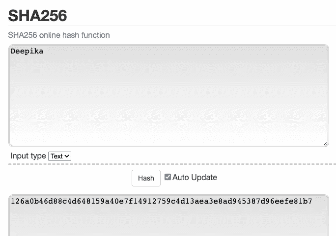
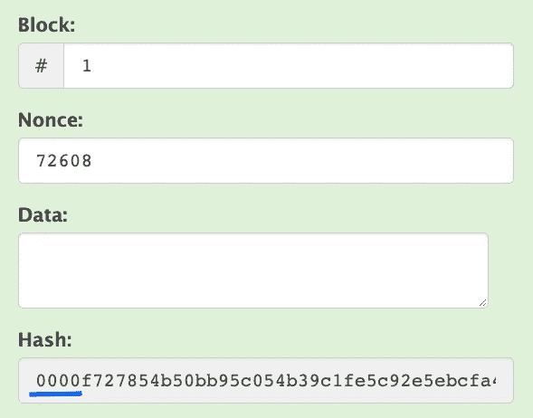
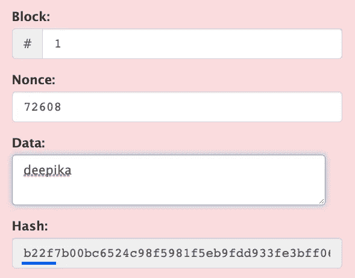
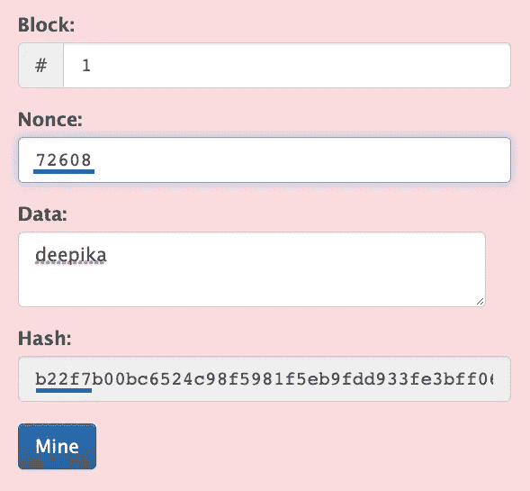
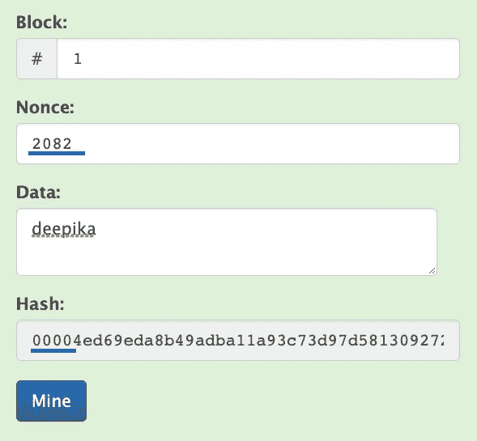
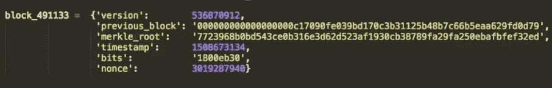
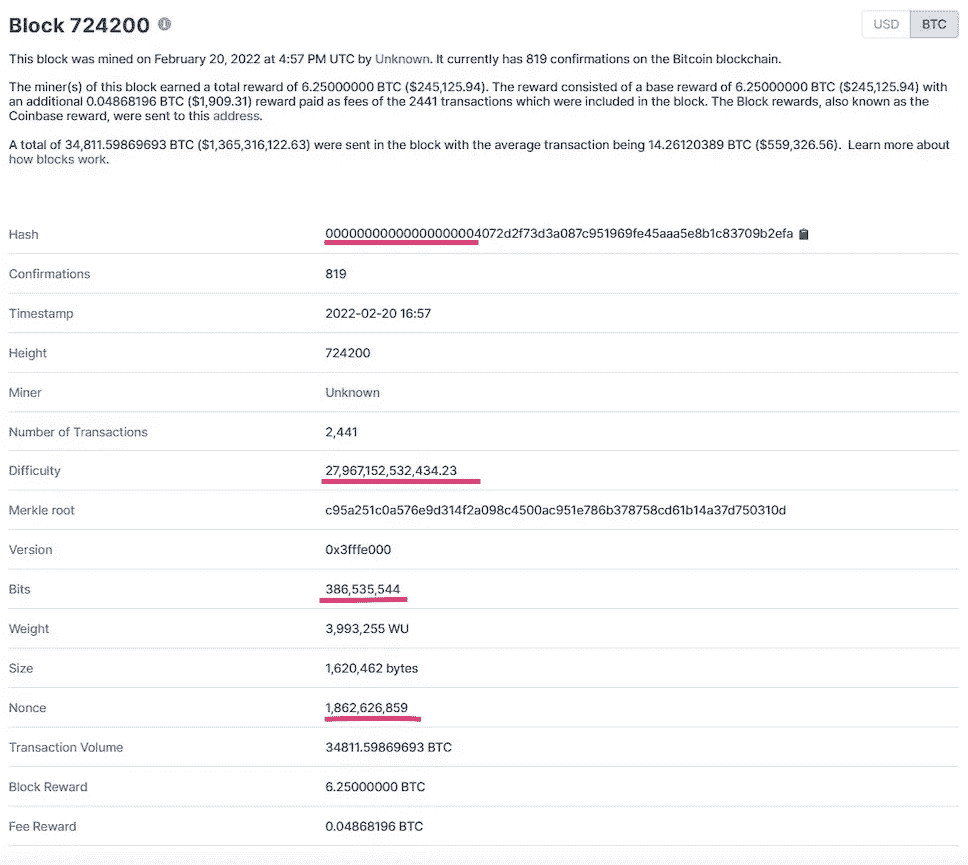

# 区块链解封-第 2 部分:哈希，挖掘和其他可怕的话题初学者友好指南！

> 原文：<https://medium.com/coinmonks/blockchain-unblocked-part-2-beginner-friendly-guide-to-hashing-mining-and-other-scary-topics-2c3aa50ed44a?source=collection_archive---------8----------------------->

> 在本文中，我们将讨论:
> 
> -哈希 SHA256
> 
> -块和块验证
> 
> -到底什么是采矿？
> 
> -采矿面板:)
> 
> -什么是共识协议？
> 
> -私人区块链货币交易以外的用例

你好。如果你是新来的，欢迎你！区块链畅通是我试图用简单的语言解释区块链的广阔概念的一系列文章！如果您是从第 0 部分和第 1 部分来到这里的，感谢您的阅读！

本系列没有任何先决条件，除了一个——请阅读本系列以前的每一篇文章！^_^

我们将首先介绍区块链的一些关键概念，然后回答我们上面列出的问题。

# **SHA 256 哈希**

SHA256 是一个哈希函数，用于保护比特币区块链网络中的数据。

在小学，我们学习函数。一个函数看起来是这样的:f(x) = y，其中 x 是一个输入，y 是我们将 x 传递给某个函数 f 后得到的输出。

哈希是一个函数。

Hash(x) = y，其中输出 y 是 x 的散列。有许多类型的散列函数，但今天我们将研究一种称为 *SHA 256 的散列函数。*

1.  *SHA 256* 是做什么的？

它将任何给定的输入字符串转换成字母数字输出，这样对于给定的输入，每个输出都是唯一的。例如，输入字符串“Deepika”的哈希如下所示:

您可以通过输入自己的输入值来试验[这里的](https://emn178.github.io/online-tools/sha256.html)，您会看到，您更改的每一个字母的散列都会发生变化，因为每一次更改都会使它成为一个新的输入。

一些很酷的事实:

*   给定输入的 SHA256 哈希是常数。您可以删除输入并重新输入，您将得到完全相同的散列输出。
*   任何大小的输入的 SHA256 哈希的长度总是 256 位(或 64 个字符)。输入“Deepika”哈希为 64 个字符，输入“Deepika Karanji”哈希为 64 个字符。输入整个印度宪法，它仍然会散列出 64 个字符！因此，它被称为“确定性”散列函数。
*   对原始数据的微小更改会极大地改变哈希值，以至于看不出新的哈希值是从相似的数据中派生出来的；这就是所谓的雪崩效应。(Deepika**Deepika**和 **DEepika** 的哈希值相差极大！)
*   SHA56 是一个[单向加密哈希函数](https://security.stackexchange.com/questions/11717/why-are-hash-functions-one-way-if-i-know-the-algorithm-why-cant-i-calculate-t)。我以前误以为是加密功能。加密功能意味着有可能“解密”它，要么通过找出加密算法，要么通过创建一个新的算法并获得原始输入。但是使用 SHA256，没有人或超级计算机能够从散列中恢复原始数据。

# 街区

在这一点上，我们有一些输入数据给一个散列函数，我们得到一个输出。现在让我们将输入数据分成 3 部分:

*   批号
*   一个叫做 nonce 的神奇数字
*   一些实际数据

此输入的 SHA256 散列(现在被分成 3 部分)为我们提供了如下所示的一些散列:

这整个盒子可以被认为是一个块。在一个块中有更多的字段，但是我们现在忽略它。

哈希是 SHA256 哈希(块号、随机数、数据)的输出。

一个有趣的观察是，散列实际上是以许多连续的前导零开始的！通常，散列只是字母数字，没有特定的模式！只是随机！因此，我们直觉地意识到，获得前导零的可能性非常低！

**这有什么特别的？**

当一个块的散列以一些“X”个前导零开始时，它被认为是一个**有效的**块！

# 这是否意味着我们已经回答了什么是有效块的问题？

没错。就是这么简单！在这一点上，它可能看起来非常抽象——就像谁决定需要多少个前导零来声明该块是有效的？我们是不是只让散列中没有前导零的输入无效？？让我们慢慢来，我们很快就会得到答案！

对于本文，让我们假设如果一个块的散列以 4 个零开始，那么它是**有效的。**

现在，如果我们更改任何一个输入—假设我们在数据部分输入“deepika”(之前它是空的)，哈希显然会发生如下所示的变化:

该哈希没有前导零！**所以这个块还没有*****有效****。*

# *采矿*

*存储在块中的数据可以是任何正确的东西，比如说它包含一些事务。我们希望这个包含大量交易的区块变得有效，这样我们就可以将它添加到区块链中。我们是否可以尝试改变 3 个输入中的任何一个，这样散列实际上以一串零开始，并且块变成 ***有效的*** ？*

1.  *我们不想改变区块编号，因为它只是区块链中的一种识别系统。*
2.  *我们当然不想修改数据，因为，嘿，必须保护的是数据的神圣性。*
3.  *我们能改变随机数吗？是啊！这其实就是 nonce 的目的！我们将尝试通过反复试验来不断改变随机数，直到我们发现一个随机数，它导致一个以 4 个零开始的散列！你实际上可以[亲自尝试一下](https://www.devglan.com/online-tools/hmac-sha256-online)。在这里,“key”输入可以被认为是我们用例的 nonce。*

*当你在上面的网站上进行实验时，你会很快发现，要想找出一个将输入散列为 4 个零的随机数，真的很难，不，是不可能的。*

# **但是……..**

*一台计算机实际上可以做到这一点！它可以通过任何给定的输入数据和块号运行数十亿，不，70 亿种可能性，以计算出使块**有效的正确随机数！***

> ***使用满足某些硬件要求的计算机为给定块寻找随机数的过程称为挖掘！***

*请参见下面的块——有一些输入和一些 nonce，但是哈希仍然无效。*

**

*Invalid Block*

*让我们点击“我的”。后台发生了什么？挖掘节点(CPU、GPU 或 FPGA 或 ASIC)将快速不断地尝试随机数，直到输出哈希出 4 个前导零！*

**

*Valid Block, nonce has changed after mining*

*一旦找到 nonce，块就变得有效！*

> *有趣的事实:nonce 扩展到“使用过一次的号码”*

*区块链矿工是拥有节点或硬件的人，这些节点或硬件运行一些软件，这些软件挖掘这个随机数并验证区块，并将它们添加到区块链中。挖掘过程是极其耗电的，需要巨大的计算能力和硬件速度，这就是为什么人们使用“[GPU](https://www.investopedia.com/tech/gpu-cryptocurrency-mining/#:~:text=A%20GPU%2C%20or%20graphics%20processing,to%20their%20speed%20and%20efficiency.)或 [ASIC](https://www.investopedia.com/terms/a/asic.asp) s”来辅助他们的挖掘过程。*

*采矿是一个竞争的过程！像你一样，有成千上万的其他矿工都试图验证一个给定的块第一！无论哪个节点能够首先验证该块，都将成为赢家，并获得一些比特币(对于本例)。这些也可以是其他硬币或代币！获胜的节点然后向网络中的所有其他节点广播该有效块。*

*挖掘是由 GPU 或 ASIC 完成的“工作”。这种“已完成的工作”的证据是什么保证了区块链。因为挖掘(也称为生成工作证明)是一个非常难以解决的问题，一旦它被实际解决并通过网络广播，所有其他节点接受或“承认”这现在是一个有效块，并且它们“承认”分类帐的当前状态包括这个新块。(提醒—分类帐类似于一个数据库，用于存储区块链中的区块信息)。*

*这就是工作证明被称为“共识协议”的原因。*

*现在让我们按照逻辑顺序回答一些问题。其中一些是第 1 部分的延续。*

*如果它变得有点太技术性，不要担心，只要保持开放的心态，并试图在高层次上理解它！*

***1。谁决定需要多少前导零来声明该块有效？***

*   *如前所述，我上面附上的方块图稍微简化了一个方块真正包含的信息。 [Henrique Centieiro](https://levelup.gitconnected.com/a-complete-decoding-of-the-bitcoin-block-578904267142) 很好地解释了块中的所有字段，但是为了回答这个问题，我们假设对于任何块，都存在一个块头，看起来像这样:*

**

*Block header for Block 491133 in Bitcoin network*

*   ***“比特”字段**实际上表示区块链的“难度等级”。基本上，让我们说 Paneer，一种受欢迎的印度食品，现在需求量很大。每当 Amul 创造出一块 Paneer，人们就争相得到 Amul 生产的每一块。因为人们想赢得比赛，他们采购设备和传感器和嗅探犬，以帮助他们在别人之前发现 Paneer 块！*
*   *换句话说，随着越来越多拥有更好、更快资源来寻找 paner 的矿工进入市场或网络，找到 paner 区块的整体速度增加，找到区块所需的时间减少！这个速度称为网络的哈希速率。*
*   *但是，比特币定义了一个规则，即挖掘一个 Paneer 块平均需要 10 分钟。因此，算法所做的是，根据网络的哈希速率，它调整**“位”字段**，或[难度级别](https://levelup.gitconnected.com/a-complete-decoding-of-the-bitcoin-block-578904267142)，这样平均挖掘一个块需要 10 分钟。*
*   *难度越高，开采一个区块需要的资源和力量就越多。在写这篇文章的时候，为小规模矿工开采比特币已经变得非常无利可图，因为难度很高，导致 BTC 有点分散，因为只有大规模矿工似乎占上风，但那是另一个时间的讨论。*
*   *这个难度决定了输出哈希中需要出现多少个前导零，才能将一个块声明为有效。截止 2022 年 2 月 23 日，难度等级为 27967152532434。输出散列应该有 19 个前导零。**我们如何从难度等级得到 19？我不确定，请在评论中告诉我！***
*   *Psssst …实际上，位字段指示输出散列需要小于 256 位的某个 X 位，以便有一定数量的前导零将输出增加到 256。这实际上不是关于需要多少个前导零，尽管这相当于。*

**

*Paneer Blocks — easier to digest than Bitcoin Blocks :P*

***这是实际砖块的样子:***

**

*Explore Bitcoin blocks at [https://www.blockchain.com/btc/block/724200](https://www.blockchain.com/btc/block/724200)*

*一个块中的事务被存储在一个叫做 Merkle 树的结构中，稍后会详细介绍！*

***2。采矿(又名工作证明)是验证区块的唯一方法吗？还有其他共识协议吗？***

*   *不，不是唯一的方法！是的，还有其他人！*
*   *所以我在这篇文章中关注 PoW 和比特币的原因是因为通常当有人说“密码”或“区块链”时，“采矿”和“BTC”会出现在脑海中。但是随着我们对区块链基础知识的了解，我认为我们做得很好！*
*   *为了回答这个问题，我们已经知道采矿是非常耗电的。这也意味着它有成本，能源和环境的影响。如果有人试图拥有一个专用区块链，比如特定于公司的，那么让专用节点通过这种高成本、高能耗的过程进行竞争性挖掘来验证数据块对公司来说是没有意义的，对吗？*
*   *于是人们想出了其他的共识协议——比如利害关系证明、PBFT、烧录证明、权威证明等等。毫无疑问，每一个都有自己的优点和缺点。*

***3。我们已经说过，在第 1 部分中，任何块篡改都将被检测到并被放弃。我可以改变一个旧的块，然后找到一个相应的 nonce，这样改变的块将有相同的哈希，我的改变不被发现吗？基本上，两个不同的输入可以有相同的散列吗？***

*   *没有。使用 SHA256 作为哈希算法的主要原因是它的抗冲突性(不同的输入产生完全相同的哈希)。事实上，没有人发现过碰撞，尽管比特币网络每秒产生万亿次散列。如果您发现两个不同的输入对哈希算法产生相同的输出，您将“破解”SHA256 [(还没有完成)](https://crypto.stackexchange.com/questions/47809/why-havent-any-sha-256-collisions-been-found-yet)。*

***4。为什么没有人发现 SHA256 发生过碰撞？***

*   *对于 SHA256，有 2 个⁵⁶可能的散列。这比已知宇宙中的原子数还要多，所以两个相同的可能性微乎其微，难以想象。要了解更多关于 SHA256 的信息，我强烈建议您跟随整篇文章中给出的超链接:)*

***5。SHA256 是区块链唯一使用的哈希算法吗？***

*   *没有，但它是最受欢迎的。不同的区块链项目可能使用不同的哈希算法。比如以太坊用的是 Keccak-256，Dodgecoin 用的是 Scrypt。*
*   *值得注意的是，ASIC(专用集成电路)被设计成挖掘特定类型的散列；即 SHA256 ASICs 只能用于使用 SHA256 哈希的挖掘网络。*

***6。既然挖矿是一场竞技比赛，是不是意味着谁的挖矿力大谁就赢了？***

*   *没错。如果我试图用 GPU 来采矿，但你有一个 ASIC，那么你比我更有机会找到那个 nonce，因为 ASIC 是专为采矿而设计的，而 GPU 是用于游戏、视频渲染等的多用途卡，因此没有 ASIC 快。*

***7。但这公平吗？富人可以在采矿场拥有高性能硬件，也许最终拥有 51%的网络，可以说“打破了区块链”…***

*   *公平的问题，我也发现自己在问——比特币真的是去中心化的吗？但是 BTC 专家 Andreas Antonopolus 认为，运营、地理、政治限制、电力供应、自然灾害等都不利于集中化..但是去中心化和集中化的力量平衡了吗？他要求我们从相对的角度来看待它..也就是说，问问你自己:比特币比任何其他类似的支付系统更分散吗？答案是肯定的！这是一个有很多争论的话题，所以我仍然在寻找一个明确的答案。*

***8。我提到了公司正在使用的私人区块链——除了跟踪货币交易，区块链还有其他用例吗？***

*   *是啊！例如，沃尔玛使用 Hyperledger Fabric 在多个食品合作伙伴之间建立了一个私人区块链网络，以追踪食品来源。通过使用区块链解决方案而不是基于纸张的分类账，供应商有义务在不可变的块中添加和存储所有信息。区块链具有透明性；数据是开放的，每个供应链参与者都可以访问。众所周知，沃尔玛一直利用技术和创新来确保顾客每天都有低价，我发现它的'[案例研究](https://pixelplex.io/blog/walmart-strives-for-food-safety-using-blockchain/)特别吸引人！*
*   *[IBM 列出了一些超越加密的区块链的好用例](https://www.ibm.com/blogs/blockchain/2019/12/blockchain-beyond-cryptocurrency/)*

*如果你成功了，恭喜你！这是一篇比前两部分略重的文章！我们已经成功回答了开始时的问题！*

***这里有几个开放式问题:***

1.  *单个块是如何链接在一起的？*
2.  *在第 1 部分，我们说过区块链有一个分布式账本系统。验证是如何在网络的对等点或节点之间发生的？*
3.  *一个矿工如何获得金钱奖励来验证一个区块呢？*

***以前文章中的未决问题:***

1.  *区块链中的第一块是如何产生的？*
2.  *如何记录块内的事务？*
3.  *什么是硬币/代币，谁创造了它们？*

*我们将在接下来的文章中看到这些问题的答案！敬请期待！*

*非常感谢安德斯·布朗沃斯，因为他的[网站](https://medium.com/r?url=https%3A%2F%2Fandersbrownworth.com%2Fblockchain%2Fhash)，事情变得更加清晰。一定要去看看！*

* [## 区块链解封——第 0 部分:信号和噪声

### “是的，所以我投资 NFTs”

medium.com](/@deeps.karanji2/blockchain-unblocked-part-0-the-signal-and-the-noise-39637995db56)  [## 区块链解封—第 1 部分:基础知识

### 在本文中，我们将讨论:

medium.com](/@deeps.karanji2/blockchain-unblocked-part-1-the-basics-e99dcf42d1cc)  [## 区块链解封-第 2 部分:哈希，挖掘和其他可怕的话题初学者友好指南！

### 在本文中，我们将讨论:

medium.com](/coinmonks/blockchain-unblocked-part-2-beginner-friendly-guide-to-hashing-mining-and-other-scary-topics-2c3aa50ed44a) 

*如果您有任何建议/意见，请随时在下面提出。你可以随时给我发电子邮件到 deeps.karanji2@gmail.com。如果你从这篇文章中学到了什么，请考虑通过鼓掌来表达你的感激之情！:)我会不断更新系列的新文章！*

*insta gram:*[*@ dpk _ 99*](https://www.instagram.com/dpk_99/)*—兴趣爱好之类的:P*

 [## Deepika Karanji 软件开发工程师 II-沃尔玛全球技术印度| LinkedIn

### 查看 Deepika Karanji 在全球最大的职业社区 LinkedIn 上的个人资料。Deepika 有 9 份工作列在…

www.linkedin.com](https://www.linkedin.com/in/deepika-karanji/) 

> *加入 Coinmonks* [*电报频道*](https://t.me/coincodecap) *和* [*Youtube 频道*](https://www.youtube.com/c/coinmonks/videos) *了解加密交易和投资*

# 另外，阅读

*   [有哪些交易信号？](https://coincodecap.com/trading-signal) | [Bitstamp vs 比特币基地](https://coincodecap.com/bitstamp-coinbase) | [买索拉纳](https://coincodecap.com/buy-solana)
*   [ProfitFarmers 回顾](https://coincodecap.com/profitfarmers-review) | [如何使用 Cornix Trading Bot](https://coincodecap.com/cornix-trading-bot)
*   [十大最佳加密货币博客](https://coincodecap.com/best-cryptocurrency-blogs) | [YouHodler 评论](https://coincodecap.com/youhodler-review)
*   [MyConstant 点评](https://coincodecap.com/myconstant-review) | [8 款最佳摇摆交易机器人](https://coincodecap.com/best-swing-trading-bots)
*   [MXC 交易所评论](/coinmonks/mxc-exchange-review-3af0ec1cba8c) | [Pionex vs 币安](https://coincodecap.com/pionex-vs-binance) | [Pionex 套利机器人](https://coincodecap.com/pionex-arbitrage-bot)
*   [我的加密副本交易经历](/coinmonks/my-experience-with-crypto-copy-trading-d6feb2ce3ac5) | [比特币基地评论](/coinmonks/coinbase-review-6ef4e0f56064)
*   [CoinFLEX 评论](https://coincodecap.com/coinflex-review) | [AEX 交易所评论](https://coincodecap.com/aex-exchange-review) | [UPbit 评论](https://coincodecap.com/upbit-review)
*   [AscendEx 保证金交易](https://coincodecap.com/ascendex-margin-trading) | [Bitfinex 赌注](https://coincodecap.com/bitfinex-staking) | [bitFlyer 审核](https://coincodecap.com/bitflyer-review)*