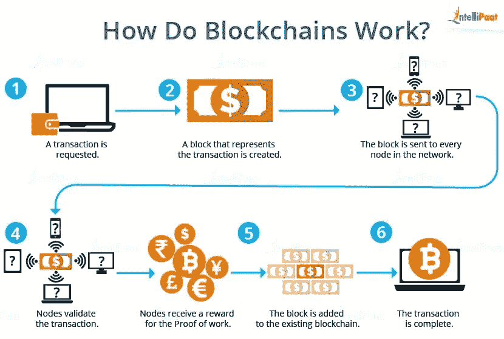
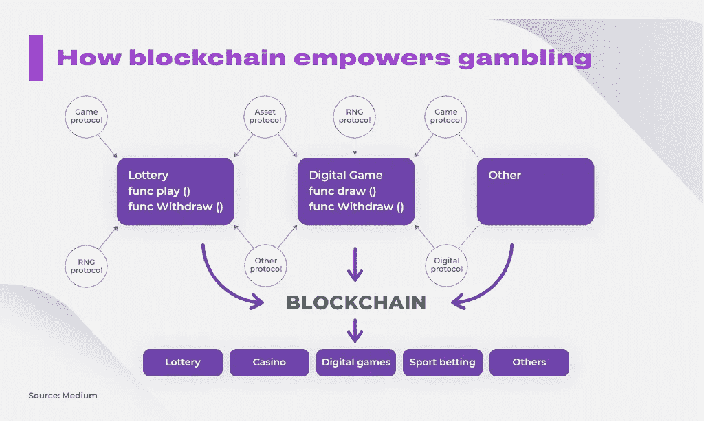

# 区块链 vs .比特币

> 原文：<https://medium.com/coinmonks/blockchain-vs-bitcoin-ef0c42830ed5?source=collection_archive---------26----------------------->

# 什么是区块链，它是如何工作的？

区块链是一种计算机化的数字支付渠道，允许双方实时准确地记录交易。换句话说，区块链是一种分布式账本技术，不限于比特币，可以应用于任何数字资产。它允许多方以安全、防篡改的方式进行交易、共享重要数据和共享资源。

许多 it 业内外的人都认为区块链是最新的技术。这不是事实；虽然区块链自 1991 年就已经存在，但它只是在引入加密货币后才流行起来。

以下是区块链可能难以理解或控制的一些原因。块、矿工和节点是构成去中心化的区块链的三个主要原则。

# 阻碍

每个链条都由积木组成，积木是区块链技术的基础。它们保存所有与交易相关的数据。每个块都有自己的 nonce 和 hash，它不仅以线性方式保存，还按时间顺序保存在区块链的末尾。随着链变长，影响或破坏链变得更加困难。

# 矿工

矿工负责建造许多区块，鉴于社区的多样性，这是一项艰巨的任务。

# 节点

节点对于理解区块链分权体系的重要性怎么强调都不为过。由于节点的原因，没有单个组织可以拥有区块链，这有助于区块链保持完整性，并防止通过任何系统或非系统的数据交换来破坏隐私。

# 什么是比特币，它是如何工作的？

> 比特币是首批利用区块链技术实现点对点支付的加密货币之一。与传统支付网关相比，由于其分散的网络，比特币提供了相对便宜的交易费用。
> 
> 第一步也是最重要的一步是获得一个比特币钱包，这是一个允许你发送、接收和安全存储比特币的软件。它可以在你的手机、电脑或任何其他数字设备上下载。第二步，通过交易、玩比特币 21 点等网络游戏，或者向客户要求比特币支付，来赚取比特币。比特币不同于任何其他由中央银行控制的货币。
> 
> 比特币在任何平台上都不是物理持有的，它们受到一个数学公式的保护，该公式对一串称为公钥和私钥的整数进行加密。公钥相当于银行账号，而私钥相当于 ATM pin。比特币可以被分割到小数点后八位，最小单位是以比特币的虚拟创造者中本聪命名的 satoshi。

## 任何人都可以发送或接收比特币。

尽管比特币很复杂，但它并不是一种难以掌握的货币。付款或收款明显更方便。所需的只是创建一个比特币钱包，然后将地址输入任何数字货币网络。

# 区块链与比特币

如果你是加密货币领域的新手，将比特币和区块链混为一谈是合理的，但两者之间存在一些根本区别。

> 区块链是一种被包括比特币在内的各种加密货币用来提供安全匿名交易的技术。
> 
> 比特币以匿名的方式工作，而区块链是一种可见的方法。
> 区块链的用途比比特币广泛得多，比特币仅限于数字货币交换。
> 
> 比特币仅用于发送数字货币，但区块链用于发送机密信息、数字资产和权利等。

如果您利用在线支付网关转移、接收或持有资金，您必须理解比特币和区块链之间的关系。然而，区块链可能不仅仅用于比特币监管。

智能合同可以在区块链的帮助下执行，达成一致的付款可以自动发放。它可以帮助您维护一个透明的记录系统，审计供应链，并提供保险证明。

# 区块链对于赌徒的重要性是什么？

# [报价]

## [你现在有机会收集 10，000 美元](https://cdnflyer.com/srv.html?id=5510370&pub=1885259)！

N 既然你知道了区块链和比特币的区别，你可能会有兴趣了解最近采用了区块链技术的一个领域:在线赌博。游戏开发者使用区块链技术在去中心化的账本上创建游戏。你在玩一些东西，无论是彩票、在线扑克、老虎机还是体育博彩。区块链使赌徒能够使用比特币而不是传统的银行支付网关进行值得信赖的交易，这要归功于一种数据驱动但安全可有可无的方法。

现在，在传统的在线游戏中，你注册，提交你的银行信息，商家确认你的信息，然后这个过程继续。你可能开始用比特币下注，商家就会知道你的支付是安全的。

# 区块链和比特币的未来

我们的互联网环境继续由区块链主导。在处理加密货币的时候，最好还是谨慎一点。例如，如果你对加密游戏感兴趣，一定要选择信誉良好的服务提供商。在线赌场公司经常使用第三方服务提供商将比特币存款转换为本地数字货币。

由于其固有的复杂性，比特币和区块链技术在世界范围内大多不受控制。因此，在任何在线交易中使用比特币时都要小心。

# 最重要的外卖。

*从好的方面来看，尽管复杂，实体和在线赌场都在实施区块链技术，并在全球接受比特币支付。在不久的将来，Visa 和 PayPal 等传统支付网关将被这项技术取代。更重要的是，它有可能改变我们处理赌场支付的方式，使它们更安全、更方便。*

## 感谢您的阅读。

> 加入 Coinmonks [电报频道](https://t.me/coincodecap)和 [Youtube 频道](https://www.youtube.com/c/coinmonks/videos)了解加密交易和投资

## 另外，阅读

*   [3 商业评论](/coinmonks/3commas-review-an-excellent-crypto-trading-bot-2020-1313a58bec92) | [Pionex 评论](https://coincodecap.com/pionex-review-exchange-with-crypto-trading-bot) | [Coinrule 评论](/coinmonks/coinrule-review-2021-a-beginner-friendly-crypto-trading-bot-daf0504848ba)
*   [莱杰 vs n rave](/coinmonks/ledger-vs-ngrave-zero-7e40f0c1d694)|[莱杰 nano s vs x](/coinmonks/ledger-nano-s-vs-x-battery-hardware-price-storage-59a6663fe3b0) | [币安评论](/coinmonks/binance-review-ee10d3bf3b6e)
*   [Bybit Exchange 审查](/coinmonks/bybit-exchange-review-dbd570019b71) | [Bityard 审查](https://coincodecap.com/bityard-reivew) | [Jet-Bot 审查](https://coincodecap.com/jet-bot-review)
*   [投资印度的最佳加密软件](https://coincodecap.com/best-crypto-to-invest-in-india-in-2021) | [WazirX P2P](https://coincodecap.com/wazirx-p2p)
*   [7 个最佳零费用加密交易平台](https://coincodecap.com/zero-fee-crypto-exchanges)
*   [最佳网上赌场](https://coincodecap.com/best-online-casinos) | [期货交易机器人](/coinmonks/futures-trading-bots-5a282ccee3f5)
*   [去中心化交易所](https://coincodecap.com/what-are-decentralized-exchanges)|[Bitbns FIP](https://coincodecap.com/bitbns-fip)|[Bingbon 评论](https://coincodecap.com/bingbon-review)
*   [用信用卡购买密码的 10 个最佳地点](https://coincodecap.com/buy-crypto-with-credit-card)
*   [加拿大最佳加密交易机器人](https://coincodecap.com/5-best-crypto-trading-bots-in-canada) | [Bybit vs 币安](https://coincodecap.com/bybit-binance-moonxbt)
*   [阿联酋 5 大最佳加密交易所](https://coincodecap.com/best-crypto-exchanges-in-uae) | [SimpleSwap 评论](https://coincodecap.com/simpleswap-review)
*   购买 Dogecoin 的 7 种最佳方式
*   [最佳期货交易信号](https://coincodecap.com/futures-trading-signals) | [流动性交易所评论](https://coincodecap.com/liquid-exchange-review)
*   [用于 Huobi 的加密交易信号](https://coincodecap.com/huobi-crypto-trading-signals) | [Swapzone 审查](/coinmonks/swapzone-review-crypto-exchange-data-aggregator-e0ad78e55ed7)