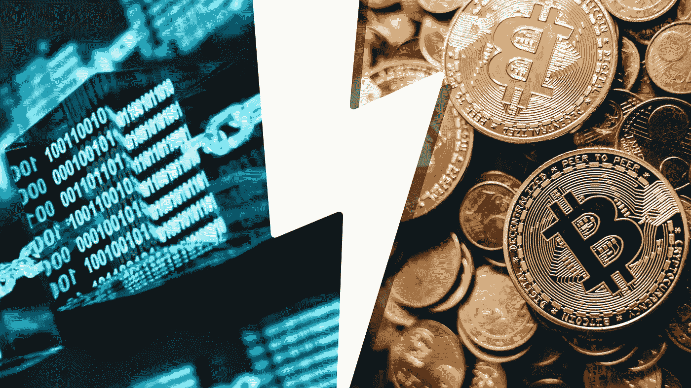

# 区块链 vs 加密货币。它们是一样的吗？？

> 原文：<https://medium.com/coinmonks/blockchain-vs-cryptocurrency-are-they-the-same-2c2fb2a6c558?source=collection_archive---------113----------------------->

区块链和加密货币，近段时间风靡全球的两个流行语。但大多数人似乎不知道这两者之间的区别，因为媒体交替使用这些“热门”词汇。

加密货币是使用区块链作为分类账来存储加密交易记录的数字货币。然而，除了加密货币，区块链还有许多用途，包括存储和访问医疗数据、供应链和物流信息等。

因此，让我们更详细地研究一下这两个主题。

# 什么是区块链？

区块链就像一个电子表格，其中包含了区块链用户存储的信息。而在加密货币中，这些信息就是网络的交易。但与常规的电子表格不同，区块链的信息存储在世界各地的多台计算机中，这被称为“分布式账本”。

关于区块链的这些信息被存储在“块”上，当这些块满了时，它们被链接到一个新的块，并且这个过程重复进行。这个区块链被称为“区块链”(是的，我知道，令人兴奋)。

# 什么是加密货币？

加密货币是与其他货币一样具有市场价值的数字货币。第一种加密货币是₿itcoin，它开创了区块链技术。

随后，以太等其他加密货币诞生，以太区块链的名字是以太坊，互换相当频繁。

## 摘要

区块链是一种“分布式账本”技术，除了加密货币，还有许多其他用例。另一方面，加密货币是使用区块链技术来保护和处理其货币交易的数字货币。

> 加入 Coinmonks [电报频道](https://t.me/coincodecap)和 [Youtube 频道](https://www.youtube.com/c/coinmonks/videos)了解加密交易和投资

# 另外，阅读

*   [购买 Dogecoin 的 7 种最佳方式](https://coincodecap.com/ways-to-buy-dogecoin) | [ZebPay 评论](https://coincodecap.com/zebpay-review)
*   [最佳期货交易信号](https://coincodecap.com/futures-trading-signals) | [流动性交易所评论](https://coincodecap.com/liquid-exchange-review)
*   [火币加密交易信号](https://coincodecap.com/huobi-crypto-trading-signals) | [Swapzone 审查](/coinmonks/swapzone-review-crypto-exchange-data-aggregator-e0ad78e55ed7)
*   最佳[密码交易机器人](https://coincodecap.com/best-crypto-trading-bots) | [购买索拉纳](https://coincodecap.com/buy-solana) | [矩阵导出审查](https://coincodecap.com/matrixport-review)
*   [Coldcard 评论](https://coincodecap.com/coldcard-review) | [BOXtradEX 评论](https://coincodecap.com/boxtradex-review)|[uni swap 指南](https://coincodecap.com/uniswap)
*   [比特币基地评论](/coinmonks/coinbase-review-6ef4e0f56064) | [德里比特评论](/coinmonks/deribit-review-options-fees-apis-and-testnet-2ca16c4bbdb2) | [FTX 评论](/coinmonks/ftx-crypto-exchange-review-53664ac1198f)