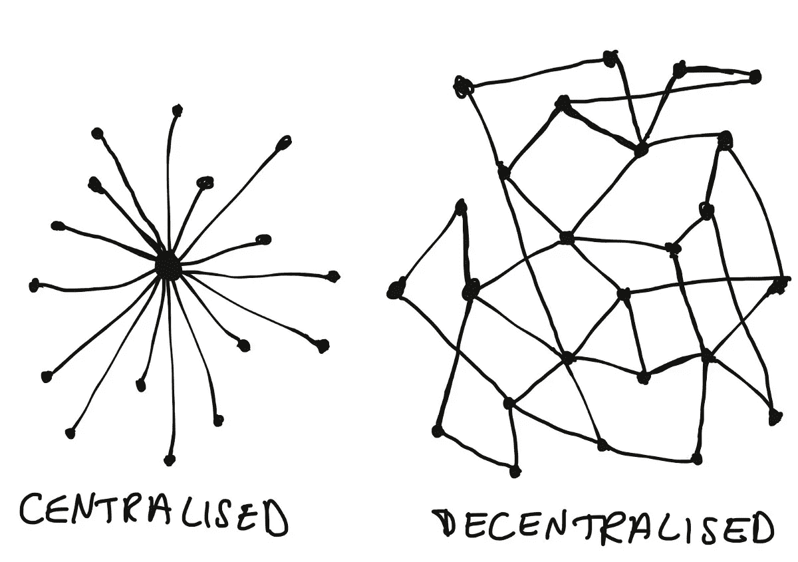
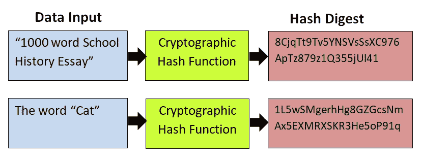

# 区块链—网络 3.0

> 原文：<https://medium.com/coinmonks/blockchain-web-3-0-df259bbe6f2b?source=collection_archive---------13----------------------->

this photo is taken from google and i have no ownership of this image.

> 嘿，这是 ANURAG KATARIA，一个狂热的数据科学家和区块链开发者。

区块链是一项新兴技术，但只有很少人正确理解它，它有许多错误的认识和困惑。因此，我试图根据我的知识从概念上解释区块链，以理清一些混乱，使它更简单和有趣。

在现在的市场上，区块链是绝对的高需求，但很少有人在这方面训练有素。对我们许多人来说，密码学和区块链只不过是模棱两可的词汇。

我称区块链为 WEB 3.0，因为它提供连接的智能，连接大量的数据，概念化的应用和以人为本。

# **了解事务**:

在任何交易中有两个术语需要理解:**拥有权和所有权**。一般来说，在货物或金钱的对等转移中，个人拥有所有权和占有权，但在银行的中间人环节中，你有一个分类账，记录你的转移和交易的全部轨迹，并保留你的资产，你有所有权，但没有占有权。

## 现在，当在简单分类账中出现跟踪的情况时，就有可能克隆数字资产，从而产生重复支出的问题。

因此，区块链来了，它通过消除对中间人的需求，或者我们说通过提供对等交易，解决了重复消费的问题。

区块链现在是每个大型技术和服务公司的需求，银行，加密初创公司，甚至政府都在使用区块链。

**区块链的关键因素是**:

1.  智能合同，即通过使用加密技术安全地买卖数字资产。
2.  减少了中间人，提供简单的点对点交易，因此交易完成得更快，没有额外的钱花。
3.  网络正在扩展，如股票市场、P2P 贷款、债务管理等。

**区块链为什么经典**:

最重要的事情来了，是什么让区块链如此经典。正如我们所知，它消除了中间人并支持点对点交易，因此它也提供了一个生态系统，用户将在其中对他们的交易感到安全，这就是区块链的两个主要好处:去中心化和哈希。

**分权**:

区块链提供了一个生态系统，其中来自世界各地的系统以这样的方式连接在一起，它们形成了一个网络，其中没有任何一个实体拥有该生态系统，因此区块链不可能完全失败。

每个节点(系统)在散列链的散列中以影响一个散列将影响所有散列的方式连接。网络中的每个块都是按时间顺序添加的，因此网络上发生的任何事情都是作为一个整体发生的，从而使网络安全。

this photo is taken from google and i have no ownership of this image.

**加密哈希**:

散列函数是键值对，对于给定的输入，我们得到一个摘要。这里我们使用的哈希函数是密码学哈希函数。

密码哈希函数的属性:

1.  确定性因此，每次对于相同的输入，我们得到相同的摘要，没有两个输入值可以有相同的摘要。
2.  快速给出摘要，你不能从摘要回到输入。
3.  投入微小变化都会严重影响产出。

this photo is taken from google and i have no ownership of this image.

**元掩码**:

METAMASK 为以太坊区块链网络中的以太交易提供了生态系统。元掩码连接到 INFURA，后者连接到区块链节点，后者连接到区块链。

**区块链如何在交易时提供安全保障**:

在 METAMASK 中，当传送以太网时，区块链识别恶意活动，因为它生成签名，即它创建签名交易。

## 它还生成 32 字节(64 个六位字符)长私钥，并使用 ECDSA 函数将其转换为公钥，公钥用于创建以太坊帐户，这是一个您在交易账单字段中看到的铁帐户。现在以太网帐户也可以生成为交易签名+私钥形式的签名交易，然后通过 EC 恢复功能转换为以太网帐户。现在，当我们从两个过程中获得相同的以太网帐户时，我们说该交易不是恶意的。

**关键因素**:

1.  交易签名确保交易的真实性。
2.  签名由私钥生成。
3.  公钥由私钥生成。
4.  私钥再也不能从公钥生成。
5.  不惜一切代价保证私钥的安全。

this photo is taken from google and i have no ownership of this image.

> 因此，在这里，我试图详细解释初学者需要掌握的区块链基础知识。在我以后的博客中，我会试着解释社会和网络 3。JS 详细，以便了解区块链发展的深度。
> 
> 如果这有助于你解读区块链，请分享。
> 
> 阿努拉格·卡塔里亚

> 加入 Coinmonks [电报频道](https://t.me/coincodecap)和 [Youtube 频道](https://www.youtube.com/c/coinmonks/videos)了解加密交易和投资

# 另外，阅读

*   [印度最佳 P2P 加密交易所](https://coincodecap.com/p2p-crypto-exchanges-in-india) | [柴犬钱包](https://coincodecap.com/baby-shiba-inu-wallets)
*   [8 大加密附属计划](https://coincodecap.com/crypto-affiliate-programs) | [eToro vs 比特币基地](https://coincodecap.com/etoro-vs-coinbase)
*   [最佳以太坊钱包](https://coincodecap.com/best-ethereum-wallets) | [电报上的加密货币机器人](https://coincodecap.com/telegram-crypto-bots)
*   [交易杠杆代币的最佳交易所](https://coincodecap.com/leveraged-token-exchanges) | [购买 Floki](https://coincodecap.com/buy-floki-inu-token)
*   [3 commas vs . Pionex vs . crypto hopper](https://coincodecap.com/3commas-vs-pionex-vs-cryptohopper)|[Bingbon Review](https://coincodecap.com/bingbon-review)