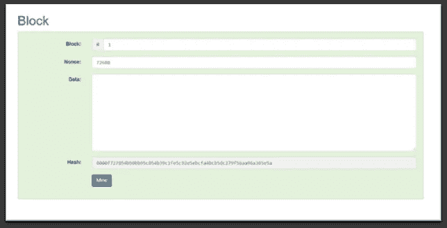
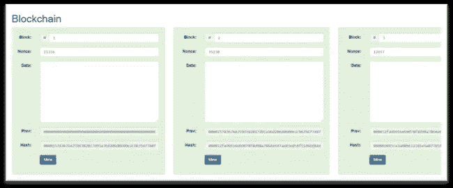
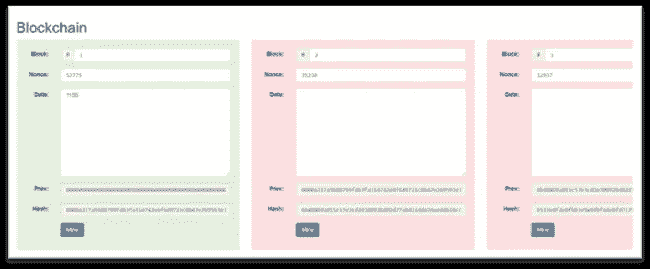
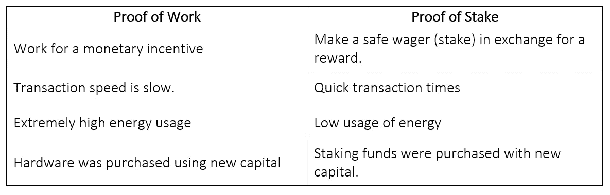
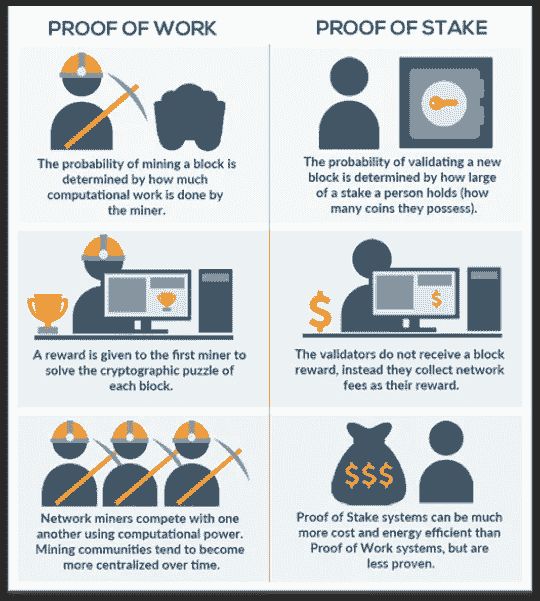
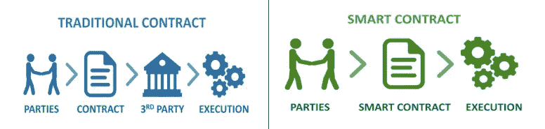
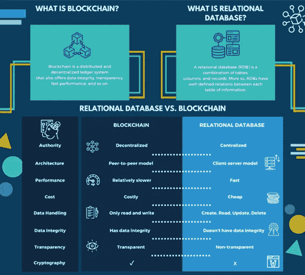

# 区块链将会改变游戏规则，所以让我们准备好。

> 原文：<https://medium.com/coinmonks/blockchain-will-be-a-game-changer-so-let-us-gear-up-de59809ac48a?source=collection_archive---------24----------------------->

除非你一直生活在岩石下，否则你可能听说过**比特币**和**区块链**。毕竟，他们是今年的关键词，他们现在是潮流和媒体的最爱。甚至那些从未开采过加密货币或对其工作原理有基本了解的人也在讨论它。在我的生活中，非技术朋友比技术朋友多。他们缠了我几个星期，要求我给他们解释这个新的行话。我相信有成千上万的人有同样的感觉。当这种情况发生时，是时候创造一些东西，每个人都可以指向其他迷失的灵魂——这是本博客的目标——用普通的英语写，任何普通的互联网用户都可以理解。

**什么是“块”？**

假设所有交易都记录在纸上，每张纸有 25 行。一旦填写了一张表(25 个交易)，社区将“验证”当前页面上的交易。如果团体中的大多数人同意 25 个交易都是相同的，则通过团体共识来验证。一旦页面被验证，它就被添加到先前验证的表单的堆栈中。因为一旦一个表被认证，它就不能通过将这些表结合在一起而被修改，所以堆栈中的每个表都可以被认为是可信的。这个过程被称为形成块。

**积木是如何“链接”在一起的？**

我们将以前纸张中的信息嵌入到新批准的纸张中，以将我们的纸张链接在一起。我们的一张纸等于区块链中的一块。链接是将先前的信息块整合到当前的信息块中的过程。于是，区块链这个词就诞生了。

如今，块中的所有数据都通过一种称为“加密哈希”的特定程序进行处理，以将它们链接在一起。加密哈希为给定的输入生成独一无二的输出。因此，根据图 1 中的*所示的输入，每个块的散列将总是唯一的。*

*Figure 1*

*Figure 2*

为了将数据块连接或链接在一起，当前块的头提供了先前验证的块的散列值(*图 2* )。改变一个区块链中任何一个区块上的内容都会产生完全不同的 hash，与下一个区块头中的 hash 不匹配(*图 3* )，导致区块链被破坏，所有链接到修改的区块失效。这使得区块链具有不变性(无法被改变)，并对审查具有很强的抵抗力。

*Figure 3*

**什么是区块链？**

匿名的中本聪提出了区块链的概念，并将其记录在白皮书中。本白皮书中讨论的概念导致了比特币的诞生，这是世界上第一个也是最大的区块链。区块链的核心是一个记录系统，可以跟踪“代币”或“硬币”形式的货币财富的移动。比特币和其他加密货币如以太、莱特币和 Monero 目前就是这种情况的例子。通过提供广泛分布且经过同行验证的数字不可更改分类账，区块链成为加密货币的有效支持平台。因为上述每种加密货币都有其区块链，不能直接兑换。重要的是要记住，区块链不需要货币，许多有趣和引人注目的用例不需要使用特定的货币、硬币或令牌。本质上，区块链是一个分类账，作为资产所有权的记录，独立于资产的类型。区块链还可以存储区块链特定存储规则定义的几乎任何类型的数据。这种记录系统可以记录重要的货币和非货币交易。这包括转移所有权、更新医疗记录、获取培训认证以及记录重要的单方声明等。

智能合约只不过是软件编程的事件，它的使用可以使区块链成为一个事件跟踪系统，其中公告表明事件和事件可以被操作。

区块链也可以用作工作流平台，通过使用智能合同围绕事件制定规则。对于要与智能协定通信的客户端应用程序，用户或用户从中调用协定功能的应用程序必须知道协定的公共地址。

以太坊和 Hyperledger Fabric 是两个最发达和最常用的区块链系统。尽管以太坊和 Hyperledger Fabric 都是在 2015 年发布的，但它们的开箱即用功能却大相径庭。为了构建智能合约和本机令牌化，以太坊提供了一个开放的、公共的、无权限的区块链和一个名为 Solidity out of the box 的图灵完整编程语言。Hyperledger Fabric 提供了一个封闭的、私有的、许可的开箱即用的区块链，以及针对链代码开发的 Go、JAVA 和 JavaScript 的图灵完整编程语言支持(智能合同)。

**区块链共识**

在区块链中，所有的交易都是以区块记录的。在将一个块添加到先前已验证的块链之前，它必须首先被组共识验证。有各种各样的区块链共识技术，然而，不管所利用的共识类型如何，链式区块上的每个交易数据都被认为是可信的，并且链式数据由于群体共识数据验证而没有被改变。有两种主要的共识机制，工作证明和利益证明。

***工作证明(PoW)共识***

通过工作验证系统的证明，比特币实现了拜占庭容错。当一个数据块已满时，每个节点会竞争解决一个猜谜游戏问题，以使用工作共识证明来验证数据块。因为这是一个非计算性的问题，所以最有效的解决方法是随机猜测。挖掘器是必须估计“现时”以成功验证块的节点。所有块数据以及当前猜测值(nonce)都通过加密哈希发送；如果结果与当前的“难度”匹配，矿工就猜对了。网络调整难度以匹配负载。

nonce 是一段随机数据，它与块数据混合在一起，产生与块链当前难度匹配的哈希输出。任何认为自己有正确答案的矿工都会告诉社区的其他人。矿工将使用块数据的随机数来尝试得到一个符合难度设置的结果，以验证解决方案是正确的。如果 51%或更多的矿工同意所提议的随机数，则获胜者区块上的交易被判断为正确，并且具有正确答案的矿工被支付(通常奖励以平台代币的形式给出)。任何缺少正确块数据的节点都将通过从附近的节点复制经验证的块来进行协调。工作共识的证明为每个节点精确和诚实地行动提供了博弈论激励；不诚实的玩家在猜随机数时会产生现实世界的成本，因为有 0%的机会获得支付。

***股权证明(PoS)共识***

利益证明是一种较新的区块链共识技术，被提议作为工作证明的替代，以解决 PoW 的可扩展性和成本问题。由于利害关系证明消除了区块验证中的猜谜游戏，采矿不再需要复杂和专门的设备，需要更少的处理能量。

为了验证交易，利益一致性证明使用一种机制，其中“验证者”节点单独捐赠或支付利益。当到了达成集体共识的时候，每个想参与的人都把钱押在赌注上。选择一个随机节点，并向所有其他参与者显示该节点的块内容的散列。块事务的有效性由所有其他节点决定。如果提议的区块被大多数人批准，随机节点将获得奖励，该节点上的任何下注者也将获得奖励。如果大多数节点不同意，随机节点失去他们的股份，得不到奖励，随机选择一个新节点来共享块数据。只有实施的机制发生了变化，但诚实和准确的博弈论动机依然存在。

与这种共识的主要区别在于，在此期间不进行任何处理；取而代之的是，只进行下注，任何设备，不管计算能力如何，都可以下注。“无风险”困境是一个潜在的风险证明漏洞，在这种困境中，验证器节点在硬分叉之后授权分类帐两侧的所有交易。

***工作证明 vs 利益证明***

*Figure 4*

**智能合约**

智能合约是一种将规则和决策点嵌入区块链交易和流程的技术。在传统的编程术语中，智能契约可以被认为是具有开发背景的个人的类。智能合约会立即发布到区块链，并允许交易自动化，同时确保它们都遵循相同的规则。在区块链上，每个智能合约及其进行的交易都被存储为记录或交易。因此，智能合同作为永久实体存在于区块链上——在将智能合同视为解决方案组件时要记住这一点。

*Figure 5*

**智能合约提供:**

自治:智能合同可以由任何人产生；不需要像律师、经纪人或审计员这样的中间人。

**效率:**去除流程中介通常会带来流程效率的大幅提高。

**节约成本:**经常更换中介可以显著节约成本。

**备份:**放置在区块链上的区块链和智能合同可以提供永久记录，即使开发者不再从事业务，也可以进行审计、洞察和追溯。

**准确性:**通过用可执行代码代替人工中间人，保证流程的一致性。

**区块链 vs 数据库**

在确定部署哪种技术以及区块链是否合适时，有许多方面需要考虑。解决方案数据的位置是任何解决方案的一个重要方面。传统系统现在依赖于经过多年改进的数据库技术。

当考虑将区块链作为一种解决方案时，在以下情况下，传统数据库系统将比区块链更适合:

1)高安全性数据

2)表现出色至关重要

3)不需要历史记录，只需要数据的快照

4)易于维护

5)应用程序逻辑预计会定期变化

6)保持资源的集中管理至关重要

当下列条件适用时，区块链将比传统的数据库系统更适合:

1)要求透明和公开验证

2)需要极高的容错能力

3)需要无限的可扩展性

4)数据不能或不应该委托给单一权威机构。

*Figure 5*

**“区块链正在超越加密货币，值得关注——特别是因为成功的原型表明，区块链，也被称为分布式账本技术，将是变革性的。”-** 朱莉·斯威特

**继续建造*。***

# 参考

1.伊恩·可汗。(2019 年 5 月 10 日)。*区块链城市——区块链驱动的城市未来*。从 Youtube 上检索到:[https://www.youtube.com/watch?v=I6fadL-0VRw](https://www.youtube.com/watch?v=I6fadL-0VRw)

2.孔斯坦托普洛斯 g(2017 年 12 月 1 日)。*了解区块链基础知识，第 1 部分:拜占庭容错。*从介质中检索:[https://Medium . com/loom-network/understanding-区块链-基础-part-1-Byzantine-fault-tolerance-245 f 46 Fe 8419](/loom-network/understanding-blockchain-fundamentals-part-1-byzantine-fault-tolerance-245f46fe8419)

3.马尔霍特拉，S. (2018 年 8 月 15 日)。*区块链初学者指南——向一个 5 岁的孩子解释。*从媒体中检索:[https://Medium . com/@ _ sidh arth _ m _/初学者-区块链指南-向 5 岁儿童解释-772caac6ae97](/@_sidharth_m_/beginners-guide-to-blockchain-explaining-it-to-a-5-years-old-772caac6ae97)

> 加入 Coinmonks [电报频道](https://t.me/coincodecap)和 [Youtube 频道](https://www.youtube.com/c/coinmonks/videos)了解加密交易和投资

# 另外，阅读

*   [加拿大最佳加密交易机器人](https://coincodecap.com/5-best-crypto-trading-bots-in-canada) | [Bybit vs 币安](https://coincodecap.com/bybit-binance-moonxbt)
*   [阿联酋 5 大最佳加密交易所](https://coincodecap.com/best-crypto-exchanges-in-uae) | [SimpleSwap 点评](https://coincodecap.com/simpleswap-review)
*   购买 Dogecoin 的 7 种最佳方式
*   [最佳期货交易信号](https://coincodecap.com/futures-trading-signals) | [流动性交易所评论](https://coincodecap.com/liquid-exchange-review)
*   [火币加密交易信号](https://coincodecap.com/huobi-crypto-trading-signals) | [Swapzone 审查](/coinmonks/swapzone-review-crypto-exchange-data-aggregator-e0ad78e55ed7)