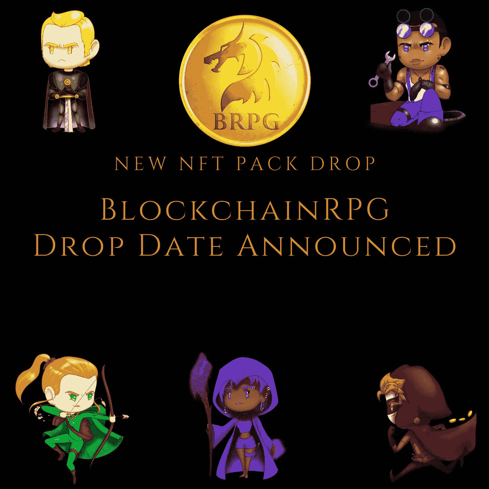

# BlockchainRPG NFTs 和公会！

> 原文：<https://medium.com/coinmonks/blockchainrpg-nfts-and-guilds-d8bda66afe46?source=collection_archive---------52----------------------->

BRPG Pack Drop

BlockchainRPG 开发团队和整个 BRPG 社区最近发生了许多令人兴奋的事情。今天早些时候，我在 Publish0x 上分享了一篇关于我们即将推出的游戏 NFT 包掉落以及新 NFT 包包含哪些内容的帖子。如果你有兴趣阅读更多关于新的 NFT 包和里面的 NFT 角色，前往 Publish0x 阅读“ [BlockchainRPG NFT 包下降宣布](https://www.publish0x.com/blockchainrpg/blockchainrpg-nft-pack-drop-announced-xjokvnl)”。

除了即将推出的新的 NFT 背包，我们还在 [BlockchainRPG discord 频道](https://discord.blockchainrpg.io)推出了一个新的社区聚焦项目。公会！

我们的团队已经决定让我们的 discord 频道中有服务器助推器角色的成员可以创建公会。玩家不需要购买特殊的 NFT 或者持有特定的代币来创建公会。只需提升不和谐服务器，任何人都可以启动自己的公会，并根据自己的需求进行定制。一些成员已经在我们的玩家社区中为他们的公会招募成员。

为什么要扮演服务器助推器的角色？它很容易获得，我们认为它将更多地关注社区发展，而不是让一群脚蹼/赌徒试图获得类似“公会通行证”的东西，并可能阻止那些真正有兴趣长期玩和发展 BRPG 社区而不是只赚快钱的玩家。

基于我们正在开发的新游戏机制以及社区反馈，未来的事情总是会发生变化。目前，在 BlockchainRPG 中创建自己的公会的门槛非常低。加入我们的不和，提高服务器，创建您的公会，邀请成员，并建立一个社区去冒险。就这么简单。

还不熟悉 [BlockchainRPG](https://blockchainrpg.io) ？让我们深入了解一下。

BlockchainRPG 是一个数字项目，位于遥远的奥兰姆的元宇宙。猎杀怪物，获得资源，制造更好的工具，与他人竞争。BlockchainRPG 提供了一个有趣的游戏来赢得风格的游戏。在玩的时候赚取黄金和稀有的 NFT。与其他玩家交易/购买/出售游戏中的物品，在冒险中互相帮助！让你的区块链冒险开始吧！

**路线图页面:**[https://www.blockchainrpg.io/roadmap/](https://www.blockchainrpg.io/roadmap/)

**网址:**[https://www.blockchainrpg.io/](https://www.blockchainrpg.io/)

**https://wax.atomichub.io/explorer/collection/blokchainrpg 收藏:**

**不和谐**:[https://Discord . blockchainrpg . io](https://discord.blockchainrpg.io/)

**推特**:[https://twitter.com/BlockchainRPG](https://twitter.com/BlockchainRPG)

# 喜欢内容吗？

请在[出版 0x](https://www.publish0x.com/@DrCharles) ，在[媒体](/@DrCharles)和[推特](https://twitter.com/crypto_leader)上关注我，保持联系。

> 加入 Coinmonks [电报频道](https://t.me/coincodecap)和 [Youtube 频道](https://www.youtube.com/c/coinmonks/videos)了解加密交易和投资

# 另外，阅读

*   [如何在 FTX 交易所交易期货](https://coincodecap.com/ftx-futures-trading) | [OKEx vs 币安](https://coincodecap.com/okex-vs-binance)
*   [CoinLoan 评论](https://coincodecap.com/coinloan-review) | [YouHodler 评论](/coinmonks/youhodler-4-easy-ways-to-make-money-98969b9689f2) | [BlockFi 评论](https://coincodecap.com/blockfi-review)
*   [XT.COM 评论](https://coincodecap.com/profittradingapp-for-binance) | [币安评论](https://coincodecap.com/xt-com-review)
*   [SmithBot 评论](https://coincodecap.com/smithbot-review) | [4 款最佳免费开源交易机器人](https://coincodecap.com/free-open-source-trading-bots)
*   [比特币基地僵尸程序](/coinmonks/coinbase-bots-ac6359e897f3) | [AscendEX 审查](/coinmonks/ascendex-review-53e829cf75fa) | [OKEx 交易僵尸程序](/coinmonks/okex-trading-bots-234920f61e60)