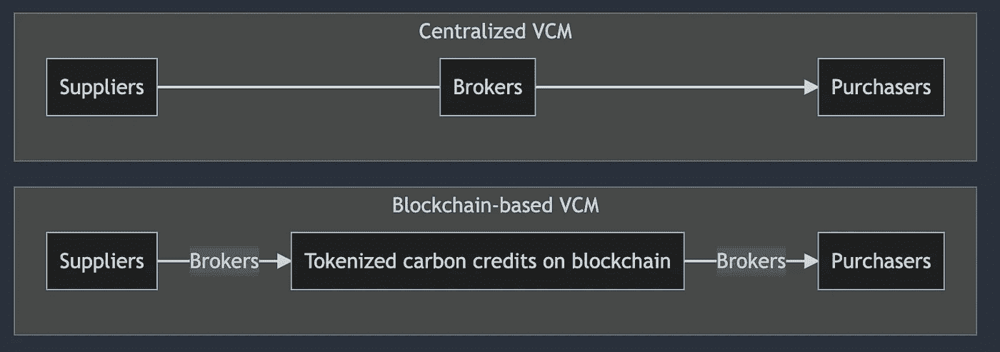

# 自愿碳市场中的区块链和企业

> 原文：<https://medium.com/coinmonks/blockchains-and-enterprises-in-the-voluntary-carbon-market-bd57b72598a6?source=collection_archive---------17----------------------->

在这篇博文中，我将介绍两种发展自愿碳市场的方法:**基于区块链的自愿碳市场和企业主导的自愿碳市场。**

我将从各自的优势、风险和潜在的集成方面，就如何理解这两种方法提出我的观点。

# 前提

企业为增长价值链所做的努力的规模很容易掩盖链上价值链的基础工作。由 Shopify、Stripe、Meta、Alphabet 和麦肯锡牵头的 Frontier 公司承诺在 2022 年至 2030 年间购买 9 . 25 亿美元的碳信用额。另一方面，到目前为止，大约有 40 万吨的信用额度——主要是价格低于 10 美元的[信用额度——已经在链上收回。此外，链条上的碳信用额](https://coinmarketcap.com/currencies/toucan-protocol-base-carbon-tonne/)[并不能反映碳补偿的实际价值。](https://carbonplan.org/research/toucan-crypto-offsets?utm_source=pocket_mylist)

那么，链上氯乙烯单体没有必要实现净零排放吗？应该提出问题，**但我相信，追求链上价值链管理的规模化将带来更好的总体结果。**

# 迈向机构再生金融(ReFi)

首先，我们可以在链上 VCM 和**制度性 DeFi** 之间做一个比较。

Institutional DeFi 是一类协议，服务于对安全性和合规性有复杂要求的机构。有了像 Fireblocks 和 Securitize 这样的经纪人提供的高接触支持，大型机构能够进入 DeFi。

跟随 DeFi 的脚步，链上 VCM 可能成为支持跨企业规模交易的基础设施。我们可以称之为**机构再融资**。

像 Fireblocks 这样将传统金融与 DeFi 联系起来的经纪人可以加入大型碳信用购买者的行列。除此之外，像 Frontier 这样促进大规模信用购买的企业也可以与机构 ReFi 整合，提供像 MRV 碳抵消(测量、验证和报告)这样的服务。

# 区块链的黑天鹅

在处理气候变化等基本上有时间限制的问题时，应考虑新技术固有的不确定性(即未知的未知性)。

有人可能会说，在区块链领域，比传统金融领域有更多潜在的“黑天鹅”。比如[“道黑”](https://podclips.com/c/hsmP8E?ss=r&ss2=ethereum&d=2022-06-20)肆虐，耽误了以太坊的接连升级。更不用说导致数百万美元损失的智能合同漏洞和糟糕的密钥管理了。

# 企业主导的 VCM

倡导碳信用的企业正在支付额外的碳信用额，此外还开发了足够严格的框架来正确评估每种抵消技术。这些都不是琐碎的工作，对于一个基础的项目来说，即使不是不可能，也是极其困难的。这是否意味着企业正在快速启动的集中式 VCM 将是让我们实现净零排放的 VCM？由于我上面提到的原因，这在我看来是完全可能的。

另一种看待这个问题的方式是，存在一些获取 VCM 利润的财务激励。将获得这些激励的行为标记为好的或坏的不在这篇博文的范围之内；尽管值得注意的是，增长风险资本的努力是公共产品。

此外，应区分以下两者。

1.  开发集中式 VCM 的企业
2.  企业是区块链风投公司的经纪人

类似于后一种结果——托管提供商成为市场守护者的未来——被认为是制度缺陷中不可取的。在班克里斯的[播客中可以学到更多。](https://www.youtube.com/watch?v=7jm9KVByiA4&t=3772s)

无论是以敏捷但集中的 VCM 为目标，还是以不确定但开放和分散的 VCM 为目标，制度性 DeFi 都是链上 VCM 可以借鉴的先例之一。

# 多元化的规模之路

拥有不同的途径来实现一个共同的目标从根本上来说是件好事。区块链和机制设计可以带来传统方法无法实现的创新。(例如， [KlimaDAO](https://www.klimadao.finance/) 正在用宏观经济学应对气候变化)和大企业结成伙伴关系，并利用他们对企业和客户的深远影响来发展 VCM 也是必要的。

[认知多元主义](https://www.radicalxchange.org/media/blog/why-i-am-a-pluralist/)的心智模型强调一系列不同的集体实体和知识文化的重要性，这些实体和文化相互交叉和合作，这有助于理解风险资本管理的发展，假设每个人都在诚信行事；尽管我之前说过这个假设有待商榷。

# 企业和链上 VCMs 的未来集成

在我之前的博文中，我强调了链上 VCM 的好处。总结一下我在这篇博文中提出的观点:区块链应用程序的硬度和可组合性将促进创新，而区块链应用程序固有的透明性将参与解决传统 VCM 中提出的责任问题。

尽管区块链可能不是立即的最佳解决方案，但人们可以想象这样一个世界，碳的价格将被外化，直到被定价到区块链驱动的经济中。此外，对于成本外部化的其他实例，碳成本的定价可以成为使用区块链进行成本内部化的先例。

如果企业快速增加的碳信用额最终能够过渡到区块链进行令牌化，这样的世界是可以实现的。**碳信用额的象征化不一定需要马上发生。但是随着区块链变得成熟，我们可以想象一个象征性的碳信用额充分利用区块链力量的世界。**

# 结束的

企业公司可能会作为碳信用交易的经纪人发挥重要作用。基于区块链的碳信用交易是一项开创性的工作，需要一段时间才能达到有影响力的规模。此外，由于新技术固有的不确定性，更不用说区块链在“现实世界”中仍然没有很多有影响力的例子，连锁碳市场可能不是解决有时间限制的问题的最佳方案。

尽管人们可以想象，最初没有区块链的企业公司迅速推出的碳信用额度，在未来将被令牌化并在链上交易。

# 评论

*尽管我一直在区分链上 VCM 和企业代理，因为它们目前是不相交的，但这两者确实有合作关系，共同努力实现规模化。如* [*与 Nori 合作的 Shopify，以及其他碳抵消供应商*](https://news.shopify.com/fighting-for-the-future-shopify-invests-5m-in-breakthrough-sustainability-technologies) *。*

> 加入 Coinmonks [电报频道](https://t.me/coincodecap)和 [Youtube 频道](https://www.youtube.com/c/coinmonks/videos)了解加密交易和投资

# 另外，阅读

*   [最佳以太坊钱包](https://coincodecap.com/best-ethereum-wallets) | [电报上的加密货币机器人](https://coincodecap.com/telegram-crypto-bots)
*   [交易杠杆代币的最佳交易所](https://coincodecap.com/leveraged-token-exchanges) | [购买弗洛基](https://coincodecap.com/buy-floki-inu-token)
*   [3 commas vs Pionex vs Cryptohopper](https://coincodecap.com/3commas-vs-pionex-vs-cryptohopper)|[Bingbon Review](https://coincodecap.com/bingbon-review)
*   [加密复制交易平台](/coinmonks/top-10-crypto-copy-trading-platforms-for-beginners-d0c37c7d698c) | [如何在 WazirX 上购买比特币](/coinmonks/buy-bitcoin-on-wazirx-2d12b7989af1)
*   [货币评论](https://coincodecap.com/coinloan-review)|[Crypto.com 评论](/coinmonks/crypto-com-review-f143dca1f74c)