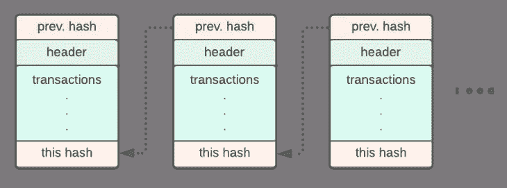

# 区块链在 Web 3.0 中的作用

> 原文：<https://medium.com/coinmonks/blockchains-role-in-web-3-0-36ff53affbef?source=collection_archive---------36----------------------->

我最近有机会参加了在 Solana bootcamp 上开发的 Chainlink，这只是对在 Solana 上开发 dapps(去中心化应用程序)的一个小小的了解。幸运的是，我在 Flatiron 的时间帮助我理解了编程语言的核心概念及其功能，这有助于我理解 Rust 以及代码如何与索拉纳区块链本身进行交互。参加这个研讨会让我看到了“幕后”发生的事情，这是投资加密货币本身永远做不到的。这反过来帮助我发现了区块链理工学院在革新我们今天做事方式方面的潜力。

**Web 3.0 简介**

Web 3.0 绝对是我们这些天经常看到的一个词，并且最近已经成为许多人迷恋的时髦词。Web 3.0 的一个包罗万象的定义是消除互联网上的中间人。在深入研究区块链技术和什么是 Web 3.0 之前，我们必须先回顾一下互联网诞生的历史和它的目的。互联网的开端始于 Web 1.0，当时 Web 被视为一种民主化信息访问的方式，但不幸的是，它对如何与静态页面交互设置了许多限制。因此，Web 2.0 是由谷歌、脸书、亚马逊、Twitter 和大型科技公司领导创建的，使互联网更容易连接和在线交易。电子商务和社交媒体让其他人有机会将他们的平台扩展到更广泛的受众。然而，许多批评者认为这些公司现在积聚了太多的权力，由此产生了 Web 3.0 这个术语。Web 3.0 的理念是拥有一个分散的系统，在这个系统中，个人可以控制自己的数据，并能够使用一个单独的个性化帐户在不同的平台上来回移动，在区块链上创建所有活动的个人记录。这将引入一个利用 AI(人工智能)、IOT(物联网)和区块链技术的自主开放的互联网。

那么，区块链在 Web 3.0 中的角色是什么？通过其在对等网络中促进多份数据存储的能力和在网络中验证者之间达成一致的要求，区块链协议是真正的 Web 3.0 的主干。最重要的是，它能够使两个陌生人通过智能合同达成协议，并通过互联网结算交易，从而消除了对中介的需求。我现在将深入我对区块链基础设施的理解，并帮助我的读者一瞥客户与区块链互动的代码，以及这一切是如何开创性的。

**区块链基础设施**

当客户通过 dapps 或分散式交换机与区块链上的特定合同地址进行交互时，他或她总是首先将他们的数字钱包连接到启动该过程的应用程序本身。从那里，客户机的请求与网络中的验证器节点进行交互。验证器节点利用 RPC(远程过程调用)来读取特定块的先前散列，并且当所有节点验证事务时，授予在区块链自身上创建块的批准。这一步有助于验证之前的交易和当前的交易，以保证数据块本身没有被可疑行为者篡改。



很多人想知道为什么使用 RPC 而不是更常用的 REST API 方法。REST APIs 有时可能会失败，尤其是在大型应用程序中，这就是为什么 RPC 更常用于内部通信。然而，使用 RPC 胜过 REST APIs 的最大原因是由于区块链的不变性组件。REST APIs 支持 CRUD(创建、读取、更新、删除)操作；然而，验证器在与区块链交互时不需要 update 和 delete 方法，只需要 GET 和 POST。这种更简单的方法有助于简化应用程序与区块链的交互。

**样本交互**

既然我们已经看到了基础设施的概述，我们可以看看与区块链交互的幕后代码。**免责声明:**以下示例是 Chainlink/Solana 训练营期间提供的示例代码。所有的工作都是在一个使用索拉纳 CLI 的本地索拉纳集群上完成的，并被用作与索拉纳区块链交互的模型。显示的合同和钱包地址不是现有地址。

会议期间使用的示例是创建我们自己的令牌，因为这是大多数人在谈到区块链时所熟悉的。我们从本地化服务器开始，然后在一个 Rust 文件中，我们调用我们想要发生的指令。

```
use borsh::{BorshDeserialize, BorshSerialize};#[derive(BorshSerialize, BorshDeserialize, Debug, Clone)]pub enum TokenInstruction {CreateToken,CreateTokenAccount,Mint { amount: u64 },Transfer { amount: u64 },}
```

在这种情况下，Borsh 用于散列，主要用于安全关键项目行业，因为它优先考虑一致性、速度和严格的规范。它的 Serialize/Deserialize 方法用于将数据结构转换成字节，主要用于与 RPC 和客户机交互的过程中。

接下来的步骤是定义将存储在程序中的数据，该数据被分为两个结构，一个是定义标题级信息的“令牌”标题级，另一个是定义令牌帐户信息的“令牌帐户”结构。从那里，编译器被告知使用来自 Borsh 库的信息以及我们传递的指令和帐户信息。

```
use borsh::{BorshDeserialize};
use solana_program::{
   account_info::{next_account_info, AccountInfo},
   entrypoint::ProgramResult,
   msg,
   program_error::ProgramError,
   pubkey::Pubkey,
};

use crate::instruction::TokenInstruction;
use crate::state::{Token, TokenAccount};

pub struct Processor {}

impl Processor {
   pub fn process_instruction(
       _program_id: &Pubkey,
       accounts: &[AccountInfo],
       instruction_data: &[u8],
   ) -> ProgramResult {
       let instruction = TokenInstruction::try_from_slice(instruction_data)
           .map_err(|_| ProgramError::InvalidInstructionData)?;
       let accounts_iter = &mut accounts.iter();
       msg!("Instruction: {:?}",instruction);
       match instruction {
           TokenInstruction::CreateToken => {
               msg!("Instruction: Create Token");

           }
           TokenInstruction::CreateTokenAccount => {
               msg!("Instruction: Create Token Account");

           }
           TokenInstruction::Mint { amount } => {
               msg!("Instruction: Mint");

           }
           TokenInstruction::Transfer { amount } => {
               msg!("Instruction: Transfer");
           }
       }
       Ok(())
   }
}
```

**注:** Crate 是编译器。帐户信息存储我们想要维护令牌所有权的帐户的信息。

从这里开始，我们传递我们希望每个函数做的事情。

总之，我们将首先为我们指定的帐户创建一个新令牌，同时指定一个“令牌授权”帐户(铸造或创建新令牌的权限等)。然后，我们指定令牌的具体细节，例如提供并保存所有者帐户，以便能够访问令牌授权帐户。

完成此步骤后，我们将指定哪个帐户想要接收铸造的令牌，即所有者帐户和令牌颁发机构帐户。代码逻辑将验证它是尝试铸造令牌的令牌授权帐户，否则它将返回错误。一旦支票通过，代币账户的总供应量将随着目标接收者的余额而增加。

逻辑的最后一部分是验证令牌可以在帐户之间转移。为此，我们必须核实“转出”账户和“转入”账户，并确认“转出”账户持有足够的资金。我们的逻辑还将验证“发件人”帐户的所有者已经签署了交易，同时还将检查“收件人”帐户是否与我们输入的收件人帐户相匹配。如果都检查通过，两个账户的余额将被更新和保存。

说明部分的最终代码块应该如下所示:

```
match instruction {TokenInstruction::CreateToken => {msg!("Instruction: Create Token");//get account info for master token accountlet token_master_account = next_account_info(accounts_iter)?;let token_authority = next_account_info(accounts_iter)?;let mut token = Token::load_unchecked(token_master_account)?;//set default values and save master token accounttoken.authority = *token_authority.key;token.supply = 0;token.save(token_master_account)?}TokenInstruction::CreateTokenAccount => {msg!("Instruction: Create Token Account");//get account info for master token account and token account to be createdlet token_account_acct = next_account_info(accounts_iter)?;let token_master_account = next_account_info(accounts_iter)?;let owner = next_account_info(accounts_iter)?;let mut token_account = TokenAccount::load_unchecked(token_account_acct)?;//set default values and save token accounttoken_account.owner = *owner.key;token_account.token = *token_master_account.key;token_account.amount = 0;token_account.save(token_account_acct)?}TokenInstruction::Mint { amount } => {msg!("Instruction: Mint");//get account info for master token account and token account to mint tolet token_account_acct = next_account_info(accounts_iter)?;let token_master_account = next_account_info(accounts_iter)?;let mut token_account = TokenAccount::load(token_account_acct)?;let mut token = Token::load(token_master_account)?;//basic validation, ensure its the master token authority trying to mintlet token_authority = next_account_info(accounts_iter)?;if !token_authority.is_signer {msg!("Only the token owner can mint tokens");return Err(ProgramError::MissingRequiredSignature);}//update total supply of the master token, and update balance of token account that received the minttoken.supply += amount;token_account.amount += amount;//save updated contents of both accountstoken_account.save(token_account_acct)?;token.save(token_master_account)?;}TokenInstruction::Transfer { amount } => {msg!("Instruction: Transfer");//get account info for from and to token accounts, as well as master token accountlet from_token_acct = next_account_info(accounts_iter)?;let to_token_acct = next_account_info(accounts_iter)?;let owner = next_account_info(accounts_iter)?;let mut src_token_account = TokenAccount::load(from_token_acct)?;let mut dst_token_account = TokenAccount::load(to_token_acct)?;//basic validation, ensure sender has enough fundsif src_token_account.amount <= amount {msg!("Not enough tokens to transfer");return Err(ProgramError::InsufficientFunds);}//ensure the owner of the from account is the one signing the transactionif !owner.is_signer {msg!("Not the token owner signing the transaction");return Err(ProgramError::MissingRequiredSignature);}//ensure the owner passed in is the actual owner of the token accountif !(src_token_account.owner == *owner.key) {msg!("Not the token account owner signing the transaction");return Err(ProgramError::MissingRequiredSignature);}//update values in from and to accounts, then save new contents of both accountssrc_token_account.amount -= amount;dst_token_account.amount += amount;src_token_account.save(from_token_acct)?;dst_token_account.save(to_token_acct)?;}
```

一旦我们部署了客户端代码，我们应该在 Solana CLI 中看到，我们应该看到一个成功完成的交易，以及令牌名称、新生成的余额和两个帐户之间的转帐。

**回顾与思考**

这篇博客最终肯定比我预期的要长，但当谈到区块链技术及其自动化我们今天做事方式的能力时，真的有太多东西要解开。我希望我写的下一篇博客能够联系到 oracles 如何与链一起工作，将真实世界的信息与来自智能契约的查询联系起来。如果我想让其他人从中吸取什么的话，那就是区块链技术仍然是一个不断发展的领域，它对去中心化有利有弊，但最终有潜力帮助每个人作为一个社会共同发展。

> 加入 Coinmonks [电报频道](https://t.me/coincodecap)和 [Youtube 频道](https://www.youtube.com/c/coinmonks/videos)了解加密交易和投资

# 另外，阅读

*   [本地比特币评论](/coinmonks/localbitcoins-review-6cc001c6ed56) | [加密货币储蓄账户](https://coincodecap.com/cryptocurrency-savings-accounts)
*   [什么是融资融券交易](https://coincodecap.com/margin-trading) | [美元成本平均法](https://coincodecap.com/dca)
*   [拥护卡审核](https://coincodecap.com/uphold-card-review) | [信任钱包 vs MetaMask](https://coincodecap.com/trust-wallet-vs-metamask)
*   [Exness 评测](https://coincodecap.com/exness-review)|[moon xbt Vs bit get Vs Bingbon](https://coincodecap.com/bingbon-vs-bitget-vs-moonxbt)
*   [如何开始通过加密贷款赚取被动收入](https://coincodecap.com/passive-income-crypto-lending)