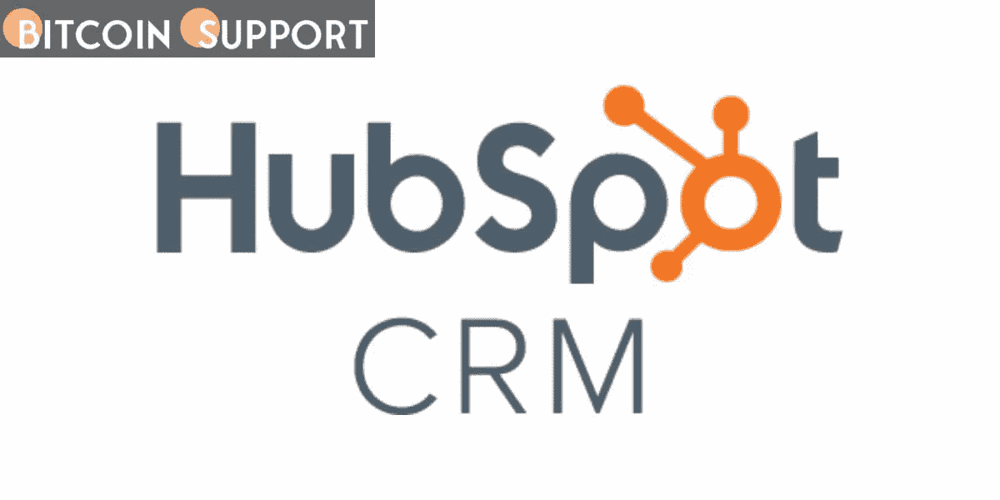

# BlockFi、天鹅比特币和潘迪拉建议用户在 Hubspot CRM 袭击中的数据泄露后如何保持安全

> 原文：<https://medium.com/coinmonks/blockfi-swan-bitcoin-and-pantera-advise-users-on-how-to-remain-secure-following-the-data-breach-6f1d8af15d87?source=collection_archive---------76----------------------->

**Visit our website:-** [**https://bitcoinsupports.com/**](https://bitcoinsupports.com/)

On Friday, a hacker targeting crypto customers discovered a vulnerability in the client relationship management (CRM) platform Hubspot, stealing customer data from BlockFi, Swan Bitcoin, and Pantera Capital — all of which have shared steps customers can take to help ensure the security of their data and funds.

In light of this most recent incident, BlockFi advised its consumers to take the following steps:

— Maintain good password hygiene by ensuring that your passwords are strong and unique for each service; You can simplify this process by use password managers such as 1Password;

— Allowlisting for BlockFi should be enabled: this is advised even if you do not have an allowlisted address. Any time you wish to withdraw, you must add a new allowlisted address, which will trigger a seven-day hold — in addition to the company’s regular one-business-day security hold.

— keep an eagle eye out for scams: This applies to any inbound messages, whether they are emails, phone calls, or texts — refrain from engaging with anything that is not a typical BlockFi channel of contact.

Swan Bitcoin itself published a list of recommendations, stating:

— keep an eye out for suspicious activities, particularly in your email — presume that any communication that requests sensitive information or a specific action is not real until proven otherwise;

— phishing — attempts to obtain further information from you or to coerce you into doing anything via email, phone call, or text;

— if you are approached outside of the normal channels of communication that you receive, do not engage;

— When in doubt, contact companies directly via their official email addresses or phone numbers;

— Two-Factor Authentication (2FA) should be enabled for all of your accounts; It is recommended to use an authenticator app or a hardware authenticator tool, such as Yubikey;

— Update your software — this includes the operating systems on your phones, tablets, and laptops — and make sure that all devices, applications, and operating systems receive automatic updates;

— Ensure that you use strong passwords and a password manager.

Pantera shared the same advise regarding password usage and management, as well as two-factor authentication, adding the following in an email:

— If a correspondence has strange language or bad grammar, it may be the work of a malicious third party impersonating Pantera;

— Never click on links in emails or text messages that do not include the full site URL.

Finally, all three companies concur on the following:

**“If something appears to be too good to be true, it probably is.”**

Attack with a cryptographic component

According to Hubspot, the hacker “compromised” one of its staff accounts on March 18 in what the company described as a “targeted incident aimed at customers in the bitcoin business.”

The company asserted that it has “terminated access to the hacked Hubspot employee account and disabled other employees from performing certain operations in client accounts.”

The firm verified that the assault exposed a number of telephone numbers and email addresses. It stated, however, that sensitive data such as passwords and proofs of identification remained protected.

CRM platforms are frequently employed by enterprises as a digital, hub-like tool for pooling or storing customer and prospective customer data and tracking interactions.

**SAFU funds**

BlockFi responded on Twitter, stating that its “internal systems and client cash are secure and unaffected.” Additionally, the business stated:

**“We can also confirm that Hubspot never saved passwords for BlockFi accounts, government-issued identification numbers, or social security numbers. At the moment, no action is required on your BlockFi account.”**

BlockFi noted that it stored data on “the vast majority” of its clients “including name, email, and phone number,” but was still “waiting to learn the full degree” of the hack’s “effect.”

Swan Bitcoin, on the other hand, noted in an email to customers that was also shared on Twitter that the company “uses Hubspot for limited client communication and marketing data,” adding:

**“Hubspot is not used to store financial data, transactions, or other sensitive personal or financial information. Your money is secure. Swan’s systems have not been harmed.”**

The company noted that it utilises Hubspot to store data that it “uses to assist in onboarding new and prospective customers.”

“Additional information will be emailed to all impacted clients in the coming days,” it ended.

Yan Pritzker, the company’s co-founder, stated on Twitter that the team has been working “around the clock” since Friday on “data cleaning, termination of further data to 3rd parties, and completion of audit.” Additionally, they intend to reveal a “complete” plan next week, which will involve “moving away from email vendors.”

[https://twitter.com/skwp/status/1505411291187322881](https://twitter.com/skwp/status/1505411291187322881)

In a subsequent press statement on the incident, Hubspot stated that its “initial review indicates that data was exported from fewer than 30 HubSpot portals” — but warned that a “bad actor” would have achieved what they wanted if the hacker “attempted to access contact data.”

The firm stated that additional facts “on the bad actor’s conduct” had been “given to impacted customers.”

According to Pantera, Hubspot warned the company that an unauthorised person “may have gotten access to a portion of its client data,” including certain Pantera data stored on the platform.

According to Pantera’s email, the information that may have been accessed includes names, email addresses, mailing addresses, phone numbers, and regulatory classifications.

According to Pantera, the incident had no effect on the company’s internal systems, and as a result, sensitive personal information such as a social security number or government-issued identity was not accessible. “Hubspot does not save this information,” the business stated.

Pantera Capital also suffered a security incident involving Hubspot last year, which the former claimed was exploited to target consumers with a phoney “token sale” offer.

**Visit our website:-** [**https://bitcoinsupports.com/**](https://bitcoinsupports.com/)

**Disclaimer: These are the writer’s opinions and should not be considered investment advice. Readers should do their own research.**

> 加入 Coinmonks [电报频道](https://t.me/coincodecap)和 [Youtube 频道](https://www.youtube.com/c/coinmonks/videos)了解加密交易和投资

# 另外，阅读

*   [3 商业评论](/coinmonks/3commas-review-an-excellent-crypto-trading-bot-2020-1313a58bec92) | [Pionex 评论](https://coincodecap.com/pionex-review-exchange-with-crypto-trading-bot) | [Coinrule 评论](/coinmonks/coinrule-review-2021-a-beginner-friendly-crypto-trading-bot-daf0504848ba)
*   [莱杰 vs n rave](/coinmonks/ledger-vs-ngrave-zero-7e40f0c1d694)|[莱杰 nano s vs x](/coinmonks/ledger-nano-s-vs-x-battery-hardware-price-storage-59a6663fe3b0) | [币安评论](/coinmonks/binance-review-ee10d3bf3b6e)
*   [Bybit Exchange 审查](/coinmonks/bybit-exchange-review-dbd570019b71) | [Bityard 审查](https://coincodecap.com/bityard-reivew) | [Jet-Bot 审查](https://coincodecap.com/jet-bot-review)
*   [3 commas vs crypto hopper](/coinmonks/3commas-vs-pionex-vs-cryptohopper-best-crypto-bot-6a98d2baa203)|[赚取加密利息](/coinmonks/earn-crypto-interest-b10b810fdda3)
*   最好的比特币[硬件钱包](/coinmonks/hardware-wallets-dfa1211730c6) | [BitBox02 回顾](/coinmonks/bitbox02-review-your-swiss-bitcoin-hardware-wallet-c36c88fff29)