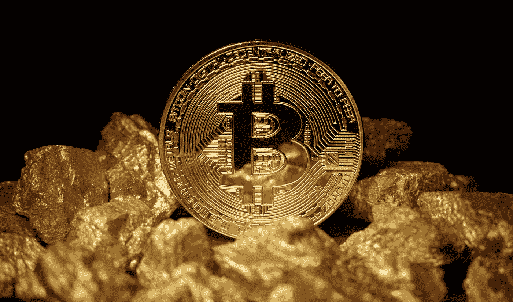
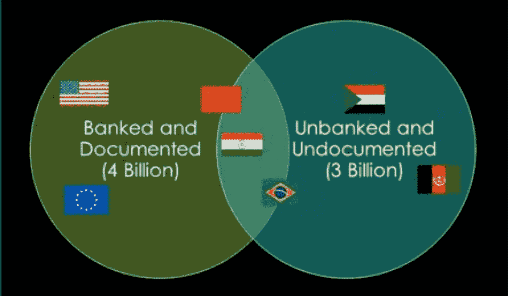
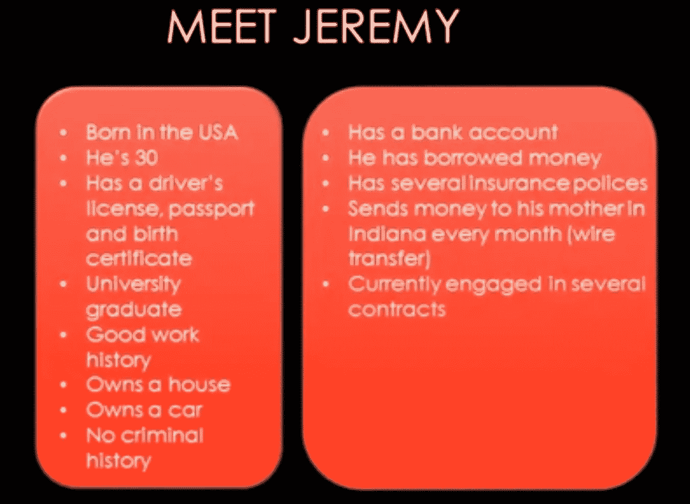
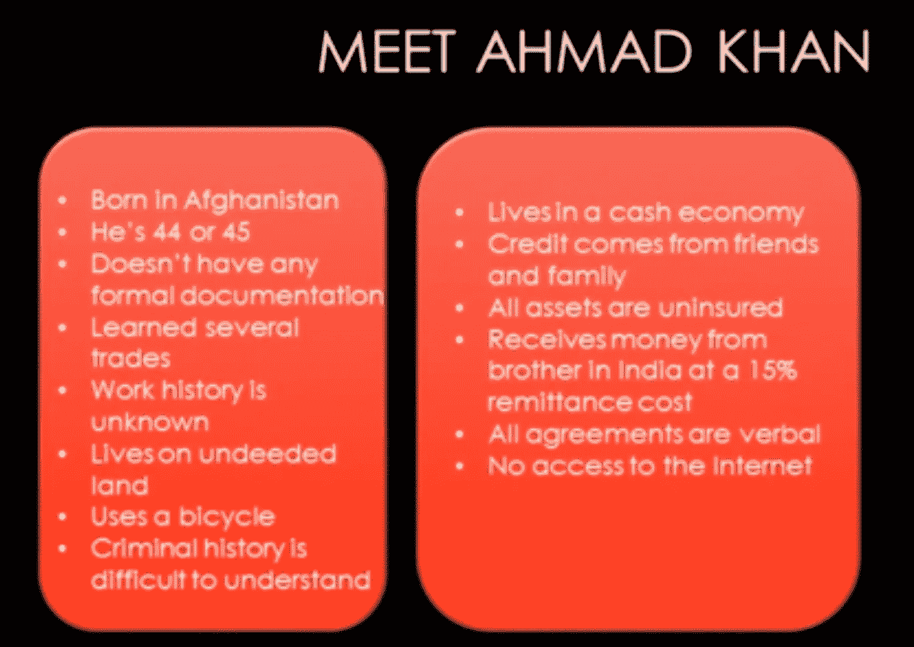
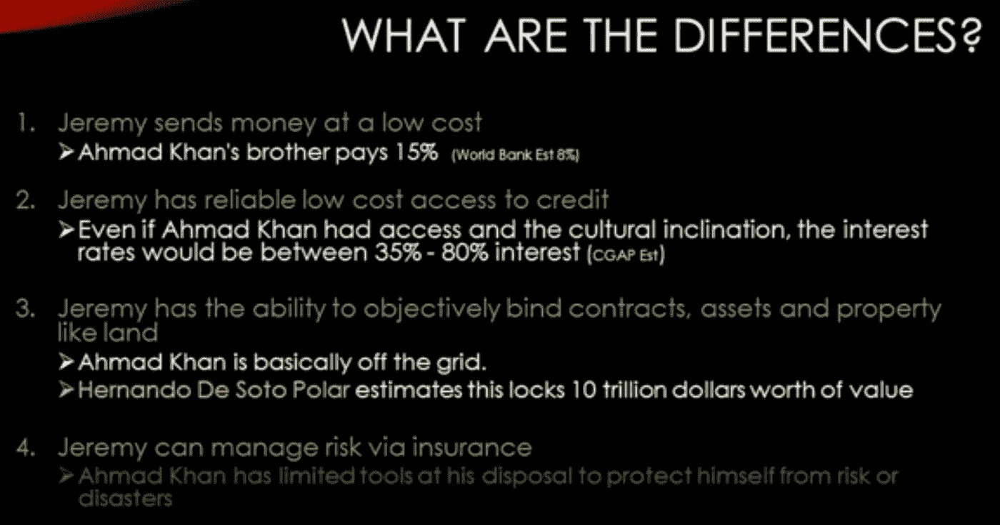
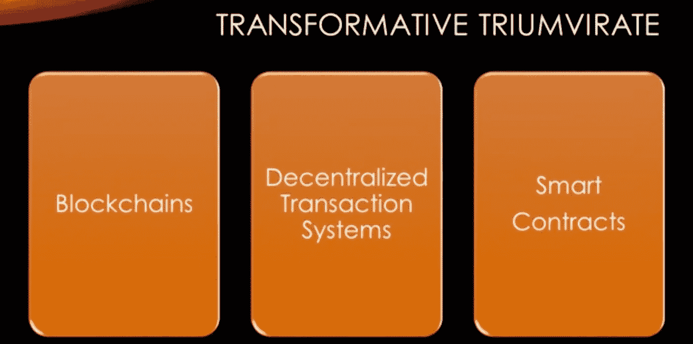
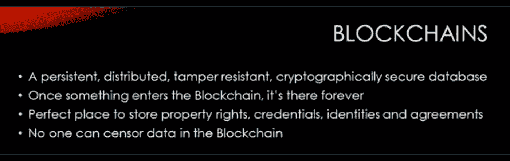
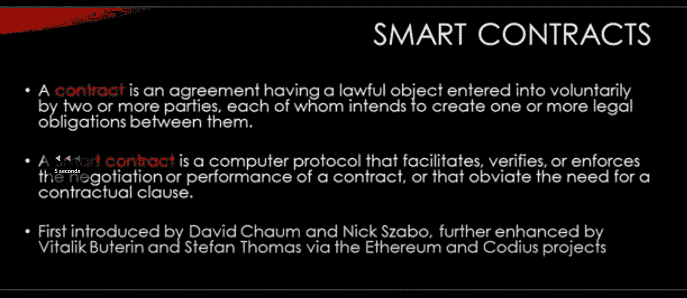
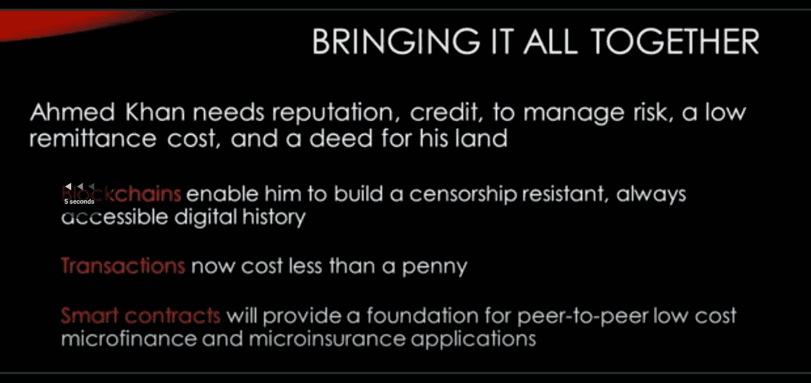

# 区块链博客 05:区块链消除贫困？

> 原文：<https://medium.com/coinmonks/blog-05-f3add0f865e5?source=collection_archive---------9----------------------->

在之前的博客中，我们看到了为什么 5000 年来黄金一直是最好的保值手段。令人难以置信的是，今天如果你需要留下 5000 美元给某人，给你的女儿，而不是你的女儿或你的孙女，或者从现在起 900 年后的任何 40 代人。我们不知道该怎么做。如果你只留下美元，它不会值很多钱。据我们所知，没有安全措施能持续那么久。我们所知道的唯一可以长期保值的是，你需要购买价值 5000 美元的黄金，锁在金库里，900 年后把钥匙交给那个人。比特币被称为数字黄金，因为它在以下六个特征中的每一个方面都与黄金极其相似且优于黄金:

*   它比黄金稀缺得多。
*   它是耐用的
*   它是可分的
*   它是可运输的
*   它是可识别的
*   它是可替代的

永远不会超过 2100 万个比特币。比黄金可分多了。比特币由一百万个被称为 Satoshis 的碎片组成。你可以将比特币附加到短信、或、或电子邮件中，免费实时发送到世界各地。而且非常容易验证。当你得到一个比特币的时候，你就知道这是一个好的比特币。

# 比特币:不需要银行的账本

比特币创造的是一个不需要银行的账本。这一点实际上非常重要，因为如果你考虑什么是银行，至少就资金转移、支票和储蓄而言，不是贷款部分，而是银行的金融、资金流动部分，它确实是一个安全的分类账。银行不只是有一个小文件，说你的账户里有 3000 美元。他们坚持认为，当你写东西时，他们会在他们的分类账中注明，1000 美元从你的账户转到了别人的账户等等。这对于确保安全非常重要。嗯，比特币的设计者创造了一种方式来制作一个安全的账本，每个人都可以信任，但没有人拥有或控制。这使得人们可以拥有不受政府影响的钱，如果你是一个政府，这是不好的，如果你不喜欢政府的货币政策，这是很好的。它让政策由共识和软件设定。所以比特币基本上找到了一种方法，总是知道大多数人在想什么。通过了解大多数人的想法，你会得到一些你希望可以信任的东西。理论上，如果有人控制了世界上超过一半的电脑，他们就可以接管比特币，但这不太可能。

# 银行系统的加密货币？

让我们把世界分成两个桶，让我们看看有银行记录和有文件记录的世界，让我们看看没有银行记录和没有文件记录的世界，绿色的桶里有大约 40 亿人生活在其中，比如美国，欧盟，然后我们看看中国，印度和巴西，我们开始进入没有银行记录和没有文件记录的世界，比如苏丹，阿富汗。

如果你看看每一个有意义的指标，从婴儿死亡率到识字率，生活质量往往会随着更多的金融服务和更多的文件而变得更好。

让我们用一个例子来解释一下，让我们看看两个人

杰里米大约 30 岁，他出生在美国。他可以拿到护照、驾驶执照、出生证明等。他有证书，上过大学，有良好的工作经历，有房子，可能是大家都认识的人。现在让我们看看他的财务历史，他有一个银行账户，他以前借过钱，他有几份保险单，所以如果他开车撞了你，如果他的房子着火了，如果他生病了，他有办法通过代理人支付，他每个月都给他在世界另一个地方的母亲寄钱。

现在让我们来认识一下艾哈迈德，他来自未记录世界的正确圈子。他出生在阿富汗。他没有任何正式的文件，他学过几个行业，但很难理解他的工作历史。他没有文件证明他实际上拥有他在那里住了 20 年的房子，他使用自行车作为交通工具，并且他有很难核实的犯罪历史。让我们看看他的金融生活，他生活在一个现金经济中，一切都是现金。他带走的所有钱，他的信用，都来自朋友和家人，他的所有资产都没有保险。他从他在印度的兄弟那里收到钱，每一美元只花了他 15%的汇款成本，他所有的协议都是口头的，而且他绝对不能访问互联网。

杰里米以非常低的成本汇款，只需要几天时间，也许只有几个百分点。另一方面，艾哈迈德的兄弟支付交易的 15%。让我们来看看每个人的数字，全球汇款业务约为 5400 亿美元，1.92 亿居住在国外的人向家里汇款，资金总额约为 4000 亿美元，转移资金的成本平均在 8.6%至 12%之间，这是世界银行的估计，但根据你居住的地方，可能会高得多。

这是全世界约 30 亿人面临的严峻现实。

杰里米可以低成本获得信贷，当他获得贷款时，他可以获得 5 年，10 年，15 年的长期贷款，这取决于他的资产。利率相当不错，比如说 5%到 10%。现在，如果艾哈迈德有机会获得贷款，他将能够摆脱贫困。

# 区块链消除贫困

使用区块链可以帮助不发达国家的人们消除贫困。想想一个生活在南苏丹、索马里或肯尼亚的人，尽管事实上他很聪明，有很好的想法，但如果他想自己创业，他可能不得不行贿，或者不得不说服一些官员或申请贷款。现在他可能永远也得不到贷款，即使他能得到贷款，他也必须为此支付巨额利息。
**这些问题背后的一些原因是:**

*   政府很穷
*   所有的银行都没有这个人的担保，因为他们看不到这个人以前的任何记录，或者他们看不到这个人的任何真实文件

**如果我们在这个场景中使用区块链:**

*   首先，那个人不需要任何第三方的依赖，他甚至不需要任何第二个人就可以自己创业。
*   第二，与此人相关的每一份公开文件将在全球范围内可用，因为区块链，银行将确保这些文件没有被欺骗或更改，所以这些都是原始的，而且由于区块链的透明因素，政府将进行公开检查。

每个人似乎都在谈论的比特币实际上有一些解决方案，也像比特币一样，许多其他加密货币也有这种变革性的三足鼎立，这里实际上有三点:

参考之前的视频了解区块链和智能合约: [2 月 28 日:区块链和加密货币研究博客](https://aaklii.medium.com/28days-of-february-blockchain-and-cryptocurrency-research-blogs-4b73c51ce3db)

所以，让我们把这些放在一起，让我们回到为什么我们关心艾哈迈德。那么他的问题是什么？

*   他需要名声
*   他需要信任
*   他需要能够管理他的风险
*   他需要低汇款成本
*   他很想能够证明他拥有这片土地，他生活在这片土地上
*   如果他不得不逃离它，那么区块链使他能够建立一个抵制审查的总是可访问的数字历史他所做的一切，如果他通过区块链的解决方案做到这一点，它将永远存在，并且完全脱离他的政府。因此，不管是谁在控制特定的政治突发事件，它就在那里。

你只要问自己这个问题，为什么这个星球上的每个人类没有平等的机会。为什么有些人为了目标要多奋斗，只是因为他们出生在一个贫穷的国家，或者是一个政府腐败的国家。区块链不是所有问题的解决方案，但如果我们让这项技术在这些领域发展，这个世界的未来会很棒。我们确实需要大量的研究。我的博客基于研究和知识。到目前为止，我相信区块链技术有潜力改变这个世界几个世纪以来的工作方式，让它成为每个人更好的生活场所。

***阅读下一部分:*** [区块链博客 06 —密码学、安全和加密钱包](https://aaklii.medium.com/blockchain-blog-06-cryptography-sha-and-wallets-438a92921f1c)

***全系列:*** [28 篇关于区块链和加密货币的博客](https://aaklii.medium.com/28days-of-february-blockchain-and-cryptocurrency-research-blogs-4b73c51ce3db)

> 加入 Coinmonks [电报频道](https://t.me/coincodecap)和 [Youtube 频道](https://www.youtube.com/c/coinmonks/videos)了解加密交易和投资

## 另外，阅读

*   [3 商业评论](/coinmonks/3commas-review-an-excellent-crypto-trading-bot-2020-1313a58bec92) | [Pionex 评论](https://coincodecap.com/pionex-review-exchange-with-crypto-trading-bot) | [Coinrule 评论](/coinmonks/coinrule-review-2021-a-beginner-friendly-crypto-trading-bot-daf0504848ba)
*   [莱杰 vs n rave](/coinmonks/ledger-vs-ngrave-zero-7e40f0c1d694)|[莱杰 nano s vs x](/coinmonks/ledger-nano-s-vs-x-battery-hardware-price-storage-59a6663fe3b0) | [币安评论](/coinmonks/binance-review-ee10d3bf3b6e)
*   [Bybit Exchange 审查](/coinmonks/bybit-exchange-review-dbd570019b71) | [Bityard 审查](https://coincodecap.com/bityard-reivew) | [Jet-Bot 审查](https://coincodecap.com/jet-bot-review)
*   [3 commas vs crypto hopper](/coinmonks/3commas-vs-pionex-vs-cryptohopper-best-crypto-bot-6a98d2baa203)|[赚取加密利息](/coinmonks/earn-crypto-interest-b10b810fdda3)
*   最好的比特币[硬件钱包](/coinmonks/hardware-wallets-dfa1211730c6) | [BitBox02 回顾](/coinmonks/bitbox02-review-your-swiss-bitcoin-hardware-wallet-c36c88fff29)
*   XT.COM 评论[币安评论](https://coincodecap.com/profittradingapp-for-binance) |
*   [SmithBot 评论](https://coincodecap.com/smithbot-review) | [4 款最佳免费开源交易机器人](https://coincodecap.com/free-open-source-trading-bots)
*   [比特币基地僵尸工具](/coinmonks/coinbase-bots-ac6359e897f3) | [AscendEX 审查](/coinmonks/ascendex-review-53e829cf75fa) | [OKEx 交易僵尸工具](/coinmonks/okex-trading-bots-234920f61e60)
*   [如何在印度购买比特币？](/coinmonks/buy-bitcoin-in-india-feb50ddfef94) | [瓦济克斯评论](/coinmonks/wazirx-review-5c811b074f5b)
*   [隐翅虫替代品](/coinmonks/cryptohopper-alternatives-d67287b16d27) | [HitBTC 审查](/coinmonks/hitbtc-review-c5143c5d53c2)
*   [CBET 评论](https://coincodecap.com/cbet-casino-review) | [库科恩 vs 比特币基地](https://coincodecap.com/kucoin-vs-coinbase)
*   [折叠 App 审核](https://coincodecap.com/fold-app-review) | [Kucoin 交易机器人](/coinmonks/kucoin-trading-bot-automate-your-trades-8cf0ca2138e0) | [Probit 审核](https://coincodecap.com/probit-review)
*   [如何匿名购买比特币](https://coincodecap.com/buy-bitcoin-anonymously) | [比特币现金钱包](https://coincodecap.com/bitcoin-cash-wallets)
*   [币安 vs FTX](https://coincodecap.com/binance-vs-ftx) | [最佳(索尔)索拉纳钱包](https://coincodecap.com/solana-wallets)
*   [比诺莫评论](https://coincodecap.com/binomo-review) | [斯多葛派 vs 3Commas vs TradeSanta](https://coincodecap.com/stoic-vs-3commas-vs-tradesanta)
*   【Capital.com】|[港加密借贷平台](https://coincodecap.com/crypto-lending-hong-kong)
*   [如何在 Uniswap 上交换加密？](https://coincodecap.com/swap-crypto-on-uniswap) | [A-Ads 评论](https://coincodecap.com/a-ads-review)
*   [WazirX vs CoinDCX vs bit bns](/coinmonks/wazirx-vs-coindcx-vs-bitbns-149f4f19a2f1)|[block fi vs coin loan vs Nexo](/coinmonks/blockfi-vs-coinloan-vs-nexo-cb624635230d)
*   [本地比特币审核](/coinmonks/localbitcoins-review-6cc001c6ed56) | [加密货币储蓄账户](https://coincodecap.com/cryptocurrency-savings-accounts)
*   [什么是保证金交易](https://coincodecap.com/margin-trading) | [美元成本平均法](https://coincodecap.com/dca)
*   [支持卡审核](https://coincodecap.com/uphold-card-review) | [信任钱包 vs 元掩码](https://coincodecap.com/trust-wallet-vs-metamask)