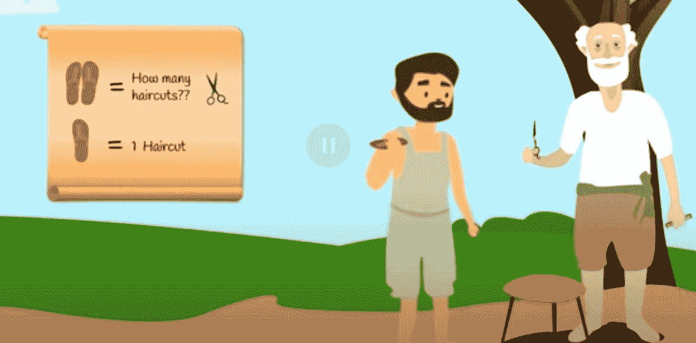
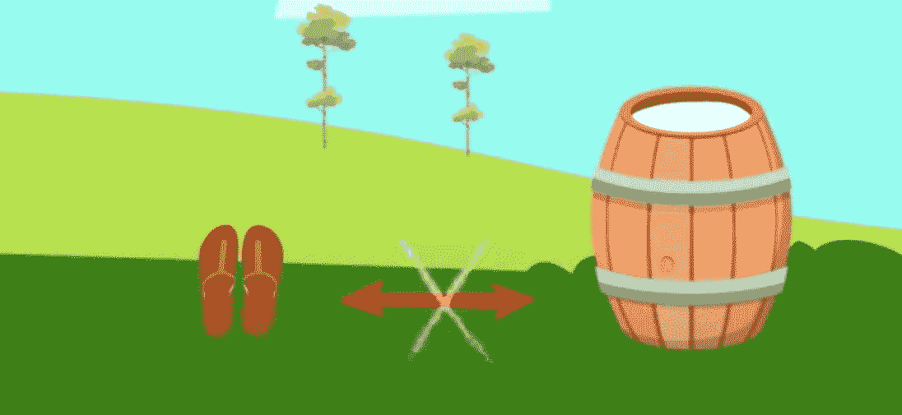
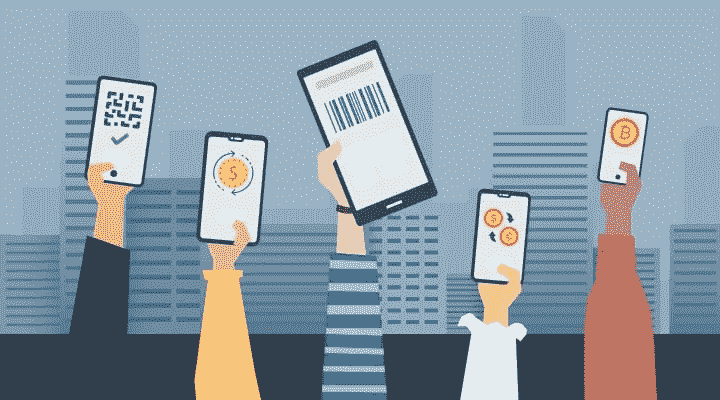

# 区块链博客 01:加密货币，需要吗？

> 原文：<https://medium.com/coinmonks/blog-1-cryptocurrencies-is-it-needed-part-1-33d51eecd6fa?source=collection_archive---------10----------------------->

人们对金钱总是又爱又恨。但是，钱到底是什么？货币是交易的工具。货币是一项发明，它让我们能够更容易地交易我们创造的商品和提供的服务。

货币作为一种票据，除了用来交易产品和服务之外，一无是处。它们本身毫无价值。美元的价值是因为它代表什么，而不是它是什么。换句话说，金钱代表了人们为了交换商品和服务而互相提供的最好的东西。有了钱，人们可以交换最好的自己，才能，或任何一种他们拥有的东西。你向世界提供的越多，你在交易中获得的价值就越多，你提供的价值越多，你做的交易就越多。

# 货币易货系统

**那么，在有任何种类的货币之前，有什么呢？你有没有想过钱是怎么产生的？**金属作为货币的使用可以追溯到公元前 2000 年前的巴比伦，标准化和认证的硬币可能直到公元前**7 世纪才出现。**

在此之前，会有一个物物交换系统。不同类型的工作，如织工、鞋匠、农民、裁缝等。存在于社区中。

想象一下，有一个叫 Vijay 的鞋匠，和一个叫 Raj 的农民，当 Vijay 需要蔬菜的时候，他去 Raj 那里用一双拖鞋换了他需要的蔬菜，两个人都很高兴，这就是所谓的物物交换系统，一个人可以用另一个人生产的货物和服务交换他生产的货物和服务。

但是物物交换系统总是有效的吗？物物交换系统的问题在于它是基于双重巧合原理，两个巧合必须发生。一是你应该找到愿意卖你想要的东西的人，二是卖家想要你愿意卖的东西。一种商品与另一种商品的直接交换需要双方都直接满意。

现在 Vijay 需要更多的蔬菜，于是去找 Raj，但是 Raj 不需要更多的鞋子，所以没有发生易货交易。

现在维杰需要理发，他去找理发师 Billu，但是理发的价值比一双拖鞋的价值要小得多，而且拖鞋不能被分割，因此没有发生易货交易。

Vijay 需要牛奶，但是用一双拖鞋来交换牛奶的数量是非常苛刻的，而且牛奶容易腐烂，Vijay 不想要太多，因此没有发生易货交易。

因此交换货物并不容易。想象一下这种混乱，这就是为什么物物交换系统逐渐结束，但是在同一时期有什么替代方案呢？金属在公元前 6 世纪被发现并占领了古代世界。类似于现在硬币的第一批硬币出现了，它们是具有固定重量和价值的小金属片，并带有官方印章，这是铸造它们的政府或王国的标志，也是它们价值的保证。最早使用的金属是金和银。

中央银行成立后，其他金属硬币取代了所有的货币。这些银行代表政府发行纸币和硬币。

从那时起，随着创新，我们已经取得了很大进展，现在有许多数字支付选项，如信用卡钱包在线转账设施，从而从现金社会转向无现金社会。

忘了回到物物交换系统吧，即使是一个有纸币的社会现在看起来也更老了，无现金经济是一条路要走。

在过去的 100 年里，由于技术和创新，我们在生活的许多方面都取得了显著的进步。但是在我们经济的一个方面没有太大的变化，没有看到由于技术的变化而带来的显著改善，这就是我们的**货币**。

从易货体系到金属货币的转变将是一个非常缓慢的过程。类似地，从金属货币到纸币，再到现在的数字货币的转变也没有那么突然。只有在我们有了合适的工具和技术之后，我们才能够改变我们的经济齿轮。

**所以现在的问题是，我们是否处于一个需要再次思考如何与人交换礼物的时代。是时候将我们的齿轮从今天的法定货币转向加密货币了吗？今天的法定货币有什么问题吗？加密货币是交易所的未来吗？**我们将在博客的下一部分探讨更多关于法定货币和加密货币的内容。敬请关注。

***阅读下一部分:*** [区块链博客 02:一个经济系统的故事](https://aaklii.medium.com/blog-2-cryptocurrencies-is-it-needed-part-2-fa5a7b14e220)
***全系列:*** [28 个关于区块链和加密货币的博客](https://aaklii.medium.com/28days-of-february-blockchain-and-cryptocurrency-research-blogs-4b73c51ce3db)

> 加入 Coinmonks [电报频道](https://t.me/coincodecap)和 [Youtube 频道](https://www.youtube.com/c/coinmonks/videos)了解加密交易和投资

## 另外，阅读

*   [3 商业评论](/coinmonks/3commas-review-an-excellent-crypto-trading-bot-2020-1313a58bec92) | [Pionex 评论](https://coincodecap.com/pionex-review-exchange-with-crypto-trading-bot) | [Coinrule 评论](/coinmonks/coinrule-review-2021-a-beginner-friendly-crypto-trading-bot-daf0504848ba)
*   [莱杰 vs n rave](/coinmonks/ledger-vs-ngrave-zero-7e40f0c1d694)|[莱杰 nano s vs x](/coinmonks/ledger-nano-s-vs-x-battery-hardware-price-storage-59a6663fe3b0) | [币安评论](/coinmonks/binance-review-ee10d3bf3b6e)
*   [Bybit Exchange 审查](/coinmonks/bybit-exchange-review-dbd570019b71) | [Bityard 审查](https://coincodecap.com/bityard-reivew) | [Jet-Bot 审查](https://coincodecap.com/jet-bot-review)
*   [3 commas vs crypto hopper](/coinmonks/3commas-vs-pionex-vs-cryptohopper-best-crypto-bot-6a98d2baa203)|[赚取加密利息](/coinmonks/earn-crypto-interest-b10b810fdda3)
*   最好的比特币[硬件钱包](/coinmonks/hardware-wallets-dfa1211730c6) | [BitBox02 回顾](/coinmonks/bitbox02-review-your-swiss-bitcoin-hardware-wallet-c36c88fff29)
*   [本地比特币评论](/coinmonks/localbitcoins-review-6cc001c6ed56) | [加密货币储蓄账户](https://coincodecap.com/cryptocurrency-savings-accounts)
*   [什么是融资融券交易](https://coincodecap.com/margin-trading) | [成本平均法](https://coincodecap.com/dca)
*   [维护卡审核](https://coincodecap.com/uphold-card-review) | [信任钱包 vs 元掩码](https://coincodecap.com/trust-wallet-vs-metamask)