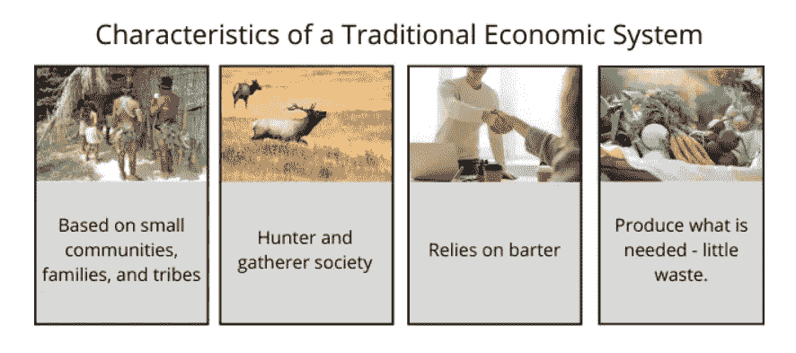
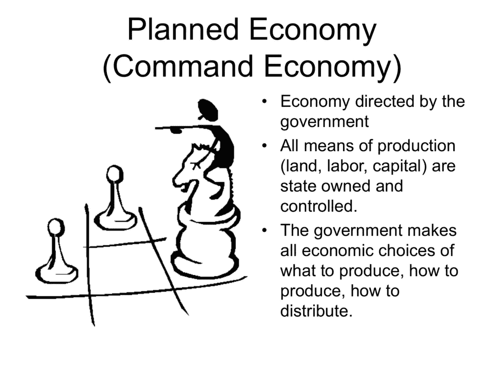
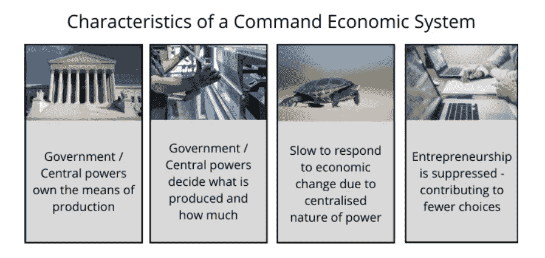
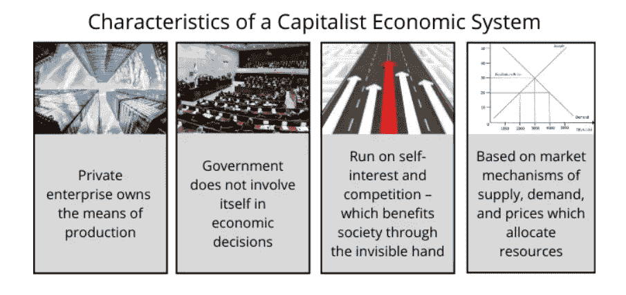
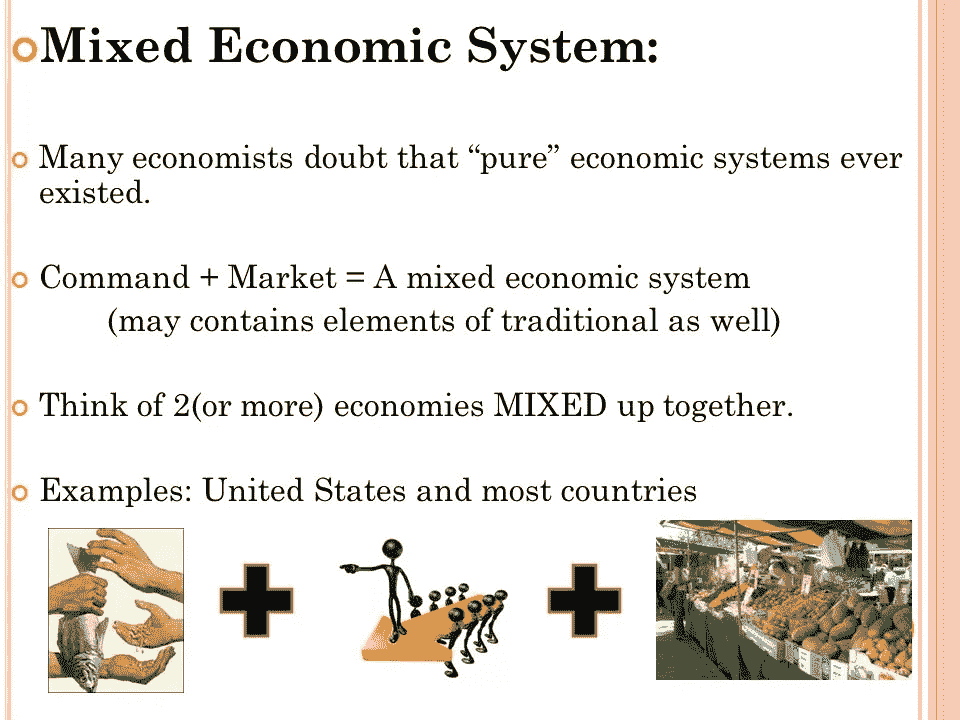
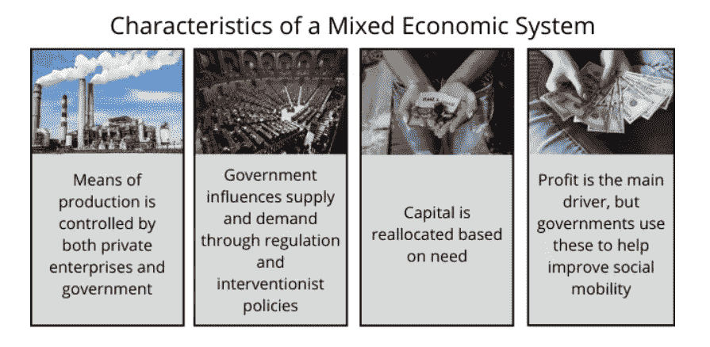
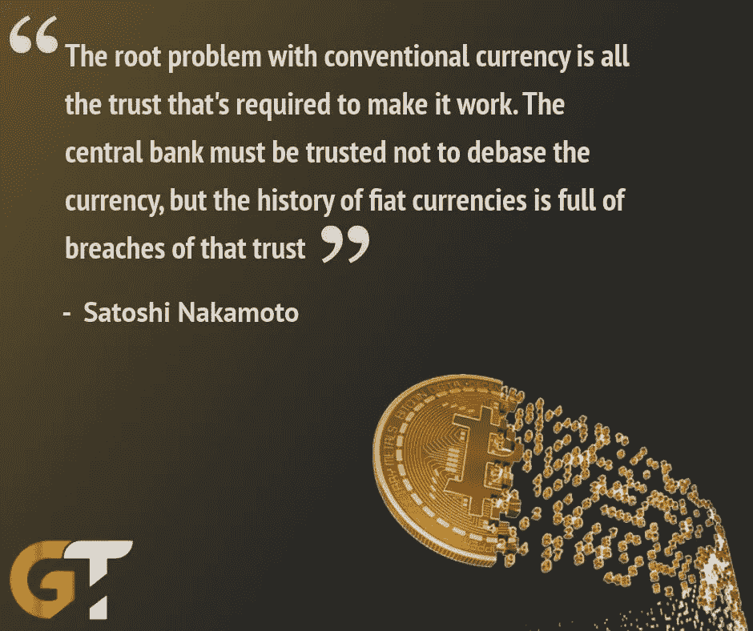
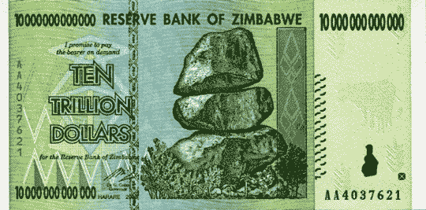
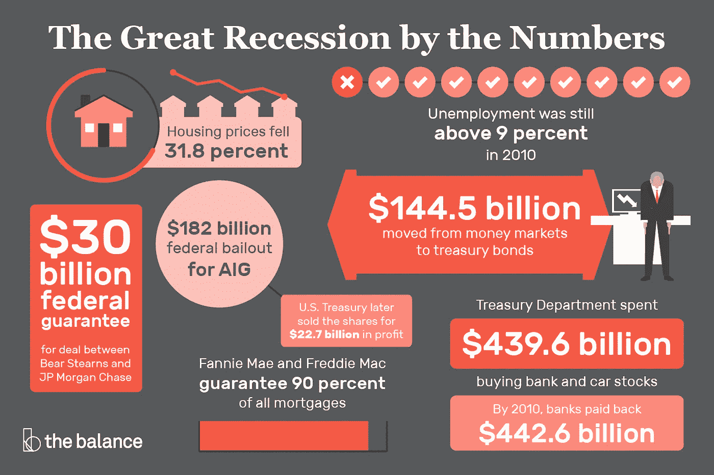
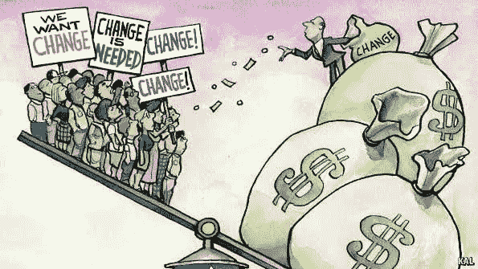

# 区块链博客 02:经济体系的故事

> 原文：<https://medium.com/coinmonks/blog-2-cryptocurrencies-is-it-needed-part-2-fa5a7b14e220?source=collection_archive---------3----------------------->

世界上的每个社会都面临着同样的基本问题，即如何以公平有效的方式将有限的资源分配给人们。纵观社会历史，不同的社会基于他们拥有的技术和工具以不同的方式处理这个问题。每个社会都有相似或不同的经济体系来处理经济问题。

在更深入地了解现代货币和加密货币之前，让我们试着了解一下我们目前所处的经济体系。如果你还没有读过之前关于我们如何从易货系统过渡到今天的法定货币的博客，请在这里阅读:[博客 01:加密货币，它是必需的吗？](https://aaklii.medium.com/blog-1-cryptocurrencies-is-it-needed-part-1-33d51eecd6fa)

# 经济系统

那么什么是**经济体系**？简而言之，经济体系是社会或政府在一个地理区域或国家组织和分配可用资源、服务和商品的手段。

**四种经济体系:**

世界上有多种类型的经济。每一种经济的运行都基于一套独特的条件和假设。经济体系可以分为四种主要类型:传统经济、指令经济、混合经济和市场经济。

**传统经济体系:**

传统经济以文化和仪式为基础，以整个社区为重点。每个人都努力工作，并从其他人的努力中受益。专注于自给农业和狩猎的小型社会被认为是传统经济。我们可以说过去的物物交换系统是这种经济的一部分。

**命令经济系统:**

指令经济依靠国王或政府做出所有的经济决策，包括分配资源和调节价格和工资。以前，当王国和帝国由君主统治时，我们可以说他们会遵循指令性经济体系，指令性经济的现代例子是朝鲜，在某种程度上也包括中国。

**市场经济体制:**

市场经济是由消费者驱动的，消费者的决定决定了工业和金融市场将如何运作。个人选择如何使用他们的资源，生产什么商品，提供什么服务，从事什么工作。在纯粹的市场经济中，没有政府的参与，正因为如此，我们今天没有真正的纯粹市场经济。我们可以说，今天不存在不受任何政府或中央银行系统控制的法定货币。

**混合经济体制:**

今天，大多数社会都有混合经济，利用有限的政府参与，同时也运用自由市场的概念。一个例子是美国。然而，几乎所有其他国家都是某种形式的混合经济，每个国家都是独特的，都面临着在消费者选择和政府控制之间找到适当平衡的挑战。

经济系统分为传统系统、指令系统、市场系统和混合系统。传统系统关注商品、服务和工作的基本要素，它们受到传统和信仰的影响。中央集权影响指挥系统，而市场系统控制供求力量。最后，混合经济是计划经济和市场经济的结合。所以在混合经济体系中，市场是由消费者驱动的，但我们使用的货币是由任何一个中央银行体系监管的。这就是加密货币开始出现的地方，中央系统的命令被取消，权力被交给市场和个人。

# 现有货币的问题？

在了解加密货币之前，了解现有货币的问题非常重要。货币的价值取决于它的总供应量。当我们谈论加密货币时，它变得更加重要。我们努力工作，为自己创造价值，通过对社会的贡献，我们赚钱谋生，过着辉煌的生活。我们目前使用的交换媒介是我们的法定货币。

法定货币是政府发行的货币，它不是由实物商品，如黄金或白银支持，而是由发行它的政府支持。法定货币的价值来源于供求关系和发行政府的稳定性，而不是支持它的商品的价值。

现在政府可以多印 100 到 1000 倍的纸币，而这正是你努力工作的结果。他们继续印更多，贬低你一生的工作。我们经历了像 2008 年那样的大繁荣，但仍然没有人对货币做任何事情。这正是 2008 年发生的事情。这位历史学家宣布了大衰退。人们对货币失去了信心。
**再比如:**津巴布韦储备银行
下面是津巴布韦 10 万亿美元纸币的图像。

2008 年的事情很可怕，政府不知道该做什么。于是他们开始了。所以他们开始大量印刷钞票。像津巴布韦这样的国家开始印更多的钱，炎症率是 98-100%
存了钱的老年人不得不回去工作，因为他们的储蓄毫无价值。年轻人没有就业。失业率为 40%

## 比特币的开端

2008 年的混乱时期导致了我们今天拥有的这种新的数字货币的最初产生。在经济衰退期间，黄金看起来比存在银行里的货币更安全。今天，许多人将比特币视为黄金。像黄金一样，比特币的供应量有限，不像纸币可以多次印刷。我们现有的货币可以贬值。更糟糕的是，在今天的许多国家，有钱人无法获得金钱。非洲只有 20%的人有银行账户。感谢上帝，三分之二的非洲人都有手机。加密货币不同于今天的货币，因为它们受数学的监管。

今天，42 个人控制的财富相当于世界上最贫穷的 50%的人。世界上最富有的 1%拥有世界上 82%的财富。亿万富翁们一直在最大化他们的财富，而贫富之间的不平等却在加剧。这与社会主义或资本主义无关，但这种财富不平等太极端了。尤其是当世界上有这么多的人仍然无法使用银行服务的时候。随着每个人长期获得这些加密货币，这种类型的资本主义可能会走到尽头。想象一下经济，这些加密货币是基于人们在经济系统中创造的价值而产生的。

**那么，加密货币是现代经济问题的解决方案吗？比特币真的是解决方案吗？从政府手中拿走货币发行权，建立市场经济体制，真的合适吗？**老实说，我们真的还不知道。我们仍在探索。如今，许多加密货币的创始人更年轻、更叛逆，并拥有这种“权力属于人民”的方法。他们会让全球加密货币流程对我们更加公平。与此同时，有许多因素影响着加密货币的流通，也有许多诈骗以首次发行硬币的名义在世界各地发生。许多真正的基于加密货币的解决方案被创建来解决各种类型的挑战。

在这个 2 月 28 日[的旅程中:区块链和加密货币研究博客](https://aaklii.medium.com/28days-of-february-blockchain-and-cryptocurrency-research-blogs-4b73c51ce3db) **，**我将每天发布一篇关于区块链和加密货币的博客，在这里我将努力保持不偏不倚。在这个系列中，我们将进一步探索加密货币的技术和经济方面。

***阅读下一部分:*** [区块链博客 03:区块链，为数据时代](https://aaklii.medium.com/blog-3-blockchain-for-the-data-age-b43e801a0e6e)

***全系列:*** [28 篇关于区块链和加密货币的博客](https://aaklii.medium.com/28days-of-february-blockchain-and-cryptocurrency-research-blogs-4b73c51ce3db)

> 加入 Coinmonks [电报频道](https://t.me/coincodecap)和 [Youtube 频道](https://www.youtube.com/c/coinmonks/videos)了解加密交易和投资

## 另外，阅读

*   [3 商业评论](/coinmonks/3commas-review-an-excellent-crypto-trading-bot-2020-1313a58bec92) | [Pionex 评论](https://coincodecap.com/pionex-review-exchange-with-crypto-trading-bot) | [Coinrule 评论](/coinmonks/coinrule-review-2021-a-beginner-friendly-crypto-trading-bot-daf0504848ba)
*   [莱杰 vs Ngrave](/coinmonks/ledger-vs-ngrave-zero-7e40f0c1d694) | [莱杰 nano s vs x](/coinmonks/ledger-nano-s-vs-x-battery-hardware-price-storage-59a6663fe3b0) | [币安评论](/coinmonks/binance-review-ee10d3bf3b6e)
*   [Bybit Exchange 审查](/coinmonks/bybit-exchange-review-dbd570019b71) | [Bityard 审查](https://coincodecap.com/bityard-reivew) | [Jet-Bot 审查](https://coincodecap.com/jet-bot-review)
*   [3 commas vs crypto hopper](/coinmonks/3commas-vs-pionex-vs-cryptohopper-best-crypto-bot-6a98d2baa203)|[赚取加密利息](/coinmonks/earn-crypto-interest-b10b810fdda3)
*   最好的比特币[硬件钱包](/coinmonks/hardware-wallets-dfa1211730c6) | [BitBox02 回顾](/coinmonks/bitbox02-review-your-swiss-bitcoin-hardware-wallet-c36c88fff29)
*   [BlockFi vs 摄氏度](/coinmonks/blockfi-vs-celsius-vs-hodlnaut-8a1cc8c26630) | [Hodlnaut 审核](/coinmonks/hodlnaut-review-best-way-to-hodl-is-to-earn-interest-on-your-bitcoin-6658a8c19edf) | [KuCoin 审核](https://coincodecap.com/kucoin-review)
*   [Bitsgap 审查](/coinmonks/bitsgap-review-a-crypto-trading-bot-that-makes-easy-money-a5d88a336df2) | [Quadency 审查](/coinmonks/quadency-review-a-crypto-trading-automation-platform-3068eaa374e1) | [Bitbns 审查](/coinmonks/bitbns-review-38256a07e161)
*   [密码本交易平台](/coinmonks/top-10-crypto-copy-trading-platforms-for-beginners-d0c37c7d698c) | [Coinmama 审核](/coinmonks/coinmama-review-ace5641bde6e)
*   [印度加密交易所](/coinmonks/bitcoin-exchange-in-india-7f1fe79715c9) | [比特币储蓄账户](/coinmonks/bitcoin-savings-account-e65b13f92451)
*   [Capital.com 评论](https://coincodecap.com/capital-com-review) | [香港的加密借贷平台](https://coincodecap.com/crypto-lending-hong-kong)
*   [如何在 Uniswap 上交换加密？](https://coincodecap.com/swap-crypto-on-uniswap) | [A-Ads 审查](https://coincodecap.com/a-ads-review)
*   [WazirX vs CoinDCX vs bit bns](/coinmonks/wazirx-vs-coindcx-vs-bitbns-149f4f19a2f1)|[block fi vs coin loan vs Nexo](/coinmonks/blockfi-vs-coinloan-vs-nexo-cb624635230d)
*   [本地比特币评论](/coinmonks/localbitcoins-review-6cc001c6ed56) | [加密货币储蓄账户](https://coincodecap.com/cryptocurrency-savings-accounts)
*   什么是融资融券交易
*   [支持卡审核](https://coincodecap.com/uphold-card-review) | [信任钱包 vs MetaMask](https://coincodecap.com/trust-wallet-vs-metamask)