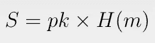
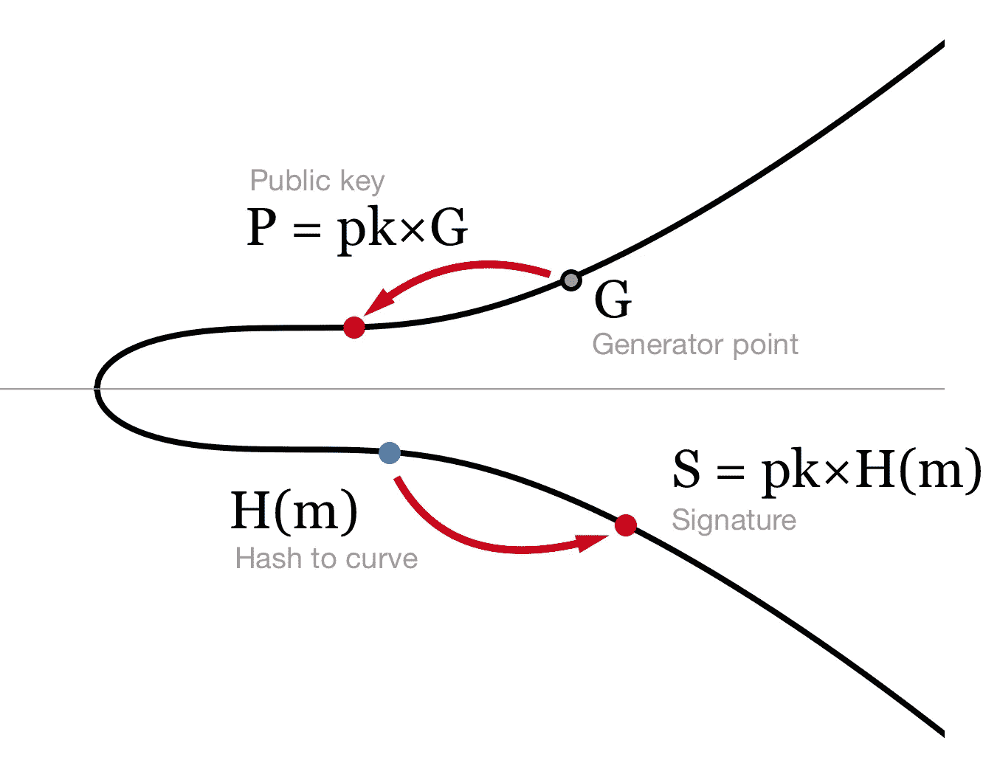
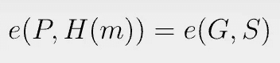
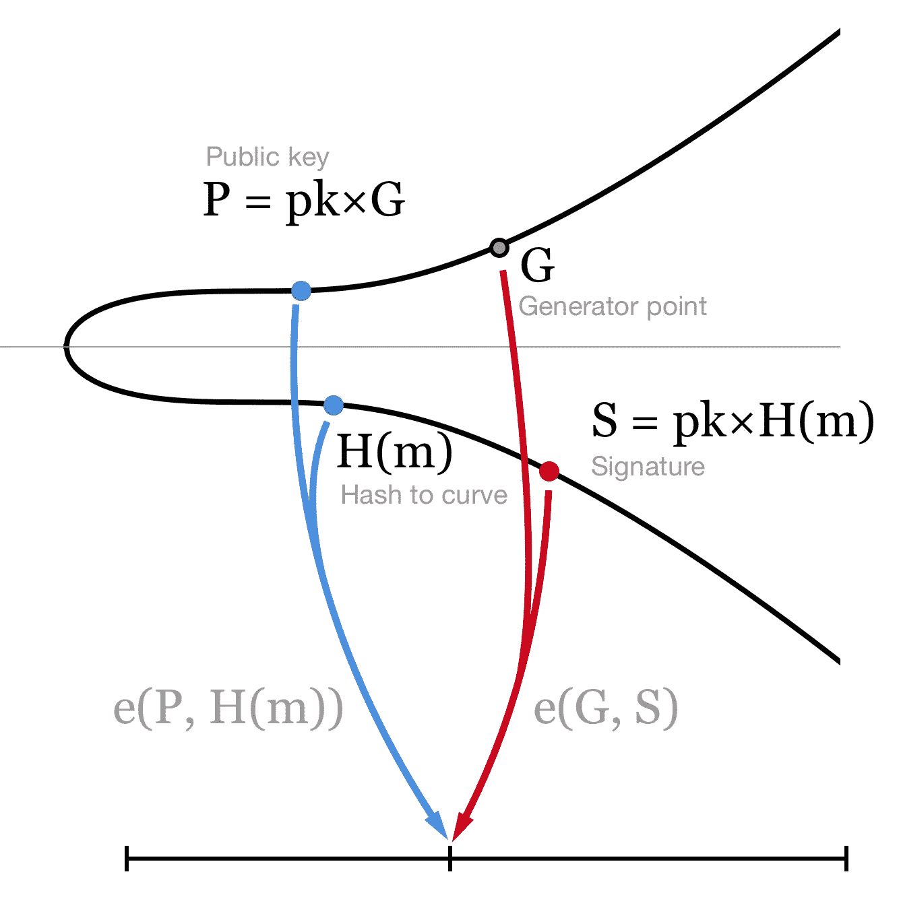
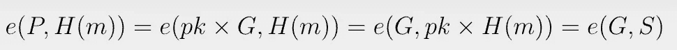

# 比特币上的 BLS 签名

> 原文：<https://medium.com/coinmonks/bls-signatures-on-bitcoin-fc837c799380?source=collection_archive---------10----------------------->

## 基于配对的密码学:第 2 部分

Boneh-Lynn-Shacham (BLS)是基于[双线性对](https://xiaohuiliu.medium.com/bilinear-pairings-on-bitcoin-57260fdbc81a)的签名方案。

与 [ECDSA](https://en.wikipedia.org/wiki/Elliptic_Curve_Digital_Signature_Algorithm) 或 [Schnorr](https://en.wikipedia.org/wiki/Schnorr_signature) 签名相比，它有几个显著的优势:

*   短 2 倍
*   对签名和密钥聚合友好
*   确定性:它不依赖于随机数生成器。

由于其最小的存储和带宽需求，它已经被多个区块链采用，如 Ethereum、Dfinity、Algorand 和 Chia。我们举例说明如何在比特币上实现它。

# BLS 签名:理论

## 散列到曲线:H(m)

在 ECDSA 中，消息 ***m*** 被散列成一个数字。在 BLS，我们把它散列到椭圆曲线上的一点。

一种简单的方法是对消息进行哈希运算，并将结果乘以生成点 ***G*** 得到一个曲线点。然而就是[不安全](https://crypto.stackexchange.com/questions/83981/mapping-the-hash-of-message-to-a-point-of-elliptic-curve-for-signature)。

为了安全地做到这一点，我们首先使用 SHA-256 对消息进行散列，并将 256 位的结果作为一个点的 x 坐标。如果曲线上不存在这样的点，我们增加 x 坐标并重试，直到找到第一个有效点。

## 符号

签约是小事。我们简单地相乘:

***pk*** 是私钥 ***m*** 是消息。注意不需要随机数。 ***S*** 只是一个曲线点，可以[压缩](https://bitcoin.stackexchange.com/questions/3059/what-is-a-compressed-bitcoin-key)到 33 字节，大约是 ECDSA 签名大小的一半。

[Signing](/cryptoadvance/bls-signatures-better-than-schnorr-5a7fe30ea716)

## 核实

为了验证签名，我们简单地比较两个配对:

[Verifying](/cryptoadvance/bls-signatures-better-than-schnorr-5a7fe30ea716)

要了解验证工作的原因，

双线性配对 ***e*** 允许我们将标量 ***pk*** 从第一个输入移动到第二个。

# 在比特币上实现

我们已经使用配对库实现了 BLS 签名验证。

注意我们让用户通过***y***-坐标直接验证，避免计算模平方根。

> 加入 Coinmonks [电报集团](https://t.me/joinchat/Trz8jaxd6xEsBI4p)，了解加密交易和投资

# 摘要

我们只演示了如何验证比特币上的单个 BLS 签名。BLS 的主要力量在于[聚合签名和密钥](/cryptoadvance/bls-signatures-better-than-schnorr-5a7fe30ea716)。我们将它们在比特币上的实现作为练习留给读者。

[1]这种方法被称为 Hash and Pray，它在非常数的时间内运行。恒定时间方法是存在的，例如 [Fouque 和 Tibouchi](https://link.springer.com/chapter/10.1007/978-3-642-33481-8_1) ，但是更难实现。

[2]为了便于说明，我们假设存在具有 x 坐标的曲线点。可以很容易地添加散列和祈祷方法。