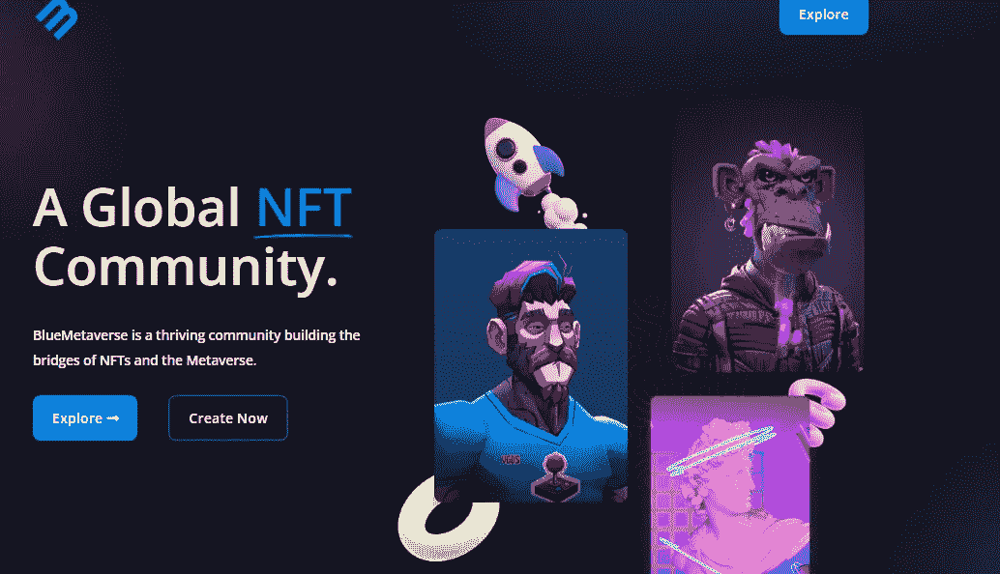

# Bluemetaverse 提供点对点工具，在 NFTs 和元宇宙之间架起桥梁

> 原文：<https://medium.com/coinmonks/bluemetaverse-offers-peer-to-peer-tools-that-bridge-nfts-with-the-metaverse-3255e91456c3?source=collection_archive---------45----------------------->



[https://bluemetaverse.io/](https://bluemetaverse.io/)

“元宇宙”一词不时出现在新闻中。尽管这种观念已经存在了六七年，但直到最近才成为热门话题。然而，非传染性疾病将对元宇宙产生重大影响。NFT 和元宇宙的迅速流行为创新者、企业家和商人创造了许多机会。

现有的社交网络和区块链平台阻止用户实现 NFT 技术和 Web 3.0 的全部潜力。 ***Bluemetaverse.io*** 的目标是建立一个 GameFi ***元宇宙生态系统*** 在其中任何用户都可以为自己的兴趣创造元世界。NFT 收藏家和艺术家将能够展示他们的作品，并开发 ***3D 市场***——品牌和影响者与观众互动的新方式。

# 为元宇宙设计的工具

以下是为元宇宙设计的四种工具。

***NFT 发射台:***

有必要利用这个程序在 Launchpad 上部署 Nfts 集合。NFT 是一种数字证书，可以帮助你证明你是网络世界中某样东西的所有者。

> ***NFT 代:——***用户可以借助这个工具制作数字杰作。
> 
> ***NFT 市场地点:——***任何人都可以浏览、购买、出售和拍卖非金融工具。

***NFT 交易:***

与其他收集器交换 NFT 是一个简单的过程。与普遍的看法相反，NFT 不仅仅是区块链上的数字艺术品或收藏品。他们远不止于此，因为每个人都配备了一份智能合同，从中可以得出他们的真正价值。

蓝色元宇宙是一个不可替代的代币(NFT)市场，在这里你可以找到独家的数字收藏品和不可替代的代币。

## **顶级类别:**

蓝色元宇宙提供艺术，视觉艺术和收藏品销售。创建和修改你的角色，与其他用户交谈，探索不断扩大的分散宇宙都是用户可以选择的。

***即将推出的项目:***

Bluemetaverse 的目标是很快推出两个新项目。

***梦想编织者:***

一个独特的创世纪系列描绘了女性和她们美丽的发型，她们穿越元宇宙寻找回家的路。

***元世界***

购买并开发元宇宙的虚拟土地，然后使用该区域来构建您的宇宙。

# 路标

***第一阶段:***

*   NFT 下降
*   NFT 发射台
*   NFT 市场
*   NFT 拍卖公司

***第二阶段:***

*   增强型市场
*   项目启动
*   视频游戏整合

***第三期:***

*   NFT 贸易
*   NFT 一代
*   NFT 游戏化
*   菲亚特实施

正如之前报道的那样，蓝精灵最近被发现是元宇宙宇宙的新统治者。

Bluemetaverse 是一个动态社区的一部分，它弥合了 NFTs 和元宇宙之间的差距。被称为共享流动性 NFT 市场智能合约的 ***Bluemeta*** 被多家网站用来为其访问者提供尽可能好的体验。

欲了解更多信息，请关注我们。

```
[**https://bluemetaverse.io/**](https://bluemetaverse.io/)
```

> 加入 Coinmonks [电报频道](https://t.me/coincodecap)和 [Youtube 频道](https://www.youtube.com/c/coinmonks/videos)了解加密交易和投资

# 另外，阅读

*   [印度的秘密税](https://coincodecap.com/crypto-tax-india) | [altFINS 审查](https://coincodecap.com/altfins-review) | [Prokey 审查](/coinmonks/prokey-review-26611173c13c)
*   [Blockfi vs 比特币基地](https://coincodecap.com/blockfi-vs-coinbase) | [BitKan 评论](https://coincodecap.com/bitkan-review) | [期货交易机器人](/coinmonks/futures-trading-bots-5a282ccee3f5)
*   [南非的加密交易所](https://coincodecap.com/crypto-exchanges-in-south-africa) | [BitMEX 加密信号](https://coincodecap.com/bitmex-crypto-signals)
*   如何在 WazirX 上购买柴犬(SHIB)硬币？
*   [MoonXBT 副本交易](https://coincodecap.com/moonxbt-copy-trading) | [阿联酋的加密钱包](https://coincodecap.com/crypto-wallets-in-uae)