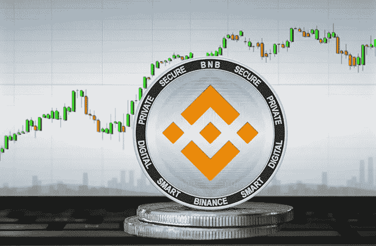

# BNB·普莱斯准备好打气筒，等着瞧吧！！！

> 原文：<https://medium.com/coinmonks/bnb-price-gets-ready-for-a-pump-see-when-72240308066c?source=collection_archive---------75----------------------->

为加密货币的崛起做准备似乎是不可能的，不幸的是，许多人购买了高估的硬币，看着他们的钱完全融化，这是很少有人掌握的解决方案，但我会告诉你你可以

BNB 在 2022 年完成了第二次自动焚烧，从流通中回收了 184 万枚 BNB 代币。此次交易令市场分析师兴奋不已，他们预测，随着交易所供应短缺加剧，BNB 价格将呈现看涨形态。

据分析师称，燃烧系统地减少了 BNB 的流通量，加剧了供应短缺。通常，平台上流通供应的减少会导致价格上涨。

此外，最近提交给泰国证券交易所的一份文件披露了海湾能源公司在 BNB 的投资。这家能源公司通过一家加密货币子公司购买了数量不详的 BNB，使其持有的资产多样化。

被称为“DaCryptoGeneral”的分析师指出，最近的下跌对 BNB 来说是一次健康的调整。

此外，他认为代币已经准备好进行下一次冲动的行动，对破碎的对称三角形的进一步测试可能会将代币带到 510 美元。

“价格走势仍然看涨，目前的下行走势是下一轮看涨走势的健康价格修正。我相信，多头的回归很有可能会让 BNB 回到 500 美元以上，”他说。

与此同时，被称为“AltcoinSherpa”的分析师认为，BNB 目前正处于积累阶段。因此，代币将准备好向上移动。

他指出:“我认为，BNB 在走出目前的交易区间后，会出现大幅上涨，这看起来像是市场的一个健康积累期。”

永远记住，许多的话从来不是你的，做你的分析，因为你是 100%负责你的投资，BNB 有一个很好的主张，已经是一个完全巩固的货币在市场上

观看每日货币图表，不要失去泵！

请关注我，获取更多像这样令人难以置信的内容，因为每一次鼓掌和点赞都有助于我继续为您提供最好的信息来源！

> 加入 Coinmonks [电报频道](https://t.me/coincodecap)和 [Youtube 频道](https://www.youtube.com/c/coinmonks/videos)了解加密交易和投资

# 另外，阅读

*   [AscendEx 保证金交易](https://coincodecap.com/ascendex-margin-trading) | [Bitfinex 赌注](https://coincodecap.com/bitfinex-staking) | [bitFlyer 评论](https://coincodecap.com/bitflyer-review)
*   [Bitget 回顾](https://coincodecap.com/bitget-review) | [双子座 vs BlockFi](https://coincodecap.com/gemini-vs-blockfi) cmd| [OKEx 期货交易](https://coincodecap.com/okex-futures-trading)
*   [AscendEx Staking](https://coincodecap.com/ascendex-staking)|[Bot Ocean Review](https://coincodecap.com/bot-ocean-review)|[最佳比特币钱包](https://coincodecap.com/bitcoin-wallets-india)
*   [霍比审核](https://coincodecap.com/huobi-review) | [OKEx 保证金交易](https://coincodecap.com/okex-margin-trading) | [期货交易](https://coincodecap.com/futures-trading)
*   [网格交易机器人](https://coincodecap.com/grid-trading) | [Cryptohopper 审查](/coinmonks/cryptohopper-review-a388ff5bae88) | [Bexplus 审查](https://coincodecap.com/bexplus-review)