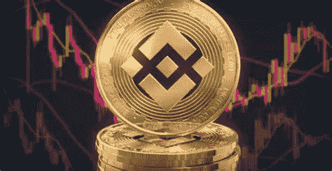

# BNB 价格预测——价格将飙升至 500 美元？

> 原文：<https://medium.com/coinmonks/bnb-price-prediction-price-will-boom-to-500-8d20f93237c4?source=collection_archive---------38----------------------->

Source photo [bnb — Bing images](https://www.bing.com/images/search?view=detailV2&ccid=p0qcau5M&id=53021C91CFFF11AFC3958713162390F1A21E9109&thid=OIP.p0qcau5Ma8p8E6CSKQT5BAHaD0&mediaurl=https%3a%2f%2fcoinpogo.com%2fwp-content%2fuploads%2fbfi_thumb%2f01_BNB-coin-with-trading-chart-in-the-background-6y1xjx6ub78l7mwtrhbjsah5b69idz044ms8ctwsnfk.jpg&cdnurl=https%3a%2f%2fth.bing.com%2fth%2fid%2fR.a74a9c6aee4c6bca7c13a0922904f904%3frik%3dCZEeovGQIxYThw%26pid%3dImgRaw%26r%3d0%26sres%3d1%26sresct%3d1%26srh%3d671%26srw%3d1300&exph=372&expw=720&q=bnb&simid=608018269590271535&FORM=IRPRST&ck=56D6617C875643A90C0D535EE5FE56A7&selectedIndex=8&ajaxhist=0&ajaxserp=0)

币安 2021 年 11 月 8 日，硬币价值达到 700 美元左右的峰值。然而，加密货币的下跌在此后不久发生，推动价格下跌。在 BNB 降价 50%后，一切都没有改变，这就是我们想要重新评估的原因。

加密货币市场似乎正在为另一轮牛市做准备，价格在过去七天里大幅上涨…