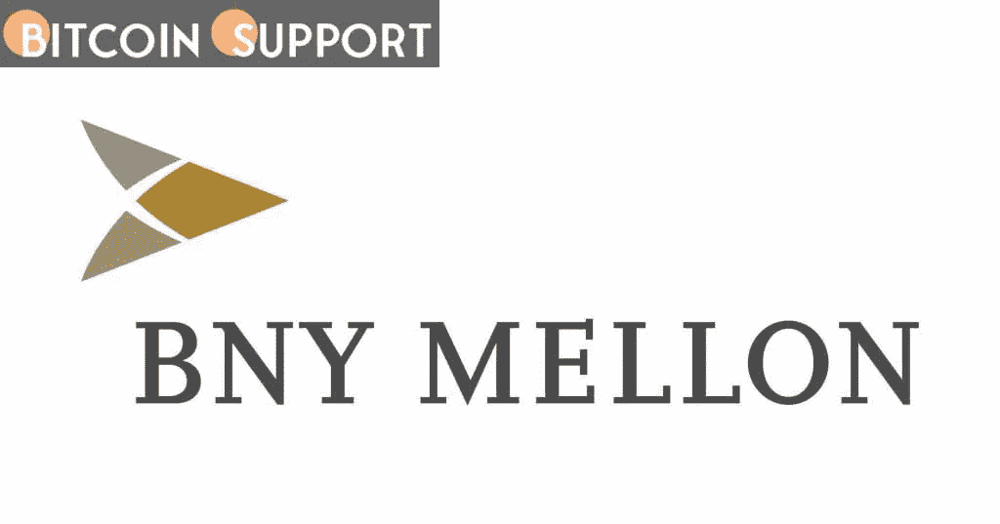

# BNY 梅隆大学打算在今年晚些时候创建一个数字资产托管平台。

> 原文：<https://medium.com/coinmonks/bny-mellon-intends-to-create-a-platform-for-digital-asset-custody-later-this-year-3f1eb1597401?source=collection_archive---------39----------------------->

**Visit our website:-** [**https://bitcoinsupports.com/**](https://bitcoinsupports.com/)

据报道，该投资银行将在美国开始运营，随后根据市场需求在全球扩张。

大型投资银行 BNY 梅隆公司正在为机构客户建立一个接触数字资产的平台。

根据 City A.M .的一份报告，客户将能够在由 Fireblocks 技术支持的 BNY 梅隆加密钱包中存储世界上最受欢迎的加密货币比特币(BTC)和以太网(ETH)。然而，一旦获得监管许可，该服务将逐步扩展，并纳入各种各样的令牌化传统和数字资产。

据投资银行称，新服务将于今年晚些时候推出。此外，BNY 梅隆大学表示，它将“率先加入”全球数字托管市场。文章称，梅隆大学的目标是先在美国起步，然后根据需求向全球扩张。这项服务在美国推出后，BNY 梅隆大学的 Talia Klein 预测它将扩展到英国。

***“我认为我们在英国看到的是，这里有一个非常活跃和活跃的数字资产市场。”***

去年 2 月，该行宣布计划作为资产管理人代表客户持有、转让和发行比特币和其他加密货币。BNY 梅隆和灰度投资于 2021 年 7 月宣布建立关系，为灰度的主要比特币投资产品提供一系列服务。

[https://twitter.com/aussieg7/status/1496192352196923392](https://twitter.com/aussieg7/status/1496192352196923392)

如前所述，BNY 梅隆公司已经与区块链数据和分析初创公司 chain analysis 合作，将 chain analysis 合规技术整合到其风险管理系统中。

**访问我们的网站:-**[**https://bitcoinsupports.com/**](https://bitcoinsupports.com/)

**免责声明:这些是作者的观点，不应被视为投资建议。读者应该自己做研究。**

> 加入 Coinmonks [电报频道](https://t.me/coincodecap)和 [Youtube 频道](https://www.youtube.com/c/coinmonks/videos)了解加密交易和投资

# 另外，阅读

*   [阿联酋 5 大最佳加密交易所](https://coincodecap.com/best-crypto-exchanges-in-uae) | [SimpleSwap 评论](https://coincodecap.com/simpleswap-review)
*   [购买 Dogecoin 的 7 种最佳方式](https://coincodecap.com/ways-to-buy-dogecoin) | [ZebPay 评论](https://coincodecap.com/zebpay-review)
*   [最佳期货交易信号](https://coincodecap.com/futures-trading-signals) | [流动性交易所评论](https://coincodecap.com/liquid-exchange-review)
*   [火币加密交易信号](https://coincodecap.com/huobi-crypto-trading-signals) | [Swapzone 审查](/coinmonks/swapzone-review-crypto-exchange-data-aggregator-e0ad78e55ed7)
*   最佳[密码交易机器人](https://coincodecap.com/best-crypto-trading-bots) | [购买索拉纳](https://coincodecap.com/buy-solana) | [矩阵导出评论](https://coincodecap.com/matrixport-review)
*   [Coldcard 评论](https://coincodecap.com/coldcard-review) | [BOXtradEX 评论](https://coincodecap.com/boxtradex-review)|[uni swap 指南](https://coincodecap.com/uniswap)
*   [比特币基地评论](/coinmonks/coinbase-review-6ef4e0f56064) | [德里比特评论](/coinmonks/deribit-review-options-fees-apis-and-testnet-2ca16c4bbdb2) | [FTX 评论](/coinmonks/ftx-crypto-exchange-review-53664ac1198f)
*   [n rave ZERO Review](/coinmonks/ngrave-zero-review-c465cf8307fc)|[phe MEX Review](/coinmonks/phemex-review-4cfba0b49e28)|[PrimeXBT Review](/coinmonks/primexbt-review-88e0815be858)