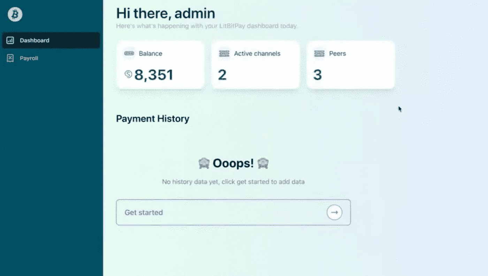

# 螺栓 11 开票

> 原文：<https://medium.com/coinmonks/bolt-11-invoicing-cfe178abb17c?source=collection_archive---------11----------------------->

> *闪电支付的发票协议*

## 什么是螺栓？

对于不同的闪电网络实现，如核心闪电(以前的 c-lightning)、艾克蕾尔、LND 和其他实现，它们需要就规范达成一致。[螺栓](https://github.com/lightning/bolts)(Lightning 技术基础)是定义所有 Lightning 实现通信和交互的协议规范的文档。

## 什么是 BOLT 11 发票？

与比特币网络不同，在比特币网络中，你生成一个地址，并与付款人共享该地址以发送资金，闪电网络使用一种不同的方法，付款人通过这种方法向收款人请求特定金额的发票(也称为付款请求)。由于闪电发票过期，付款需要在规定的时间内支付，并且同一张发票不应支付超过一次，因为第一次支付将已经向支付路线中的参与者泄露了秘密(前像)。 [BOLT 11](https://github.com/lightning/bolts/blob/master/11-payment-encoding.md) 发票规定了在闪电网络上完成支付所需的内容。发票使用 bech32 编码进行编码，这是一种能够检测错误的校验和算法。这并不是比特币领域首次使用这种算法。比特币改进协议( [BIP 173](https://github.com/bitcoin/bips/blob/master/bip-0173.mediawiki) )也使用相同的算法来编码高效的比特币地址格式。

## 我对 BOLT 11 发票的体验

我第一次为发票实现 BOLT 11 是在“[Shock the Web](https://bolt.fun/hackathons/shock-the-web)”BOLT 黑客马拉松期间，当时我和我的团队成员需要在 Lightning Network 上构建一个工资系统。该系统应该能够支付基于时间表(每小时，每天，每周等)的员工的节点。)为员工配置。我们的解决方案 [LitBit](https://github.com/Jeezman/LitBit) 在入职阶段请求员工的 invoice.macaroon 文件和节点 ID，然后使用 macaroon 文件代表员工生成发票，并自动结算生成的发票。这种方法是可行的，但是它要求雇主节点存储雇员的节点详细信息和凭证，这成为了一个隐私问题。更好的方法是使用 Keysend，这是有限制的，因为没有付款证明。

## 深入了解 BOLT 11 发票

检查发票时，您会注意到它由不同的部分组成，包括人类可读的前缀(即人类可以浏览并提取信息的部分)和用于编码完成支付所需信息的数据部分。下面是摘自[掌握闪电网](https://github.com/lnbook/lnbook)的真实发票

lnbc 2500 u 1 pvjlue zpp 5 qqqsyqcyq 5 rqwzqfqyqcyq 5 rqwzqfqqyqcyq 5 rqwzqfqypqdq 5 xysxatsyp 7 en XV 4 jsxqzpuzptrnwng Zn 3 kdz w5 hyd lzf 03 qdg m2 hdq 27 CQ v3 agm 2 awz 5s e 903 vruatfhq 77 w3l S4 EVS 3 ch 9 zw 97j 25 emudup

前四个字符(lnbc)表示闪电网络(mainnet、testnet 等。)，后面是金额，2500，那么“u”代表微比特币单位，乘数为 0.000001。数据段的下一部分有 3 个部分，即:时间戳、标记的键-值对和使用 bech32 编码的整个发票的签名，用于良好的纠错。

## 螺栓 11 发票缺点

发票方法的一个显著缺点是，对于每笔发票付款，收款人总是需要一个媒介或渠道来与付款人沟通。在某些情况下，这可能是困难的或者不可能的，例如当接收者不知道发送者是谁或者甚至不知道是否有发送者时的在线捐赠。此外，支付发票包含关于收款人节点的信息，这对其隐私有负面影响。

## 螺栓 11 得到了改进

尽管 BOLT 11 规定了如何使用支付发票进行支付，但它有一些限制，这导致了已经在 Core Lightning 中实现的 [BOLT 12](https://bolt12.org/) 。BOLT 12 使用的是“offer”，可以是静态的，也可以是可重用的。BOLT 11 的另一个增强是 [LNURL](https://github.com/fiatjaf/lnurl-rfc) ，这是一套标准，将这些带外交互进行了编码和标准化，以便钱包和其他应用程序可以实现它们并实现互操作(根据[advancingbitcoin.com 博客](https://www.advancingbitcoin.com/blog/lnurl/#:: text=is%20a%20set%20of 20them%20so%20that%20wallets%20and%20other%20apps%20can%20implement%20them%20and%20be%20interoperable))。

## 结论

BOLT 11 发票指定了在闪电网络上完成支付所需的内容。该发票由接收方构建，包含金额、付款单位、接收方节点等信息。其中一些数据是人类可读的，而其他字段则用 bech32 编码。发送者和接收者之间需要存在通信信道的事实对于 BOLT 11 发票来说是一个主要的挑战。BOLT11 发票还有其他选择，如 BOLT12 报价、LNURL 和 Keysend。

希望这有助于理解 BOLT 11 发票。如果你觉得这篇文章有用，请分享给你在脸书和推特上的朋友！

# 另外，阅读

*   [CoinDCX 评论](/coinmonks/coindcx-review-8444db3621a2) | [加密保证金交易交易所](https://coincodecap.com/crypto-margin-trading-exchanges)
*   [红狗赌场评论](https://coincodecap.com/red-dog-casino-review) | [Swyftx 评论](https://coincodecap.com/swyftx-review) | [CoinGate 评论](https://coincodecap.com/coingate-review)
*   [Bookmap 评论](https://coincodecap.com/bookmap-review-2021-best-trading-software) | [美国 5 大最佳加密交易所](https://coincodecap.com/crypto-exchange-usa)
*   [如何在 FTX 交易所交易期货](https://coincodecap.com/ftx-futures-trading) | [OKEx vs 币安](https://coincodecap.com/okex-vs-binance)
*   [CoinLoan 评论](https://coincodecap.com/coinloan-review) | [YouHodler 评论](/coinmonks/youhodler-4-easy-ways-to-make-money-98969b9689f2) | [BlockFi 评论](https://coincodecap.com/blockfi-review)
*   [XT.COM 评论](https://coincodecap.com/profittradingapp-for-binance)币安评论 |