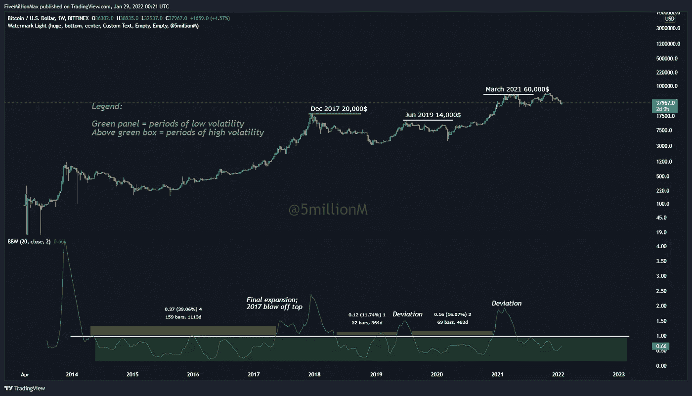
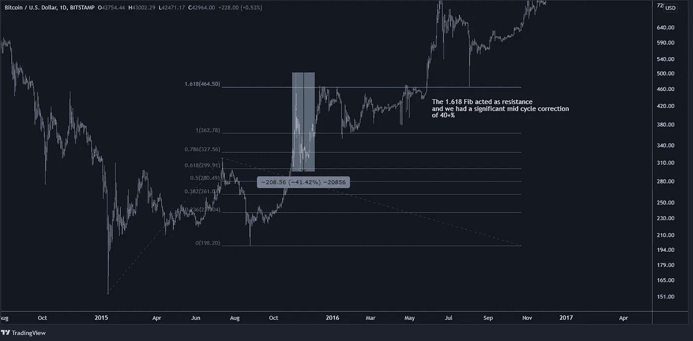
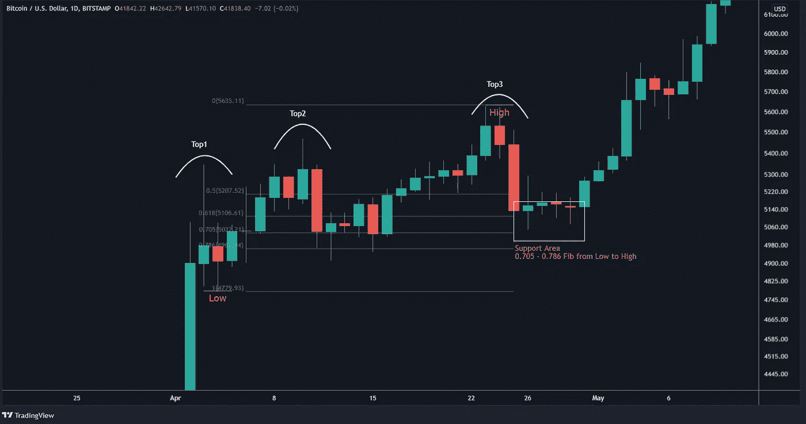
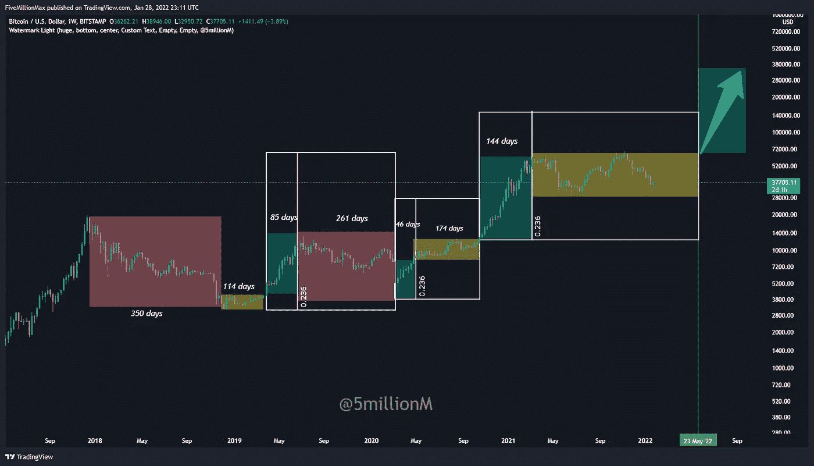
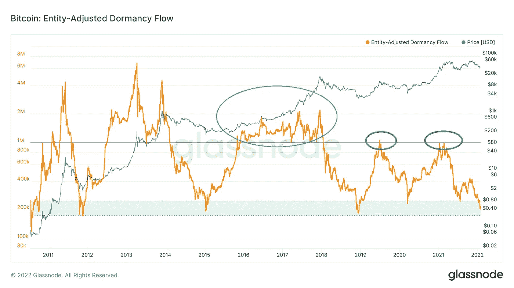
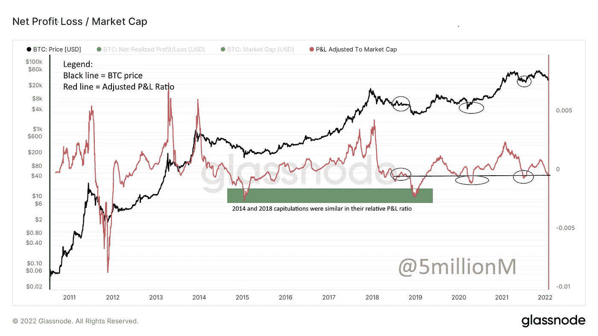
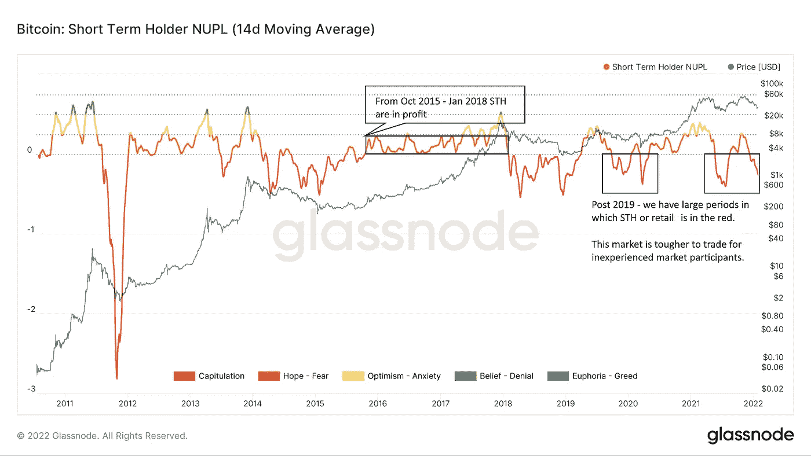

# 繁荣-萧条周期？再想想。

> 原文：<https://medium.com/coinmonks/boom-bust-cycle-think-again-dd300399f8ef?source=collection_archive---------5----------------------->

## 或者说这次的比特币市场周期与之前的有何不同。

如果我们评估价格行为，花足够的时间看图表，我们会发现许多重复的模式。这是有道理的——人类的心理没有改变，我们仍然会经历恐惧、贪婪和其他强烈的情绪，这些情绪会影响我们的财务决策。在图表上留下标记的决定——上涨的冲动波，大规模修正，积累和分配的时间。

也就是说，细微的差别会造成很大的不同。以至于区分了胜利者和失败者。在这篇文章中，我将阐述我的观点，并详细解释为什么我发现这个牛市在许多方面、形状和形式上都与之前的不同。

关键区别——这个周期更长，由大趋势中的小牛市周期组成，具有更高的波动性，例如更深/更长的修正和更陡峭的上行。

出于分析目的，我们将讨论的主题分为两类:

*   技术分析和指标
*   链上数据
*   回溯测试以及我们应该如何调整它

你听说过比特币市场的波动性随着时间的推移而降低这句话吗？是的，暂时忘掉它，因为我们现在看到的是在每个方向都比以前的市场周期更加繁荣。

让我们一起探索吧！

**技术分析和指标**

1.布林线宽度或波动性在当前和之前周期中的表现

Figure 1 : Bollinger Band Width and measured volatility

请注意绿色面板。白线以上的一切都是高波动性，正如你所注意到的，2017 年我们只有大约 6 个月的短暂时间，价格最终向上扩张。或者用数字说话——在 2014 年至 2017 年期间，我们有大约 1113 天的价格从未超过该水平。回到当前的画面，我们已经有过两次实例-在 2019 年 6 月和 2021 年 3 月，当时价格突破了那个水平。

2.1.618 斐波纳契曲线以及如何在当前周期中调整它

如果你还记得我以前的文章[你可能忽略的 5 种比特币模式](/me/stats/post/cc58bf5560f0)，我已经解释了 1.618 的 Fib 水平以及它在 2017 年抛物线运行中的重要影响。

让我们快速看一下:

Figure 2 : The importance of the 1.618 Fibonacci level

简而言之，2017 年的每一次(除了在 20，000 美元的最后一次突破)，我们都在 1.618 fib 面临阻力，随后是 30-40%的抛售和整合时间，这为价格在继续上涨之前提供了反弹空间。

2019 年后我们会看到什么？现在，正如 2020 年 3 月、2021 年 6 月、2022 年 1 月所经历的那样，在宏观牛市趋势中出现 50%以上的修正是正常的。虽然价格仍然尊重 1.618 的 Fib 水平，但我们通常不会在那里巩固或修正太多。相反，我们有一个我喜欢称之为前三名的市场结构。Top3 是一个连续 3 个局部顶部的看涨累积，其间的价格差异非常小。调整确实会发生，但幅度较小——20%—25 %,而且在下一轮上涨之前，盘整通常会持续 30 天左右。这比我们在 2017 年看到的要快得多。快速波动的市场是艰难而邪恶的——大多数参与者都以亏损告终，损失惨重。

简而言之——在上升过程中，我们以较小的修正快速前进。在下跌过程中——我们得到了 50%以上的恶性修正。在 2014—2017 年周期中，情况并非如此。

Figure 3 : The infamous top3 formation

说到小周期、斐波纳契比率、前三名形态和盘整期，我还想包括一些我们在之前的周期中没有看到的东西:

3.价格就是时间！或者说冲动波和矫正波是如何一起形成搞笑比例的。

Figure 4 : Time is price

为了更好地理解图 4，我创建了一个带有简短解释的图例:

**图例:**

绿色方框=冲动式波浪上涨/迷你牛市

黄色方框=看涨盘整/累积

红框=矫正波。与黄框不同，我们的市场结构发生了变化，高点和低点越来越低

白盒=花费的总时间(脉冲波上升+校正)

我的论点是，每一波上涨都有一个修正运动/看涨盘整波。两者形成一个白盒，是两者花费时间的总和。当花在绿框中的天数占总总花费天数的 0.236 时，另一波上涨就来了。

我们以 2019 年 4-6 月为例—绿框(冲高)= 85 天，红框(矫正波)= 261 天或总共 346 天。花在绿框中的时间是 85 / 346，或者非常接近 0.236 斐波纳契水平。我们可以在 2020 年 3 月至 10 月和当前的市场结构中反复找到相同的模式。

与红盒子不同，黄盒子没有市场结构的变化，例如，较低的高点和较低的低点。这是一个波动性较低(冷却)的时期，价格需要时间来恢复，然后才会再次上涨。这是看涨的，因为价格不可能永远向上移动，趋势需要先冷却和重置。

那么我们还能得出什么结论呢？好吧，我相信既然这个市场周期与其他周期如此不同，我们可以独立于以前的周期来看一些连锁和 PA 行为。让我们看一看。

**On-chain data 这次描绘了一幅不同的画面。**

Figure 5 : Entity- Adjusted Dormancy Flow

休眠指的是自上次在事务中使用以来所花费的时间。休眠流量是当前市场资本总额与以美元衡量的年度休眠值的比率。或者用外行的话来说:绿色区域是指聪明的资金从愚蠢的资金和恐慌的卖家手中拿走廉价的硬币。但这不是我想在这里讨论的。相反，我想指出每次我们如何在 1.0 水平面临阻力——外科手术般的精确度，分别在 2019 年和 2021 年达到 14，000 美元和 60，000 美元的顶部。注意这个指标在 2017 年牛市(蓝圈)期间的反应有多么不同。对于普通市场参与者来说，保持盈利要容易得多，也安全得多。还不信服？查看下图:

Figure 6 : Profit & Loss Indicator Adjusted to the total Bitcoin Market Cap

在图 6 中，我们找到了另一种方法来探索当前市场和之前市场之间的差异，这就是我创建的调整后损益指标。它实际上是以美元计算的总盈亏额，然后除以比特币的总市值。

通过这种方式，我们可以得到一个指标，显示利润/损失金额占市值的比例。随着 BTC 价格的上涨，市值也会上涨。亏损和盈利的总净额将会增加，但它不能充分反映局部高点和低点时的痛苦/兴奋。从 300 美元到 150 美元的 50%损失与从 6，400 美元到 3，200 美元的损失是一样的。如果我们从绝对数量上来看这两个事件，第二个事件似乎对网络有更大的负面影响。这不一定是事实。

正如所见，2014 年 150 美元投降期间的痛苦程度与我们在 2018 年 12 月经历的非常相似，尽管价格高出约 20 倍。与 2017 年相比，我们也在以更快、更陡的速度前进。

Figure 7: Short Term Holder Net Unrealized Profit / Loss (14 Moving Average)

最后，如图 7 所示——不像上一个周期，我们有超过 2 年的短期持有者交易获利，这一次他们花了大量的时间在赤字上。这是有道理的——市场更快，更不稳定，因此——更难解读和交易。

到目前为止我们可以得出的结论:

嗯，有几个。首先，我们在大多数在链和 TA 指标上都处于超卖区域，同时在较高的时间框架内保持看涨的市场结构。根据我的分析，这表明在 2022 年的 Q2 会有进一步的上升趋势(图 4)。

第二个结论是，总体而言，市场波动更大，速度更快，这让短期持有者和新的市场参与者受益匪浅。

第三，我之前的文章中也提到过:[‘我他妈的不会走的！’](/coinmonks/i-am-not-f-ing-leaving-53f984176e26)、我们正在追随 90 年代互联网普及的足迹。你会看到越来越多的国家、州和地区接受比特币，并努力使其成为合法货币。结合长期的链上数据，如新的活跃地址、散列率和其他数据，我相信比特币网络的增长将继续扩大。从长远来看，这当然会对价格上涨产生有利影响。

最后但同样重要的一点是，两个周期的差异会显著影响某些交易策略的盈利能力(ROI)。由于比特币的交易历史很短，很多策略都是在大约 10 年的整个交易期间进行回溯测试的。我肯定会调整我更重视最近的历史-2019 年后的数据，因为市场表现与之前非常不同。

也就是说，请始终尽职尽责。

> 免责声明:
> 
> 以上分享的内容不是理财建议。
> 
> 这篇文章重点介绍了我感兴趣的一些模式和工具，仅供娱乐之用。

> 加入 Coinmonks [电报频道](https://t.me/coincodecap)和 [Youtube 频道](https://www.youtube.com/c/coinmonks/videos)了解加密交易和投资

## 也阅读

 [## 杠杆代币[多头代币]终极指南

### 杠杆化令牌是具有杠杆化风险敞口的 ERC20 令牌，不考虑保证金、要求、管理…

medium.com](/coinmonks/leveraged-token-3f5257808b22)  [## 最佳加密交易所| 2022 年十大加密货币交易所| CoinCodeCap

### 哪一个是最好的加密交换？在本文中，我们将根据多种加密货币列出 10 大加密货币交易所

coincodecap.com](https://coincodecap.com/crypto-exchange)  [## 2022 年最佳加密交换平台| CoinCodeCap

### 随着时间的推移，我们大多数人将转向 dex 以获得更好的安全性和隐私。因此。在这里，我们将讨论…

coincodecap.com](https://coincodecap.com/best-swap-platforms)  [## 10 大最佳在线赌场|赢得并赢取免费 BTC 2022 | CoinCodeCap

### 接收、支付和赚取加密货币| |有各种各样的最佳在线赌场可供选择，有可能…

coincodecap.com](https://coincodecap.com/best-online-casinos)  [## 2021 年最佳加密借贷平台| 6 大比特币借贷平台

### 获得比特币和其他加密货币的最佳贷款利率

medium.com](/coinmonks/top-5-crypto-lending-platforms-in-2020-that-you-need-to-know-a1b675cec3fa)  [## 2021 年 6 大最佳硬件钱包|顶级加密硬件钱包[更新]

### 最好的加密货币硬件钱包是绝对必要的。我们将在 NGRAVE、Ledger Nano X 和…

medium.com](/coinmonks/the-best-cryptocurrency-hardware-wallets-of-2020-e28b1c124069)  [## 加密交易机器人——19 款最佳免费加密交易机器人

### 2022 年币安、比特币基地、库币和其他密码交易所的最佳密码交易机器人。四进制，位间隙…

medium.com](/coinmonks/crypto-trading-bot-c2ffce8acb2a)  [## 最佳 4 个加密交易信号电报通道

### 这是乏味的找到正确的加密交易信号提供商。因此，在本文中，我们将讨论最好的…

medium.com](/coinmonks/best-crypto-signals-telegram-5785cdbc4b2b)