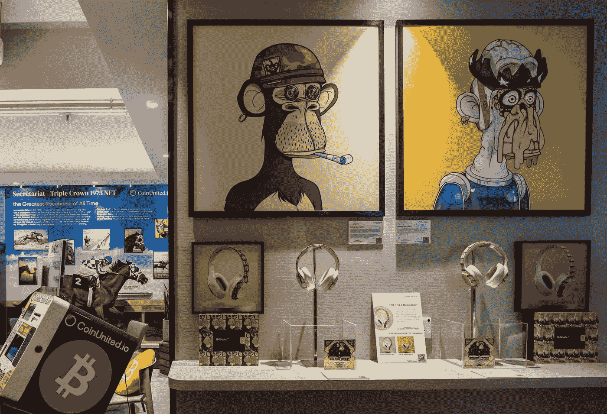

# 无聊的猿元宇宙巨星筹集 3.2 亿美元，坠毁以太坊

> 原文：<https://medium.com/coinmonks/bored-ape-metaverse-superstar-raises-320-million-crashes-ethereum-806eca7b59cc?source=collection_archive---------13----------------------->

“宇迦实验室的虚拟土地销售引发了以太坊交易费用的最高上涨，”吴京说

The physical artwork of “Bored Ape #2967” created by Bored Ape Yacht Club, left, and “Mutant Ape #1933” created by Mutant Ape Yacht Club, both available for sale as an NFT, displayed at a CoinUnited cryptocurrency exchange in Hong Kong. Source: Bloomberg

在一个投资者正在寻求进入虚拟房地产游戏的市场中，宇迦实验室，受欢迎的 Bored Apes 游艇俱乐部不可替代令牌(NFTs)集合的创造者，于周六推出了一项销售虚拟土地的销售…