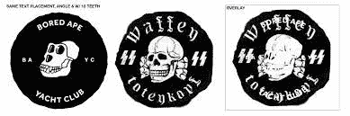
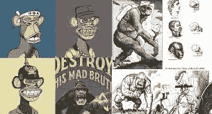

# 无聊的猿纳粹俱乐部:疯狂的阴谋还是真理之环？

> 原文：<https://medium.com/coinmonks/bored-ape-nazi-club-wild-conspiracy-or-a-ring-of-truth-b6f6d2f9b90f?source=collection_archive---------10----------------------->

YouTube:[https://www.youtube.com/channel/UCWJKTKtXt-R392QaIg7eEkw](https://www.youtube.com/channel/UCWJKTKtXt-R392QaIg7eEkw)
不和:[https://discord.gg/J73qhkj7kr](https://discord.gg/J73qhkj7kr)推特:[https://twitter.com/CryptoverseDAO](https://twitter.com/CryptoverseDAO)Linktree:[https://linktr.ee/cryptoversedao](https://linktr.ee/cryptoversedao)

最近一个名为“无聊的猿纳粹俱乐部”的视频对同名的标志性 NFT 系列进行了严厉的探索。

YouTuber Phillion 强调了明显的象征意义和与另类右翼意识形态的联系如何让许多人相信，无聊猿游艇俱乐部 NFT 收藏背后的实体——宇迦实验室——正在有意用纳粹肖像和修辞取代该项目——从艺术、隐藏在 AR 任务中的数据和创始人自己的斑点历史中。

如果得到证实，这将会多么令人震惊？

看起来这段视频中的许多联系都是一种延伸——但它们建立在似乎有些坚实的调查报道的基础上。

这个项目被描述成充满了神秘和另类的象征，符合 4Chan 提倡无需任何责任的华丽辞藻的精神。

然而，就像他一开始指出的，需要多少巧合？
在你到达临界点之前，你需要建立多少联系？似乎很难对许多指控做出合理的解释。

ICYMI 这里是视频:

 [## 无聊的猿 YC 种族主义指控继续作为推特收集证据

### 就在几天前，Phunks 创意总监赖德·瑞普斯指责 BAYC 种族主义和支持 alt-right 符号…

nftevening.com](https://nftevening.com/bored-ape-yc-racism-accusations-continue-as-twitter-gathers-evidence/) 

它们可能是精神体操，但它们数量众多，而且足够频繁，以至于需要问一些棘手的问题。许多参考 18 & 44，德国死亡小队，纳粹象征主义等等——所有这些都可以很容易地被记录为一个巧合闯入可信的否认领域。

这绝对是一个重磅炸弹，它在震惊了加密社区几天的 [@adyingnobody](http://twitter.com/adyingnobody) 声明后不久就袭击了我们。一些人认为这只不过是另一个高冲击值的骗局，目的是在熊市期间搅动局面，在 BAYC 周围制造轰动，而另一些人则认为这是火山爆发，将扰乱已经深度熊市的市场。

这似乎只是那些两极化的叙述之一。对一些人来说，这只是确认他们已经知道的事实。对其他人来说，这是能想象到的最古怪的事情。当谈到这种阴谋时，这里有一个很好的试金石:你相信的一半可能是假的，你相信它只是因为你已经开始相信了。另一半，你认为不是真的，可能有一些理由，但你没有所有的信息。

> 加入 Coinmonks [电报频道](https://t.me/coincodecap)和 [Youtube 频道](https://www.youtube.com/c/coinmonks/videos)了解加密交易和投资

# 另外，阅读

*   [分散交易所](https://coincodecap.com/what-are-decentralized-exchanges) | [比特 FIP](https://coincodecap.com/bitbns-fip) | [宾邦评论](https://coincodecap.com/bingbon-review)
*   [用信用卡购买密码的 10 个最佳地点](https://coincodecap.com/buy-crypto-with-credit-card)
*   [加拿大最佳加密交易机器人](https://coincodecap.com/5-best-crypto-trading-bots-in-canada) | [Bybit vs 币安](https://coincodecap.com/bybit-binance-moonxbt)
*   [阿联酋 5 大最佳加密交易所](https://coincodecap.com/best-crypto-exchanges-in-uae) | [SimpleSwap 评论](https://coincodecap.com/simpleswap-review)
*   [购买 Dogecoin 的 7 种最佳方式](https://coincodecap.com/ways-to-buy-dogecoin) | [ZebPay 评论](https://coincodecap.com/zebpay-review)
*   [最佳期货交易信号](https://coincodecap.com/futures-trading-signals) | [流动性交易所评论](https://coincodecap.com/liquid-exchange-review)