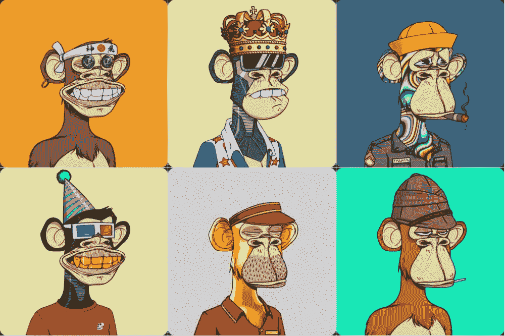
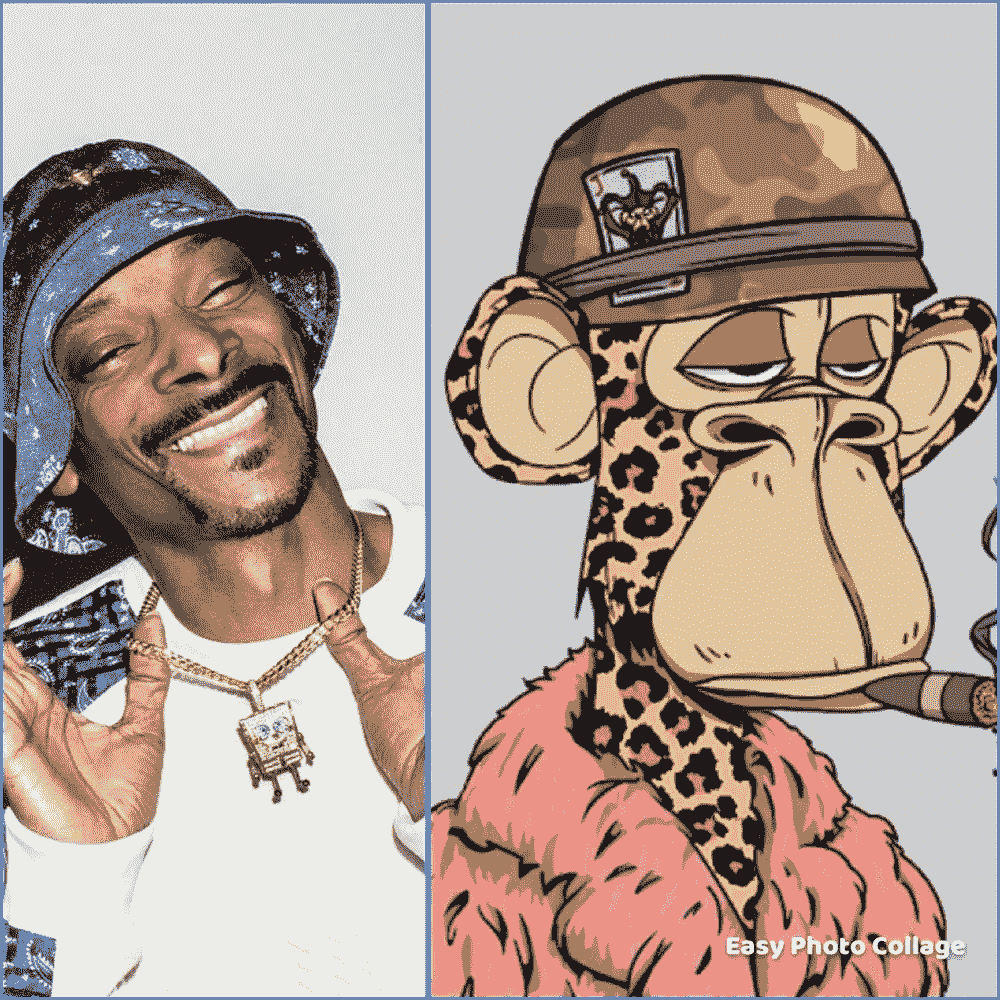
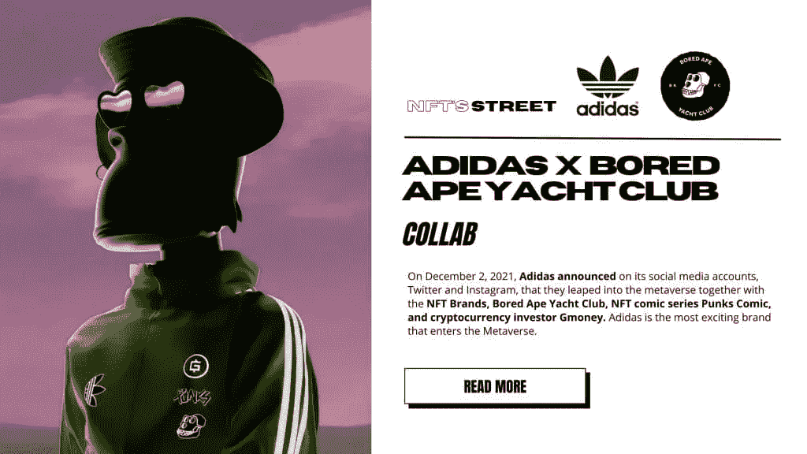
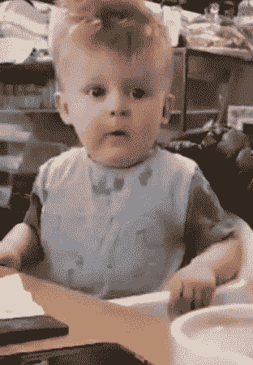
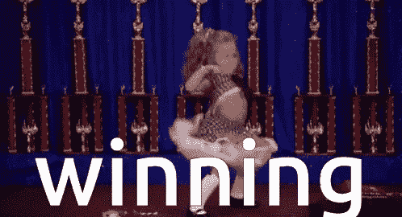

# NFT 无聊猿游艇俱乐部

> 原文：<https://medium.com/coinmonks/bored-ape-yacht-club-bayc-nft-9a0e9fc906b?source=collection_archive---------52----------------------->

你好！我今天要介绍的 NFT 是最近的一种潮流——猴子 NFT！

*如果你去过 NFT 或者对它感兴趣，这个 NFT 非常有名，你肯定会知道🐵*

## 无聊的猿猴

From NFT Culture

这家名为无聊猿游艇俱乐部的 NFT 于 2021 年开始流行起来。

它在名为 OpenSea 的 NFT 市场上市，是以太坊区块链基地。

正如你所看到的，猴子的脸上装饰着各种各样的衣服和饰品，这是一个典型的 NFT。

许多名人，包括贾斯汀比伯和史努比·道格，也因为大量投资而变得更加出名。

By Leah Bitsky on Page Six

By swensonk7 on The Bored Ape Gazette

最近他们甚至和阿迪达斯合作了！

By NFT’S STREET

目前价格通常在 152 ETH 左右，在韩国飙升到差不多 8 亿韩元！

from Pinterest

那么，这只猴子为什么这么出名呢？

除了有一个概念清晰、形象鲜明的 NFT 形象为人们所喜闻乐见之外，他们还有一个独特的不同之处。

## 差异

图片只是跟随，NFT 业主享有特权！​

🌟首先，无聊猿社区只对 NFT 的主人开放。

这个社区主要是通过不和谐来活跃的。通过限制这个不和谐的社区，只有 NFT 业主可以参与。​

🌟第二个好处是它不仅允许拥有 NFTs，还允许商业使用。

这意味着我可以自由地用这个 NFT 赚钱了！​

GIF from Tenor

这就是为什么它击败了血腥的 NFT 竞争成为第一！

> 今天无聊猿的故事怎么样？
> 
> 希望你收到了一些有用的信息，哈哈。
> 
> 随时欢迎关于无聊猿 NFT 和其他 NFT 的讨论和问题！
> 
> 祝你今天过得愉快！
> 
> 如果你有更多的问题或想获得硬币相关的信息，请随时来和我们下面的社区交谈。:)
> 
> 推特:【https://twitter.com/el_coinmonster 
> 
> 然后，下一个故事再见！

> 加入 Coinmonks [电报频道](https://t.me/coincodecap)和 [Youtube 频道](https://www.youtube.com/c/coinmonks/videos)了解加密交易和投资

# 另外，阅读

*   [5 款最佳加密交易终端](https://coincodecap.com/crypto-trading-terminals) | [最佳 DeFi 应用](https://coincodecap.com/best-defi-apps)
*   [比特币基地 vs 瓦济克斯](https://coincodecap.com/coinbase-vs-wazirx) | [比特鲁点评](https://coincodecap.com/bitrue-review) | [波洛涅克斯 vs 比特鲁](https://coincodecap.com/poloniex-vs-bittrex)
*   [德国最佳加密交易所](https://coincodecap.com/crypto-exchanges-in-germany) | [Arbitrum:第二层解决方案](https://coincodecap.com/arbitrum)
*   [币安交易机器人](/coinmonks/binance-trading-bots-d0d57bb62c4c) | [OKEx 评论](/coinmonks/okex-review-6b369304110f) | [阿塔尼评论](https://coincodecap.com/atani-review)
*   [最佳加密交易信号电报](/coinmonks/best-crypto-signals-telegram-5785cdbc4b2b) | [MoonXBT 评论](/coinmonks/moonxbt-review-6e4ab26d037)
*   [如何在 Bitbns 上购买柴犬(SHIB)币？](https://coincodecap.com/buy-shiba-bitbns) | [购买弗洛基](https://coincodecap.com/buy-floki-inu-token)