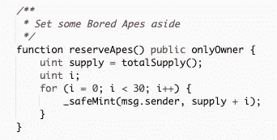
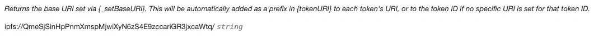

# 无聊猿游艇俱乐部:力学+坚实智能合同分析

> 原文：<https://medium.com/coinmonks/bored-ape-yacht-club-mechanics-smart-contract-breakdown-6345bffd75ec?source=collection_archive---------4----------------------->

Photo by [Markus Spiske](https://unsplash.com/@markusspiske?utm_source=unsplash&utm_medium=referral&utm_content=creditCopyText) on [Unsplash](https://unsplash.com/s/photos/bored-ape?utm_source=unsplash&utm_medium=referral&utm_content=creditCopyText)

我知道这个已经完成了——特别是对无聊猿游艇俱乐部智能合同的逐行分析。

然而，读了一些帖子后，我仍然对其中的机制感到困惑——比如说我想做一个 BAYC 风格的 NFT 项目。一旦我有了智能合同，我实际上会做什么？涉及的操作顺序是什么——什么时候创建我的 JSON 元数据，什么时候部署我的合同？我应该先调用哪个函数？我如何进行预售？

我觉得有很多关于*每行代码做什么*的解释，但是关于*如何做*的解释不够。所以我想以稍微不同的方式来处理这篇文章，通过回顾一下*如何使用*智能合同来实际执行 NFT 项目的机制。

# 介绍

BAYC 是 10，000 个无聊的猿 NFT 的集合，[自称](https://boredapeyachtclub.com/#/home)为“生活在以太坊区块链上的独特数字收藏品”，其中每一个都是“独特的，通过编程从超过 170 个可能的特征中生成，包括表情、头饰、衣服等等……有些比其他的更罕见。”

支撑这个大获成功的 NFT 项目的 [BAYC 智能合同](https://etherscan.io/address/0xbc4ca0eda7647a8ab7c2061c2e118a18a936f13d#code)，是 [ERC-721 不可替代令牌标准](https://eips.ethereum.org/EIPS/eip-721)的实现。

ERC-721 标准听起来很奇特，因为它是一个带有数字代码的首字母缩写词，而我们在心理上将它与复杂性联系在一起。然而，其核心仅仅是一组标准的事件、功能和合同细节，需要实现它们才能将智能合同归类为符合 ERC-721 标准。仅此而已。

谢天谢地，OpenZeppelin 已经创建了[模板](https://docs.openzeppelin.com/contracts/4.x/erc721)来帮助你做到这一点。您可以轻松地扩展这些现成的合同来实现您自己的 NFT 项目(这正是 BAYC 所做的)。

也有很多优秀的 NFT 教程。

# 力学

所以，很快——你走上了经典的加密路线，获得了 BAYC 的合同，部署了一个你自己的模仿 NFT 的项目。从哪里开始？

## 1a。艺术

这*应该是*的第一步——首先，你要推销的艺术和概念应该在实现之前；关于车和马的一些事情。第二——为了恰当地实施“随机化”的售前流程，防止对系列中特定作品的窃取，比如 BAYC，需要一个初始序列。

每只猿都有不同的可能特征——例如，[猿#1152](https://ipfs.io/ipfs/QmQsxRXfVxxC5k9Uo8U51QcBtiA6TNmHAenbPMar7vFZrt) ，在公海上看到的，有 5 个特征——“皮毛”(“深棕色”)，“背景”(“紫色”)，“嘴”(“无聊的胡子拉碴”)，“衣服”(“服务”)，“眼睛”(“僵尸”)。其他类人猿也可能有不同数量的特征。

“程序生成”简单地说就是，在离线状态下，创造者为每只猿生成不同数量的特征和相应的特征值的随机组合。每个性状值的稀有程度不同，这意味着它们在集合中出现的概率不同。

这在实践中如何运作？

他们提出了一系列不同的可能特征(“皮毛”、“眼睛”、“帽子”等)，并为每个特征列出了一系列可能的值(“皮毛”颜色、“眼睛”类型等)，并为每个值分配了不同的出现概率(即 1%的猿类有“服务”服装，如 1152 号猿)。

然后，他们将这些特征值中的每一个绘制成图像层，并通过编程运行一个循环到 10，000。在循环的每一次迭代中，他们都会生成一个随机的属性和值组合，将图像层组合在一起以创建每个独特的 Ape。这是您开始时的顺序(稍后会以随机方式重新排序)。

[这里有一个很棒的 github repo](https://github.com/rounakbanik/generative-art-nft) 演示了用 Python 写的另一个 NFT 项目(Scrappy 松鼠——嘿，我不评价艺术)的生成过程。然而，他们对元数据采取了稍微不同的路线，将元数据保存为一个大的 CSV 文件(而不是每个 NFT 一个 JSON 元数据文件；因此，它更类似于 [BAYC 最终证明散列](https://ipfs.io/ipfs/Qme57kZ2VuVzcj5sC3tVHFgyyEgBTmAnyTK45YVNxKf6hi)，尽管没有出处散列字段)。

每个 Ape 还需要一个与之相关联的 JSON 元数据文件，说明它的属性。以下是 Ape #1152 的 JSON 元数据:

## 1b。IPFS

你还需要上传数据到[IPFS](https://ipfs.io/)——图像数据，以及 JSON 元数据。IPFS 只是帮助你为你的数据生成分散的 URL 端点(`ipfs://…`)，这是一个比使用典型的 URL 端点(`https://…`)更合理的。然而，如果所有者选择删除，IPFS 链接仍然会受到链接腐烂的影响。

你可以使用 Pinata 云服务来帮助你上传或“锁定”你所有的数据到 IPFS。这一步实际上可以(也应该)与步骤 1a 一起完成，即在编程循环中创建图像和元数据时将其固定。在此之后，对于每个 Ape，您应该有两个 IPFS 链接——一个图像 URI 及其关联的元数据 URI，其中还包含对 IPFS 图像链接的引用(对于 Ape #1152，这里的[和这里的](https://ipfs.io/ipfs/QmQsxRXfVxxC5k9Uo8U51QcBtiA6TNmHAenbPMar7vFZrt)和)。

## 2.合同部署和初始参数

下一步实际上是将智能合约部署到以太坊区块链上。这可以通过多种方式实现——从 [Truffle](https://trufflesuite.com/) 或 [Hardhat](https://hardhat.org/) 部署脚本，或者简单地从 [Remix](https://remix.ethereum.org/) 部署脚本。BAYC 合同在这里是[T21。](https://etherscan.io/address/0xBC4CA0EdA7647A8aB7C2061c2E118A18a936f13D#code)

在部署期间，构造函数需要几个参数:NFT 的名称(" BoredApeYachtClub ")、符号(" BAYC ")、maxNftSupply(一个 int-10000)和 saleStart(一个 unix 时间戳 int-1619060439，对应于 2021 年 4 月 21 日 3:00:39 AM GMT)。从该数据中，ape 的最大数量被设置(到 10k)，并且显示时间戳被计算为所提供的销售开始时间之后的第 9 天:

然后(在 BAYC 的情况下),合同`owner`通过`reserveApes`函数为自己保留了一些 ape，他们可以无限次数地这样做，每批 30 个，除了汽油费什么都不花(注意，其他 ape 由普通公众铸造的底价是 0.08 Eth)。这当然是可选的。

然后，设置基本 URI——这是一个 ERC721 必填字段，链接到每个 Ape 的元数据。这是存储元数据的 IPFS 文件夹，按顺序排列。

## 3.预售铸造期

一旦设置了这些初始参数，必须设置`saleIsActive`字段`true` ，以便打开铸造周期。这是通过`flipSaleState`功能实现的:

现在任何人都可以开始铸造猿类(通过`mintApes`功能)，最大数量为 10，000。当已经铸造了 10，000 个 Ape，或者在到达显示时间戳之后铸造了第一个 Ape 时(以先发生者为准)，在契约中自动设置`startingIndexBlock`变量，由`mintApes`函数中的逻辑控制:

`startingIndexBlock`实质上是初始预售期结束后的第一个 Eth 区块。

该变量非常重要，因为必须对其进行设置，以使随机化过程(即设置`startingIndex`变量)发生。所以还内置了应急功能，让车主手动设置。但是，如果随机化尚未发生，他们只能*手动设置:*

## 4.序列随机化

预售期结束后(设置`startingIndexBlock`后)，可通过`setStartingIndex`功能触发随机化过程。

随机化仅仅是将初始 NFT 序列移动一定的量，这样，虽然序列的*连续*顺序保持不变，但是起点和终点不同。

移位量由`startingIndex`的计算值直接给出，该值是在 1 和 9999 之间产生的随机数(如果`startingIndex`恰好是 0，则将其设置为 1，以便保证序列移位至少 1 个索引，并且防止默认序列)，通过块号的 blockhash 使用简单随机性:

在很大程度上，这种随机化方法是[糟糕的实践](https://docs.soliditylang.org/en/v0.8.14/units-and-global-variables.html#block-and-transaction-properties)，并且通常不可取，因为时间戳和块散列在某种程度上都可能受到挖掘者的影响。一个更好的解决方案是使用[链节 VRF(可验证随机函数)](https://docs.chain.link/docs/chainlink-vrf/)，它提供加密安全的随机数。

BAYC 的[最终起始指数](https://etherscan.io/address/0xBC4CA0EdA7647A8aB7C2061c2E118A18a936f13D#readContract)计算为 8853:

这意味着，从步骤 1 中创建的 NFT 序列，顺序被移动了 8853，并且它的(易混淆的名称)“初始序列索引”是根据[公式](https://boredapeyachtclub.com/#/provenance)计算的:

对于 Ape #1152，这变成:(1152 + 8853) % 10000 = 5。因此，Ape #1152 的初始序列索引为 5:

## 5.创建出处散列

既然已经设置了最终的序列，就可以[计算](https://boredapeyachtclub.com/#/provenance)最终的证明散列:

> 每个无聊的猿图像首先使用 SHA-256 算法散列。通过以如下所列的特定顺序连接每个钻孔 Ape 图像的 SHA-256 来获得组合串。最后的证明是通过 SHA-256 散列这个组合字符串获得的。这是存储在智能合约上的最终出处记录。

这个[最终证明散列](https://ipfs.io/ipfs/Qme57kZ2VuVzcj5sC3tVHFgyyEgBTmAnyTK45YVNxKf6hi)也被固定到 IPFS，作为包含出处散列(“cc 354 B3 FCA ce 8844 DCC 9861004 da 081 f 71 df 9567775 B3 F3 a 43412752752 c0bf”)以及 NFT 元数据的最终序列的 JSON 文件。

## 6.更新剩余数据

最后一步是使用最终确定的序列更新剩余的数据。对于 BAYC，这包括用最终的排序信息创建 [Arweave](https://www.arweave.org/) permaweb URIs，以及[将该元数据固定到 IPFS](https://ipfs.io/ipfs/QmUE2HrYFxMbrwrQeiXj7B8C7voUN9zE8C7yAkYD2Sw7eQ) 上，然后通过`setProvenanceHash`函数用来自步骤 5 的出处散列更新合同:

就是这样！一步一步的指南复制大获成功的 BAYC 项目，建立自己的 NFT 收藏。感谢阅读。

## 注意

最后一点——我已经看到其他文章[这里](/better-programming/bored-ape-yacht-club-smart-contract-breakdown-6c254c774394)和[这里](/northwest-nfts/bored-ape-yacht-club-contract-review-80dce503308e)鹦鹉学舌关于`startingIndex`变量及其作为猿类序列随机化手段的功能的相同错误:

> 但是……这个随机偏移量实际上并没有被用到任何地方！代码没用！尽管 BAYC 的[声称](https://boredapeyachtclub.com/#/provenance)猿的顺序是随机的，但实际上不是！而`*startingIndex*`只是浪费汽油！

…

> 这些功能都是辅助性的，没有实际影响！ *startingIndex* 值在契约中不会被重用，因此它对任何事情都没有影响。

他们错了。虽然 BAYC 随机数生成并不完美，但是`startingIndex`“对任何事情都没有影响”显然是错误的。它并不直接用于智能合约本身，而是离线使用，最终证明散列通过`startingIndex`计算，然后在合约中设置。

自己检查一下— [最终证明哈希](https://ipfs.io/ipfs/Qme57kZ2VuVzcj5sC3tVHFgyyEgBTmAnyTK45YVNxKf6hi)显示了令牌 Id 为 5 的 Ape #1152，它是使用 8853 的`startingIndex`计算的:

并且 [Arweave permaweb URIs](https://ipfs.io/ipfs/QmUE2HrYFxMbrwrQeiXj7B8C7voUN9zE8C7yAkYD2Sw7eQ) 也示出了与 Ape #1152 的分配令牌 ID 1152 相关联的初始序列索引 5:

通过在事务搜索中使用 arweaveId，您还可以在这里看到 Arweave 事务[。此事务包含 Ape #1152 的 IPFS 映像链接的散列数据(qmqsxrxfvxxc 5 K9 uo 8 u 51 qcbtia 6 tnmhaenbpmar 7 VF zrt)。](https://viewblock.io/arweave/tx/4CBzpnMCUJKCw5aaH2GbLb4XLleK70-pRj868NTM8P0)

> 加入 Coinmonks [电报频道](https://t.me/coincodecap)和 [Youtube 频道](https://www.youtube.com/c/coinmonks/videos)了解加密交易和投资

# 另外，阅读

*   [CoinDCX 评论](/coinmonks/coindcx-review-8444db3621a2) | [加密保证金交易交易所](https://coincodecap.com/crypto-margin-trading-exchanges)
*   [红狗赌场评论](https://coincodecap.com/red-dog-casino-review) | [Swyftx 评论](https://coincodecap.com/swyftx-review) | [造币厂评论](https://coincodecap.com/coingate-review)
*   [Bookmap 评论](https://coincodecap.com/bookmap-review-2021-best-trading-software) | [美国 5 大最佳加密交易所](https://coincodecap.com/crypto-exchange-usa)
*   [如何在 FTX 交易所交易期货](https://coincodecap.com/ftx-futures-trading) | [OKEx vs 币安](https://coincodecap.com/okex-vs-binance)
*   [CoinLoan 审查](https://coincodecap.com/coinloan-review) | [YouHodler 审查](/coinmonks/youhodler-4-easy-ways-to-make-money-98969b9689f2) | [BlockFi 审查](https://coincodecap.com/blockfi-review)
*   [XT.COM 评论](https://coincodecap.com/profittradingapp-for-binance)币安评论 |
*   [SmithBot 评论](https://coincodecap.com/smithbot-review) | [4 款最佳免费开源交易机器人](https://coincodecap.com/free-open-source-trading-bots)