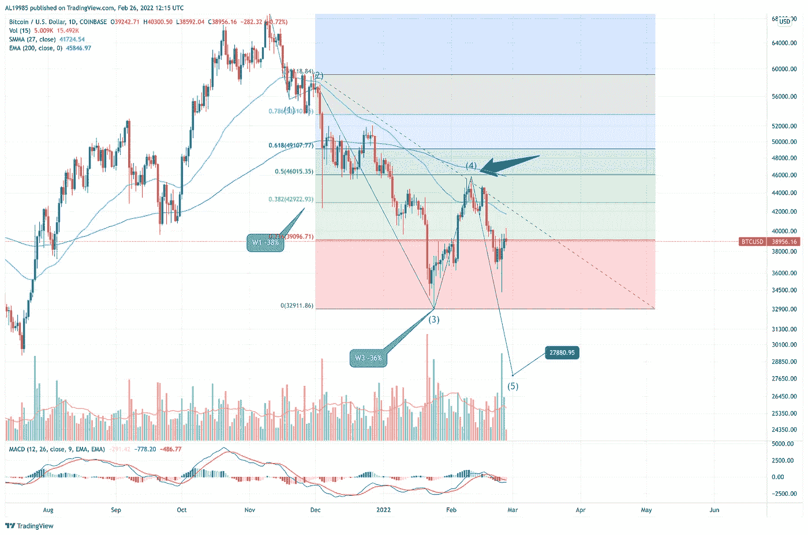

# 底部在场景中@蹩脚的交易者笔记#8

> 原文：<https://medium.com/coinmonks/bottom-is-in-scenarios-crappy-trader-notes-8-9fc2dc4cf017?source=collection_archive---------41----------------------->

BTCUSD 修正底部正在实现，所以今天我们将看看它可能如何揭开潜在的情景。我们还将详细阐述最有可能的价格走势。


# 场景#1 —扩展的平坦校正

**概率**:高
**反转** **电平**:28–30k BTCUSD

自 11 月 ATH 事件以来，这是最有可能发生的情况。1 月下旬需求良好的初步支持可能是这种情况的一个迹象。在这种情况下，当前的反弹应该算作第 5 波下跌中的第 2 波修正。在这种情况下，我们应该看到一个巨大的第三波，价格波动幅度大，交易量大，可能会把我们带到 30k 以下的水平。缺乏销售高潮是这个场景的另一个要点——第三波的最终结束是销售高潮的一个很好的候选。


这种情况得到了第 5 波最终长度与第 3 波和第 1 波长度的斐波纳契计数的支持。


在这种情况下，1 月/2 月的修正是第三波之后 50%的非常健康的修正。



人们可能还会注意到，突破 20-25k 水平将是一个重大双顶的迹象——这是最悲观、最戏剧性但也是最不可能的。我们稍后分析它。

# 场景#2 —常规平坦校正

**概率**:中等
**反转** **级别**:30–32k BTCUSD

在常规的持平情景中，去年夏天的低点是最有可能出现反转的区域。这个编队在最近几个月一直在玩，现在处于最后阶段。在这种情况下，双底也形成了，这为反弹提供了额外的可信度。此外，低时间框架和高时间框架的波浪计数表明，底部地层可能形成于 30–32k BTC USD 水平。这也将导致第五波截断，这是反转级别的常见价格行为。

如果这种情况是正确的，我们应该在未来几周看到一种波动和皮下量/价的行动，然后是一个长期持续的交易区间。这将是一个坚实的基础建设的标志，并最终为向上移动做准备。


Regular Flat Correction Bottom formation

# 场景#3—运行平面校正

**概率**:低
**反转** **电平**:35–38k BTCUSD

在上周的运行平稳情景中，36–37k BTC USD 的支撑位是底部，我们是第一波上涨的一部分。然而，没有明确的波数支持这种情况(非常短的第五波)以及缺乏必要的皮下动作的价格/成交量动作，这是主要反转的特征。此外，花在积累上的时间很短，所以它不能成为大幅上涨的基础。价格没有理由涨到新高。

这就是为什么这种情况是可能的，但概率很低。


# 场景# 4——巨大的双顶

**概率**:极低
反转 级别:11–18k BTCUSD

这是一种“释放地狱场景”。如果我们在没有自动反弹和交易区间的迹象下突破 28k BTCUSD，那么我们就完蛋了。双顶完全有效，下一站是 11–18k BTC USD 或更低。

我们认为这种情况的概率非常低，因为它会使更高水平的波浪计数无效，并使当前 2021 年 4 月-今天的修正作为第 4 波平坦修正无效。

以下是该场景中标记的关键区域:


# 摘要

下面是对底层场景的简要总结:

```
+------------------------+-------------+--------------------------+
|    Bottom Scenario     | Probability | Reversal level (BTC USD) |
+------------------------+-------------+--------------------------+
| 1 - Extender Flat      | Very High   | 28-30k                   |
| 2 - Regular Flat       | Medium      | 30-32k                   |
| 3 - Running Flat       | Low         | 35-38k                   |
| 4 - Massive Double Top | Very Low    | 11-18k                   |
+------------------------+-------------+--------------------------+
```

毫无疑问，这将是一个动荡和危险的时期，因为接近底部和逆转是一条崎岖不平的道路。

因此，一如既往地保持安全和流动性。

巨大的买入机会就在眼前。

# 更多阅读

如果你想知道我是如何得出当前预测的，我推荐你阅读博客的前几章。因此，你可以理解我的推理，看看我的话有多真实。

*   2022 年 2 月反弹被揭穿— [下一站 30k BTCUSD @蹩脚交易者笔记#7](https://yentenobserver.medium.com/next-station-30k-btcusd-crappy-trader-notes-7-204ea6d157cc)
*   2022 年 1 月熊市情景解释— [BTCUSD 熊市在控制中@蹩脚交易者笔记#6](https://yentenobserver.medium.com/btcusd-bears-are-in-control-crappy-trader-notes-6-50507d28179a)
*   2021 年 12 月下旬 C 波情景的有力证实—[BTC C 波放大@蹩脚交易者笔记#5](https://yentenobserver.medium.com/btc-wave-c-zoom-in-crappy-trader-notes-5-2cd5ccfc6a8a)
*   2021 年 12 月初可能下跌的预警—[BTC C 波风暴来了？@ CrappyTrader 笔记#4](https://yentenobserver.medium.com/wave-c-storm-is-coming-crappytrader-notes-4-d71eee69f4ff)
*   2021 年 11 月下旬对可能的熊市前景的悲观预测— [我们处于 C 浪之中吗？@ CrappyTrader 笔记#3](https://yentenobserver.medium.com/are-we-in-a-c-wave-crappytrader-notes-3-2eecee27ca45?source=your_stories_page----------------------------------------)
*   2021 年 11 月 11 月价格走势有两种选择—[BTC 突破还是牛市陷阱？@ CrappyTrader 笔记#2](https://yentenobserver.medium.com/a-btc-breakout-or-bull-trap-crappytrader-notes-2-f49c476a4c0)

# 你觉得我的工作有价值吗？

如果是，那么您可以通过以下方式支持我的努力:

*   在推特上关注我
*   跟随我的媒体档案