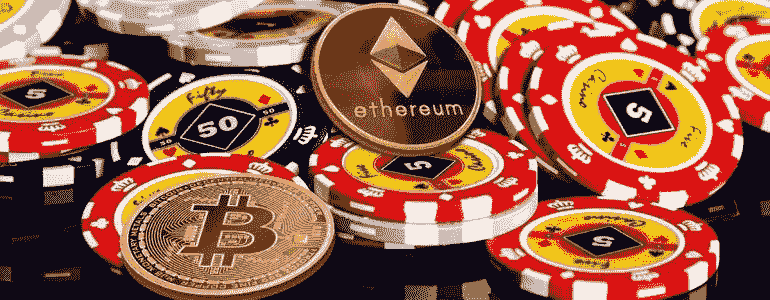
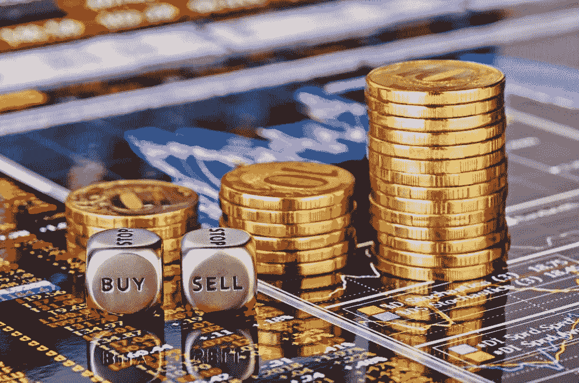
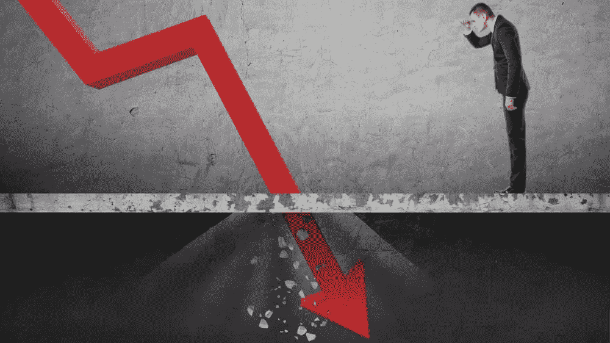
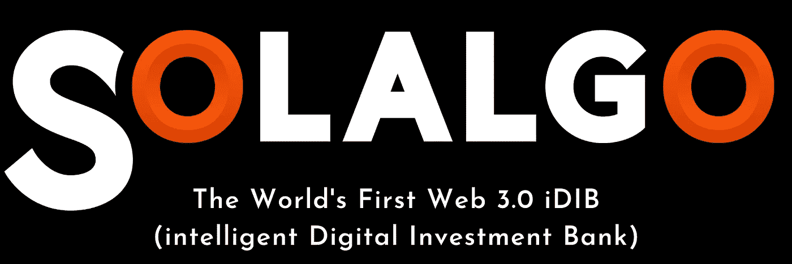

# 男孩柱塞——秘密之旅第一部分

> 原文：<https://medium.com/coinmonks/boy-plungers-a-crypto-journey-pt-1-716e693c7aa?source=collection_archive---------23----------------------->

**枪下无新**

在德州扑克和其他形式的扑克游戏中；*‘枪口下’*，是位置、直接性、知识性的表达。这意味着你在第一轮下注中处于第一个行动的位置——没有任何即时信息来做出深思熟虑的决定，(*除了你的底牌*)。这是一个危险的地方，它可以揭示一个球员的很多东西，以及他们对风险的开放程度。

像生活中的大多数事情一样，使扑克成为压倒性的技能游戏的是如何玩游戏的必要累积知识的应用。我说扑克是一种游戏，他们说花一个小时去思考你已经学会了，花一辈子去理解你还没有掌握。当经历恐惧、贪婪和焦虑时，这也是生活中最真实的事情。

表情；*“枪口之下”*几乎是过去五年密码市场的完美比喻——就像扑克一样，很容易认为你已经学会了，实际上，实际上很难理解，更不用说大师了。

作为一名相对成功的股票交易者，了解阴谋、复杂性和纪律对我个人有所帮助——但即使是这样根深蒂固的知识也只能让我到此为止。

当我第一次涉足伦敦证券交易所交易时，我年轻得可笑，天真得可笑，无畏得可笑。撒切尔仍紧紧抓住她的王位不放；市场向普通人开放进行投机(政府推动出售国有资产)，同时也失去了它 300 年的身份，尽管它改变了游戏的方式(电子交易的非个人化和快速性的偶然和费力的引入)。

随着所有这些新的、基本上不成熟的“投资者”寻求从其他人的行业中快速获利，世界各地的市场飞速发展——几乎每天都在创新高——甚至一个没有受过完整教育的野蛮的爱尔兰男孩也可以把一英镑或一美元变成一笔财富——并且像我一样赚了一大笔钱——一直到 1987 年 10 月。

当然，市场崩溃了，当然，我在 20 岁出头的时候，银行存款就有几百万，而在 72 小时内，我就欠了银行几百万。让我告诉你一个有益的教训——主要是因为我不知道我在做什么，甚至不知道为什么我会如此戏剧性地失败。

在接下来的三十年里，我学会了正确地操作市场。我接受了分析的价值，对*“直觉”*的磨练，对精心制定的长期和短期战略的绝对需求，以及为什么基本思维和积累的知识是成功的国王、王后、王子和仆人的本质。

自从我的损失比 1987 年大得多以来，已经发生了许多次崩盘，但我设法避免受到任何一次太严重的打击，当时(T2，因为周期总是决定着)，一切都一次又一次地发生在默德身上。我的意思是，我学会了对我参与的企业进行深度理解和足够程度的控制——无论是我在一个匹配的廉价市场上创办的一家初创企业，还是在一家允许一定程度的政策指令的小型公司持有足够大的股份。

当你知道自己在做什么，并且清楚地接受和理解自己在全局中的位置时，事情会变得容易得多。换句话说，通过接受我是谁以及我能做什么，我把股票市场的存在变成了我的优势。唯一的缺点是，它最终变成了一项繁重的工作，在这里，投机在很大程度上占据了不仅仅是一个次要位置——所以……很无聊，但稳定而安全——就像扑克中的研磨机。

然后出现了一种新的游戏方式。

大约从 2010 年开始，我就知道 crypto ( *是我知道的一个通用术语*)。2017 年，我对这个新市场产生了浓厚的兴趣。我在 2020 年初开始认真研究这款游戏——老实说，封锁是很大一部分原因。

2020 年 9 月，我采访了 Barry(Solalgo 的联合创始人)。他知道的比我多。他的进步态度和我的传统主义心态找到了共同点，我变成了一个转换到非常真实的可能性； ***【前途是光明的，因为未来是秘密的】*** 。

我们一起探讨了问题和可能性，并打开了我们的集体思维，让旧的做事方式和让它们更好工作的新方式结合起来。然后，我们汇集我们的资源——财务和商业经验——投入到这个惊人的概念和现实世界中。

两年后，我们成立了**Solalgo Group**，开发了 **ALGOSO101** ，验证了**白皮书**，审计了**智能合同**，推出了最先进的 **dAPP** 并获得了 **KYC 证书**——与此同时，我们还遵循传统价值观，即在开发基于基本资产价值的传统商业模式时，要做到一丝不苟

我们现在正在为我们发行的代币( **SLGO** )进行**私人轮**销售，市场的反应非常令人满意。我承认有一个学派认为我们是。*《枪下》(Under the Gun)*业务是 Solalgo，象征是 SLGO——毫无疑问，我们 6 月份在交易所的公开发行将让我们接受愤世嫉俗的机构反对者的微观检查，他们对密码的恐惧超过普京。

但是我们已经完成了工作，我们知道潜力，我们已经通过望远镜的两端来看待问题，(*让我们自信地说，我们将为所有参与者提供有利可图的解决方案*)。我们确实知道我们手中的牌的价值，并且毫不犹豫地把自己放在一个位置上；*在这款*【新】*游戏中击败所有游戏。*

****(在“男孩柱塞”的第二部分中，我将探索 Solalgo 等式两边产生的背景以及在加密市场中获得正确结果的困难。*感谢阅读)***

> *加入 Coinmonks [电报频道](https://t.me/coincodecap)和 [Youtube 频道](https://www.youtube.com/c/coinmonks/videos)了解加密交易和投资*

# *另外，阅读*

*   *[分散交易所](https://coincodecap.com/what-are-decentralized-exchanges) | [比特 FIP](https://coincodecap.com/bitbns-fip) | [宾邦评论](https://coincodecap.com/bingbon-review)*
*   *[用信用卡购买密码的 10 个最佳地点](https://coincodecap.com/buy-crypto-with-credit-card)*
*   *[加拿大最佳加密交易机器人](https://coincodecap.com/5-best-crypto-trading-bots-in-canada) | [Bybit vs 币安](https://coincodecap.com/bybit-binance-moonxbt)*
*   *[阿联酋 5 大最佳加密交易所](https://coincodecap.com/best-crypto-exchanges-in-uae) | [SimpleSwap 评论](https://coincodecap.com/simpleswap-review)*
*   *购买 Dogecoin 的 7 种最佳方式 | [ZebPay 评论](https://coincodecap.com/zebpay-review)*
*   *[最佳期货交易信号](https://coincodecap.com/futures-trading-signals) | [流动性交易回顾](https://coincodecap.com/liquid-exchange-review)*
*   *【Huobi 的加密交易信号 | [Swapzone 审查](/coinmonks/swapzone-review-crypto-exchange-data-aggregator-e0ad78e55ed7)*