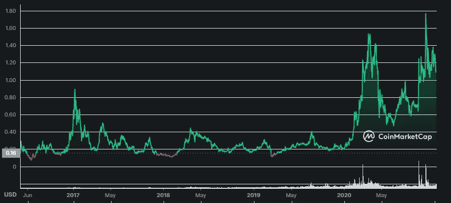

# 勇敢的浏览器你应该知道的 Web 3 技术

> 原文：<https://medium.com/coinmonks/brave-browser-the-web-3-technology-you-should-know-about-1be0b3a7d31a?source=collection_archive---------4----------------------->

## 不要错过 web 3 技术。

Photo by [Keila Hötzel](https://unsplash.com/@keilahoetzel?utm_source=medium&utm_medium=referral) on [Unsplash](https://unsplash.com?utm_source=medium&utm_medium=referral)

Brave 提供了各种很酷的功能，比如摆脱网站追踪器和在线广告。它基于 Chromium 浏览器，但专注于隐私和集成像加密货币一样的分散应用程序(DApps)和分散金融(DeFi)。

您可以通过查看 Brave 广告来赚取 BAT(基本注意力令牌)令牌。但是你可以选择看或者不看。你可以每小时选择 0 到 10 个广告。你已经花时间在你的浏览器上了，为什么不积累一些有价值的加密货币呢？

所有用户数据都保存在用户的设备上，任何第三方都无法访问，因此您的浏览数据是隐私的。

英美烟草也在比特币基地交易所上市，这使得它变得非常重要。在写作的时候，这是 BAT 的历史图表。

[https://coinmarketcap.com/currencies/basic-attention-token/](https://coinmarketcap.com/currencies/basic-attention-token/)

它创下了 1.8 美元的历史新高。所以把这些蝙蝠奖励积攒到钱包里是个好主意。您可以选择 support 或 Gemini wallet 在月底领取您的奖励。该选项集成在浏览器中。

Brave 创造了 Brave Wallet，这是第一个直接内置在浏览器中的安全加密钱包，不需要扩展。它也比扩展更安全。扩展减慢你的设备。它从 CoinGecko 接收价格，并具有 NFT 和多链支持。也可以导入其他钱包。勇敢钱包项目越来越成熟和广泛。

除了相当多的优势，使用这款浏览器也是一种有趣的体验，所以我真的推荐尝试这款浏览器。

另一个很酷的功能是，被配置的创建者可以从你的钱包里收到提示。你可以将鼠标悬停在浏览器内的一个图标上，如果网站通过验证，就会显示“已验证”,你可以选择金额。一个很好的例子将被验证 YouYube 的创造者。

在 Twitter 中，每条推文中都有一个小费选项，这与 Brave 的这一功能完美契合。

关于勇敢的一些有用的快速统计(在写作的时候):

*   月活跃用户:5020 万
*   日活跃用户:1550 万
*   经核实的网站:106 088 个
*   已核实的推特账户:189 330 个
*   已核实的 YouTube 账户:703 984 个
*   已验证的 Reddit 用户:108，586
*   已验证的 GitHub 用户:47，446
*   已验证的 Vimeo 帐户:93，846
*   已核实的 Twitch 账户:96，628 个

通过验证，我的意思是他们可以接受蝙蝠代币作为小费。

Brave talk 是集成到 Brave 中的基于浏览器的注重隐私的视频会议工具。

Brave 通过允许每个浏览器会话呈现唯一性来防止指纹跟踪。

BAT 的商业模式和 tokenomics 是由一个包括用户、创造者和广告商的循环来支持的。广告主购买蝙蝠在平台上展示广告。如果用户选择看我们讨论过的这些广告，他们会得到奖励。经过验证的创作者可以被用户奖励蝙蝠。

Brave 多次被不同的科学实体，如都柏林三一学院的计算机科学和统计学院，认定为最隐私的浏览器。

您可以在此处找到平台统计数据和令牌活动:

 [## 透明数据馈送|勇敢的浏览器

### 透明度数据馈送 5020 万 1550 万类别当前总 YouTube 网站 Twitter Twitch Reddit GitHub…

brave.com](https://brave.com/transparency/) 

感谢阅读。您可以关注并订阅以了解最新信息。

> 加入 Coinmonks [电报频道](https://t.me/coincodecap)和 [Youtube 频道](https://www.youtube.com/c/coinmonks/videos)了解加密交易和投资

## 也阅读

 [## 如何在印度购买比特币？2021 年购买比特币的 7 款最佳应用[手机版]

### 如何使用移动应用程序购买比特币印度

medium.com](/coinmonks/buy-bitcoin-in-india-feb50ddfef94)  [## 加密税务软件——五大最佳比特币税务计算器[2021]

### 不管你是刚接触加密还是已经在这个领域呆了一段时间，你都需要交税。

medium.com](/coinmonks/best-crypto-tax-tool-for-my-money-72d4b430816b)  [## 9 个 2022 年最值得购买的密码| CoinCodeCap

### 2021 年对于加密货币、比特币、NFT 或不可替代代币、元宇宙等等来说是很棒的一年。这一年…

blog.coincodecap.com](https://blog.coincodecap.com/crypto-to-buy-in-2022)  [## 存储比特币的最佳加密硬件钱包[2021] | CoinCodeCap

### 保管您的数字资产很容易，但找到正确的存储方式却是一项繁琐的任务。在线钱包有一个风险…

blog.coincodecap.com](https://blog.coincodecap.com/best-hardware-wallet-bitcoin)  [## Pionex 评论 2021 |免费加密交易机器人和交换

### Pionex 是为交易自动化提供工具的后起之秀。Pionex 上提供了 9 个加密交易机器人…

medium.com](/coinmonks/pionex-review-exchange-with-crypto-trading-bot-1e459d0191ea)  [## 2022 年密码交易员的三大电报渠道

### 加密信号是来自专业交易者的交易想法，以特定的价格或价格买卖特定的加密货币

medium.com](/coinmonks/top-3-telegram-channels-for-crypto-traders-in-2021-8385f4411ff4)  [## 2022 年 5 个最佳免费加密投资组合追踪器

### 加密投资组合追踪器是作为一个解决方案创建的，既费时又令人困惑的家务提供一个…

blog.coincodecap.com](https://blog.coincodecap.com/free-crypto-portfolio-trackers)