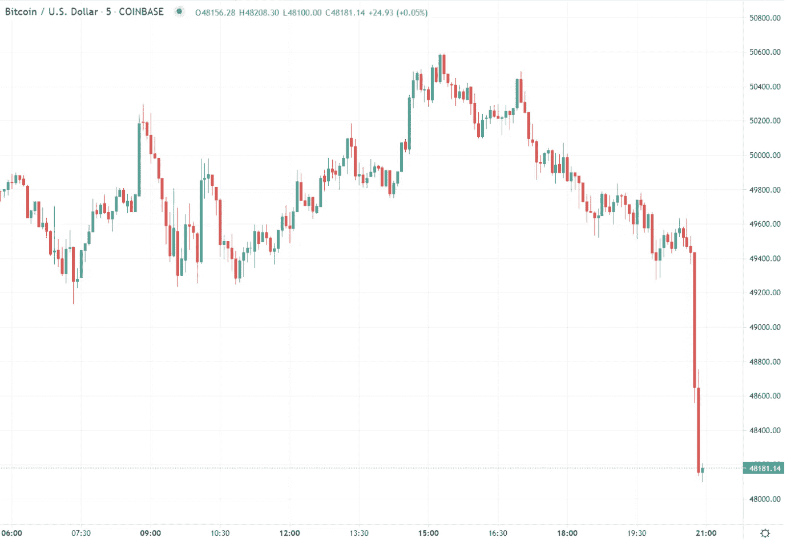
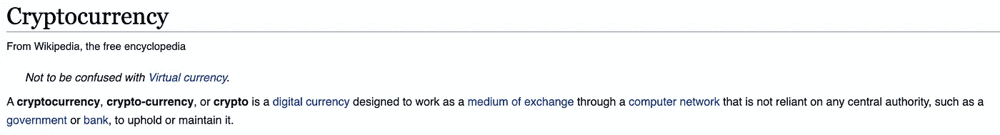
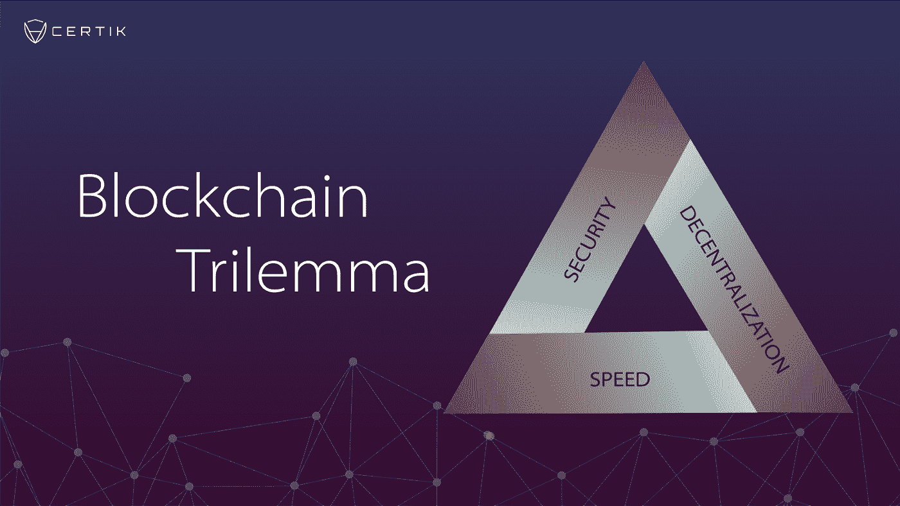

# 破裂

> 原文：<https://medium.com/coinmonks/break-19f37d785f72?source=collection_archive---------72----------------------->

最近，我暂停了写作，因为我的职业生涯已经开始，我发现很难兼顾工作和写作。然而，我发现这是一个开始新篇章的好时机，或者更像是一个新的写作主题，这次是关于投资而不是如何理财。

我相信有很多关于如何理财的信息来源，因此在休息半年后，我的重点将更多地放在投资上。特别是使加密投资更简单。

到目前为止，我相信你已经听说过加密作为一种替代投资形式。无论是新闻报道还是口头传播。对一些人来说，密码是抑制通货膨胀的替代资产，而对其他人来说，这是一个庞氏骗局，或快速致富计划。当你听到著名投资者称 crypto 为诈骗资产时，你可能也会感到害怕。

然而，在进一步阅读之前，我敦促你客观地阅读这篇文章，并权衡双方的观点。让我进一步说明，加密投资并不适合所有人，因为风险很高，资产通常不稳定。因此，如果你觉得投资这项资产不舒服，那就离开。

在 2019 年底，2020 年代初，我曾经是 crypto 的批评者。当时，我脑海中的普遍想法是，欺诈，骗局，不稳定，有风险，这绝对是一个泡沫。然而，当我在 2020 年初开始我的去中心化金融(defi)之旅时，这种情况发生了变化。在币安智能链(BSC)上，我确信，加密是一种替代资产和替代交易方式。那时，我的投资组合主要由股票组成，只有 10%投资于以太坊(ETH)和币安硬币(BNB)

当 Microstrategy 开始积累比特币(BTC)并希望将其资产负债表上的现金余额转换为 BTC 时，情况发生了变化。没过多久，特斯拉也跟进了，剩下的就是历史了。BTC 一年内从 10k 涨到 65k！这是你的资本回报率的 6.5 倍。我为什么要给你写这个？有人曾经对我说:“你是宁愿正确还是宁愿赚钱？”背景当然很重要，取决于你当时投资了什么，有些投资可能会变成零。

当我确信机构投资者和大公司开始关注加密货币时，我对它到底是什么以及如何投资做了一些研究。在我的文章中，我会参考网上对我的投资之旅有所帮助的其他文章。

你可能想知道加密货币到底是什么？

维基百科最好将其概括为一种数字货币，把它想象成数字人民币，或者如果你住在美国，是美元，但在 Venmo 上。crypto 与 Venmo 的不同之处在于，它背后的技术区块链运行在分布式分类账系统上，以验证网络上发生的交易。

从 Gemini 来看，区块链是一个共享的数据分类帐，例如交易或代码，这些数据被分批分块、验证，随后通过共识机制被分布式用户网络接受为区块链的一部分。因为每个经过验证的数据块都包含来自前一个数据块的唯一数据签名，所以它们不可避免地链接在一起成为一个“块链”基于网络的共识机制是区块链协议就其底层技术架构将如何运行达成一致的一种方式。

 [## 什么是区块链网络？加密和超越|双子座

### 一串积木？是的，简而言之，这是一门几乎在每个领域都在改变我们生活方式的科学。阅读…

www.gemini.com](https://www.gemini.com/cryptopedia/blockchain-technology-explained#section-blockchain-technology-explained) 

TLDR:基本上就是在烧烤前把不同的配料串在一起。串肉扦上的每一种配料都可以比作网络上的一块数据。一旦块被填满，它就被散列到链上的前一个块。同样，它把一种配料一种接一种地放在串肉扦上。

然而，这项技术的特别之处在于，区块链是与网络上的每个人共享的。在这种情况下，想象一下你的 5 个朋友在一次烧烤聚会上一起制作一个，仅仅一个，要烧烤的串肉扦。每个人都知道串肉扦上的配料顺序是什么(例如，首先是猪肉，然后是辣椒，然后是樱桃番茄)。每个人都可以看到串肉扦，但因为是 1，所以没有人会同时拥有串肉扦。

拥有分散系统的好处如下:

**信任**

区块链在不同实体之间建立信任，而信任要么不存在，要么未经证实。实体愿意参与涉及交易或数据共享的业务交易，否则他们可能不会这样做或需要中介来这样做。建立信任是区块链最常提到的好处之一。

**提高安全性和隐私性**

区块链通过端到端加密创建了不可更改的交易记录，将欺诈和未经授权的活动拒之门外。此外，区块链上的数据存储在计算机网络中，几乎不可能被黑客攻击(不像传统的计算机系统将数据存储在服务器中)。此外，通过匿名化数据和要求权限来限制访问，区块链可以比传统的计算机系统更好地解决隐私问题。

**速度(有争议——随后在区块链三难困境中解释)**

通过消除中介以及取代交易中剩余的手动流程，区块链处理交易的速度比传统方法快得多。在某些情况下，区块链可以在几秒钟或更短的时间内处理一笔交易。然而，时代可以改变；基于区块链的系统处理交易的速度取决于多种因素，例如每个数据块的大小和网络流量。尽管如此，专家们得出结论，区块链通常在速度方面胜过其他工艺和技术。

**能见度**

它有能力追踪这些芒果和其他产品的来源。根据专家的说法，区块链可以帮助跟踪各种物品的来源，例如药品，以确认它们是合法的而不是假冒的，以及有机物品，以确认它们确实是有机的。

**不变性**

不变性简单地说就是交易一旦被记录在区块链上，就不能被更改或删除。在区块链，所有的交易都有时间和日期标记，所以有一个永久的记录。因此，可以使用区块链跟踪信息，实现安全、可靠的信息审计。(这与容易出错的基于纸张的归档和可能被损坏或淘汰的传统计算机系统形成对比。)

然而，尽管如此，当谈到区块链时，还是有一个三难困境。分散化、安全性和速度。目前不可能在区块链上实现这三个目标。在这个过程中，三元悖论的一个方面必须被牺牲掉。

区块链经常被迫做出取舍，这妨碍了他们实现所有三个方面:

1.  分散式:创建一个不依赖于中央控制点的区块链系统
2.  可伸缩性:区块链系统处理不断增长的交易量的能力
3.  安全:区块链系统按预期运行、抵御攻击、漏洞和其他不可预见问题的能力

 [## 区块链三难困境:去中心化、可扩展和安全？

### 区块链项目以其愿景和雄心而闻名，但他们优先考虑的事情和他们所知的事情可以…

medium.com](/certik/the-blockchain-trilemma-decentralized-scalable-and-secure-e9d8c41a87b3) 

也就是说，你可能会想，加密与当前的金融系统有什么关系？为此，让我向您展示一下 crypto 的潜力。最近，加拿大经历了一次卡车司机抗议，加拿大银行已经开始冻结与抗议有关的账户。

这使得人们无法获得金融服务。然而，使用 crypto，由于其分散的性质，没有一个实体能够否认另一个人访问金融服务的能力。

我认为 Crypto 仍处于萌芽阶段，未来有很大的增长潜力。也就是说，它并不完美，随着社区的不断发展，它会有起有落。如果你有兴趣和我一起踏上投资金融前沿的旅程，请加入我的下一篇文章，因为我将讨论加密的风险和回报。

与此同时，请记得关注我，了解我最近的帖子，并留下评论，以便我知道如何才能更好地向您提供信息！

免责声明:内容仅供参考，您不应将任何此类信息或其他材料理解为法律、税务、投资、财务或其他建议。