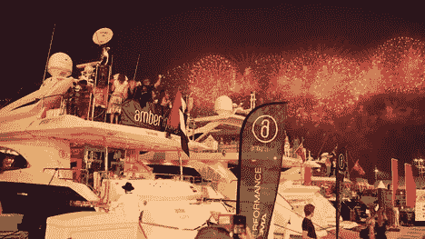
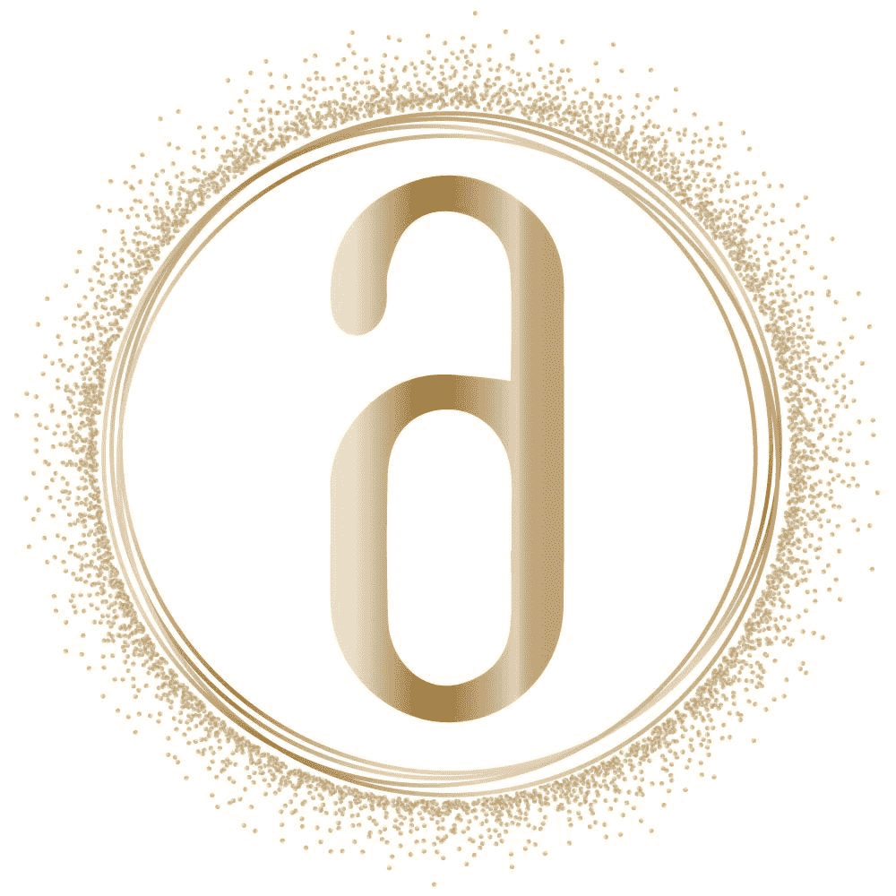

# 突破:Amber Lounge 为贵宾和富裕人士推出了全球首个 NFT 会员资格，让他们可以参加最专属的 Oneⓒ方程式派对

> 原文：<https://medium.com/coinmonks/breaking-amber-lounge-launches-worlds-first-nft-membership-for-vips-hnwis-to-access-most-25c2a9d01fe6?source=collection_archive---------42----------------------->

[Amber Lounge](https://amber-lounge.com) 因在一级方程式赛车世界内外提供卓越体验而闻名于世，现在推出 VIP 会员专享计划。

**“Amber X”NFT 代表一个只有 1888 名受邀才能购买的会员资格的专属俱乐部，允许 NFT 持有者** l **ifetime 参加一系列国际贵宾和全球流行活动，这些活动是全球高净值和有影响力的个人经常光顾的，包括亿万富翁、名人和其他喷气式飞机乘客。**

一些名人嘉宾和“琥珀之友”包括路易斯·汉密尔顿、尼科·罗斯伯格、贾斯汀比伯、金·卡戴珊、理查德·布兰森、戈丹·拉姆齐、帕米拉·安德森、凯莉·米洛和超级名模娜奥米·坎贝尔、约瑟芬·斯基弗、佩特拉·恩姆科瓦和维多利亚·希斯特德。

自 2003 年成立以来，Amber Lounge 一直在世界各地的许多城市举办奢华的派对，包括他们在 Oneⓒ方程式赛车场之后在摩纳哥、新加坡、阿布扎比、墨西哥城和上海等主要目的地举办的标志性活动。他们赛后从黄昏到黎明的活动通常以原创的 F1ⓒ车手时装秀和由世界知名 DJ 现场直播的通宵派对为特色。

**“推出我们独有的 NFT 会员计划，我们希望吸引眼光敏锐的全球派对精英，他们真正欣赏生活中的精彩，以及世界上最独特、最迷人的派对体验。**Amber Lounge 首席执行官 Cher Ng 表示:“我们还在全球范围内积极寻找机会，将 Amber 的派对带到更多举办大奖赛和其他重大全球体育或国际赛事的国家。”Cher Ng 也是吉隆坡两家世界知名娱乐场所 Zouk Club KL 和 TREC KL 的联合创始人。

该公司在未来 18 个月的活动路线图中安排了一系列重要亮点，将琥珀的独特性和标志性的派对带到新的城市，包括 2023 年美国 F1 赛道的迈阿密和拉斯维加斯，以及巴厘岛和伊比沙岛等其他顶级目的地热点。

Amber Lounge 集团 MD[Jeannette Tan](https://www.linkedin.com/in/jeannettet/)是 luxe lifestyle events 和娱乐机构 Imaginoire 的创始人，她将纽约著名的 VIP 剧院“The Box”带到了亚洲，并将带来一个新鲜、大胆、突破界限和令人兴奋的新创意方向，将该品牌久负盛名的活动体验提升到史诗般的新高度。

“展望未来，我们希望重振琥珀聚会体验，使其比以往任何时候都更加令人兴奋和激动。**游客可以期待意想不到的事情，因为我们将带领他们踏上由世界级的表演者和身临其境的娱乐行为推动的迷人旅程。**

“我们的终身 VIP 会员资格是公用事业 NFTs 的完美实施——它们无纸化、透明且易于转让，”Ng 解释道。“我们已经与主要艺术家和品牌进行了多次合作，在我们的派对上推出独家 NFT，我们还有一些元宇宙活动正在筹备中。**NFT 将成为高端夜生活领域的下一个大事件，而 Amber Lounge 正处于这一运动的前沿**

**仅出售 1，888 张终身俱乐部会员 NFTs】**

在待售的 1，888 个 NFT 会员中，有两个层次的非功能性交易，目前都是通过邀请才可以。这些俱乐部会员资格授予 NFT 业主终身访问所有 Amber X 世界各地的活动，他们也将收到邀请到元宇宙的活动。

此外，顶级 NFT(只有 30 家)允许所有者在琥珀色签名活动中使用价值高达 30，000 美元的贵宾席，包括私人晚宴和社交活动。顶级 NFT 会员还将特别获得在琥珀厅活动期间发布的限量版定制设计香槟礼盒套装 NFT 滴瓶——独特而精致的主题制作香槟酒瓶艺术系列。

除了待售的 1，888 个 NFT 会员资格外，团队还保留了另外 112 个 NFT 用于促销和营销目的。

"**琥珀厅活动比其他会员俱乐部更具优势。我们的聚会是奢侈的，排外的和疯狂的乐趣。我们非常高兴将世界上第一批高知名度的 NFT 会员带入全球奢华生活活动空间**，”ng 说。

他补充说，“我们还将在我们的场馆接受许多不同的加密货币作为支付方式，我们正在扩展到大奖赛以外的其他活动——例如，我们将于今年 8 月在巴厘岛举办一场只有受邀才能参加的夏季海滩盛典派对，或者在库尔舍维尔或圣莫里茨等豪华目的地举办一场仅限会员参加的冬季滑雪度假。”

支持 ng 增强愿景的 Amber 股东包括著名的全球投资集团 Catcha Group 的负责人，以及加密领域的其他主要参与者，如前新加坡议员 T2 郑恩里，他最近成立了一家 NFT 和 fan token 投资公司，该公司与 Crypto.com、币安和 FTX 一起获得了迪拜颁发的虚拟资产许可证。

精通加密的客户会很高兴地知道 Amber X NFTs 可以与所有标准的 Web3 钱包一起工作。与此同时，加密新手也可以放心，对于尚不熟悉 Web3 技术的买家购买 Amber X 会员资格，我们将随时提供积极的支持和指导。该平台设计了一个用户友好的界面，不要求加密新手拥有加密货币的先验知识，而是可以简单地使用信用卡购买会员资格。

**关于琥珀酒廊**

Amber Lounge 是一家 VIP 豪华派对主办机构，在全球主要城市举办活动，包括在主要大奖赛目的地举办世界上最奢华的生活方式活动。Amber Lounge 成立于 2003 年，现已成为一家世界知名的组织，在全球范围内提供奢华时装秀和令人兴奋的从黄昏到黎明派对的特殊体验。亿万富翁、名人和其他飞机乘客经常光顾琥珀厅。

2022 年，Catcha 集团收购了 Amber Lounge，并推出了“Amber X”NFT 会员计划。每张 NFT 代表一个终身会员资格，授予持有者全球参与琥珀厅活动的权利，以及其他额外待遇。Amber X NFTs 是 Amber Lounge 首次进军不断扩大的元宇宙计划，是全球奢华生活活动公司推出的全球首个高调的 NFT 会员。

**关于 Catcha 集团**

Catcha 集团成立于 1999 年，是东南亚历史最悠久的互联网集团之一。该集团的愿景是企业家第一，20 多年来，他们一直在世界各地建立和投资颠覆性技术公司，特别关注东南亚和澳大利亚。

自成立以来，Catcha 集团已完成 70 多项公司交易，并使 6 家公司从早期阶段上市或出售，总估值超过 10 亿美元。2021 年 2 月，Catcha 将 3 亿美元的特殊目的收购公司 Catcha Investment Corp(特殊目的收购公司)在纽交所上市，与新经济领域的企业合并。最近，Catcha 投资了 Carsome，这是东南亚最大的综合汽车电子商务平台，也是马来西亚第一家科技独角兽。

**琥珀 X 官方渠道**

推特:【https://twitter.com/AmberxNFT 

网址: [https://amberx.io](https://amberx.io)

**琥珀酒廊官方渠道**

网址:[https://amber-lounge.com](https://amber-lounge.com)

insta gram:[https://www.instagram.com/amberloungeltd](https://www.instagram.com/amberloungeltd/?hl=en)

推特:[https://twitter.com/AmberLoungeLtd](https://twitter.com/AmberLoungeLtd)

https://www.facebook.com/AmberLoungeLtd/

> 加入 Coinmonks [电报频道](https://t.me/coincodecap)和 [Youtube 频道](https://www.youtube.com/c/coinmonks/videos)了解加密交易和投资

# 另外，阅读

*   [OKEx 评论](/coinmonks/okex-review-6b369304110f) | [Coinswitch 俱吠罗评论](/coinmonks/coinswitch-kuber-review-1a8dc5c7a739) | [比特币基地收费](/coinmonks/coinbase-fees-831e77d4f2c5)
*   [AscendEX 审查](/coinmonks/ascendex-review-53e829cf75fa) | [OKEx 交易机器人](/coinmonks/okex-trading-bots-234920f61e60) | [OKEx 交易机器人](/coinmonks/okex-trading-bots-234920f61e60)
*   [火币交易机器人](https://coincodecap.com/huobi-trading-bot) | [如何购买 ADA](https://coincodecap.com/buy-ada-cardano) | [Geco？一次审查](https://coincodecap.com/geco-one-review)
*   [币安 vs Bitstamp](https://coincodecap.com/binance-vs-bitstamp) | [Bitpanda vs 比特币基地 vs Coinsbit](https://coincodecap.com/bitpanda-coinbase-coinsbit)
*   [如何购买瑞波(XRP)](https://coincodecap.com/buy-ripple-india) | [非洲最好的加密交易所](https://coincodecap.com/crypto-exchange-africa)
*   [非洲最佳加密交易所](https://coincodecap.com/crypto-exchange-africa) | [Hoo 交易所评论](https://coincodecap.com/hoo-exchange-review)