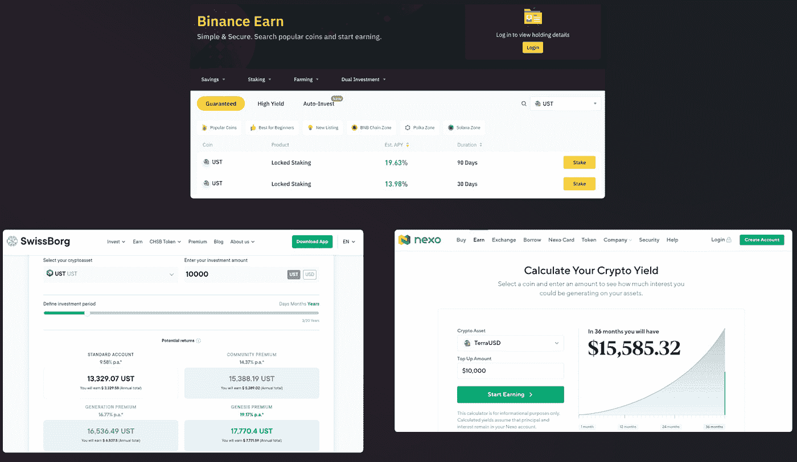

# 打破主播在 UST 的 20% APY

> 原文：<https://medium.com/coinmonks/breaking-down-anchors-20-apy-on-ust-7479253013bb?source=collection_archive---------1----------------------->

exodus.com

# 介绍

我们最近见证了 Terra 的 stablecoin UST 在 SwissBorg、币安 Earn、Nexo 和许多其他平台上市，有可能每年赚取惊人的 15-20%的被动收入。

想象一下，一种与美元挂钩的稳定货币带来的收益超过了传统银行的最高利率，以及自 1957 年以来世界最佳指数基金 SNP500 每年 10%的历史年化平均回报率(数据来自彭博和宏观趋势)。

考虑到世界上最伟大的投资者每年只能获得 20%的收益，并且为此必须承担市场风险，那么 20%的 APY 对一个存款账户来说怎么可能是无风险的呢？

那么，如何才能做到这一点，真的没有风险吗？

*图片来源:3 年 1 万美元的例子:swissborg.com/smart-yield-account;·nexo.io/earn-crypto;和锁定的 binance.com/en/earn/ust;股份*

# 锚协议

【medium.com/anchor-protocol】图片来源:T2

**什么是锚协议？**

Anchor protocol 是 Terra 区块链的主要 DeFi 产品，这是一个分散的货币市场，由 Terra 区块链背后的公司 Terraform labs 建立，具有持续 20%的 APY。

**Anchor 是如何工作的？**

*图片来源:medium.com/anchor-protocol*

Anchor 是一个开放的、无许可的储蓄协议，这意味着任何第三方应用程序都可以不受限制地自由连接和赚取利息。分散的**贷款**和**借款**，以及**抵押品抵押**，是这里起作用的两个关键组成部分。

**借贷&借款**

*图片来源:app.anchorprotocol.com/borrow(9 . 4 . 22)*

锚协议定义了借贷双方之间的货币市场。

贷方是将 Terra 的稳定货币 UST 借给锚货币市场的用户。存入的稳定存款(TerraUST)被集中起来借给借款人，应计利息按比例分配给所有储户。他们被激励以 19.46%的 APY 放贷。

**借款人**在一个被称为超额抵押的过程中，存入一笔价值超过他们想要借入的加密货币价值的加密货币，以确保协议在违约的情况下总是有足够的资金来弥补潜在的损失。在撰写本报告时，借款人应付的利息为 12.40%。*

例如，如果借款人存入价值 10，000 美元的以太币，他们可以借入价值高达 8，000 美元的 UST，这是一个 80%的贷款价值比(LTV)比率。如果超过这个 LTV 比率，抵押品将被出售。

这通常是由市场参与者(如投资者)完成的，他们需要以稳定的 UST(stable coin)的形式获得资金，而不必出售他们的加密资产，以便在市场反弹期间购买更多的加密，或者通过将 UST 转换为法定货币在加密货币市场之外花钱。这防止了一个人最终用 10，000 个比特币买一个披萨的情况，正如 Laszlo Hanyecz 在 2010 年所做的那样，当时一个比特币的价值远低于 1 美分。

**抵押标桩**

锚协议中的借款人必须存放有桩(抵押)的抵押品，以便借入 must 见下文:

【图片来源:app.anchorprotocol.com/borrow(9 . 4 . 22)

绑定抵押品，例如 bLUNA，是通过将常规 LUNA(Terra 区块链的本地加密货币)存入锚协议上的一个特殊智能合同来创建的，该协议将 LUNA 委托给 Terra 区块链上经过验证的验证者。

接受的其他抵押品有 ETH(以太坊的本地加密货币)、wasAVAX(雪崩的加密货币)和 ATOM(宇宙区块链的加密货币)。这些是加密行业中最大的区块链，拥有最具流动性的令牌。

从这些担保抵押品(如 bLUNA 和 bETH)中产生的 ***赌注回报*** 然后由锚协议本身赚取， ***此外*** 为借款人(12.40%)为他们所借的任何 UST 支付的利息。

赌注奖励如下所示:

*图片来源:利多协议(9.4.22)*

顺着这个，我们就可以算出主播的收入和支出了。

***费用:2381414663 美元***

UST 存款——12，237，485，424 美元 x 19.46% APY = 2，381，414，663 美元的支出

***收入:749196761 美元***

布鲁纳——440316 万美元 x 6.5% = 28620.54 万美元

贝丝——1，569，460，000 美元 x 3.9% = 61，208，940 美元

瓦萨瓦克斯——2654 万美元* 9.45% = 2508030 美元

巴通——29，002 美元* 9.7% = 2，813 美元

借款——3，219，932，082 美元 x 12.4% = 399，271，578 美元

***损失:——1632217902 美元***

那么，这怎么可能是可持续的呢？不是的。

# 补贴贷款

就目前而言，Terra 本质上是在为 Anchor 的成长和采用买单。当然，这个想法是，当补贴在 2024 年到期时，锚协议将会有一个充满活力的储蓄和贷款生态系统。不过，为了自我维持，利率可能会下降。

2022 年 2 月，有人提议将 Anchor Protocol 的产量储备增加 4.5 亿美元，露娜基金会警卫队被接洽。鉴于总存款是 UST 市值增长的结果，Anchor 的存款利率在当前状态下显然是不可持续的。正如 Terra 的创始人 Do Kwon 的帖子中所指出的，Terra 基金会警卫队已经给予了他们的批准。

*图片来源:agora.terra.money*

这并不是第一次发生这种情况，因为 Terraform Labs 在去年 5 月市场整体低迷期间向 Anchor Yield Reserve 注入了价值约 7000 万美元的 UST。

目前，收益准备金为 3.15 亿美元:

*图片来源:mirrortracker.info/anchor*

Terra 和 Anchor protocol 背后的韩国公司 Terraform Labs 的首席执行官 Do Kwon 指出，“存款大量增加，借款减少”，但他强调这不是担忧的原因。Do Kwon 表示，在熊市期间，当贷款需求放缓时，储备机制完全按照应有的方式运行，保持稳定。

在收益率储备耗尽的情况下，Anchor 将像常规 DeFi 货币市场一样运行。根据 Do Kown 的说法:

> “如果我们达到这种假设的情况，Anchor 仍将提供稳定债券的最高回报[15%至 16%]……与此同时，我决心找到补贴收益率储备的方法。Anchor 仍处于增长阶段，在 DeFi stable 保持最具吸引力的收益率将加强增长并建立护城河。”

# 有什么风险？

**脱钩**

取消钉住是指失去以前制定的与法定货币 1:1 的钉住，在这种情况下，泰拉的价值是 1 UST 对 1 美元。

*图片来源:推特@staderlabs*

UST 是一种算法稳定的货币，与美元挂钩。无论从经济上还是技术上来说，算法稳定点通常很难设计和维护。

UST 最近一次主要的脱钩事件发生在 2021 年 5 月的市场崩盘期间。随着 LUNA 与加密市场的其他股票一起下跌，借入 UST 来对抗 LUNA 的投资者被迫出售他们的股份，导致大量 LUNA 进入市场。

几天后，UST 的钉住汇率制度被重新确立，但它会步 Iron FIFA 的后尘吗？Iron FIFA 是一种部分抵押的算法稳定的硬币，它偏离了钉住汇率制度，一路跌至 0 美元。

这是一种真实的可能性，也是 Terra 面临的重大系统性风险。尽管 UST 被描述为一个分散的国家，但 Terraform Labs 通过介入清算，在帮助 UST 维持其联系汇率方面发挥了重要作用。如果没有这一点，UST 盯住美元的汇率制度肯定会比现在更加不稳定。

然后是比特币储备。

**UST 比特币后盾**

*图片来源:seekingalpha.com*

另一个促使 Terra 的 LUNA 价格上涨的重大事件是 Luna Foundation Guard 宣布筹集资金建立 UST 比特币储备。这些储备可以用来在市场极度波动时维持 UST 的运转。

比特币储备目前为 17 亿美元，目标是 100 亿美元支持 terraUSD stablecoin。鉴于 UST 的市值超过 160 亿美元，比特币的这一额外支持大大增强了 Terra UST 生态系统的信心。

然而，必须指出的是，比特币储备可能不足以捍卫 ust 盯住美元的汇率制度。

# 摘要

为了促进 Terra 的长期增长和大规模采用，锚协议**必须变得可持续**。《议定书》需要吸引更多的借款，激励借款的过程需要时间。

据该协议背后的开发者称，Anchor V2 将包括一项跨链生态系统的风险投资，增加额外的抵押资产，以及更好的 ANC 令牌组学，以建立更强有力的借贷奖励机制。随着几乎 77%的 Terra TVL 被锚协议锁定，下一次升级可能会启动 Terra、LUNA 和 UST 扩张的下一阶段。

*免责声明:本文包含的信息仅用于教育目的，不构成 Wheatstones 的任何形式的建议或推荐，也不打算供用户在做出(或避免做出)任何投资决定时依赖。*

> *加入 Coinmonks* [*电报频道*](https://t.me/coincodecap) *和* [*Youtube 频道*](https://www.youtube.com/c/coinmonks/videos) *了解加密交易和投资*

# 另外，阅读

*   [Bookmap 评论](https://coincodecap.com/bookmap-review-2021-best-trading-software) | [美国 5 大最佳加密交易所](https://coincodecap.com/crypto-exchange-usa)
*   最佳加密[硬件钱包](/coinmonks/hardware-wallets-dfa1211730c6) | [Bitbns 评论](/coinmonks/bitbns-review-38256a07e161)
*   [新加坡十大最佳加密交易所](https://coincodecap.com/crypto-exchange-in-singapore) | [购买 AXS](https://coincodecap.com/buy-axs-token)
*   [红狗赌场评论](https://coincodecap.com/red-dog-casino-review) | [Swyftx 评论](https://coincodecap.com/swyftx-review) | [CoinGate 评论](https://coincodecap.com/coingate-review)
*   [投资印度的最佳密码](https://coincodecap.com/best-crypto-to-invest-in-india-in-2021)|[WazirX P2P](https://coincodecap.com/wazirx-p2p)|[Hi Dollar Review](https://coincodecap.com/hi-dollar-review)