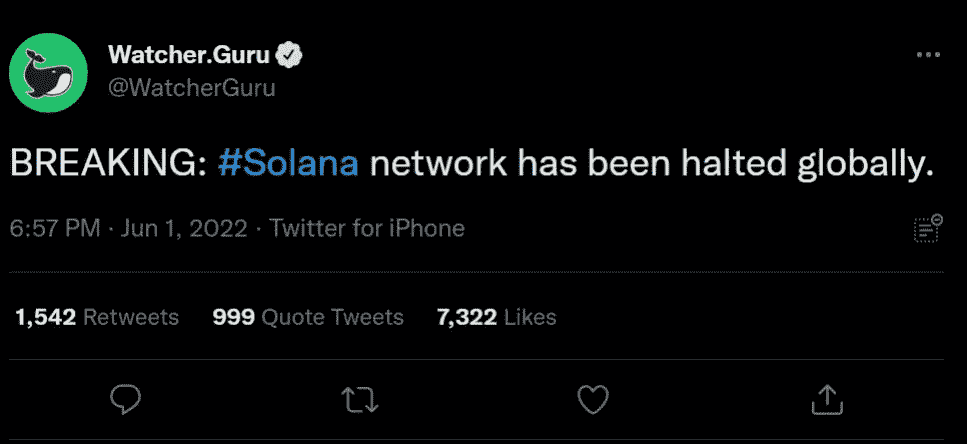

# 爆炸性新闻

> 原文：<https://medium.com/coinmonks/breaking-news-560c12a332c8?source=collection_archive---------36----------------------->

***立定！***

有时候事情好得不像真的。不幸的是，索拉纳的抛物线反弹和创造“翻转”的机会是短暂的。根据 Twitter 上的持续报道和社区投诉，Solana 网络没有批准或签署任何关于区块链的交易。

在这次停机期间，网络无法达成共识，以至于有必要重启 Mainnet Beta 集群。这个问题是由针对 Candy Machine 的机器人引起的，Candy Machine 是 Solana 上的一个 NFT 造币工具，每秒发送超过 400 万次交易。这次攻击产生了超过 100 Gbps 的流量峰值，**阻塞了 Solana 网络**。这既不是 Solana 第一次因为受到攻击而崩溃，也不是它第一次真正成为 DDoS 攻击的目标。由于攻击利用了 Metaplex Candy Machine 上的一个机器人，因此决定对该机器人进行处罚。

索拉纳又倒下了。这直接展示了 CoinEx Smart Chain-CSC 的制造方式和原因。这不是一个小的“我的密码比你的好”的阴影。这一事件简单地揭示了我的 [$](https://twitter.com/search?q=%24ADA&src=cashtag_click) CET 投资论文的一大基础…CSC 是可靠的。

Solana 是第二家因周末与 NFTs 相关的显著交易量而紧张的网络。由于宇迦实验室释放了 55，000 个 NFT，以太坊交易成本飙升至平均 450 美元以上，一些用户支付了高达 5 以太(ETH)或 14，000 美元的交易费，以及更多的交易费。

由于交易中的各种安全威胁和费用，开发者不能有效地在这样的区块链上运行他们的项目，原因是显而易见的，而且这样的挫折总的来说导致了财务上和系统上的损失。

最近的一条推文中说“Luna 死了，Luna 2.0 是骗局， **Solana** 不行，比特币慢，以太坊贵。所有问题的答案都是 CSC $CET“简单地通知用户 CSC

自世界见证最受欢迎的加密货币比特币以及区块链的卓越功能以来，十多年已经过去了。经过多年的发展，有许多区块链项目的想法正在开发中。

有些已经引起了全世界人们和行业的关注。你可以在当今时代找到各种分散的交易应用程序，并通过可用的选项访问广泛的功能。

***救世主***

CoinEx 智能链是一个高度复杂但简单易用的区块链。“简单易用”的愿景反映了 CoinEx 团队经过长时间深思熟虑后达成的共识。面对区块链近年来的快速发展，CoinEx 一直在考虑它能为更多用户创造什么价值。众所周知，虽然有数百万区块链用户，但只有一小部分人完全理解区块链是如何运作的，并通过采取正确的策略获利。

CoinEx 智能链(CSC)，CoinEx 生态系统内的公共链，旨在建立一个高性能、去中心化的金融生态系统。CSC 致力于通过“简单”的核心价值实现其生态系统的高速增长。对于 CSC 来说，建立品牌优势的关键是创建易于使用的底层协议和完善的底层基础设施，为开发者提供舒适的工作环境，并为优秀的项目提供资金支持。基于其与 EVM 的兼容性，CSC 使用 PoS(一种创新的共识机制)为开发人员提供高性能平台，使他们能够受益于 CSC 的高吞吐量、可伸缩性、安全性和低成本等特性。

***为什么是区块链？***

许多人认为区块链技术是决定金融界未来的关键因素。区块链项目的想法可以扩展到金融领域之外，这在很大程度上是基于区块链降低成本和有限处理时间的能力。与此同时，与区块链相关的透明度优势也促进了其在各行各业的采用。此外，IBM 和亚马逊等科技行业的大公司已经提出了为直接和间接客户量身定制的区块链解决方案。

***意念***

对区块链逐渐增长的兴趣是当前强调区块链项目的原因之一。最重要的是，区块链本质上是开源的，并且有可能找到符合您组织的转型目标的区块链项目。

此外，许多区块链项目正在改变关于区块链应用的传统假设。区块链项目不仅仅是提供交换或挖掘加密货币的平台，而是将注意力转向预测和信息。区块链和区块链专业人士的未来是如此光明。

简单易用是 CSC 愿景的核心。CSC 旨在通过建立一个性能良好、安全、稳定的公共链来创建一个繁荣的生态系统。

# CoinEx 智能链的官方渠道

[访问 CoinEx Smart Chian 网站](https://www.coinex.org/?lang=en_US) > > >

[在 Twitter 上关注 CoinEx 智能链](https://twitter.com/CoinEx_CSC) > > >

[跟随 CoinEx 智能链上脸书](https://www.facebook.com/CoinExSmartChain/) > > >

[加入我们的电报](https://t.me/CoinExChain) > > >

[加入我们的不和](https://discord.com/invite/5uBGRW9qSp) > > >

> 加入 Coinmonks [电报频道](https://t.me/coincodecap)和 [Youtube 频道](https://www.youtube.com/c/coinmonks/videos)了解加密交易和投资

# 另外，阅读

*   [币安 vs FTX](https://coincodecap.com/binance-vs-ftx) | [最佳(SOL)索拉纳钱包](https://coincodecap.com/solana-wallets)
*   [比诺莫评论](https://coincodecap.com/binomo-review) | [斯多葛派 vs 3Commas vs TradeSanta](https://coincodecap.com/stoic-vs-3commas-vs-tradesanta)
*   [Capital.com 评论](https://coincodecap.com/capital-com-review) | [香港的加密借贷平台](https://coincodecap.com/crypto-lending-hong-kong)
*   [如何在 Uniswap 上交换加密？](https://coincodecap.com/swap-crypto-on-uniswap) | [A-Ads 评论](https://coincodecap.com/a-ads-review)
*   [WazirX vs CoinDCX vs bit bns](/coinmonks/wazirx-vs-coindcx-vs-bitbns-149f4f19a2f1)|[block fi vs coin loan vs Nexo](/coinmonks/blockfi-vs-coinloan-vs-nexo-cb624635230d)
*   [本地比特币审核](/coinmonks/localbitcoins-review-6cc001c6ed56) | [加密货币储蓄账户](https://coincodecap.com/cryptocurrency-savings-accounts)
*   什么是融资融券交易