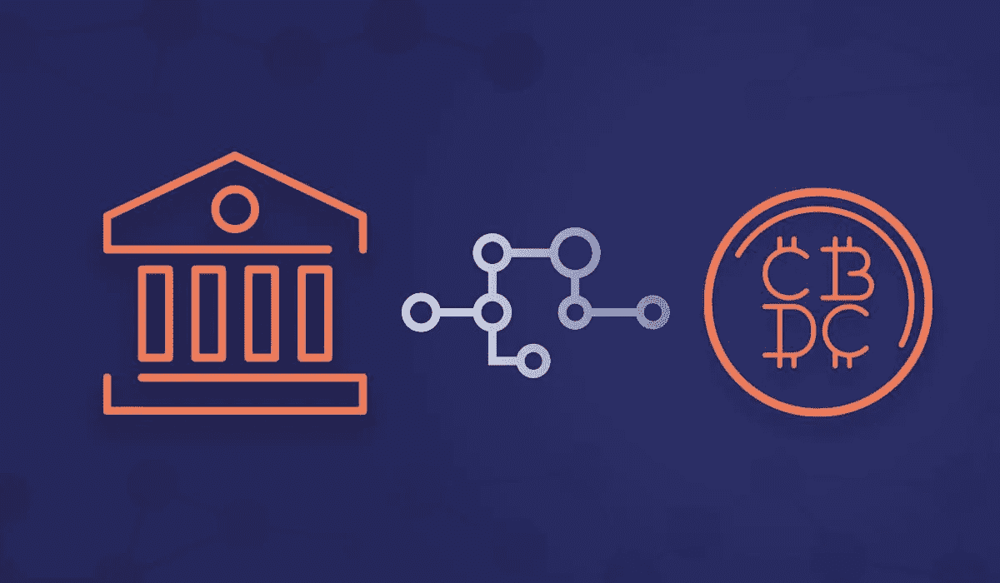

# 摧毁银行还是银行摧毁你

> 原文：<https://medium.com/coinmonks/breaking-the-banks-or-the-banks-breaking-you-5fff7d2ef7b5?source=collection_archive---------31----------------------->

~dwulf

CBDC

银行的主要问题是集中权力来支配你账户上资金的使用和支出。

作为一个密码持有者和区块链开发者，我认为代码就是法律。我尽职尽责、高度警觉地运用这一权力，因为我知道，在秘密资本交易中，我不能犯任何错误，否则就有可能血本无归。

据报道，银行是大多数第一世界人民资金事实上的管理者。当银行因为各种原因冻结你的账户，从你的账户上取钱，或者冻结你的账户，这是很可怕的。在很大程度上，这些原因是为了防止欺诈或第三方从您的帐户中窃取。总的来说，这是件好事。

但是有些时候，这些账户的冻结或保留并不符合你的最佳利益，而是被你无法控制的力量所影响，而且往往是在你不知情的情况下。

合法扣押是有问题的，在大多数情况下，你会在资产被扣押之前看到它。美国国税局和税务机关不必通过监管渠道，他们有全权在任何时候随意查封任何账户，无需账户所有人的同意。

**收回权力**

与旧世界经济脱钩，用数字加密资本运营，并控制你的私人密钥，是确保你(也只有你)拥有资本资产主权的唯一途径。

这很难，但这也是你的钱，拥有 100%的控制权总是一件好事。

但是银行掌握着我们大部分生活的金融权力。第一世界的公民被它奴役，第三世界的公民和没有银行账户的人被它驱逐。

具有讽刺意味的是，第三世界公民比第一世界公民更有优势，因为第三世界公民和他们各自的银行之间已经建立了 KYC。

第三世界或流离失所和没有银行账户的公民，被禁止或被限制开立银行账户，甚至从来没有机会确定自己是 KYC 还是 dox。

他们可以在没有 KYC 和 100%匿名的情况下，以 100%纯保管的方式插入到加密生态系统中，从而奠定正确和秘密的基础。

**对 CBDC 说不**

不需要重置，只需退出。CBDCs 是一个大问题，但对用户来说不一定如此。干脆不参与。常规的第 1 层和第 2 层交换已经可用并且是可能的。

然而，我怀疑监管者和立法者会要求他们的中央银行独家参与。根据用户实际居住和生活的地点，可能需要“完全了解你的客户”( KYC)的参与，消除任何形式的真实匿名。

**如果你不得不答应 CBDC 呢？**

他们得到了枪支和监狱，但用户拥有被区块链及其网络利用的选择权。如果一个人被迫使用民族国家的 CBDC，不要烦恼，使用它，但使用它作为一个加密工具，知道它是一个妥协的加密工具。我不会把超过 1%的个人加密资产投入到任何一个看似参与和实验的 CBDC 中，但我完全清楚 CBDC 中的所有财富都将变为零。

集中式加密交换怎么样？

任何和所有 KYC 将妥协你的身份，永远到交易所的钱包，甚至可能几跳出来。使用集中式加密交换，直到你可以舒适和负担得起地使用 DeFi 等效服务。

集中式加密交易所使其变得容易，但它的代价是在交易所的钱包和钱包或附属于它们的银行账户上纹上数字纹身，并通过流氓雇员、监管法院命令或简单的交易所政策，使其桌上的任何和所有资产可能被冻结或扣押。

**波尔卡多特链在工厂**

由于 Polkadot 是第 0 层，而其上的对位链(即 Acala、Astara 等。)是第 1 层和第 2 层。这创建了一个不依赖于集中式加密交换、它们的规则和它们的策略的操作层。但是允许用户旋转他们自己的节点，并运行他们自己的收入和交换验证器，允许通过虫洞桥接的不同资产的原子交换，并通过 XCM/XCMP 传输到其他副链。

附加一个 DAO，一个 LLC 作为在真实空间公司和房地产世界中执行操作的必要条件，您就进入了商业领域。

最终，你想成为自己的银行，做银行做的事情来赚钱。贷款、赌注、流动性互换和通过电子商务零售 BTCpay。

> 加入 Coinmonks [电报频道](https://t.me/coincodecap)和 [Youtube 频道](https://www.youtube.com/c/coinmonks/videos)了解加密交易和投资

# 另外，阅读

*   [OKEx vs KuCoin](https://coincodecap.com/okex-kucoin) | [摄氏替代品](https://coincodecap.com/celsius-alternatives) | [如何购买 VeChain](https://coincodecap.com/buy-vechain)
*   [币安期货交易](https://coincodecap.com/binance-futures-trading)|[3 comas vs Mudrex vs eToro](https://coincodecap.com/mudrex-3commas-etoro)
*   [如何购买 Monero](https://coincodecap.com/buy-monero) | [IDEX 评论](https://coincodecap.com/idex-review) | [BitKan 交易机器人](https://coincodecap.com/bitkan-trading-bot)
*   [CoinDCX 评论](/coinmonks/coindcx-review-8444db3621a2) | [加密保证金交易交易所](https://coincodecap.com/crypto-margin-trading-exchanges)
*   [红狗赌场评论](https://coincodecap.com/red-dog-casino-review) | [Swyftx 评论](https://coincodecap.com/swyftx-review) | [CoinGate 评论](https://coincodecap.com/coingate-review)