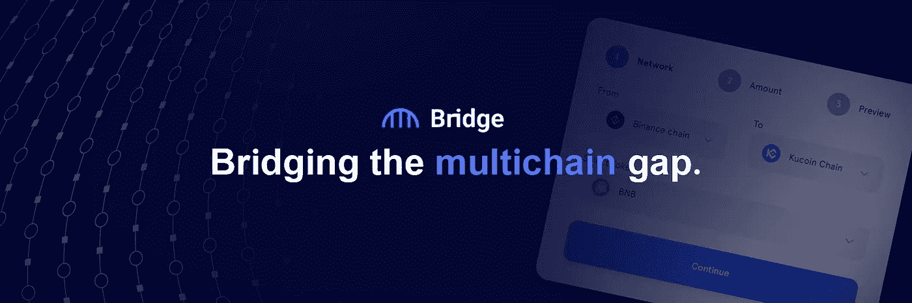
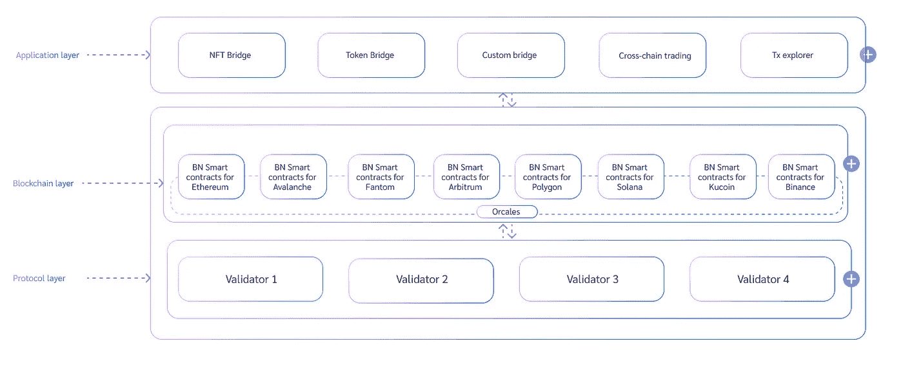

# 桥接网络

> 原文：<https://medium.com/coinmonks/bridge-network-ab3f5d42639a?source=collection_archive---------49----------------------->

## 弥合多链差距

Image from [Bridge Network](https://twitter.com/bridgenetwork0x), recreated by Vitaly Tomachevski

桥网是一个全合一的跨链平台，专注于用户体验。用户不仅将不再需要使用几个不同的应用程序来实现他们想要的最终结果，而且他们还将能够从单个用户仪表板参与所有他们喜欢的跨链活动。桥接网络是最终满足您所有多链需求的地方。

## **跨链互操作性**

区块链网络相互连接和通信的能力对于大规模采用至关重要。目前，大多数区块链都是由许多不同的应用程序和具有不同特征的生态系统组成的孤立网络。这些区块链还不能容易地相互通信，因此信息和其它有价值的数据不能在它们之间自由流动。

[互操作性](https://www.finextra.com/blogposting/18972/blockchain-and-interoperability-key-to-mass-adoption)是区块链技术的下一次发展，预计将通过结合现有工具和利用各自网络的有益功能，带来新一波创新产品和服务。

> 许多专家认为，可互操作的[智能合同](https://www.gemini.com/cryptopedia/smart-contract-examples-smart-contract-use-cases)可以推动医疗保健、法律或房地产等行业的发展——[密码百科](https://www.gemini.com/cryptopedia)、[跨链互操作性:对区块链的意义](https://www.gemini.com/cryptopedia/why-is-interoperability-important-for-blockchain)

桥接网络通过它们跨链协议将这些区块链连接在一起，以便用户可以在它们之间移动他们的数字资产，并参与其他跨链活动。

# **常见的跨链挑战**

Background layer from [Vecteezy, Graphic2U](https://www.vecteezy.com/vector-art/544571-blockchain-technology-fintech-cryptocurrency-block-chain-server-abstract-background-linked-block-contain-cryptography-hash-and-transaction-data-new-futuristic-system-technology-vector-illustration) and used in [Canva](https://www.canva.com/).

在我们深入了解 Bridge Network 为我们打造的所有有趣工具之前，让我们简要探讨一下现有多链解决方案的一些常见问题。

## **碎片化的用户体验**

用户可能希望跨链进行各种交易，但是，对于每种类型的跨链交易，都有一个单独的应用程序来执行它们。

## **安全**

许多跨链工具被匆忙部署以满足需求，代价是采用具有重大漏洞的安全模型。只需在谷歌上搜索最新的“跨链黑客”。所使用的一些方法要求用户信任[验证者](https://cryptoadventure.com/what-are-crypto-validators/),这些验证者被认为是维护协议的完整性的，而防止欺诈或其他恶意活动的激励根本不存在。这些跨链协议过于集中。

## **资产规模**

大多数跨链协议支持的数字资产需要一个手动过程，类似于在集中式交换中获取令牌。一些跨链协议可能需要数周时间来添加对新令牌的支持。

> “桥接网络通过设计一个无信任、无摩擦且可扩展的 CCP 来应对这些挑战”——桥接网络， [Litepaper](https://www.bridgenetwork.com/_files/ugd/ae230d_84e602bb19a94b7b833b9560d3a014e5.pdf)

# 桥梁工具包

Image created by [Alexander Iwasiwka](/@aiwasiwka) in [Canva](https://www.canva.com/).

Bridge Network 正在开发一套工具，允许用户从一个位置进行任何类型的跨链交易。

## 范德比尔特

一种令牌桥，允许用户使用锁定、铸造和刻录机制将数字资产从一个区块链移动到另一个。洛克菲勒基金会增加了资产支持。

> 例如，当用户选择将某个 MATIC 从 Polygon 移动到币安智能链(BSC)时，该 MATIC 将被发送到一个智能合同，并在那里被锁定。BSC 端的另一个智能契约接收 MATIC 刚刚在多边形端被锁定的消息，并在 BSC 上创建 MATIC (brMATIC)的包装版本或副本，并将其发送到用户的钱包。当用户想要赎回他们的 brMATIC 时，他们启动一个事务，将 brMATIC 从 BSC 发送到 Polygon，然后 br MATIC 被发送到 BSC 端的 smart contract 进行刻录。多边形端的智能契约接收到 brMATIC 刚刚被烧录的消息，并解锁发送到用户钱包的 MATIC。

*目前在 testnet 中，用户可以在 6 个 EVM 兼容网络之间移动资产，包括币安智能链、库币链、Polygon、Fantom、Avalanche 和以太坊，预计不久将增加更多网络。*

## **洛克菲勒**

一种多链令牌包装器，允许令牌发行者将其令牌集成到范德比尔特，从而在任意两个受支持的区块链之间建立桥梁。这是在几分钟内自动完成的，无需任何进一步的开发或批准，类似于让令牌在 Uniswap 等分散式交易所(DEX)上市。发行者只需要用一个经过验证的地址连接，并为创建一个桥支付少量费用。每次使用他们的代币进行跨链交易时，交易费用的 20%会流向他们选择的地址。

## **毕加索**

一种 NFT 桥，允许用户将他们的不可替换令牌(NFT)从一个区块链移动到另一个，并使用锁定、铸造、刻录机制。NFT 的[元数据](/coinmonks/how-nft-metadata-works-a65ba7631842)随着它一起传输，并且可以通过使用称为 Columbus 的多链事务浏览器进行跟踪和验证。

## **哥伦布号**

类似于 etherscan 和 bscscan 的事务浏览器，但用于跟踪通过桥接网络协议运行的可替换和不可替换资产的多链事务。

## **卡内基**

一个跨链交易界面，允许用户在任何支持的区块链上执行跨链互换和交易任何两种资产。使用 BRG 代币作为中介，流动性被聚集并且交易被立即结算。

## **薄纱**

一个跨链产量耕作界面，允许用户在多个链上耕作，而无需手动桥接和堆叠/拆分资产或使用单独的应用程序。多种资产的收益率被汇总，转换农场通常需要的步骤被压缩。

# 协议

Image Source — Bridge Network, [Litepaper](https://www.bridgenetwork.com/_files/ugd/ae230d_84e602bb19a94b7b833b9560d3a014e5.pdf)

桥接网络协议主要由三层组成。

1.  应用层—这是构建所有跨链工具的地方，也是最终用户直接交互的地方。新的工具可以在这里建立，任何人都有能力在未来的发展阶段这样做。
2.  区块链层—这是所有智能合约和定制的 oracles 与支持的区块链进行交互的地方。这是添加对额外区块链的支持的地方。
3.  协议层—这一层将区块链层和验证器结合在一起。在这里，所有通过智能合约的交易都被跟踪和验证，同时数据通过充当数据中继的 oracles 被广播到不同的网络。

## 验证者奖励

任何人都可以作为验证者参与进来，并让 BRG 验证和确认交易。验证者按他们的股份比例获得奖励，奖励来自交易费。60%的交易费用分配给验证者。验证者还将获得新桥建造费用的 50%。

## 网络安全性

Bridge Network 使用一种受保的绑定联盟模型，其中要求一组验证者持有或抵押一定数量的 BRG 令牌，以验证链之间的交易。如果被发现参与恶意活动，如签署欺诈性交易，100%的赌注资金将被削减，奖励将被终止。

## 黑客缓解

Bridge Network 已经集成了 [LSS 标准](https://lossless.cash/)，一个黑客缓解工具。它监督智能合同，检测欺诈活动并冻结/归还资金。

Image Source — Bridge Network, [Litepaper](https://www.bridgenetwork.com/_files/ugd/ae230d_84e602bb19a94b7b833b9560d3a014e5.pdf)

> “桥接网络旨在通过与无损等项目合作，为桥接世界带来安全和信任，从而设立一个新的标准。令牌将被包装在 LSS 标准中，这将为桥接令牌启用无损安全参数。”— Bridge Network， [Bridge Network 与 Lossless 合作，为桥梁创建者集成黑客攻击缓解工具](/@bridgenetwork/bridge-network-partners-with-lossless-to-integrate-hack-mitigation-tool-for-bridge-creators-e23169a79cc3)

# BRG 代币

$BRG 公用事业公司

*   验证者需要投入一定量的 BRG 来保护网络和验证交易。如果检测到恶意活动，该份额将被完全削减，然后 BRG 将被发送到保险池，在欺诈事件中可能损失资金的用户之间进行分配。
*   令牌发行者还被要求持有一定数量的 BRG，以创建他们的桥梁。这些股份的 50%被分配给验证者，50%被烧掉，使 BRG 成为通货紧缩的象征。
*   BRG 将作为治理令牌，对网络的重要变更和更新进行投票。
*   BRG 还将用于激励流动性开采。
*   在跨链交易中，BRG 将充当中间结算令牌，赋予其额外的效用。

令牌分发

500 米供应量

Image Source — Bridge Network, [Litepaper](https://www.bridgenetwork.com/_files/ugd/ae230d_84e602bb19a94b7b833b9560d3a014e5.pdf)

归属时间表

**种子轮**——TGE 后 1 个月解锁。24 个月每月线性发布。

**私人回合**—TGE 后 1 个月解锁。24 个月每月线性发布。

**公开销售** —在 TGE 获得 25%的折扣。之后的 3 个月每月发放 25%。

**营销**—**3 年按月既得。**

****国库**—3 年按月归属。**

****生态系统**—3 年按月归属。**

****奖励** — 每周发布 3 年。**

**TGE 已经被推迟到四月初。**

****网络的当前状态****

**Bridge Network 目前正在 mainnet 中进行内部测试，根据 Bridge Network 官方媒体页面的最新[更新](/@bridgenetwork/what-weve-been-up-to-988c77311d39)，mainnet 将在未来 2-4 周内向公众推出。**

**当它首次向公众推出时，我们可以期待在 mainnet 上看到范德比尔特、洛克菲勒，甚至可能是哥伦布的早期版本。**

**要了解路线图上还有什么，请查看 [*桥接网络*](https://www.bridgenetwork.com/_files/ugd/ae230d_84e602bb19a94b7b833b9560d3a014e5.pdf) 。**

***关于* [*桥网*](https://www.bridgenetwork.com/) *的最准确信息和最新更新，请访问其官方渠道。***

> **加入 Coinmonks [电报频道](https://t.me/coincodecap)和 [Youtube 频道](https://www.youtube.com/c/coinmonks/videos)了解加密交易和投资**

# **另外，阅读**

*   **[my constant Review](https://coincodecap.com/myconstant-review)|[8 款最佳摇摆交易机器人](https://coincodecap.com/best-swing-trading-bots)**
*   **[我的加密副本交易经历](/coinmonks/my-experience-with-crypto-copy-trading-d6feb2ce3ac5) | [AAX 交易所评论](/coinmonks/aax-exchange-review-2021-67c5ea09330c)**
*   **[逐位融资融券交易](/coinmonks/bybit-margin-trading-e5071676244e) | [币安融资融券交易](/coinmonks/binance-margin-trading-c9eb5e9d2116) | [超位审核](/coinmonks/overbit-review-9446ed4f2188)**
*   **[有哪些交易信号？](https://coincodecap.com/trading-signal) | [比特斯坦普 vs 比特币基地](https://coincodecap.com/bitstamp-coinbase)**
*   **[10 本关于加密的最佳书籍](https://coincodecap.com/best-crypto-books) | [英国 5 个最佳加密机器人](https://coincodecap.com/uk-trading-bots)**
*   **[Koinly 回顾](https://coincodecap.com/koinly-review) | [Binaryx 回顾](https://coincodecap.com/binaryx-review) | [Hodlnaut vs CakeDefi](https://coincodecap.com/hodlnaut-vs-cakedefi-vs-celsius)**